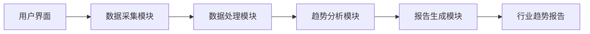

                 


# 费雪的行业趋势分析：未来增长的关键

> **关键词**：行业趋势分析，费雪分析方法，趋势识别，预测模型，数据分析，系统架构

> **摘要**：本文深入探讨费雪的行业趋势分析方法，分析其核心概念、算法原理和系统架构设计。通过详细讲解趋势识别、预测模型、数据分析方法，结合实际案例，展示如何利用费雪分析方法预测行业趋势，为企业制定增长策略提供指导。文章还探讨了系统实现的关键技术，并总结了最佳实践，为读者提供全面的行业趋势分析指南。

---

## 第一部分：背景介绍

### 第1章：行业趋势分析概述

#### 1.1 费雪的行业趋势分析方法

行业趋势分析是一种通过分析行业数据和市场动态，预测未来行业发展方向和趋势的方法。费雪分析方法作为一种经典的行业趋势分析工具，结合了统计学、数据挖掘和行业知识，能够帮助企业识别行业中的关键趋势，并制定相应的战略。

- **1.1.1 行业趋势分析的基本概念**
  行业趋势分析是通过对行业数据的分析，识别行业中的主要趋势、周期性变化和潜在机会。这些趋势可能包括市场规模的变化、技术进步、消费者行为的变化、政策法规的调整等。

- **1.1.2 费雪分析方法的核心思想**
  费雪分析方法强调通过数据驱动的方式，结合行业知识，识别和预测行业趋势。这种方法不仅关注历史数据，还注重通过模型预测未来的趋势。

- **1.1.3 行业趋势分析的适用场景**
  行业趋势分析适用于企业战略规划、投资决策、市场进入策略、产品开发等多个场景。例如，企业在进入新市场前，可以通过行业趋势分析了解市场的增长潜力和竞争格局。

#### 1.2 行业趋势分析的重要性

行业趋势分析是企业制定战略的重要工具。通过分析行业趋势，企业可以更好地理解市场环境，识别潜在机会和威胁，从而制定更具前瞻性的战略。

- **1.2.1 行业趋势对企业战略的影响**
  企业战略的制定需要基于对行业趋势的准确理解。例如，技术趋势的变化可能会影响企业的技术路线选择，市场需求的变化可能会影响产品开发策略。

- **1.2.2 行业趋势分析在投资决策中的作用**
  投资者在选择投资标的时，通常会参考行业趋势分析的结果。通过分析行业的增长潜力和风险，投资者可以做出更明智的投资决策。

- **1.2.3 行业趋势分析的边界与外延**
  行业趋势分析需要明确其适用范围和边界。例如，行业趋势分析可以用于预测行业市场规模的变化，但无法直接预测具体企业的业绩表现。

#### 1.3 费雪分析方法的核心要素

费雪分析方法的核心要素包括数据来源与处理、趋势识别与预测模型、行业动态与竞争分析。

- **1.3.1 数据来源与处理**
  数据是行业趋势分析的基础。费雪分析方法要求从多个来源收集行业数据，包括市场数据、财务数据、政策数据等。数据处理包括清洗、整合和预处理，以确保数据的准确性和一致性。

- **1.3.2 趋势识别与预测模型**
  趋势识别是行业趋势分析的核心步骤。费雪分析方法通过统计分析和机器学习算法，识别行业数据中的趋势，并构建预测模型。

- **1.3.3 行业动态与竞争分析**
  行业趋势分析不仅关注行业整体趋势，还需要分析行业内的竞争格局。通过竞争分析，可以更好地理解行业趋势的形成机制和未来发展方向。

---

## 第二部分：核心概念与联系

### 第2章：行业趋势分析的核心原理

#### 2.1 费雪分析方法的原理

费雪分析方法是一种结合了统计学和行业知识的分析方法，通过数据驱动的方式识别行业趋势，并预测未来的行业动态。

- **2.1.1 数据驱动的分析逻辑**
  费雪分析方法的核心是通过数据分析，识别行业中的主要趋势。这包括对历史数据的分析和对未来数据的预测。

- **2.1.2 趋势识别的数学模型**
  费雪分析方法使用统计模型和机器学习算法，识别行业数据中的趋势。例如，可以通过时间序列分析识别行业的周期性变化。

- **2.1.3 行业动态的关联性分析**
  费雪分析方法注重行业动态之间的关联性分析。例如，可以通过因果分析，识别政策变化对行业趋势的影响。

#### 2.2 核心概念对比分析

行业趋势分析的核心概念包括趋势识别、预测模型和行业动态分析。这些概念在不同分析方法中的表现和应用有所不同。

- **2.2.1 费雪分析与传统趋势分析的对比**
  费雪分析方法与传统趋势分析的主要区别在于数据来源和分析方法。传统趋势分析通常依赖行业报告和专家意见，而费雪分析方法更注重数据驱动的分析。

- **2.2.2 不同行业趋势分析的特征差异**
  不同行业的趋势分析具有不同的特征。例如，技术行业的趋势分析更注重技术创新，而消费品行业的趋势分析更注重消费者行为的变化。

- **2.2.3 费雪分析方法的优劣势**
  费雪分析方法的优势在于其数据驱动的分析方式，能够提供更准确的趋势预测。其劣势在于需要大量的数据支持，且模型的复杂性较高。

#### 2.3 实体关系图与流程图

为了更好地理解费雪分析方法的概念结构，我们可以通过实体关系图和流程图进行展示。

- **2.3.1 费雪分析方法的ER实体关系图**
  以下是一个简单的ER实体关系图，展示了费雪分析方法的核心实体及其关系：

  ```mermaid
  erDiagram
    actor 行业数据源
    actor 费雪分析系统
    actor 行业趋势报告
    行业数据源 --> 费雪分析系统
    费雪分析系统 --> 行业趋势报告
  ```

- **2.3.2 趋势识别的流程图**
  以下是一个趋势识别的流程图，展示了费雪分析方法的主要步骤：

  ```mermaid
  graph LR
    A[开始] --> B[数据收集]
    B --> C[数据预处理]
    C --> D[趋势识别]
    D --> E[趋势预测]
    E --> F[结束]
  ```

---

## 第三部分：算法原理讲解

### 第3章：费雪分析方法的算法原理

#### 3.1 费雪分析的核心算法

费雪分析方法的核心算法包括趋势识别和趋势预测两个部分。

- **3.1.1 趋势识别的步骤**
  趋势识别是费雪分析方法的第一步，主要步骤包括数据清洗、数据可视化和趋势检测。

  ```mermaid
  graph LR
    A[数据清洗] --> B[数据可视化]
    B --> C[趋势检测]
  ```

- **3.1.2 趋势预测的数学模型**
  趋势预测通常使用时间序列分析模型。例如，ARIMA模型是一种常用的时间序列预测模型，其数学公式如下：

  $$ARIMA(p, d, q) = y_t - \sum_{i=1}^p \phi_i y_{t-i} - \sum_{j=1}^q \theta_j e_{t-j}$$

  其中，$p$ 是自回归阶数，$d$ 是差分阶数，$q$ 是移动平均阶数。

#### 3.2 算法实现的代码示例

以下是一个使用Python实现的费雪分析方法的代码示例：

```python
import pandas as pd
import numpy as np
from statsmodels.tsa.arima_model import ARIMA

# 数据加载与预处理
data = pd.read_csv('industry_data.csv')
data = data['revenue'].values

# 趋势识别
diff_data = pd.DataFrame(data).diff().dropna()

# 趋势预测
model = ARIMA(diff_data, order=(1, 1, 1))
model_fit = model.fit()

# 预测未来趋势
forecast_steps = 5
forecast, conf_int = model_fit.forecast(forecast_steps, alpha=0.05)
```

#### 3.3 数学模型与公式

费雪分析方法的数学模型主要基于时间序列分析。例如，ARIMA模型的公式如下：

$$ARIMA(p, d, q) = y_t - \sum_{i=1}^p \phi_i y_{t-i} - \sum_{j=1}^q \theta_j e_{t-j}$$

其中，$\phi_i$ 是自回归系数，$\theta_j$ 是移动平均系数，$e_{t-j}$ 是残差序列。

---

## 第四部分：系统分析与架构设计

### 第4章：行业趋势分析系统的构建

#### 4.1 系统功能设计

行业趋势分析系统需要具备数据采集、数据处理、趋势分析和报告生成等功能。

- **4.1.1 数据采集模块**
  数据采集模块负责从多个数据源收集行业数据，包括市场数据、财务数据和政策数据。

- **4.1.2 数据处理模块**
  数据处理模块负责对采集到的数据进行清洗、整合和预处理，确保数据的准确性和一致性。

- **4.1.3 趋势分析模块**
  趋势分析模块负责使用费雪分析方法识别行业趋势，并预测未来的行业动态。

- **4.1.4 报告生成模块**
  报告生成模块负责将分析结果生成行业趋势报告，供企业决策者参考。

#### 4.2 系统架构设计

以下是一个简单的行业趋势分析系统的架构图：



#### 4.3 系统接口设计

系统接口设计需要考虑数据输入和输出的格式，以及系统与外部数据源的接口。

- **4.3.1 数据接口**
  数据接口负责与外部数据源（如数据库、API）进行数据交互，确保数据的准确性和及时性。

- **4.3.2 报告接口**
  报告接口负责将分析结果以报告的形式输出，支持多种格式，如PDF、Excel和HTML。

#### 4.4 系统交互设计

系统交互设计需要考虑用户与系统的交互流程，确保系统的易用性和功能性。

- **4.4.1 用户登录与数据输入**
  用户首先需要登录系统，并输入需要分析的行业数据。

- **4.4.2 数据处理与分析**
  系统接收用户输入的数据后，进行数据处理和趋势分析，生成分析结果。

- **4.4.3 报告输出与展示**
  分析完成后，系统生成行业趋势报告，并展示给用户。

---

## 第五部分：项目实战

### 第5章：行业趋势分析的实战应用

#### 5.1 项目背景与目标

本次项目旨在通过费雪分析方法，分析消费行业的趋势，为企业制定增长策略提供参考。

#### 5.2 项目环境与数据准备

项目环境包括数据源、开发工具和依赖库。数据准备包括数据清洗和数据预处理。

#### 5.3 项目核心实现

项目核心实现包括趋势识别和趋势预测两个部分。

- **5.3.1 趋势识别**
  使用费雪分析方法，识别消费行业的主要趋势，如市场规模的变化、消费者行为的变化等。

- **5.3.2 趋势预测**
  使用ARIMA模型，预测未来消费行业的趋势，为企业的战略决策提供支持。

#### 5.4 项目案例分析与结果解读

通过分析消费行业的实际数据，展示费雪分析方法的应用效果。

- **5.4.1 数据分析结果**
  通过数据分析，识别出消费行业的主要趋势，如线上消费的增长趋势。

- **5.4.2 趋势预测结果**
  预测未来消费行业的市场规模和增长潜力。

#### 5.5 项目小结

通过本次项目，我们验证了费雪分析方法的有效性，并展示了其在消费行业中的应用价值。

---

## 第六部分：最佳实践

### 第6章：费雪分析方法的最佳实践

#### 6.1 关键点总结

- **6.1.1 数据质量的重要性**
  数据质量是费雪分析方法成功的关键。高质量的数据能够提高分析结果的准确性。

- **6.1.2 模型选择的注意事项**
  在选择模型时，需要根据具体行业特点和数据特征，选择合适的模型。

- **6.1.3 结果验证的重要性**
  分析结果需要通过实际数据进行验证，确保模型的有效性和准确性。

#### 6.2 小结

费雪分析方法是一种有效的行业趋势分析工具，能够帮助企业识别行业趋势，并制定相应的战略。

#### 6.3 注意事项

- 数据来源的可靠性
- 模型的适用性
- 分析结果的可解释性

#### 6.4 拓展阅读

建议读者进一步阅读相关文献，深入理解费雪分析方法的理论基础和应用案例。

---

## 作者

作者：AI天才研究院/AI Genius Institute & 禅与计算机程序设计艺术 /Zen And The Art of Computer Programming

---

通过本文的详细讲解，读者可以全面了解费雪的行业趋势分析方法，并能够在实际应用中，利用该方法为企业制定增长策略提供支持。

