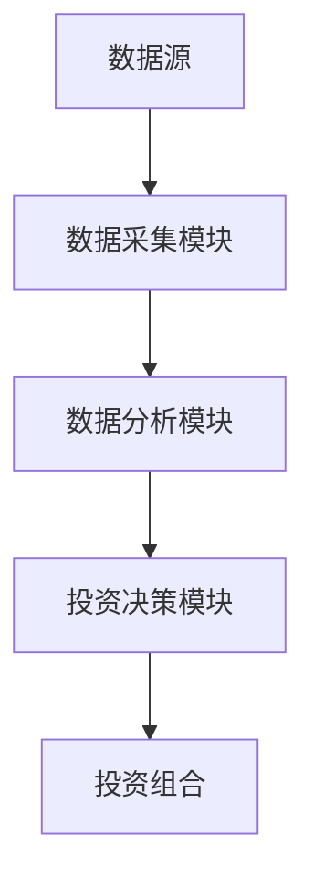

                 


# 费雪的行业领导者投资法

## 关键词

- 费雪投资法
- 行业领导者
- 投资策略
- 企业估值
- 长期投资

## 摘要

《费雪的行业领导者投资法》是一本深入探讨投资大师菲利普·费雪（Philip Fisher）独特投资方法的书籍。费雪以其对“行业领导者”企业的独特见解而闻名，他强调通过深入分析企业的基本面、竞争优势和长期增长潜力来选择投资标的。本文将从费雪投资法的背景、核心概念、筛选标准、估值方法、风险管理、组合管理和长期投资策略等多个方面进行详细探讨，结合实际案例和数学模型，帮助读者更好地理解和应用这一投资方法。

---

## 第1章: 费雪投资法的背景与核心理念

### 1.1 费雪投资法的起源与发展

#### 1.1.1 费雪的生平与投资思想

菲利普·费雪（1907-1999）是20世纪最伟大的投资大师之一，被誉为“成长股投资之父”。他出生于美国加利福尼亚州，早年在父亲的指导下开始学习投资，并在1930年代开始管理客户资金。费雪的投资理念深受本杰明·格雷厄姆的影响，但他更注重企业成长的内在动力，而非仅仅关注市场波动。

#### 1.1.2 费雪投资法的核心理念

费雪的核心理念是投资于“行业领导者”，即那些在行业内具有强大竞争优势、高利润率和持续增长潜力的企业。他认为，投资的最终目标是找到那些能够持续增长的企业，并长期持有它们的股票，以实现财富的长期增长。

#### 1.1.3 费雪投资法与现代投资理论的联系

费雪的投资方法与现代投资组合理论（MPT）有所不同，他更注重个股的选择而非资产配置。然而，费雪的“行业领导者”理念为后来的“价值投资”和“成长股投资”奠定了基础。

### 1.2 行业领导者的定义与特征

#### 1.2.1 行业领导者的定义

行业领导者是指在特定行业中占据领先地位，具有强大的市场影响力、竞争优势和持续增长能力的企业。这类企业通常具有较高的市场份额、品牌价值和技术创新能力。

#### 1.2.2 行业领导者的特征分析

1. **强大的市场地位**：行业领导者通常在市场中占据主导地位，具有较高的市场份额。
2. **竞争优势明显**：这些企业通常拥有独特的竞争优势，如专利、技术、品牌或成本优势。
3. **持续增长潜力**：行业领导者往往能够保持较高的增长率，尤其是在行业增长的周期中。
4. **高利润率**：由于其市场地位和竞争优势，行业领导者通常能够实现较高的利润率。

#### 1.2.3 行业领导者企业的竞争优势

1. **市场支配力**：行业领导者通常能够通过市场支配力影响行业格局。
2. **成本优势**：通过规模经济或技术优势，行业领导者能够降低生产成本。
3. **品牌价值**：强大的品牌价值可以帮助企业抵御竞争对手的冲击。
4. **技术创新能力**：行业领导者通常能够引领行业技术创新，保持竞争优势。

### 1.3 费雪投资法的核心目标

#### 1.3.1 投资目标的定位

费雪的投资目标是通过长期持有行业领导者的股票，实现财富的稳定增长。

#### 1.3.2 投资回报的预期

费雪认为，通过选择具有持续增长潜力的企业，投资者可以获得超越市场平均水平的回报。

#### 1.3.3 投资风险的控制

费雪强调通过深入分析企业的基本面，选择那些具有强大竞争优势的企业，从而降低投资风险。

---

## 第2章: 费雪投资法的核心概念与原理

### 2.1 费雪投资法的筛选标准

#### 2.1.1 企业盈利能力的评估

费雪认为，企业的盈利能力是衡量其是否为行业领导者的重要指标之一。他通常关注以下指标：

1. **净利润率**：净利润率 = 净利润 / 营业收入。
2. **ROE（净资产收益率）**：ROE = 净利润 / 净资产。

#### 2.1.2 企业成长性的判断

费雪强调选择那些具有持续增长潜力的企业。他关注以下指标：

1. **收入增长率**：收入增长率 = （当年收入 - 上年收入） / 上年收入。
2. **净利润增长率**：净利润增长率 = （当年净利润 - 上年净利润） / 上年净利润。

#### 2.1.3 企业竞争优势的分析

费雪认为，行业领导者必须具备独特的竞争优势。这些优势可能包括：

1. **技术优势**：拥有领先的技术或专利。
2. **品牌优势**：强大的品牌影响力。
3. **成本优势**：通过规模经济或技术优势降低成本。

#### 2.1.4 企业治理结构

费雪还关注企业的治理结构，认为良好的治理结构是企业长期发展的基础。

### 2.2 费雪投资法的估值方法

#### 2.2.1 现金流折现法

现金流折现法是一种常用的估值方法，适用于评估企业的内在价值。费雪认为，企业的真实价值可以通过未来现金流的现值来衡量。

**公式**：
$$
\text{企业价值} = \sum_{t=1}^{n} \frac{\text{现金流}_t}{(1 + r)^t}
$$

其中，\( r \) 是折现率，\( n \) 是预测的年数。

#### 2.2.2 市盈率与市净率分析

费雪也关注市盈率（P/E）和市净率（P/B）等指标，但更倾向于使用现金流折现法来评估企业的真实价值。

#### 2.2.3 费雪独特的企业价值评估公式

费雪提出了一种独特的企业价值评估方法，结合了企业的成长性和盈利能力。

**公式**：
$$
\text{企业价值} = \text{未来现金流的现值} + \text{未实现的增长潜力}
$$

---

## 第3章: 费雪投资法的实施策略

### 3.1 行业领导者企业的筛选流程

#### 3.1.1 行业分析与趋势判断

1. **行业周期分析**：分析行业所处的周期阶段（衰退期、成长期、成熟期）。
2. **行业增长潜力**：评估行业的未来增长潜力。

#### 3.1.2 企业基本面分析

1. **财务指标分析**：包括盈利能力、成长性和财务健康状况。
2. **竞争优势分析**：评估企业的竞争优势，如技术、品牌、成本等。

#### 3.1.3 竞争地位评估

1. **市场份额分析**：评估企业在行业中的市场份额。
2. **竞争对手分析**：分析竞争对手的优劣势。

### 3.2 费雪投资法的组合管理

#### 3.2.1 投资组合的构建原则

1. **集中投资**：费雪认为，投资于少数具有强大竞争优势的企业，可以实现更高的回报。
2. **长期持有**：费雪强调长期持有，避免频繁交易。
3. **分散风险**：通过选择不同行业的企业来分散投资风险。

#### 3.2.2 组合调整的时机与方法

1. **定期调整**：根据市场变化和企业基本面调整投资组合。
2. **企业基本面变化**：当企业的基本面发生变化时，需要及时调整。

#### 3.2.3 组合风险的监控与管理

1. **风险评估**：定期评估投资组合的风险。
2. **风险控制**：通过分散投资和选择优质企业来控制风险。

### 3.3 费雪投资法的长期投资策略

#### 3.3.1 长期投资的哲学

费雪认为，长期投资是实现财富增长的最佳方式，因为优质企业的价值会随着时间的推移而增长。

#### 3.3.2 费雪投资法中的复利效应

复利效应是长期投资的核心，优质企业的持续增长将带来指数级的回报。

#### 3.3.3 长期投资中的耐心与纪律

费雪强调，长期投资需要耐心和纪律，避免短期市场的波动干扰长期投资策略。

---

## 第4章: 费雪投资法的数学模型与公式

### 4.1 费雪投资法的核心公式

#### 4.1.1 净利润增长率公式

$$
\text{净利润增长率} = \frac{\text{当年净利润} - \text{上年净利润}}{\text{上年净利润}}
$$

#### 4.1.2 净资产收益率（ROE）公式

$$
\text{ROE} = \frac{\text{净利润}}{\text{净资产}}
$$

#### 4.1.3 企业价值公式

$$
\text{企业价值} = \sum_{t=1}^{n} \frac{\text{现金流}_t}{(1 + r)^t}
$$

---

## 第5章: 费雪投资法的系统架构设计

### 5.1 问题场景介绍

费雪投资法的系统架构设计旨在帮助投资者系统化地筛选和评估行业领导者企业。

### 5.2 系统功能设计

#### 5.2.1 数据采集模块

1. **行业数据采集**：收集各行业的市场数据、财务数据等。
2. **企业数据采集**：收集企业的财务报表、竞争优势等信息。

#### 5.2.2 数据分析模块

1. **财务指标分析**：计算净利润增长率、ROE等指标。
2. **竞争优势分析**：评估企业的竞争优势。

#### 5.2.3 投资决策模块

1. **企业筛选**：根据筛选标准选出行业领导者企业。
2. **组合管理**：根据投资策略管理投资组合。

### 5.3 系统架构设计

以下是费雪投资法的系统架构设计：



---

## 第6章: 费雪投资法的实战案例

### 6.1 环境安装

为了应用费雪投资法，我们需要以下环境：

1. **财务数据源**：如Yahoo Finance、Morningstar等。
2. **数据分析工具**：如Excel、Python（Pandas、NumPy）。
3. **投资组合管理工具**：如Excel、Portfolio Manager。

### 6.2 核心实现源代码

以下是用Python实现的费雪投资法筛选企业代码示例：

```python
import pandas as pd

# 数据采集
data = pd.read_csv('companies.csv')

# 财务指标计算
data['净利润增长率'] = (data['净利润'] - data['上年净利润']) / data['上年净利润']
data['ROE'] = data['净利润'] / data['净资产']

# 筛选行业领导者
data = data[data['净利润增长率'] > 0.1]
data = data[data['ROE'] > 0.15]
```

### 6.3 案例分析与解读

假设我们选择一个行业，如科技行业，筛选出其中的行业领导者企业，并分析其投资价值。

---

## 第7章: 小结与注意事项

### 7.1 小结

费雪的行业领导者投资法是一种以长期投资为核心的策略，强调选择具有强大竞争优势和持续增长潜力的企业。通过深入分析企业的基本面和行业趋势，投资者可以更好地识别行业领导者企业，并实现长期的财富增长。

### 7.2 投资注意事项

1. **长期持有**：投资于行业领导者企业需要耐心和纪律，避免短期波动的干扰。
2. **分散投资**：通过投资于不同行业的企业来分散风险。
3. **持续学习**：投资市场不断变化，需要持续学习和调整投资策略。

---

## 作者信息

作者：AI天才研究院/AI Genius Institute  
联系方式：[email protected]  
网址：[https://www.ai-genius.com](https://www.ai-genius.com)

---

以上就是《费雪的行业领导者投资法》的技术博客文章。希望对您有所帮助！

