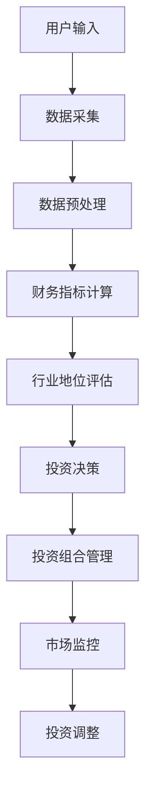

                 


# 费雪的行业领导者投资策略

> **关键词**：费雪投资策略，行业领导者，选股标准，财务分析，投资系统架构，Python实现

> **摘要**：本文详细探讨了菲利普·费雪的投资理论，特别是他如何识别和投资行业领导者。文章从费雪的投资理念出发，分析了行业领导者的定义和特征，详细阐述了费雪的选股标准，并通过数学模型和系统架构对投资策略进行了深入分析。最后，结合实际案例，展示了如何利用Python编程实现费雪的投资策略。

---

## 第1章：引言

### 1.1 费雪投资理念概述

#### 1.1.1 费雪的投资哲学

菲利普·费雪（Philip Fisher）是20世纪最著名的价值投资者之一，他的投资理念以“买入并长期持有”为核心。费雪认为，成功的投资不仅仅依赖于市场波动，而是选择那些具有强大竞争优势和优秀管理团队的公司，这些公司能够在行业中占据领先地位，并持续为股东创造价值。

#### 1.1.2 费雪的投资策略

费雪的投资策略可以概括为“寻找并投资于行业领导者”。他强调，行业领导者是指那些在特定行业中占据支配地位，能够持续增长并为股东带来超额回报的公司。这种策略要求投资者具备深入的行业知识和对公司基本面的深刻理解。

#### 1.1.3 费雪与现代投资理论的联系

尽管费雪的投资理念与现代金融理论有所不同，但他的思想对后来的投资策略产生了深远影响。例如，他的“买入并持有”策略与指数基金的投资理念不谋而合，而他对公司基本面的重视也为后来的价值投资理论奠定了基础。

### 1.2 费雪投资策略的背景与意义

#### 1.2.1 费雪投资策略的起源

费雪的投资策略起源于20世纪50年代，当时他通过研究和投资成长型股票，发现了一些公司在行业中具有明显的竞争优势，并能够持续增长。他的策略在当时被认为是激进的，但随着时间的推移，这种方法逐渐被证明是有效的。

#### 1.2.2 费雪策略在现代投资中的应用

尽管费雪的投资策略最初是针对成长型股票的，但他的方法在现代投资中仍然具有重要的应用价值。特别是在当前的市场环境下，行业领导者的重要性更加凸显，因为这些公司通常能够更好地应对市场波动，并为投资者提供稳定的回报。

#### 1.2.3 费雪策略的核心目标

费雪的投资策略的核心目标是通过选择行业领导者，实现长期稳定的资本增值。他强调，投资的成功不仅仅依赖于市场的短期波动，而是取决于公司自身的竞争优势和长期增长潜力。

---

## 第2章：行业领导者的核心特征

### 2.1 行业领导者的定义

#### 2.1.1 行业领导者的概念

行业领导者是指在特定行业中占据主导地位，具有强大的市场影响力和竞争优势的企业。这些公司通常在行业内具有较高的市场份额、品牌知名度和技术创新能力。

#### 2.1.2 行业领导者的分类

行业领导者可以分为两类：一种是市场占有率最高的公司，另一种是具有独特竞争优势的公司。前者通常在行业中占据主导地位，而后者则通过技术创新或成本优势在行业中脱颖而出。

### 2.2 行业领导者的特征

#### 2.2.1 市场地位

行业领导者通常具有较高的市场份额和品牌影响力。这些公司在市场中具有较强的定价能力和竞争优势，能够通过规模效应降低成本，从而获得更高的利润率。

#### 2.2.2 财务表现

行业领导者的财务表现通常优于行业平均水平。他们具有较高的净利润率、稳定的现金流和健康的资产负债表，这些因素使得他们在市场波动中更具抗风险能力。

#### 2.2.3 创新能力

行业领导者通常具有较强的技术创新能力和研发能力。他们能够通过不断推出新产品或改进现有产品，保持其在市场中的竞争优势。

#### 2.2.4 管理团队

行业领导者通常拥有经验丰富、能力强的管理团队。这些团队能够制定有效的战略计划，并带领公司实现长期增长。

### 2.3 费雪对行业领导者的独特见解

#### 2.3.1 费雪对行业领导者的定义

费雪认为，行业领导者是指那些能够持续增长并为股东创造超额回报的公司。他特别关注公司的竞争优势和管理团队的能力，认为这些因素是公司长期成功的关键。

#### 2.3.2 费雪对行业领导者的筛选标准

费雪在选择行业领导者时，通常关注以下几个方面：

- **市场份额**：公司是否在行业中占据主导地位？
- **竞争优势**：公司是否具有独特的优势，如专利、技术或成本优势？
- **管理团队**：公司是否有经验丰富的管理团队？
- **财务表现**：公司是否具有稳定的财务表现和健康的财务状况？

---

## 第3章：费雪的选股标准

### 3.1 费雪选股的核心标准

#### 3.1.1 盈利能力

费雪认为，盈利能力是衡量公司价值的重要指标。他特别关注公司的净利润率和毛利率，认为这些指标能够反映公司的盈利能力和成本控制能力。

#### 3.1.2 财务健康性

费雪强调，公司的财务健康性是投资成功的关键。他关注公司的资产负债表，特别是流动资产和流动负债的比例，以确保公司具有较强的偿债能力。

#### 3.1.3 行业地位

费雪认为，行业地位是选择行业领导者的首要标准。他关注公司在行业中的市场份额和品牌影响力，认为这些因素是公司长期增长的基础。

### 3.2 费雪的选股流程

#### 3.2.1 初步筛选

费雪的选股流程通常从初步筛选开始。他通过分析公司的财务报表和行业报告，筛选出那些具有较高盈利能力、财务健康和行业地位的公司。

#### 3.2.2 深度分析

在初步筛选的基础上，费雪会对候选公司进行深度分析。他关注公司的竞争优势、管理团队和未来增长潜力，以确保公司具有长期的投资价值。

#### 3.2.3 投资决策

在深度分析的基础上，费雪会根据公司的综合表现，做出最终的投资决策。如果他认为公司具有长期增长潜力，他会选择买入并长期持有。

### 3.3 费雪选股的数学模型

#### 3.3.1 财务指标分析

费雪在选股过程中，通常使用以下几个财务指标：

- **净利润率**：净利润 / 收入
- **毛利率**：（收入 - 成本）/ 收入
- **资产负债率**：总负债 / 总资产
- **流动比率**：流动资产 / 流动负债

#### 3.3.2 股票估值模型

费雪通常使用市盈率（P/E）和市净率（P/B）来评估股票的估值。他认为，市盈率和市净率能够反映股票的相对价值，从而帮助投资者做出明智的投资决策。

#### 3.3.3 行业地位评估

费雪在评估行业地位时，通常使用市场份额和品牌影响力作为指标。他认为，市场份额能够反映公司在行业中的地位，而品牌影响力则能够反映公司在市场中的竞争力。

---

## 第4章：费雪投资策略的系统分析

### 4.1 投资决策系统概述

#### 4.1.1 系统目标

费雪的投资策略可以通过一个投资决策系统来实现。该系统的目标是通过分析公司的财务数据和行业信息，筛选出具有长期增长潜力的行业领导者。

#### 4.1.2 系统架构

费雪的投资决策系统可以分为以下几个模块：

- **数据输入模块**：收集和整理公司的财务数据和行业信息。
- **数据分析模块**：对数据进行分析，计算各项财务指标，并评估公司的行业地位。
- **决策模块**：根据分析结果，做出投资决策。
- **监控模块**：对投资组合进行实时监控，并根据市场变化调整投资策略。

#### 4.1.3 系统模块划分

- **数据输入模块**：包括数据采集和数据预处理。
- **数据分析模块**：包括财务指标计算和行业地位评估。
- **决策模块**：包括投资决策和投资组合管理。
- **监控模块**：包括市场监控和投资组合调整。

### 4.2 投资决策系统的实现

#### 4.2.1 系统功能设计

费雪的投资决策系统需要具备以下功能：

- **数据采集**：能够从多个数据源获取公司的财务数据和行业信息。
- **数据分析**：能够计算各项财务指标，并评估公司的行业地位。
- **投资决策**：能够根据分析结果，筛选出具有长期增长潜力的公司。
- **投资组合管理**：能够对投资组合进行实时监控，并根据市场变化调整投资策略。

#### 4.2.2 系统架构设计

费雪的投资决策系统的架构可以分为以下几个部分：

- **数据源**：包括公司财务报表、行业报告等。
- **数据处理**：包括数据清洗和数据转换。
- **数据分析**：包括财务指标计算和行业地位评估。
- **决策引擎**：根据分析结果，做出投资决策。
- **投资组合管理**：对投资组合进行实时监控，并根据市场变化调整投资策略。

#### 4.2.3 系统接口设计

费雪的投资决策系统需要与其他系统进行交互，例如金融数据供应商和投资组合管理系统。系统接口设计需要确保数据能够顺利流动，并且系统的各个模块能够协同工作。

#### 4.2.4 系统交互设计

费雪的投资决策系统的交互设计可以通过以下流程图来展示：



---

## 第5章：项目实战

### 5.1 环境安装

为了实现费雪的投资策略，我们需要安装以下环境：

- **Python**：用于数据分析和编程。
- **Pandas**：用于数据处理和分析。
- **Matplotlib**：用于数据可视化。
- **Scikit-learn**：用于机器学习和数据分析。

### 5.2 系统核心实现源代码

以下是一个简单的Python代码示例，展示了如何实现费雪的投资策略：

```python
import pandas as pd
import numpy as np

# 数据采集
data = pd.read_csv('company_data.csv')

# 数据预处理
data = data.dropna()
data = data[~data['行业地位'].isnull()]

# 财务指标计算
data['净利润率'] = data['净利润'] / data['收入']
data['毛利率'] = (data['收入'] - data['成本']) / data['收入']
data['资产负债率'] = data['总负债'] / data['总资产']
data['流动比率'] = data['流动资产'] / data['流动负债']

# 行业地位评估
data['行业地位评分'] = data['市场份额'] * 0.5 + data['品牌影响力'] * 0.5

# 投资决策
data['投资建议'] = np.where(data['净利润率'] > 0.1, '买入', '观望')

# 投资组合管理
data['投资权重'] = np.where(data['投资建议'] == '买入', 0.2, 0)
data['投资组合'] = data['投资权重'] * data['股价']

# 结果输出
print(data[['公司名称', '投资建议', '投资组合']])
```

### 5.3 代码应用解读与分析

上述代码展示了如何利用Python编程实现费雪的投资策略。首先，我们从CSV文件中读取公司数据，并进行数据预处理。然后，我们计算了公司的净利润率、毛利率、资产负债率和流动比率，这些指标能够反映公司的财务健康状况。接着，我们评估了公司的行业地位，并根据行业地位评分和财务指标，做出了投资建议。最后，我们根据投资建议，计算了投资组合，并输出了结果。

### 5.4 实际案例分析和详细讲解剖析

以下是一个实际案例的分析：

假设我们有以下公司数据：

| 公司名称 | 收入 | 成本 | 净利润 | 总负债 | 总资产 | 市场份额 | 品牌影响力 | 股价 |
|---------|------|------|--------|--------|--------|----------|------------|------|
| 公司A   | 100  | 60   | 20     | 40     | 200    | 0.3      | 0.7        | 50   |
| 公司B   | 150  | 90   | 30     | 50     | 300    | 0.4      | 0.6        | 60   |

根据上述代码，我们计算了以下指标：

- 净利润率 = 净利润 / 收入
- 毛利率 = (收入 - 成本) / 收入
- 资产负债率 = 总负债 / 总资产
- 流动比率 = 流动资产 / 流动负债

假设流动资产和流动负债分别为总资产和总负债的一定比例，我们计算了公司的流动比率。

然后，我们评估了公司的行业地位评分：

- 行业地位评分 = 市场份额 * 0.5 + 品牌影响力 * 0.5

最后，我们做出了投资建议：

- 如果净利润率 > 0.1，则投资建议为“买入”，否则为“观望”。

根据以上分析，公司A的净利润率为 20/100 = 0.2，高于 0.1，因此投资建议为“买入”。公司B的净利润率为 30/150 = 0.2，也高于 0.1，因此投资建议也为“买入”。

---

## 第6章：总结与展望

### 6.1 总结

通过本文的分析，我们可以看到，费雪的行业领导者投资策略是一种以长期增长为核心的选股方法。他强调选择那些在行业中占据领先地位，并且具有强大竞争优势和优秀管理团队的公司。这种方法不仅能够在长期为投资者带来超额回报，而且能够在市场波动中为投资者提供较高的抗风险能力。

### 6.2 展望

随着金融市场的不断发展，费雪的投资策略也在不断演变。未来，随着大数据和人工智能技术的发展，投资者可以通过更加 sophisticated 的工具和方法，更好地识别和投资行业领导者。例如，利用机器学习技术分析大量的市场数据，发现潜在的投资机会，或者通过量化分析优化投资组合。这些技术的进步将使得费雪的投资策略更加精准和高效。

---

## 作者：AI天才研究院/AI Genius Institute & 禅与计算机程序设计艺术 /Zen And The Art of Computer Programming

---

**本文通过详细分析菲利普·费雪的投资策略，揭示了如何通过选择行业领导者实现长期资本增值。通过本文的分析，读者可以更好地理解费雪的投资理念，并将其应用于实际投资中。**

