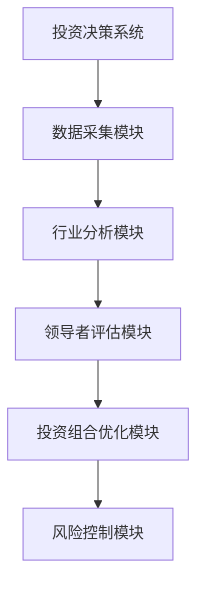

                 

# 费雪的行业领导者理论：投资行业龙头

## 关键词：
- 费雪
- 行业领导者
- 投资策略
- 市场分析
- 风险管理

## 摘要：
本文深入探讨了菲利普·费雪的行业领导者理论，分析了如何通过投资行业龙头企业来实现长期收益。文章结合理论与实践，从费雪的生平、行业领导者的定义与特征、分析框架、投资策略、风险管理到实际案例，全面阐述了这一投资理论的核心思想及其应用方法。通过系统化的分析和实战案例，为投资者提供了科学的投资决策参考。

---

# 目录

## 第一部分: 费雪的行业领导者理论基础

### 第1章: 费雪的生平与投资理念

#### 1.1 费雪的生平简介
- 1.1.1 费雪的早年经历
- 1.1.2 费雪的投资生涯
- 1.1.3 费雪的学术贡献

#### 1.2 费雪的行业领导者理论核心
- 1.2.1 行业领导者的定义
- 1.2.2 费雪的投资理念
- 1.2.3 费雪理论的现代意义

### 第2章: 行业领导者的定义与特征

#### 2.1 行业领导者的定义
- 2.1.1 行业领导者的概念
- 2.1.2 行业领导者的分类
- 2.1.3 行业领导者的标准

#### 2.2 行业领导者的特征分析
- 2.2.1 市场地位
- 2.2.2 核心竞争力
- 2.2.3 财务表现
- 2.2.4 创新能力

### 第3章: 费雪的行业领导者分析框架

#### 3.1 行业分析方法
- 3.1.1 行业生命周期分析
- 3.1.2 行业竞争结构分析
- 3.1.3 行业趋势预测

#### 3.2 领导企业识别策略
- 3.2.1 企业市场地位评估
- 3.2.2 企业核心竞争力分析
- 3.2.3 企业财务健康度评估

### 第4章: 费雪投资理论的数学模型与公式

#### 4.1 行业领导者评估模型
- 4.1.1 市场地位评分公式
  $$市场地位评分 = \frac{市场份额 + 市场排名}{2}$$

- 4.1.2 核心竞争力评分公式
  $$核心竞争力评分 = \frac{研发投入 + 技术专利数}{2}$$

#### 4.2 投资组合优化模型
- 4.2.1 投资组合收益计算公式
  $$收益 = \sum (权重_i \times 收益率_i)$$

- 4.2.2 投资组合风险计算公式
  $$风险 = \sqrt{\sum (权重_i^2 \times 方差_i)}$$

### 第5章: 费雪理论的系统架构与实现

#### 5.1 投资系统架构设计
- 5.1.1 系统功能模块划分
- 5.1.2 系统架构图（Mermaid）

#### 5.2 投资系统实现
- 5.2.1 数据采集与处理
- 5.2.2 行业分析算法实现
- 5.2.3 投资组合优化算法实现

---

## 第二部分: 行业领导者投资策略与风险管理

### 第6章: 投资策略与组合管理

#### 6.1 行业领导者的投资策略
- 6.1.1 长期投资 vs 短期投资
- 6.1.2 价值投资 vs 成长投资

#### 6.2 投资组合管理
- 6.2.1 投资组合构建原则
- 6.2.2 组合权重分配策略
- 6.2.3 组合再平衡策略

### 第7章: 风险管理与绩效评估

#### 7.1 风险管理策略
- 7.1.1 风险评估模型
- 7.1.2 风险分散化策略
- 7.1.3 风险预警机制

#### 7.2 投资绩效评估
- 7.2.1 绩效评估指标
- 7.2.2 绩效评估方法
- 7.2.3 绩效分析与优化

---

## 第三部分: 费雪理论的实战应用与案例分析

### 第8章: 费雪理论的实战应用

#### 8.1 投资流程与步骤
- 8.1.1 确定投资目标
- 8.1.2 选择行业与企业
- 8.1.3 定期评估与调整

#### 8.2 投资组合实战案例
- 8.2.1 案例一：科技行业投资
- 8.2.2 案例二：消费行业投资

### 第9章: 费雪理论的拓展与创新

#### 9.1 理论的局限性与改进
- 9.1.1 费雪理论的局限性
- 9.1.2 理论的改进方向

#### 9.2 结合现代投资工具的应用
- 9.2.1 数据分析工具的运用
- 9.2.2 人工智能在投资中的应用

---

## 第四部分: 综合理论与投资哲学

### 第10章: 投资哲学与长期视角

#### 10.1 费雪的投资哲学
- 10.1.1 长期投资理念
- 10.1.2 价值投资与成长投资的结合

#### 10.2 投资者的心理与决策
- 10.2.1 心理偏差与投资决策
- 10.2.2 投资纪律的重要性

### 第11章: 投资者的成长与学习

#### 11.1 知识储备与能力提升
- 11.1.1 行业知识的学习
- 11.1.2 财务分析能力的提升

#### 11.2 投资经验的积累与总结
- 11.2.1 实战经验的重要性
- 11.2.2 投资教训的总结与反思

---

## 附录: 费雪经典语录与推荐书单

### 附录A: 费雪的经典语录

### 附录B: 进一步阅读的推荐书单
- 《股票作手回忆录》
- 《彼得·林奇的成功投资》
- 《投资学基础》

---

## 结语: 费雪的行业领导者理论的现代启示

通过系统地学习与分析，费雪的行业领导者理论为我们提供了投资的科学方法与哲学指导。在现代投资环境中，这一理论仍然具有重要的现实意义，值得我们深入研究与实践。

---

## 作者：AI天才研究院/AI Genius Institute & 禅与计算机程序设计艺术 /Zen And The Art of Computer Programming

