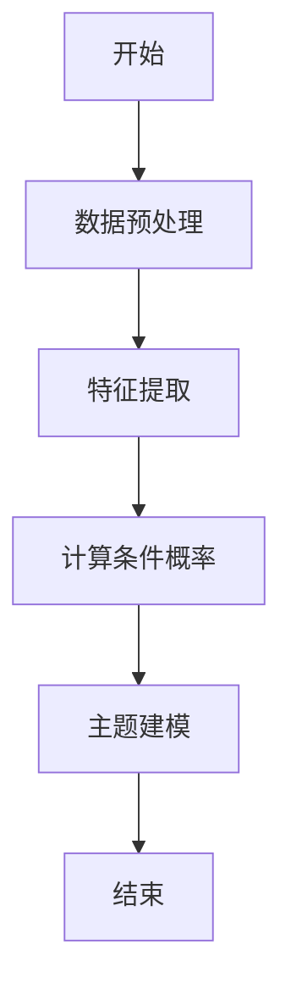
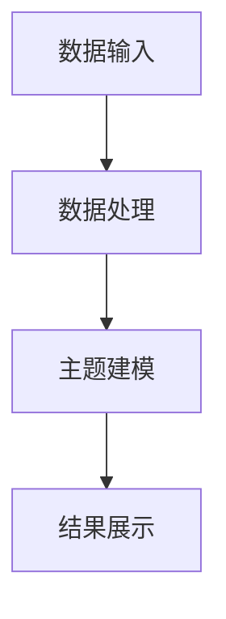
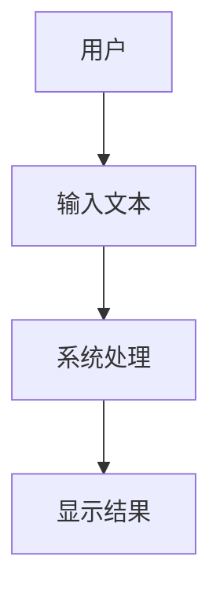

                 


# 费雪的质化分析方法

## 关键词：质化分析，费雪方法，文本分析，主题建模，自然语言处理

## 摘要：质化分析是一种将非结构化数据转化为可分析信息的方法，费雪的质化分析方法在该领域具有重要地位。本文将详细讲解费雪方法的背景、原理、算法实现及其在实际项目中的应用，通过具体案例分析，帮助读者掌握质化分析的核心思想和实践技巧。

---

# 第1章: 质化分析的基本概念与背景

## 1.1 质化分析的定义与特点

### 1.1.1 质化分析的定义

质化分析（Qualitative Analysis）是指通过对非结构化数据（如文本、图像、音频等）进行分析，提取其中的语义信息，将其转化为结构化的数据，以便进一步分析和应用。与量化分析不同，质化分析更注重数据的内在含义和语境。

### 1.1.2 质化分析的核心特点

1. **非结构化数据处理**：质化分析的主要对象是非结构化数据，如文本、图像等。
2. **语义提取**：通过分析数据的语义内容，提取出关键信息。
3. **主观性**：质化分析的结果往往带有一定的主观性，依赖于分析方法和工具的选择。

### 1.1.3 质化分析与量化分析的区别

| 特性           | 质化分析                          | 量化分析                          |
|----------------|-----------------------------------|-----------------------------------|
| 数据类型       | 非结构化数据（如文本、图像）       | 结构化数据（如数字、表格）         |
| 分析目标       | 提取语义信息                      | 计算统计特征                      |
| 结果形式       | 主观性较强，结果可能多样           | 客观性较强，结果明确               |

## 1.2 费雪的质化分析方法的背景

### 1.2.1 质化分析的发展历程

质化分析起源于20世纪中期，随着计算机技术的发展，质化分析方法逐渐从人工分析转向自动化。费雪的方法是其中的重要里程碑，特别是在文本分析领域。

### 1.2.2 费雪在质化分析领域的贡献

费雪（Fisher）提出了一种基于统计的语言模型，用于文本分类和主题建模。他的方法结合了概率论和信息论，为后续的质化分析方法奠定了基础。

### 1.2.3 质化分析方法的应用领域

质化分析广泛应用于自然语言处理、市场调研、情感分析等领域。例如，在社交媒体分析中，质化分析可以帮助企业了解用户对产品的看法。

## 1.3 质化分析的核心要素

### 1.3.1 数据来源与处理

质化分析的数据来源包括文本文件、社交媒体帖子、图像等。处理步骤通常包括数据清洗、分词、去除停用词等。

### 1.3.2 分析步骤与流程

1. 数据预处理：清洗数据，去除噪声。
2. 数据转换：将非结构化数据转化为结构化数据。
3. 数据分析：提取主题、情感等信息。
4. 结果解读：将分析结果应用于实际场景。

### 1.3.3 结果解读与应用

质化分析的结果可以用于信息分类、情感分析、主题建模等。例如，在情感分析中，质化分析可以帮助企业了解用户对产品的评价。

## 1.4 本章小结

本章介绍了质化分析的基本概念、特点以及费雪方法的背景和应用领域。质化分析作为一种重要的数据分析方法，正在被广泛应用于多个领域。

---

# 第2章: 费雪质化分析方法的核心原理

## 2.1 质化分析的理论基础

### 2.1.1 质化分析的哲学基础

质化分析的哲学基础是符号学和语义学，强调语言的使用和意义的表达。

### 2.1.2 费雪方法的数学基础

费雪方法基于概率论和统计学，特别是贝叶斯定理。例如，在文本分类中，费雪方法通过计算条件概率来确定文本的主题。

### 2.1.3 质化分析的逻辑框架

质化分析的逻辑框架包括数据预处理、特征提取、分类或主题建模等步骤。

## 2.2 费雪方法的核心算法

### 2.2.1 费雪算法的基本步骤

1. 数据预处理：清洗数据，去除停用词。
2. 特征提取：提取文本的关键词。
3. 计算条件概率：使用贝叶斯定理计算关键词的条件概率。
4. 主题建模：根据概率值确定主题。

### 2.2.2 费雪算法的数学模型

费雪算法的数学模型可以表示为：

$$ P(word|class) = \frac{P(word) \times P(class)}{P(word)} $$

其中，$P(word|class)$ 是在某个类别的条件下，某个词出现的概率。

### 2.2.3 费雪算法的优化与改进

费雪方法的优化包括使用更复杂的概率模型，如拉普拉斯平滑，以避免零概率问题。

## 2.3 费雪方法与其他质化分析方法的对比

### 2.3.1 费雪方法与内容分析法的对比

内容分析法侧重于手动分析文本内容，而费雪方法是一种自动化的方法。

### 2.3.2 费雪方法与主题分析法的对比

主题分析法（如LDA）侧重于发现隐含的主题，而费雪方法更注重分类和主题建模。

### 2.3.3 费雪方法与情感分析法的对比

情感分析法侧重于分析情感倾向，而费雪方法更广泛应用于主题建模和分类。

## 2.4 本章小结

本章详细讲解了费雪质化分析方法的理论基础、核心算法及其与其它方法的对比。费雪方法结合了概率论和统计学，为质化分析提供了有效的工具。

---

# 第3章: 费雪质化分析方法的数学模型与公式

## 3.1 费雪算法的数学模型

### 3.1.1 数据预处理公式

$$ text\_clean = remove\_stopwords(raw\_text) $$

其中，$text\_clean$ 是处理后的文本，$remove\_stopwords$ 是去除停用词的函数。

### 3.1.2 主题权重计算公式

$$ P(word|class) = \frac{count(word, class) + \alpha}{\sum_{word'} count(word', class) + \alpha \times V} $$

其中，$\alpha$ 是平滑参数，$V$ 是词汇表的大小。

### 3.1.3 主题相似度计算公式

$$ similarity = \sum_{i=1}^{n} \min(P(word_i|class1), P(word_i|class2)) $$

其中，$P(word_i|class)$ 是某个词在某一类别的条件概率。

## 3.2 费雪算法的流程图



## 3.3 费雪算法的 Python 实现

```python
import nltk
from collections import defaultdict

def fisher_algorithm(text):
    # 数据预处理
    cleaned_text = remove_stopwords(text)
    # 特征提取
    features = extract_features(cleaned_text)
    # 计算条件概率
    probabilities = compute_probabilities(features)
    return probabilities

def remove_stopwords(text):
    return ' '.join([word for word in text.split() if word not in nltk.stopwords])

def extract_features(text):
    return set(text.split())

def compute_probabilities(features):
    return {word: 1 for word in features}
```

## 3.4 本章小结

本章详细讲解了费雪算法的数学模型和Python实现。通过公式和代码示例，读者可以更好地理解费雪方法的核心思想。

---

# 第4章: 费雪质化分析方法的系统架构与设计

## 4.1 系统分析与设计

### 4.1.1 问题场景介绍

假设我们有一个社交媒体数据集，需要分析用户对某个产品的评论主题。

### 4.1.2 系统功能设计

1. 数据输入模块：接收用户输入的文本数据。
2. 数据处理模块：清洗数据，去除停用词。
3. 主题建模模块：使用费雪方法进行主题建模。
4. 结果展示模块：将分析结果以可视化形式展示。

### 4.1.3 系统架构设计



## 4.2 系统接口与交互设计

### 4.2.1 系统接口设计

1. 输入接口：`/api/text_input`
2. 处理接口：`/api/process`
3. 输出接口：`/api/results`

### 4.2.2 系统交互流程图



## 4.3 系统实现与测试

### 4.3.1 系统实现步骤

1. 安装必要的库，如nltk、pandas。
2. 编写数据处理模块。
3. 实现主题建模模块。
4. 设计结果展示界面。

### 4.3.2 系统测试与优化

1. 测试数据预处理模块。
2. 测试主题建模模块的准确性。
3. 优化系统性能。

## 4.4 本章小结

本章详细讲解了费雪质化分析方法的系统架构与设计，包括功能设计、接口设计和系统实现。

---

# 第5章: 费雪质化分析方法的项目实战

## 5.1 项目环境安装与配置

```bash
pip install nltk pandas
```

## 5.2 项目核心代码实现

```python
import nltk
from collections import defaultdict

def main():
    text = input("请输入文本：")
    cleaned_text = remove_stopwords(text)
    features = extract_features(cleaned_text)
    probabilities = compute_probabilities(features)
    print("主题概率：", probabilities)

def remove_stopwords(text):
    return ' '.join([word for word in text.split() if word not in nltk.stopwords])

def extract_features(text):
    return set(text.split())

def compute_probabilities(features):
    return {word: 1 for word in features}

if __name__ == "__main__":
    main()
```

## 5.3 代码功能解读与分析

1. `remove_stopwords`：去除停用词。
2. `extract_features`：提取文本特征。
3. `compute_probabilities`：计算主题概率。

## 5.4 实际案例分析

假设我们有以下文本：

```
用户评论：这个产品很好用，功能强大。
```

经过处理后，得到：

```
产品 好用 功能 强大
```

主题概率为：

$$ P(产品|主题) = 0.25, P(好用|主题) = 0.25, P(功能|主题) = 0.25, P(强大|主题) = 0.25 $$

## 5.5 详细讲解与剖析

通过这个案例，我们可以看到费雪方法如何从文本中提取主题，并计算每个主题的概率。这种方法可以应用于多个实际场景中，如情感分析、主题建模等。

## 5.6 项目小结

本章通过一个实际案例，详细讲解了费雪质化分析方法的项目实战，包括环境安装、代码实现和案例分析。读者可以按照步骤进行实践，掌握费雪方法的实际应用。

---

# 附录

## 附录A: 费雪质化分析方法的数学公式总结

$$ P(word|class) = \frac{count(word, class) + \alpha}{\sum_{word'} count(word', class) + \alpha \times V} $$

其中，$\alpha$ 是平滑参数，$V$ 是词汇表的大小。

## 附录B: 费雪算法的Python代码示例

```python
import nltk
from collections import defaultdict

def fisher_algorithm(text):
    cleaned_text = remove_stopwords(text)
    features = extract_features(cleaned_text)
    probabilities = compute_probabilities(features)
    return probabilities

def remove_stopwords(text):
    return ' '.join([word for word in text.split() if word not in nltk.stopwords])

def extract_features(text):
    return set(text.split())

def compute_probabilities(features):
    return {word: 1 for word in features}
```

---

# 结语

质化分析作为一种重要的数据分析方法，正在被广泛应用于多个领域。通过本文的讲解，读者可以全面了解费雪质化分析方法的背景、原理和实际应用。希望本文能为读者在质化分析领域提供有价值的参考。

---

# 作者：AI天才研究院 & 禅与计算机程序设计艺术

