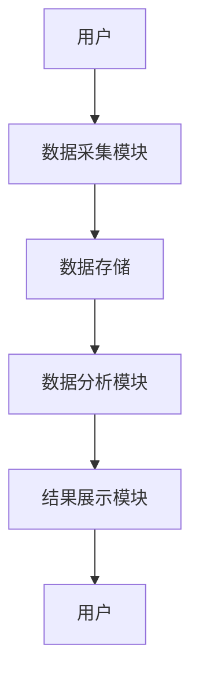

                 


# 费雪的质性分析：超越数字的公司研究方法

> 关键词：质性分析，公司研究，费雪分析法，数据挖掘，人工智能

> 摘要：本文深入探讨了费雪的质性分析方法在公司研究中的应用，分析了其核心概念、算法原理、系统架构及项目实战，展示了如何通过质性分析超越传统的数字分析，实现更深入的公司研究。

---

## 第一部分: 费雪的质性分析基础

### 第1章: 质性分析的背景与定义

#### 1.1 质性分析的起源与发展
质性分析是一种研究方法，强调通过非结构化数据（如文本、访谈）揭示隐藏的模式和关系。它起源于社会科学领域，但近年来在商业分析中逐渐受到重视。费雪的质性分析方法以其独特视角，强调对公司战略、文化和市场动态的深度理解。

#### 1.2 质性分析与定量分析的对比
定量分析依赖于数字和统计方法，而质性分析则关注于理解和解释数据背后的意义。费雪的质性分析通过结合定量与定性方法，弥补了传统数字分析的局限性。

---

### 第2章: 费雪质性分析的核心概念

#### 2.1 费雪质性分析的基本原理
费雪分析法通过深度访谈、文本分析和专家意见，挖掘公司内部和外部的隐性知识。其核心在于将质性数据转化为可操作的见解，帮助公司制定更有效的战略。

#### 2.2 质性分析的核心要素
- **数据的深度挖掘**：通过非结构化数据揭示潜在信息。
- **意见领袖的作用**：利用专家观点增强分析的深度。
- **行业专家的参与**：结合行业知识提升分析的准确性。

---

## 第二部分: 费雪质性分析的算法原理

### 第3章: 费雪质性分析的步骤

#### 3.1 数据收集阶段
- **数据预处理**：清洗和整理数据，确保数据质量。
- **数据标注**：对文本数据进行标注，便于后续分析。

#### 3.2 数据分析阶段
- **主题建模**：使用主题模型（如LDA）识别数据中的主题。
- **情感分析**：通过自然语言处理技术分析数据的情感倾向。

#### 3.3 结论推导阶段
- **结果验证**：将分析结果与定量数据进行交叉验证，确保结论的准确性。

### 第4章: 费雪质性分析的数学模型

#### 4.1 相似度计算公式
使用余弦相似度计算文本之间的相似性：
$$ \text{similarity}(A, B) = \frac{A \cdot B}{\|A\| \|B\|} $$

#### 4.2 权重分配模型
通过TF-IDF计算关键词的权重：
$$ \text{TF-IDF}(t, d) = \text{TF}(t, d) \times \text{IDF}(t) $$

---

## 第三部分: 费雪质性分析的系统架构

### 第5章: 系统功能设计

#### 5.1 数据采集模块
- 负责收集和存储质性数据，包括文本和访谈记录。

#### 5.2 数据分析模块
- 包含主题建模、情感分析等功能，支持多种分析方法。

#### 5.3 结果展示模块
- 提供可视化界面，展示分析结果，便于用户理解和决策。

### 第6章: 系统架构图


---

## 第四部分: 费雪质性分析的项目实战

### 第7章: 项目环境安装

#### 7.1 安装Python
安装Python 3.8或更高版本，确保环境兼容性。

#### 7.2 安装必要的库
安装自然语言处理库（如NLTK、Gensim）和数据分析库（如Pandas、Scikit-learn）。

### 第8章: 核心代码实现

#### 8.1 数据预处理
```python
import nltk
from sklearn.feature_extraction.text import TfidfVectorizer

# 示例文本数据
text = ["This is a sample text for preprocessing.",
        "Preprocessing is an important step in NLP."]

# TF-IDF计算
vectorizer = TfidfVectorizer()
tfidf = vectorizer.fit_transform(text)
```

#### 8.2 模型训练
```python
from sklearn.decomposition import LatentDirichletAllocation

# 主题建模
lda = LatentDirichletAllocation(n_topics=2)
lda.fit(tfidf)
```

---

## 第五部分: 最佳实践与总结

### 第9章: 最佳实践

#### 9.1 经验总结
- **数据质量**：确保数据的完整性和准确性。
- **工具选择**：根据需求选择合适的NLP工具和库。
- **专家合作**：结合专家知识提升分析深度。

#### 9.2 小结
费雪质性分析通过结合定量与定性方法，为公司研究提供了新的视角，帮助企业在复杂市场环境中做出更明智的决策。

### 第10章: 注意事项与拓展阅读

#### 10.1 注意事项
- 质性分析依赖于高质量的数据和专家意见，需谨慎处理。
- 数据隐私和伦理问题需严格遵守相关法规。

#### 10.2 拓展阅读
推荐阅读《质性研究的方法与应用》和《自然语言处理实战》等书籍，深入理解质性分析的应用和优化。

---

## 作者：AI天才研究院/AI Genius Institute & 禅与计算机程序设计艺术 /Zen And The Art of Computer Programming

---

通过以上内容，费雪的质性分析方法在公司研究中的应用得到了全面的展示，从理论到实践，从算法到系统架构，帮助读者深入了解并掌握这一方法。

