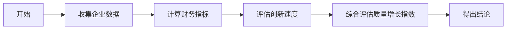

                 


# 费雪的质量增长策略：在高科技时代的重新诠释

> 关键词：费雪质量增长策略、高科技企业、投资策略、企业增长、数字化转型

> 摘要：本文将从费雪的质量增长策略出发，结合高科技时代的特点，重新诠释这一经典投资理论。通过分析高科技企业在数字化转型中的增长模式，探讨质量增长策略在技术驱动型企业的适用性，并提出优化和创新的方向。文章结合实际案例和系统设计，为投资者和企业管理者提供新的视角和实践指南。

---

## 第一部分: 费雪质量增长策略的背景与基础

### 第1章: 费雪质量增长策略概述

#### 1.1 费雪质量增长策略的起源与核心思想

费雪的质量增长策略是投资学中的经典理论，由本杰明·格雷厄姆的学生菲利普·费雪提出。该策略的核心在于通过寻找那些能够实现高质量增长的企业进行投资，而非单纯追求短期的股价波动。费雪认为，企业的质量增长不仅体现在收入和利润的增加上，更体现在其核心竞争力的提升和市场份额的扩大上。

- **背景介绍**：费雪策略的形成基于20世纪中期美国企业的增长模式，强调企业内在价值的持续提升。
- **核心观点**：企业质量增长的关键在于其能否通过技术创新、管理优化和市场拓展实现可持续的盈利增长。
- **现代意义**：在当前高科技时代，质量增长策略需要重新审视其适用性，特别是在数字化转型和技术创新对企业增长的驱动作用下。

#### 1.2 高科技时代的企业增长特征

高科技时代的到来，为企业增长带来了新的维度和挑战。

- **增长模式变化**：从传统的线性增长转向技术驱动的指数级增长。
- **技术创新影响**：技术创新不再是企业增长的外在因素，而是内生动力。
- **数字化转型**：企业通过数字化手段优化运营、提升效率，成为质量增长的重要途径。

---

### 第2章: 质量增长策略的核心概念与框架

#### 2.1 质量增长的定义与特征

质量增长不仅仅是收入和利润的增加，更强调企业在核心竞争力上的提升。

- **定义**：质量增长是指企业在保持或提升产品和服务质量的同时，实现收入和利润的可持续增长。
- **特征对比**：
  | 特征维度 | 数量增长 | 质量增长 |
  |----------|----------|----------|
  | 核心驱动力 | 规模扩张 | 技术创新 |
  | 附加值 | 低 | 高 |
  | 可持续性 | 低 | 高 |

#### 2.2 费雪质量增长策略的关键要素

- **企业竞争优势**：核心竞争力是质量增长的基础。
- **增长驱动因素**：技术创新、市场拓展、管理优化。
- **增长边界**：企业必须在核心领域保持领先地位，避免盲目扩张。

---

### 第3章: 质量增长策略的数学模型与评估方法

#### 3.1 质量增长的量化指标

- **财务指标**：ROE（净资产收益率）、ROA（资产回报率）、毛利率。
- **非财务指标**：创新速度、品牌影响力、客户满意度。

#### 3.2 质量增长的评估模型

- **费雪质量增长指数模型**：
  $$ QG = \frac{R}{T} $$
  其中，$R$ 是企业收入增长率，$T$ 是行业平均增长率。

- **增长潜力评估公式**：
  $$ PG = \alpha \times Q + \beta \times C $$
  其中，$Q$ 是质量评分，$C$ 是行业竞争程度，$\alpha$ 和 $\beta$ 是权重系数。

#### 3.3 质量增长的算法流程



---

### 第4章: 高科技时代质量增长策略的重新诠释

#### 4.1 高科技企业增长的新挑战

- **技术迭代压力**：技术创新速度加快，企业需要更快地适应市场变化。
- **数字化转型**：企业需要通过数字化手段优化运营，提升效率。
- **可持续增长路径**：在技术驱动下，企业需要找到长期的增长模式。

#### 4.2 质量增长策略的创新与调整

- **传统策略的局限性**：传统质量增长策略过于依赖财务指标，忽视了技术创新和数字化转型对企业增长的影响。
- **新维度的引入**：将技术创新、数字化能力、客户粘性纳入质量增长的评估体系。
- **策略重构**：从单纯追求财务指标转向综合评估企业技术实力、管理能力和发展潜力。

---

### 第5章: 高科技企业质量增长的系统分析与架构设计

#### 5.1 系统分析框架

- **问题场景**：高科技企业在数字化转型中的增长模式分析。
- **项目介绍**：以某高科技企业为例，分析其质量增长策略的实施路径。
- **系统功能设计**：
  ```mermaid
  classDiagram
      class 企业增长系统 {
          - 核心竞争力
          - 技术创新能力
          - 数字化能力
          - 市场拓展能力
      }
      class 评估指标 {
          + 质量评分
          + 增长潜力
          + 可持续性评分
      }
      class 系统架构 {
          + 企业战略
          + 管理优化
          + 技术创新
      }
      企业增长系统 --> 评估指标
      企业增长系统 --> 系统架构
  ```

---

### 第6章: 项目实战与案例分析

#### 6.1 项目环境与安装

- **环境要求**：具备Python编程环境、数据分析工具（如Pandas、Matplotlib）。
- **数据获取**：收集目标企业的财务数据和技术创新数据。

#### 6.2 核心实现代码

```python
import pandas as pd
import matplotlib.pyplot as plt

# 示例数据
data = {
    'Year': [2018, 2019, 2020, 2021, 2022],
    'Revenue': [100, 120, 150, 180, 200],
    'NetProfit': [20, 25, 30, 35, 40],
    'R&D': [10, 15, 20, 25, 30]
}

df = pd.DataFrame(data)
df.plot(x='Year', y='Revenue', label='Revenue')
df.plot(x='Year', y='NetProfit', label='NetProfit')
plt.title('企业收入与净利润增长趋势')
plt.legend()
plt.show()
```

---

### 第7章: 总结与展望

#### 7.1 总结

费雪质量增长策略在高科技时代需要重新审视和优化。通过引入技术创新和数字化能力的评估，企业可以在新的竞争环境中实现高质量增长。

#### 7.2 注意事项

- 投资者需要关注企业的技术创新能力和数字化转型能力。
- 管理层需要在追求增长的同时，注重企业的可持续发展。

#### 7.3 未来展望

随着技术的不断进步，质量增长策略将更加依赖于数据驱动的决策和人工智能技术的支持。未来的研究可以进一步探索技术对企业增长的具体影响路径。

---

## 作者：AI天才研究院 & 禅与计算机程序设计艺术

---

以上是《费雪的质量增长策略：在高科技时代的重新诠释》的完整文章内容，涵盖了从理论到实践的详细分析，结合实际案例和系统设计，为读者提供了全面的视角和实践指南。

