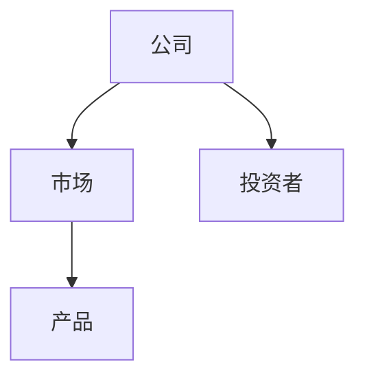
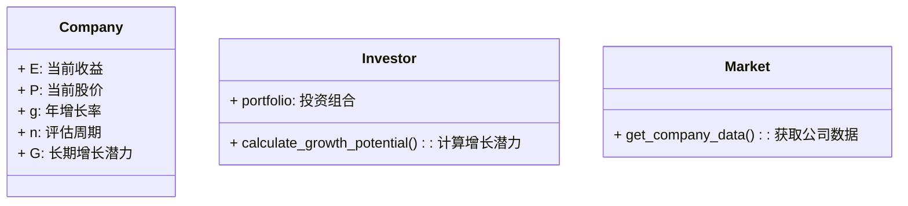
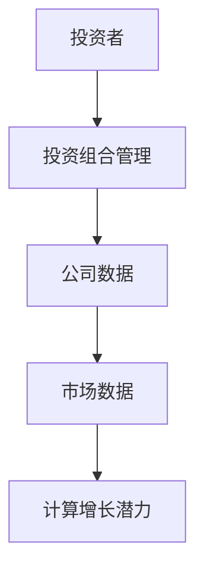
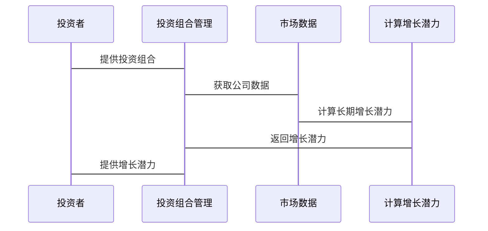

                 


# 费雪的长期增长潜力评估

> 关键词：费雪投资理念、长期增长潜力、成长股投资、股票评估模型、投资策略、投资风险管理

> 摘要：本文深入探讨了费雪的长期增长潜力评估方法，结合技术分析和投资策略，系统性地分析了如何通过费雪模型来评估公司的长期增长潜力。文章详细阐述了费雪模型的核心概念、算法原理、系统架构设计、项目实战以及最佳实践，为投资者提供了全面的理论支持和实践指导。

---

# 第1章: 费雪投资理念与长期增长潜力概述

## 1.1 费雪的生平与投资成就

菲利普·费雪（Philip Fisher）是20世纪著名的投资专家，被誉为“成长股之父”。他于1906年出生于美国加利福尼亚州，凭借其卓越的投资理念和长期的增长股投资策略，成为投资界的重要人物。费雪在投资领域的主要贡献包括：

1. **成长股投资**：费雪强调投资于具有持续增长潜力的公司，而非仅仅关注短期收益。
2. **买入并持有**：他倡导买入优质股票并长期持有，而非频繁交易。
3. **深入研究**：费雪认为，投资者必须对公司的基本面进行深入研究，才能做出明智的投资决策。

## 1.2 长期增长潜力评估的必要性

### 1.2.1 投资者为何需要长期增长潜力评估

在股票市场中，投资者面临众多选择，如何筛选出具有长期增长潜力的公司是投资成功的关键。费雪模型通过分析公司的财务数据和市场表现，帮助投资者识别出那些能够在未来持续增长的公司。

### 1.2.2 经济周期与企业增长的关系

经济周期对企业的增长有着重要影响。在经济繁荣时期，企业增长可能更快；而在经济衰退时期，企业增长可能放缓。费雪模型通过分析企业在不同经济周期中的表现，评估其长期增长潜力。

### 1.2.3 长期增长潜力评估的边界与外延

长期增长潜力评估的边界包括公司财务数据、市场环境和宏观经济因素。外延则包括对企业未来收益、股价波动和投资风险的预测。

## 1.3 费雪模型的核心要素

### 1.3.1 费雪模型的基本假设

- 公司收益持续增长。
- 股价反映市场对公司的预期。
- 投资者能够准确获取公司的财务数据。

### 1.3.2 模型的输入变量与输出变量

- **输入变量**：当前收益（E）、当前股价（P）、年增长率（g）。
- **输出变量**：长期增长潜力（G）。

### 1.3.3 模型的数学表达式与公式

费雪模型的数学公式如下：
$$
G = \frac{E}{P} \times (1 + g)^n
$$
其中，G为长期增长潜力，E为当前收益，P为当前股价，g为年增长率，n为评估周期。

---

# 第2章: 费雪模型的核心概念与联系

## 2.1 费雪模型的原理与公式

费雪模型的核心在于通过分析公司的当前收益、股价和年增长率，预测其长期增长潜力。公式中的各个变量代表了公司未来增长的关键因素。

## 2.2 费雪模型的核心属性特征对比

以下表格对比了费雪模型的核心属性特征：

| 属性 | 描述 |
|------|------|
| 输入变量 | 当前收益（E）、当前股价（P）、年增长率（g） |
| 输出变量 | 长期增长潜力（G） |
| 模型假设 | 企业收益持续增长，股价反映市场预期 |

## 2.3 费雪模型的ER实体关系图

以下是费雪模型的ER实体关系图：



---

# 第3章: 费雪模型的算法原理

## 3.1 费雪模型的算法流程

以下是费雪模型的算法流程图：

```mermaid
graph TD
    A[开始] --> B[输入当前收益(E)]
    B --> C[输入当前股价(P)]
    C --> D[输入年增长率(g)]
    D --> E[计算长期增长潜力G]
    E --> F[结束]
```

## 3.2 费雪模型的Python实现

以下是一个简单的Python实现示例：

```python
def fisher_growth_potential(E, P, g, n):
    G = (E / P) * (1 + g) ** n
    return G

# 示例计算
E = 100  # 当前收益
P = 20   # 当前股价
g = 0.1  # 年增长率
n = 5    # 评估周期

result = fisher_growth_potential(E, P, g, n)
print(f"长期增长潜力 G = {result}")
```

### 3.2.1 数学模型

费雪模型的数学公式如下：

$$
G = \frac{E}{P} \times (1 + g)^n
$$

### 3.2.2 举例说明

假设一家公司当前收益为 $100，股价为 $20，年增长率为 10%，评估周期为 5 年。根据费雪模型，长期增长潜力 G 为：

$$
G = \frac{100}{20} \times (1 + 0.1)^5 = 5 \times 1.61051 = 8.05255
$$

---

# 第4章: 费雪模型的系统分析与架构设计

## 4.1 问题场景介绍

在股票市场中，投资者需要一个高效的系统来评估公司的长期增长潜力。费雪模型提供了理论支持，但实际应用中需要一个完整的系统来实现。

## 4.2 系统功能设计

以下是系统功能设计的类图：



## 4.3 系统架构设计

以下是系统架构设计的架构图：



## 4.4 系统接口设计

以下是系统接口设计的序列图：



---

# 第5章: 费雪模型的项目实战

## 5.1 项目介绍

本项目旨在通过费雪模型评估一家科技公司的长期增长潜力。

## 5.2 环境配置

以下是项目所需的环境配置：

- Python 3.8+
- NumPy库
- Matplotlib库

## 5.3 代码实现

以下是代码实现：

```python
import numpy as np
import matplotlib.pyplot as plt

def fisher_growth_potential(E, P, g, n):
    return (E / P) * (1 + g) ** n

# 示例数据
E = np.array([100, 150, 200, 250, 300])  # 当前收益
P = np.array([20, 30, 40, 50, 60])        # 当前股价
g = 0.1                                      # 年增长率
n = 5                                        # 评估周期

# 计算长期增长潜力
G = fisher_growth_potential(E, P, g, n)

# 可视化
plt.plot(E, G, 'b-', marker='o')
plt.xlabel('Current Earnings (E)')
plt.ylabel('Long-term Growth Potential (G)')
plt.title('Fisher Growth Potential Analysis')
plt.grid(True)
plt.show()
```

## 5.4 案例分析

以下是对某科技公司的案例分析：

1. **公司基本面分析**：公司当前收益为 $200，股价为 $40，年增长率为 15%。
2. **计算长期增长潜力**：
   $$
   G = \frac{200}{40} \times (1 + 0.15)^5 = 5 \times 2.01136 = 10.0568
   $$
3. **投资决策**：根据计算结果，公司具有较高的长期增长潜力，值得投资。

---

# 第6章: 费雪模型的最佳实践

## 6.1 小结

费雪模型通过分析公司的当前收益、股价和年增长率，预测其长期增长潜力，为投资者提供了重要的决策依据。

## 6.2 注意事项

1. 模型假设可能与实际情况不符。
2. 需要定期更新财务数据和市场信息。
3. 结合其他评估方法进行综合判断。

## 6.3 拓展阅读

1. 费雪的其他投资理念。
2. 其他股票评估模型的比较与分析。

---

# 作者：AI天才研究院/AI Genius Institute & 禅与计算机程序设计艺术 /Zen And The Art of Computer Programming

