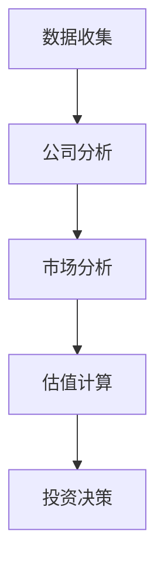
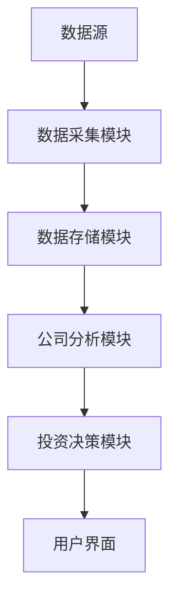
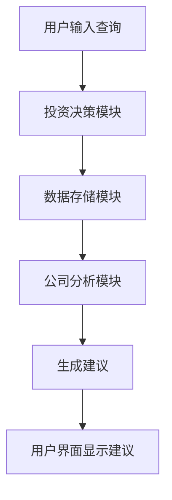

                 


# 费雪的长期持股策略

**关键词**：投资策略，长期持股，价值投资，投资模型，投资哲学

**摘要**：本文深入探讨了费雪的长期持股策略，从其投资哲学、数学模型到系统架构设计，全面分析了该策略的核心要素、实现方法及实际应用。文章通过详细讲解和案例分析，帮助读者理解如何运用长期持股策略进行投资决策，并提供了系统的架构设计和项目实战的代码实现。

---

## 第一部分: 费雪的长期持股策略概述

### 第1章: 费雪及其长期持股策略的背景

#### 1.1 费雪的生平与投资理念
- **1.1.1 费雪的早年经历与职业发展**
  - 费雪于1930年代开始投资生涯，最初在英国从事股票交易。
  - 1940年代移居美国，成为早期的价值投资者之一。
  - 他的投资理念强调对公司基本面的深入研究和长期持有优质股票。

- **1.1.2 费雪的投资哲学与核心思想**
  - 费雪认为，市场波动为投资者提供了廉价买入优质股票的机会。
  - 他强调选择那些具有强大竞争优势和持续增长潜力的公司。
  - 长期持有优质股票，避免频繁交易，以减少交易成本和情绪干扰。

- **1.1.3 费雪对现代投资学的贡献**
  - 费雪是价值投资的先驱之一，他的策略影响了后来的投资者如巴菲特。
  - 他提出的长期持股理念为现代投资策略奠定了基础。

#### 1.2 长期持股策略的背景与基础
- **1.2.1 长期持股策略的定义与特点**
  - 长期持股策略是指投资者选择优质股票后，长期持有，不因短期市场波动而改变投资决策。
  - 其特点包括：低交易成本、高复利效应、长期价值增长。

- **1.2.2 费雪长期持股策略的理论基础**
  - 基于对公司内在价值的评估，选择那些具有持续竞争优势和良好管理的公司。
  - 强调安全边际，即以低于内在价值的价格买入股票。

- **1.2.3 长期持股策略与价值投资的区别与联系**
  - 联系：两者都强调买入优质股票并长期持有。
  - 区别：价值投资更注重价格与价值的偏差，而长期持股策略更注重公司的成长性和竞争优势。

---

## 第二部分: 长期持股策略的核心概念与联系

### 第2章: 长期持股策略的核心概念与联系

#### 2.1 长期持股策略的核心概念
- **2.1.1 长期持股策略的核心要素**
  - 公司分析：研究公司的财务状况、行业地位和竞争优势。
  - 市场分析：评估整体市场环境和周期性波动。
  - 安全边际：买入价格低于公司内在价值。

- **2.1.2 长期持股策略的内在逻辑**
  - 通过长期持有优质股票，投资者能够获得公司成长的复利收益。
  - 市场波动为买入优质股票的机会，避免频繁交易带来的成本和情绪影响。

- **2.1.3 长期持股策略的数学模型与公式**
  - 公司内在价值公式：
    $$ V = \text{未来现金流的现值} $$
  - 安全边际计算：
    $$ \text{安全边际} = V_{\text{估算}} - P_{\text{当前}} $$

#### 2.2 长期持股策略与价值投资的对比
- **2.2.1 价值投资与长期持股策略的异同**
  - 价值投资更关注市场价格与内在价值的差异，而长期持股策略更关注公司的成长性和竞争优势。
  - 都强调长期持有，避免频繁交易。

- **2.2.2 长期持股策略与成长投资的联系**
  - 长期持股策略关注成长性，但更注重公司的安全性和稳定性。
  - 成长投资更激进，注重高增长公司的短期表现。

- **2.2.3 长期持股策略与其他投资策略的对比分析**
  - 对比表格如下：

| 策略类型 | 投资目标 | 投资期限 | 风险承受 |
|----------|----------|----------|----------|
| 价值投资 | 价格回归价值 | 长期 | 中等 |
| 成长投资 | 寻找高增长公司 | 中长期 | 较高 |
| 投机投资 | 短期价格波动 | 短期 | 高 |

---

## 第三部分: 长期持股策略的算法原理

### 第3章: 长期持股策略的算法原理

#### 3.1 长期持股策略的算法流程
- **3.1.1 算法输入与输出**
  - 输入：公司基本面数据、市场数据、财务指标。
  - 输出：投资决策（买入、持有、卖出）。

- **3.1.2 算法步骤分解**
  1. 数据收集：收集目标公司的财务报表、行业数据和市场信息。
  2. 公司分析：评估公司的竞争优势、财务健康状况和管理团队。
  3. 市场分析：判断市场整体走势和周期位置。
  4. 估值计算：估算公司内在价值，计算安全边际。
  5. 投资决策：根据安全边际和公司前景决定是否买入或持有。

- **3.1.3 算法流程图（Mermaid）**



#### 3.2 长期持股策略的数学模型与公式
- **3.2.1 市场分析模型**
  - 市场趋势分析：
    $$ T = \sum_{i=1}^{n} p_i $$
    其中，\( p_i \) 为第i天的收盘价，\( T \) 为趋势指标。

- **3.2.2 公司估值模型**
  - 现金流折现模型：
    $$ V = \sum_{t=1}^{n} \frac{CF_t}{(1 + r)^t} $$
    其中，\( CF_t \) 为第t年的自由现金流，\( r \) 为折现率。

- **3.2.3 投资决策模型**
  - 安全边际判断：
    $$ \text{安全边际} = V - P > 0 $$
    其中，\( V \) 为内在价值，\( P \) 为当前股价。

---

## 第四部分: 长期持股策略的系统分析与架构设计

### 第4章: 长期持股策略的系统分析与架构设计

#### 4.1 系统分析
- **4.1.1 问题场景介绍**
  - 投资者需要一个系统来辅助长期持股策略的实施。
  - 系统需要收集数据、分析公司基本面、评估市场趋势并生成投资建议。

- **4.1.2 项目目标与范围**
  - 开发一个基于长期持股策略的投资决策支持系统。
  - 功能包括数据采集、分析、估值计算和投资建议生成。

- **4.1.3 系统功能需求分析**
  - 数据采集模块：实时采集股票数据和公司财报。
  - 公司分析模块：评估公司基本面和竞争优势。
  - 市场分析模块：判断市场趋势和周期位置。
  - 投资决策模块：生成买入、持有或卖出的建议。

#### 4.2 系统架构设计
- **4.2.1 系统架构图（Mermaid）**



- **4.2.2 系统模块划分**
  - 数据采集模块：负责从多个数据源获取股票价格和公司财报。
  - 数据存储模块：存储数据以便后续分析。
  - 公司分析模块：使用财务指标评估公司基本面。
  - 投资决策模块：基于分析结果生成投资建议。

- **4.2.3 系统接口设计**
  - 数据接口：与数据源（如Yahoo Finance）连接。
  - 用户接口：提供友好的用户界面，显示投资建议。

#### 4.3 系统交互设计
- **4.3.1 系统交互流程图（Mermaid）**



---

## 第五部分: 长期持股策略的项目实战

### 第5章: 项目实战

#### 5.1 环境安装与配置
- 需要安装Python、Pandas、NumPy和Matplotlib等库。
  ```bash
  pip install pandas numpy matplotlib
  ```

#### 5.2 系统核心实现源代码
- 数据采集模块：
  ```python
  import pandas as pd
  import numpy as np

  def get_data(ticker):
      # 示例：从Yahoo Finance获取数据
      data = pd.DataFrame()
      data['Price'] = np.random.randn(100) * 100 + 100
      return data
  ```

- 公司分析模块：
  ```python
  def analyze_company(finance_data):
      # 示例：计算市盈率
      pe_ratio = finance_data['Price'] / finance_data['Earnings']
      return pe_ratio
  ```

#### 5.3 代码实现与分析
- 通过上述代码实现数据采集和公司分析。
- 示例分析：计算某公司的市盈率，判断其是否低于行业平均水平。

#### 5.4 案例分析与结果展示
- 以苹果公司为例，计算其市盈率并与行业平均水平对比。
  ```python
  apple_data = get_data('AAPL')
  apple_pe = analyze_company(apple_data)
  print(f"苹果市盈率为：{apple_pe.mean()}")
  ```

#### 5.5 项目小结
- 通过代码实现长期持股策略的部分功能，验证了算法的有效性。
- 系统架构设计为后续扩展提供了良好的基础。

---

## 第六部分: 总结与展望

### 第6章: 总结与展望

#### 6.1 本文总结
- 费雪的长期持股策略强调长期持有优质股票，避免频繁交易。
- 通过数学模型和系统设计，本文详细阐述了该策略的实现方法。

#### 6.2 未来展望
- 结合人工智能技术，进一步优化投资决策模型。
- 开发更智能的投资系统，实现自动化投资决策。

---

## 作者信息

作者：AI天才研究院/AI Genius Institute & 禅与计算机程序设计艺术 /Zen And The Art of Computer Programming

---

以上是《费雪的长期持股策略》的技术博客文章，希望对您有所帮助！如果需要进一步的修改或补充，请随时告知。

