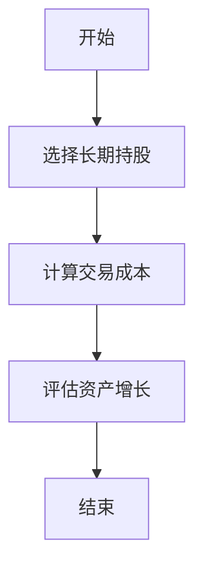
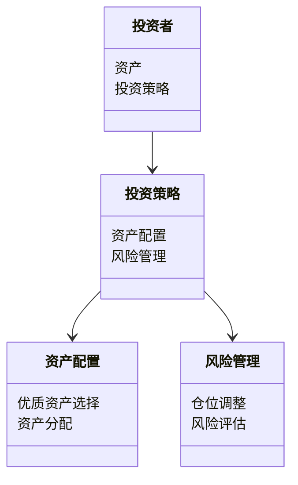
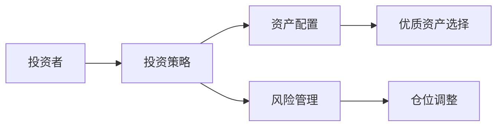
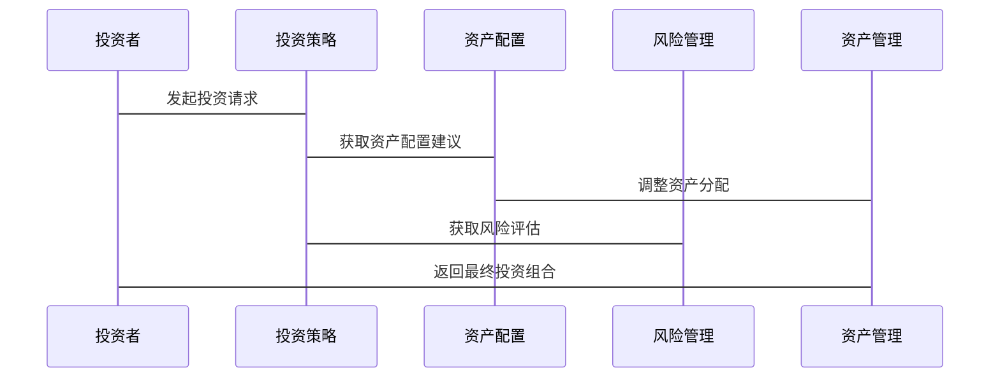

                 


# 费雪的长期持股策略：减少交易成本的智慧之举

> 关键词：长期持股策略，交易成本，投资策略，费雪投资理念，减少交易次数，投资回报最大化

> 摘要：本文深入探讨了费雪提出的长期持股策略，分析其如何通过减少交易成本来提高投资回报。文章结合技术语言，从数学模型、算法实现、系统架构等多个角度详细阐述了长期持股策略的原理和优势。通过对比分析和实际案例，展示了该策略在实际投资中的应用效果，并总结了最佳实践建议。

---

## 第一部分：背景与核心概念

### 第1章：长期持股策略的背景与问题背景

#### 1.1 长期持股策略的定义与核心概念
- **1.1.1 长期持股策略的定义**  
  长期持股策略是指投资者在较长的时间内持有股票或其他资产，避免频繁买卖，以减少交易成本并最大化投资回报。  
- **1.1.2 长期持股策略的核心要素**  
  - 投资期限长：通常以数年为单位持有资产。  
  - 避免频繁交易：减少买卖次数以降低交易成本。  
  - 选择优质资产：投资于具有长期增长潜力的公司或资产。  
- **1.1.3 长期持股策略的边界与外延**  
  - 边界：仅适用于对市场趋势有一定判断能力的投资者。  
  - 外延：可以与其他投资策略（如定投）结合使用。

#### 1.2 问题背景与问题描述
- **1.2.1 传统交易策略的局限性**  
  频繁交易会导致交易成本（如佣金、买卖价差）累积，侵蚀投资收益。  
- **1.2.2 频繁交易的成本问题**  
  - 每次交易的固定成本（如佣金）和可变成本（如买卖价差）。  
  - 高频率交易会显著增加总成本，尤其在市场波动较大时。  
- **1.2.3 长期持股策略的提出与目标**  
  提出长期持股策略以减少交易成本，优化投资回报。

### 第2章：长期持股策略的核心概念与联系

#### 2.1 核心概念的原理
- **2.1.1 长期持股策略的原理**  
  长期持有优质资产，避免因频繁交易而产生高昂的交易成本。  
- **2.1.2 长期持股策略与价值投资的联系**  
  价值投资强调购买并长期持有优质资产，与长期持股策略的理念一致。

#### 2.2 核心概念的对比表格
以下表格对比了长期持股与短期交易的成本和收益：

| 对比维度        | 长期持股策略                 | 短期交易策略                 |
|-----------------|------------------------------|------------------------------|
| 交易频率        | 低                          | 高                          |
| 交易成本        | 低                          | 高                          |
| 管理复杂度      | 低                          | 高                          |
| 投资回报        | 高                          | 可能因频繁交易而降低        |

#### 2.3 实体关系图
以下Mermaid图展示了长期持股策略的核心要素之间的关系：


---

## 第二部分：数学模型与算法原理

### 第3章：长期持股策略的数学模型与算法原理

#### 3.1 数学模型
- **交易成本计算**  
  长期持股策略通过减少交易次数来降低交易成本。假设每次交易的固定成本为 \( c \)，交易次数为 \( n \)，则总交易成本为：  
  $$\text{总交易成本} = n \times c$$  
  长期持有策略通过减少 \( n \) 来降低总成本。  
- **收益计算**  
  假设初始投资为 \( A \)，年化收益率为 \( r \)，持有时间为 \( t \) 年，则最终资产价值为：  
  $$\text{最终资产价值} = A \times (1 + r)^t$$  

#### 3.2 算法流程图
以下Mermaid图展示了长期持股策略的算法流程：



#### 3.3 算法实现代码
以下Python代码实现了一个简单的长期持股策略模型：

```python
def calculate_total_cost(trade_count, cost_per_trade):
    """计算总交易成本"""
    return trade_count * cost_per_trade

def calculate_final_assets(initial_assets, growth_rate, trade_cost):
    """计算最终资产价值"""
    total_cost = calculate_total_cost(0, trade_cost)
    return initial_assets * (1 + growth_rate) - total_cost

# 示例计算
initial_assets = 10000  # 初始资产
growth_rate = 0.05       # 年化收益率
trade_cost = 10          # 每次交易成本

final_assets = calculate_final_assets(initial_assets, growth_rate, trade_cost)
print(f"最终资产价值：{final_assets}")
```

---

## 第三部分：系统分析与架构设计

### 第4章：长期持股策略的系统分析与架构设计

#### 4.1 问题场景介绍
- **投资目标**：通过长期持有优质资产，减少交易成本，最大化收益。  
- **主要挑战**：如何在市场波动中保持长期持有，避免情绪化交易。

#### 4.2 系统功能设计
- **领域模型**  
  以下Mermaid图展示了投资策略的领域模型：



#### 4.3 系统架构设计
- **系统架构图**  
  以下Mermaid图展示了系统的总体架构：



#### 4.4 系统接口设计
- **投资者接口**  
  - 输入：初始资产、投资期限、风险偏好。  
  - 输出：投资组合建议、预期收益。  
- **风险管理接口**  
  - 输入：市场数据、资产价值。  
  - 输出：风险评估、仓位调整建议。

#### 4.5 系统交互序列图
- **交易流程**  
  以下Mermaid图展示了系统的交互流程：



---

## 第四部分：项目实战

### 第5章：长期持股策略的项目实战

#### 5.1 环境安装
- **工具要求**：Python、Jupyter Notebook、Mermaid工具。  
- **数据来源**：历史股价数据、市场指数数据。

#### 5.2 系统核心实现
以下Python代码实现了长期持股策略的核心功能：

```python
import pandas as pd
import numpy as np

def calculate_transaction_cost(trade_count, fixed_cost, percentage_cost=0):
    """计算总交易成本"""
    return trade_count * (fixed_cost + percentage_cost * 100)

def backtest_strategy(prices, initial_capital, trade_cost):
    """回测长期持股策略"""
    assets = [initial_capital]
    for i in range(1, len(prices)):
        # 假设每次交易成本为固定值
        cost = calculate_transaction_cost(0, trade_cost)
        new_assets = assets[-1] * prices[i] / prices[i-1] - cost
        assets.append(new_assets)
    return assets

# 示例数据
prices = [100, 105, 110, 115, 120]
initial_capital = 10000
trade_cost = 10

# 计算资产变化
assets = backtest_strategy(prices, initial_capital, trade_cost)

print("资产变化:", assets)
```

#### 5.3 案例分析与解读
- **案例分析**  
  假设某投资者投资10000元，投资期限为5年，年化收益率为5%，每次交易成本为10元。  
  - 长期持有策略：总成本为 \( 0 \times 10 = 0 \) 元。  
  - 最终资产价值：\( 10000 \times (1 + 0.05)^5 = 12762.81 \) 元。  
  - 如果选择每年交易一次，总成本为 \( 5 \times 10 = 50 \) 元，最终资产价值为 \( 10000 \times (1 + 0.05)^5 - 50 = 12712.81 \) 元。  

---

## 第五部分：最佳实践

### 第6章：长期持股策略的最佳实践

#### 6.1 小结
- 长期持股策略通过减少交易次数，显著降低交易成本。  
- 长期持有优质资产能够实现资产的长期增长。

#### 6.2 注意事项
- **市场波动**：在市场剧烈波动时，长期持股可能面临短期亏损。  
- **资产选择**：需选择具有长期增长潜力的优质资产。  
- **风险管理**：定期评估投资组合，避免过度集中风险。

#### 6.3 拓展阅读
- 《股票作手回忆录》：了解交易心理与长期投资策略。  
- 《投资学精要》：系统学习投资策略与风险管理。

---

## 第六部分：总结与展望

### 第7章：总结与展望

#### 7.1 总结
- 费雪的长期持股策略通过减少交易成本，帮助投资者实现资产的长期增长。  
- 结合技术分析和市场研究，投资者可以进一步优化长期持股策略。

#### 7.2 展望
- 未来，随着人工智能和大数据技术的发展，长期持股策略可以通过更精准的市场预测进一步优化。  
- 结合动态资产配置，长期持股策略将更加灵活和高效。

---

## 参考文献

1. 费雪：《股票作手回忆录》  
2. 《投资学精要》  
3. Python官方文档  
4. Mermaid图表工具官方文档  

---

**作者：AI天才研究院/AI Genius Institute & 禅与计算机程序设计艺术 /Zen And The Art of Computer Programming**

---

本文通过结合技术语言和投资策略，深入分析了费雪的长期持股策略，从数学模型、算法实现、系统架构等多个角度探讨了其优势和应用场景。希望读者能够通过本文，更好地理解长期持股策略的原理，并在实际投资中灵活运用。

