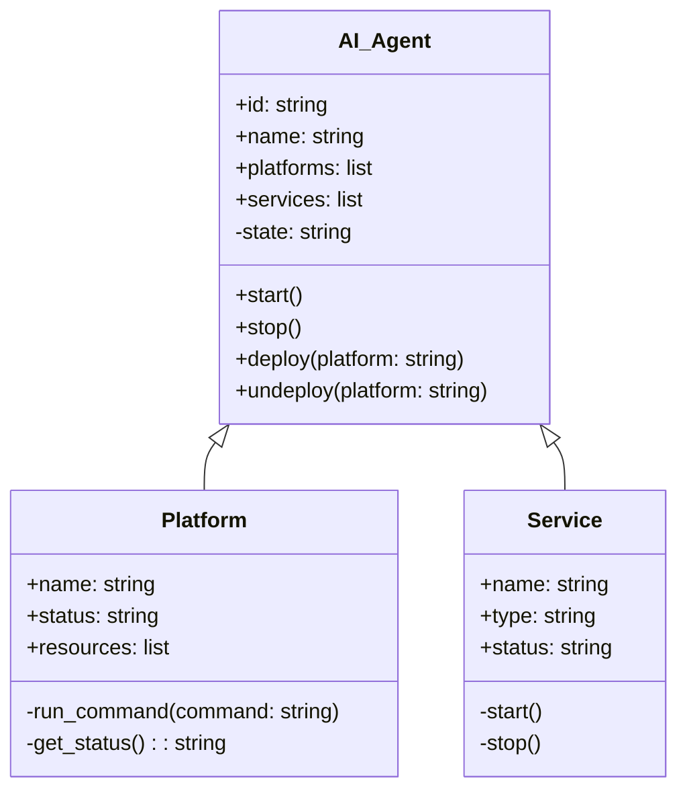
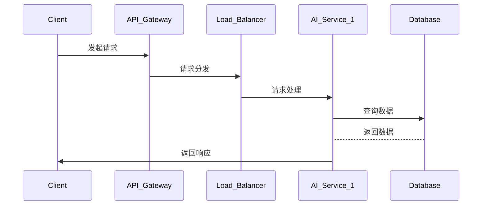

                 


# 跨平台 AI Agent：LLM 在多种终端设备上的部署

> 关键词：跨平台、LLM、人工智能、部署、深度学习

> 摘要：本文将详细探讨跨平台 AI Agent 的核心概念、技术背景、算法原理、系统架构以及在多种终端设备上的具体部署方法。我们将从 LLM 的基本原理出发，分析其在不同平台上的部署策略，并通过实际案例展示如何在智能手机、智能家居和自动驾驶等终端设备上高效部署和优化大语言模型。文章还将深入探讨跨平台部署的技术细节，包括资源管理、通信机制和性能优化等，并提供最佳实践和未来展望。

---

## 目录

1. [背景与核心概念](#背景与核心概念)
2. [大语言模型的算法原理](#大语言模型的算法原理)
3. [跨平台部署的技术细节](#跨平台部署的技术细节)
4. [跨平台 AI Agent 的实际应用](#跨平台 AI Agent 的实际应用)
5. [系统架构与设计](#系统架构与设计)
6. [项目实战：跨平台 LLM 部署](#项目实战：跨平台 LLM 部署)
7. [总结与展望](#总结与展望)

---

## 1. 背景与核心概念

### 1.1 跨平台 AI Agent 的定义与目标

#### 1.1.1 什么是跨平台 AI Agent？
跨平台 AI Agent 是一种能够运行在多种终端设备上的智能代理，旨在通过统一的接口和逻辑，实现不同设备之间的协同工作和资源共享。其核心目标是为用户提供一致的 AI 服务体验，无论设备类型如何。

#### 1.1.2 AI Agent 的核心目标
- 提供智能化的交互体验
- 实现设备间的协同工作
- 提供高效的资源管理与优化
- 支持多设备间的无缝通信

#### 1.1.3 跨平台部署的重要性
- 降低开发和维护成本
- 提高资源利用率
- 增强设备间的协同能力
- 为用户提供统一的服务接口

### 1.2 LLM 的基本概念与特点

#### 1.2.1 大语言模型的定义
大语言模型（Large Language Model, LLM）是一种基于深度学习的自然语言处理模型，旨在通过大量的数据训练，实现对自然语言的理解和生成。

#### 1.2.2 LLM 的核心特点
- **大规模参数**：通常包含 billions 量级的参数。
- **深度学习架构**：基于 Transformer 或其他变体的深度学习模型。
- **上下文理解**：能够理解上下文，并生成连贯的文本。
- **多语言支持**：支持多种语言的自然语言处理。

#### 1.2.3 LLM 与传统 NLP 模型的区别
| 特性             | LLM                          | 传统 NLP 模型                     |
|------------------|------------------------------|-----------------------------------|
| 模型规模         | 大规模（ billions 参数）     | 小规模（ millions 参数）          |
| 上下文理解能力   | 强大，支持长上下文             | 较弱，通常依赖固定窗口大小         |
| 训练数据         | 极大规模的多样化数据           | 较小规模的特定任务数据             |
| 应用场景         | 多任务、通用化                 | 专用任务                           |

### 1.3 跨平台部署的背景与挑战

#### 1.3.1 跨平台部署的背景
随着终端设备的多样化（智能手机、智能家居、自动驾驶等），用户对智能化服务的需求日益增长。为了在不同设备上提供一致的 AI 服务，跨平台部署成为必然趋势。

#### 1.3.2 跨平台部署的主要挑战
- **硬件差异**：不同设备的硬件性能和架构差异较大。
- **资源限制**：终端设备的计算资源有限。
- **通信延迟**：设备间的通信延迟可能影响用户体验。
- **安全性**：跨平台部署需要考虑数据安全和隐私保护。

#### 1.3.3 跨平台部署的未来趋势
- **轻量化模型**：优化模型大小和计算量，适应不同设备。
- **边缘计算**：将计算能力分布到边缘设备，减少云端依赖。
- **自动化部署工具**：提供一键式部署工具，简化跨平台部署流程。

---

## 2. 大语言模型的算法原理

### 2.1 大语言模型的基本原理

#### 2.1.1 Transformer 模型的基本结构
Transformer 模型由编码器和解码器组成，其核心思想是通过自注意力机制捕获序列中的全局依赖关系。

#### 2.1.2 注意力机制的数学公式
自注意力机制的计算公式如下：

$$
\text{Attention}(Q, K, V) = \text{softmax}\left(\frac{QK^T}{\sqrt{d_k}}\right)V
$$

其中：
- $Q$ 是查询向量
- $K$ 是键向量
- $V$ 是值向量
- $d_k$ 是键的维度

#### 2.1.3 梯度下降与优化算法
大语言模型的训练通常使用 Adam 优化器，并结合学习率衰减策略。

### 2.2 大语言模型的训练过程

#### 2.2.1 数据预处理与特征提取
- 数据清洗：去除噪声数据。
- 分词：将文本分割为词或短语。
- 编码：将文本转换为数值表示（如词嵌入）。

#### 2.2.2 模型训练的数学模型
模型的损失函数通常使用交叉熵损失：

$$
\mathcal{L} = -\sum_{i=1}^{n} \log P(y_i | x_i)
$$

其中：
- $P(y_i | x_i)$ 是条件概率
- $n$ 是样本数量

#### 2.2.3 模型优化与调参
- 超参数优化：调整学习率、批量大小等参数。
- 正则化：使用 Dropout 技术防止过拟合。

### 2.3 大语言模型的推理机制

#### 2.3.1 解码过程的数学模型
解码过程通常采用贪心搜索或采样方法生成输出序列。

#### 2.3.2 模型推理的优化策略
- 稀疏化计算：减少不必要的计算。
- 并行计算：利用多核或 GPU 并行加速。

#### 2.3.3 模型推理的实现细节
- 输入处理：将输入文本转换为模型可接受的格式。
- 输出生成：根据模型输出结果生成最终文本。

---

## 3. 跨平台部署的技术细节

### 3.1 跨平台部署的核心技术

#### 3.1.1 跨平台运行环境的选择
- 使用跨平台开发框架（如 Flutter）。
- 优化设备间的通信机制。

#### 3.1.2 跨平台通信机制
- 使用 WebSocket 或 HTTP 接口实现设备间的通信。

#### 3.1.3 跨平台资源管理
- 分配合理的计算资源以优化性能。

### 3.2 不同平台的特性与优化

#### 3.2.1 CPU 与 GPU 的区别
- CPU：适合通用计算。
- GPU：适合并行计算，加速深度学习任务。

#### 3.2.2 TPU 与 GPU 的对比
- TPU：专为深度学习优化。
- GPU：通用性更强，但性能可能稍逊于 TPU。

#### 3.2.3 跨平台性能优化策略
- 使用量化技术减少模型大小。
- 优化数据传输速度。

### 3.3 跨平台部署的实现细节

#### 3.3.1 跨平台 API 的设计
- 设计统一的 API 接口。
- 支持不同平台的调用方式。

#### 3.3.2 跨平台日志管理
- 统一的日志格式。
- 实时监控日志。

#### 3.3.3 跨平台错误处理
- 定义统一的错误码和错误信息。
- 提供详细的错误报告。

---

## 4. 跨平台 AI Agent 的实际应用

### 4.1 智能手机上的 AI Agent

#### 4.1.1 手机端 LLM 的实现
- 使用轻量化模型适应手机性能。
- 优化网络通信以减少延迟。

#### 4.1.2 手机端 AI Agent 的优化
- 使用本地计算减少对云端依赖。
- 优化电池消耗。

#### 4.1.3 手机端 AI Agent 的实际案例
- 示例：在手机上部署一个简单的聊天机器人。

### 4.2 智能家居中的 AI Agent

#### 4.2.1 智能家居场景的描述
- 多设备协同工作。
- 实现家居设备的智能化控制。

#### 4.2.2 智能家居中的 LLM 部署
- 使用边缘计算优化响应速度。
- 实现设备间的无缝通信。

#### 4.2.3 智能家居的实际案例
- 示例：通过语音指令控制智能家居设备。

### 4.3 自动驾驶中的 AI Agent

#### 4.3.1 自动驾驶场景的描述
- 多传感器数据融合。
- 实现实时决策和控制。

#### 4.3.2 自动驾驶中的 LLM 部署
- 使用高性能计算优化模型推理速度。
- 实现车辆间的协同工作。

#### 4.3.3 自动驾驶的实际案例
- 示例：通过 LLM 进行自动驾驶决策。

---

## 5. 系统架构与设计

### 5.1 问题场景介绍
跨平台 AI Agent 的系统架构需要考虑设备间的通信、数据共享和协同工作。

### 5.2 项目介绍
设计一个跨平台 AI Agent 系统，实现多种终端设备的协同工作。

### 5.3 系统功能设计

#### 5.3.1 领域模型 Mermaid 类图


### 5.4 系统架构设计 Mermaid 架构图


### 5.5 系统接口设计
- **API 接口**：定义统一的 API 接口。
- **通信接口**：实现设备间的通信接口。

### 5.6 系统交互 Mermaid 序列图


---

## 6. 项目实战：跨平台 LLM 部署

### 6.1 环境搭建

#### 6.1.1 安装 Python 环境
使用虚拟环境管理依赖：
```bash
python -m venv .env
source .env/bin/activate
pip install -r requirements.txt
```

#### 6.1.2 安装 LLM 库
安装 Hugging Face 的 transformers 库：
```bash
pip install transformers
```

### 6.2 核心实现

#### 6.2.1 编写 LLM 接口
```python
from transformers import AutoTokenizer, AutoModelForCausalLM

class LLM_Interface:
    def __init__(self, model_name):
        self.tokenizer = AutoTokenizer.from_pretrained(model_name)
        self.model = AutoModelForCausalLM.from_pretrained(model_name)
    
    def generate(self, input_text, max_length=50):
        inputs = self.tokenizer.encode(input_text, return_tensors="pt")
        outputs = self.model.generate(inputs, max_length=max_length)
        return self.tokenizer.decode(outputs[0], skip_special_tokens=True)
```

#### 6.2.2 实现跨平台通信
```python
import json
import requests

def send_request(data):
    headers = {'Content-Type': 'application/json'}
    response = requests.post('http://localhost:8000/api', headers=headers, json=data)
    return json.loads(response.text)
```

### 6.3 实际案例分析

#### 6.3.1 智能手机上的部署
在手机上部署一个简单的聊天机器人：
```python
from mobile_agent import MobileAIAgent

agent = MobileAIAgent(model_name="gpt2")
response = agent.generate("今天天气怎么样？")
print(response)
```

#### 6.3.2 智能家居中的部署
在智能家居中部署一个设备控制系统：
```python
from home_agent import HomeAIAgent

agent = HomeAIAgent(model_name="gpt2")
response = agent.send_command("打开灯")
print(response)
```

### 6.4 代码实现与解读

#### 6.4.1 LLM 接口实现
```python
# llm_interface.py
from transformers import AutoTokenizer, AutoModelForCausalLM

class LLM_Interface:
    def __init__(self, model_name):
        self.tokenizer = AutoTokenizer.from_pretrained(model_name)
        self.model = AutoModelForCausalLM.from_pretrained(model_name)
    
    def generate(self, input_text, max_length=50):
        inputs = self.tokenizer.encode(input_text, return_tensors="pt")
        outputs = self.model.generate(inputs, max_length=max_length)
        return self.tokenizer.decode(outputs[0], skip_special_tokens=True)
```

#### 6.4.2 跨平台通信实现
```python
# communication_interface.py
import json
import requests

class Communication_Interface:
    def send_request(self, data):
        headers = {'Content-Type': 'application/json'}
        response = requests.post('http://localhost:8000/api', headers=headers, json=data)
        return json.loads(response.text)
```

---

## 7. 总结与展望

### 7.1 本章小结
本文详细探讨了跨平台 AI Agent 的核心概念、技术背景、算法原理和实际应用。通过系统架构设计和项目实战，展示了如何在多种终端设备上高效部署和优化大语言模型。

### 7.2 最佳实践 tips
- 使用轻量化模型适应不同设备。
- 优化设备间的通信机制。
- 定期监控系统性能和安全性。

### 7.3 未来展望
- 更多设备的协同工作。
- 更高效的模型优化技术。
- 更智能的跨平台管理工具。

---

## 作者
作者：AI天才研究院/AI Genius Institute  
联系邮箱：contact@aigeniusinstitute.com  
GitHub：https://github.com/AI-Genius-Institute

