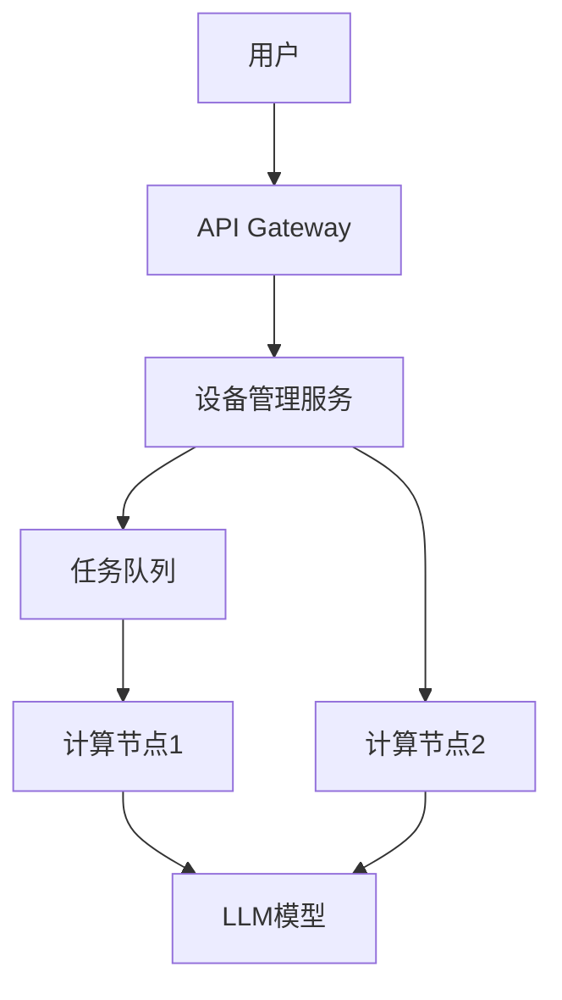

                 


# 跨平台AI Agent：LLM在多种终端设备上的部署

## 关键词：跨平台、AI Agent、LLM、大语言模型、多终端设备、部署、技术实现

## 摘要：  
随着人工智能技术的快速发展，大语言模型（LLM）在多种终端设备上的部署需求日益增长。本文将探讨跨平台AI Agent的核心概念、算法原理、系统架构设计以及实际项目部署的关键技术。通过深入分析LLM在不同终端设备上的适应性，结合具体应用场景，提供一套完整的解决方案，帮助读者理解和实现跨平台AI Agent的部署。

---

# 第一部分：背景介绍

## 第1章：AI Agent与LLM的基本概念

### 1.1 AI Agent的定义与特点  
AI Agent（人工智能代理）是指能够感知环境、自主决策并执行任务的智能实体。它可以是一个软件程序，也可以是一个硬件设备，通过与用户或环境交互，完成特定任务。  
**特点：**  
- **自主性**：能够在无外部干预的情况下运行。  
- **反应性**：能够实时感知环境并做出反应。  
- **目标导向**：以实现特定目标为导向进行决策。  
- **可扩展性**：能够适应不同场景和任务需求。  

### 1.2 大语言模型（LLM）的定义与特点  
LLM（Large Language Model）是一种基于深度学习的自然语言处理模型，具有强大的文本生成、理解与对话能力。  
**特点：**  
- **大规模训练数据**：通常使用海量文本数据进行训练，涵盖多种语言和领域。  
- **深度神经网络结构**：采用Transformer架构，支持长上下文理解和生成。  
- **多任务能力**：可以通过微调或提示工程（Prompt Engineering）实现多种任务，如问答、翻译、对话等。  
- **计算资源需求高**：训练和推理过程需要大量计算资源。  

### 1.3 跨平台AI Agent的意义与应用场景  
随着智能设备的普及，AI Agent需要在多种终端设备上运行，以满足不同场景的需求。跨平台部署可以实现以下目标：  
- **统一接口**：提供一致的API接口，方便开发者调用。  
- **多设备支持**：适应手机、平板、PC、物联网设备等多种终端。  
- **资源优化**：根据不同设备的性能特点，动态调整模型大小和计算复杂度。  

**应用场景：**  
- **智能家居**：通过AI Agent实现设备间的联动。  
- **移动应用**：在手机上提供智能助手服务。  
- **物联网**：在传感器节点上部署轻量级AI Agent。  

---

## 第2章：跨平台部署的背景与挑战

### 2.1 多终端设备的多样性  
现代终端设备种类繁多，性能差异显著：  
- **计算能力**：从高端服务器到低端移动设备。  
- **存储空间**：从几GB到几百GB。  
- **网络条件**：从高速5G到低带宽环境。  

### 2.2 跨平台部署的技术难点  
- **模型适配**：不同设备的硬件架构差异大，如CPU、GPU、TPU等。  
- **资源限制**：轻量级设备（如嵌入式设备）资源有限，需优化模型大小和计算量。  
- **通信延迟**：设备间通信延迟可能影响实时性。  

### 2.3 跨平台部署的必要性与优势  
- **扩展性**：一次部署，多设备可用。  
- **灵活性**：根据不同设备特点动态调整模型。  
- **成本优化**：减少重复开发和维护成本。  

---

## 第3章：大语言模型（LLM）的基础原理

### 3.1 LLM的核心原理  
LLM基于Transformer模型，通过自注意力机制（Self-Attention）捕捉上下文信息，生成连贯的文本输出。  
**数学公式：**  
自注意力机制的计算公式为：  
$$\text{Attention}(Q, K, V) = \text{softmax}\left(\frac{QK^T}{\sqrt{d_k}}\right)V$$  
其中，$Q$、$K$、$V$分别为查询、键、值矩阵，$d_k$为键的维度。  

### 3.2 LLM的主流模型与架构  
- **GPT系列**：生成式模型，擅长文本生成。  
- **BERT系列**：基于编码器的模型，擅长文本理解。  
- **T5**：统一的文本到文本模型，支持多种任务。  

### 3.3 LLM的性能优化与资源需求  
- **模型压缩**：通过剪枝（Pruning）和量化（Quantization）减少模型大小。  
- **推理优化**：通过并行计算和内存优化提升推理速度。  

---

## 第4章：跨平台部署的核心概念与联系

### 4.1 跨平台部署的核心概念  
- **跨平台通信机制**：设备间通过统一协议进行数据交互。  
- **跨平台资源管理**：动态分配计算资源以适应不同设备。  
- **跨平台任务调度**：根据设备负载和任务优先级进行任务分配。  

### 4.2 跨平台部署的核心原理  
- **通信协议设计**：使用JSON-RPC或HTTP协议进行设备间通信。  
- **资源分配算法**：基于设备负载的动态分配策略。  
- **任务调度算法**：采用贪心算法优先处理高优先级任务。  

---

## 第5章：跨平台部署的算法原理

### 5.1 跨平台通信算法  
- **消息传递机制**：设备间通过消息队列（Message Queue）进行通信。  
- **数据序列化**：使用Protocol Buffers或JSON进行数据序列化。  
- **通信协议设计**：定义请求格式和响应格式，确保设备间兼容性。  

### 5.2 跨平台资源管理算法  
- **资源分配策略**：根据设备性能动态分配任务。  
- **负载均衡算法**：通过Round-Robin或Least-Load算法实现负载均衡。  

---

## 第6章：系统架构设计

### 6.1 项目介绍  
本文将设计一个跨平台AI Agent系统，支持多种终端设备部署，包括手机、PC和物联网设备。  

### 6.2 系统功能设计  
- **用户交互层**：提供图形化界面或API接口与用户交互。  
- **模型服务层**：负责LLM模型的加载、推理和结果返回。  
- **设备管理层**：管理设备状态、资源分配和任务调度。  

### 6.3 系统架构设计  
**架构图：**  


---

## 第7章：项目实战

### 7.1 环境安装  
- **开发环境**：Python 3.8+，PyTorch 1.9+，Flask 2.0+。  
- **部署环境**：支持Docker容器化部署。  

### 7.2 核心实现代码  
```python
import torch
from torch import nn
from flask import Flask, request, jsonify

class SimpleLLM(nn.Module):
    def __init__(self):
        super().__init__()
        self.lm = nn.Transformer(max_len=512, d_model=512)

    def forward(self, input_ids):
        output = self.lm(input_ids)
        return output

app = Flask(__name__)
model = SimpleLLM()

@app.route('/api/predict', methods=['POST'])
def predict():
    data = request.json
    input_ids = torch.tensor(data['input_ids'])
    output = model(input_ids)
    return jsonify({'output': output.tolist()})

if __name__ == '__main__':
    app.run(port=5000)
```

### 7.3 代码解读与分析  
- **模型定义**：SimpleLLM类继承自PyTorch的nn.Module，定义了一个简单的Transformer模型。  
- **API接口**：Flask框架提供一个RESTful API，接收输入并返回模型预测结果。  

---

## 第8章：总结与展望

### 8.1 总结  
本文详细探讨了跨平台AI Agent的实现技术，包括LLM模型、通信协议、资源管理和系统架构设计。通过实际项目案例，展示了如何在多种终端设备上部署AI Agent。

### 8.2 未来展望  
- **轻量化模型**：进一步优化模型大小和计算效率。  
- **多模态支持**：结合视觉、听觉等多模态信息，提升AI Agent的感知能力。  
- **边缘计算**：将AI Agent部署在边缘设备上，提升实时性和隐私保护。  

---

## 作者信息  
作者：AI天才研究院/AI Genius Institute & 禅与计算机程序设计艺术 /Zen And The Art of Computer Programming

