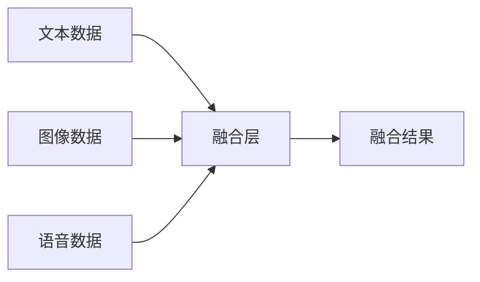
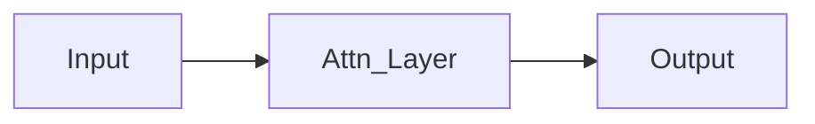
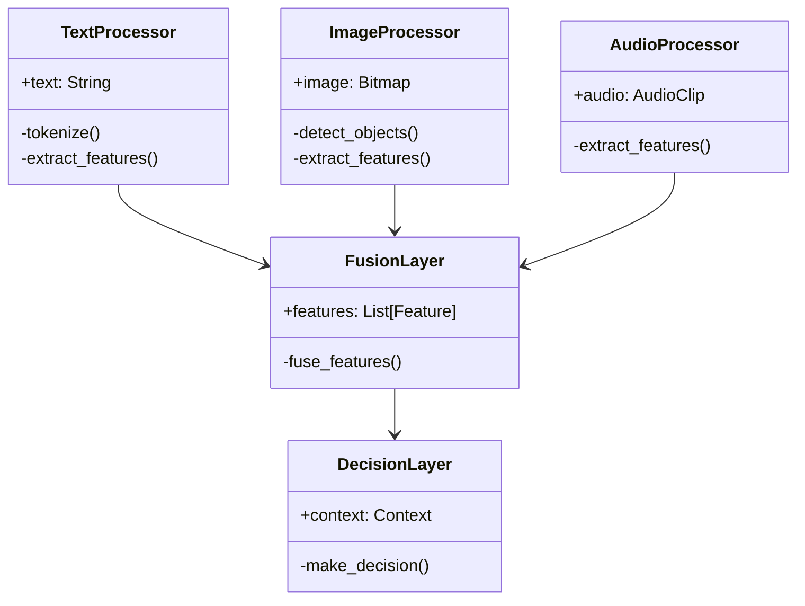

                 


# 跨感官AI Agent：融合LLM与多模态感知输入

> 关键词：跨感官AI Agent，LLM，多模态感知，数据融合，AI代理，多模态模型

> 摘要：本文深入探讨了跨感官AI Agent的核心概念，结合大型语言模型（LLM）与多模态感知输入，详细分析了多模态数据融合的原理、算法实现及系统架构设计。文章通过丰富的图表和代码示例，展示了跨感官AI Agent的实际应用场景，并提供了最佳实践建议。

---

## 第一部分：跨感官AI Agent的背景与概念

### 第1章：跨感官AI Agent概述

#### 1.1 问题背景与描述

随着人工智能技术的飞速发展，单一模态的AI代理已难以满足复杂场景的需求。跨感官AI Agent通过融合文本、图像、语音等多种模态数据，能够更全面地感知环境，从而提升决策的准确性和智能化水平。

**1.1.1 多模态数据的兴起**  
在AI领域，单一模态的数据处理方式逐渐暴露出局限性。例如，仅依赖文本信息的AI代理在处理复杂场景时会显得力不从心。多模态数据的引入，如图像、语音、视频等，为AI代理提供了更丰富的信息来源。

**1.1.2 LLM在AI代理中的作用**  
大型语言模型（LLM）如GPT系列在自然语言处理领域取得了显著成果。将LLM与多模态感知输入结合，能够使AI代理在理解上下文和执行复杂任务时更具优势。

**1.1.3 跨感官融合的必要性**  
跨感官融合通过整合多种模态数据，提升了AI代理的感知能力和决策能力。例如，在智能客服系统中，结合用户的文本输入和语音情感分析，可以更准确地理解用户需求。

#### 1.2 跨感官AI Agent的核心概念

**1.2.1 跨感官数据的定义**  
跨感官数据指的是来自不同感官渠道的数据，如视觉（图像）、听觉（语音）、触觉（触感）等。

**1.2.2 跨感官融合的原理**  
跨感官融合是指将不同模态的数据进行处理、分析和融合，以生成更丰富的信息。例如，将文本和图像数据结合，可以生成更准确的语义理解。

**1.2.3 跨感官AI Agent的架构**  
跨感官AI Agent通常由感知层、融合层和决策层组成。感知层负责采集多种模态数据，融合层对数据进行处理和融合，决策层基于融合后的信息做出决策。

#### 1.3 跨感官AI Agent的边界与外延

**1.3.1 与其他AI技术的对比**  
与单一模态的AI代理相比，跨感官AI Agent具有更强的感知和决策能力，但实现复杂度更高。

**1.3.2 应用场景的边界**  
跨感官AI Agent适用于需要多模态信息处理的场景，如智能助手、机器人控制等，但对于简单场景可能显得过于复杂。

**1.3.3 技术的未来发展**  
随着技术进步，跨感官AI Agent将更加智能化，能够处理更多模态的数据，并在更多领域得到应用。

---

## 第二部分：跨感官AI Agent的核心概念与联系

### 第2章：多模态数据融合原理

#### 2.1 多模态数据的类型与特点

**2.1.1 文本数据**  
文本数据是最常用的模态之一，具有信息密度高、易于处理的特点。

**2.1.2 图像数据**  
图像数据提供了丰富的视觉信息，但在语义理解方面相对复杂。

**2.1.3 语音数据**  
语音数据能够反映用户的情感和意图，但在噪声环境下的处理较为困难。

#### 2.2 跨感官数据融合方法

**2.2.1 基于特征融合的方法**  
将不同模态的特征向量进行融合，例如通过加权平均或拼接的方式生成融合特征。

**2.2.2 基于注意力机制的融合**  
利用注意力机制，根据各模态的重要性动态调整融合权重。

**2.2.3 端到端的多模态模型**  
通过深度学习模型直接学习多模态数据的融合方式，如多模态Transformer模型。

#### 2.3 跨感官数据融合的实体关系图



---

## 第三部分：算法原理与数学模型

### 第3章：多模态数据融合算法

#### 3.1 多模态融合算法流程

**3.1.1 数据预处理**  
对不同模态的数据进行标准化处理，确保各模态数据在融合过程中具有一致性。

**3.1.2 特征提取**  
提取各模态数据的特征，例如文本的词向量、图像的CNN特征等。

**3.1.3 融合与预测**  
将提取的特征进行融合，并通过模型进行预测。

#### 3.2 基于注意力机制的多模态融合



**3.2.1 注意力机制公式**  
注意力权重计算公式为：
$$
\alpha_i = \frac{e^{score(x_i)}}{\sum_j e^{score(x_j)}}
$$
其中，$score(x_i)$表示第i个模态的得分。

**3.2.2 多模态融合公式**  
融合后的特征表示为：
$$
f_{\text{ fused}} = \sum_{i=1}^n \alpha_i x_i
$$

---

## 第四部分：系统分析与架构设计方案

### 第4章：系统架构设计

#### 4.1 问题场景介绍

跨感官AI Agent需要处理多种模态数据，如文本、图像和语音，以提供更智能的服务。

#### 4.2 系统功能设计

**4.2.1 领域模型类图**



**4.2.2 系统架构图**

```mermaid
graph LR
    Client --> API Gateway
    API Gateway --> Service1
    Service1 --> Database
    Service1 --> Service2
    Service2 --> Database
    Service1 --> Service3
    Service3 --> Database
```

---

## 第五部分：项目实战

### 第5章：环境安装与核心代码实现

#### 5.1 环境安装

安装必要的库：
```bash
pip install numpy tensorflow transformers
```

#### 5.2 核心代码实现

**5.2.1 数据预处理代码**

```python
import numpy as np

def preprocess_text(text):
    return text.lower().split()

def preprocess_image(image):
    # 假设image是一个PIL图像
    return np.array(image)
```

**5.2.2 多模态融合代码**

```python
def fuse_features(features, weights):
    return np.sum(features * weights, axis=1)
```

---

## 第六部分：最佳实践与总结

### 第6章：最佳实践与小结

#### 6.1 最佳实践

- 数据预处理：确保各模态数据的一致性和可比性。
- 模型调优：通过交叉验证选择最优的超参数。
- 系统优化：优化数据传输和处理流程，提升系统性能。

#### 6.2 注意事项

- 数据隐私：确保用户数据的安全性和隐私性。
- 系统鲁棒性：在复杂环境下测试系统，确保其稳定性和可靠性。

#### 6.3 拓展阅读

建议进一步阅读以下内容：
- 多模态学习的最新研究成果。
- 各种多模态融合算法的比较与应用。

---

## 作者

作者：AI天才研究院/AI Genius Institute & 禅与计算机程序设计艺术 /Zen And The Art of Computer Programming

---

通过以上内容，希望您对《跨感官AI Agent：融合LLM与多模态感知输入》有了全面的了解。如需进一步探讨或实践，欢迎随时联系！

