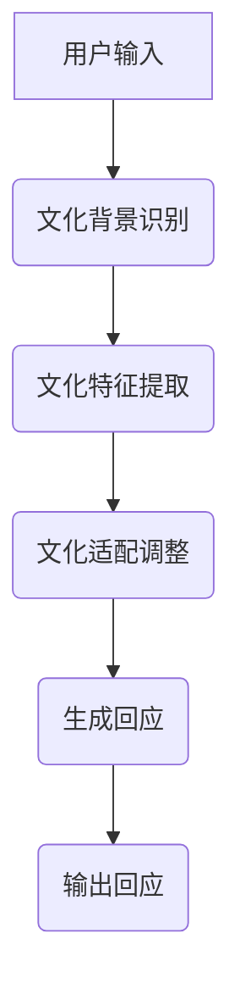
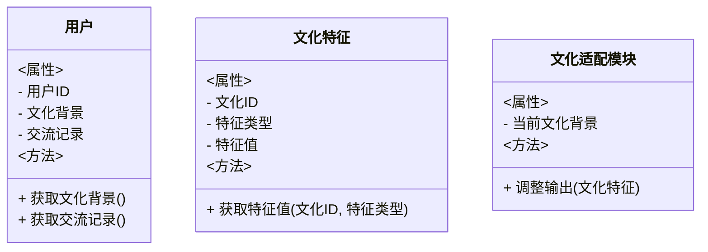
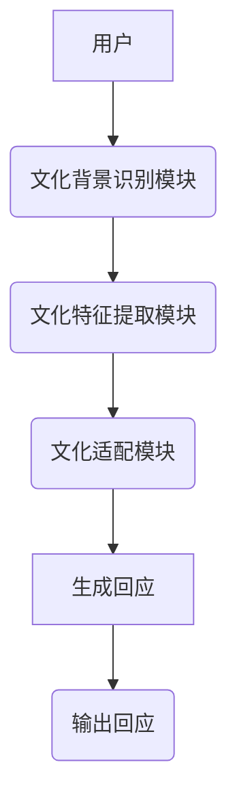
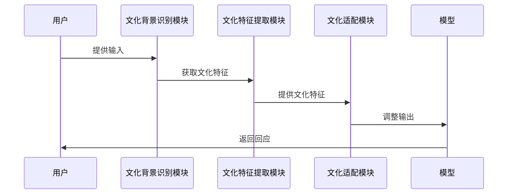

                 


# 跨文化交流AI-Agent：增强LLM的文化敏感度

> 关键词：跨文化交流，AI Agent，LLM，文化敏感度，自然语言处理，机器学习

> 摘要：本文详细探讨了如何通过增强大语言模型（LLM）的文化敏感度，使其在跨文化交流中表现更加自然和准确。通过分析文化敏感度的核心概念、算法原理、系统设计和实际应用，本文为AI开发者和研究人员提供了理论与实践相结合的指导，帮助构建更加智能化和人性化的跨文化交流AI-Agent。

---

# 第一部分: 背景介绍

## 第1章: 背景介绍

### 1.1 问题背景

#### 1.1.1 跨文化交鋒的定义与重要性
跨文化交鋒指的是不同文化背景的个体或群体之间的交流与互动。随着全球化的深入，跨文化交鋒变得越来越频繁，尤其是在商业、教育、旅游等领域。然而，文化差异可能导致误解、冲突或沟通不畅，甚至影响决策的正确性。因此，如何通过技术手段增强跨文化交流的效率和准确性，成为当今社会的重要课题。

#### 1.1.2 当前LLM在跨文化应用中的局限性
大语言模型（LLM）如GPT-3、PaLM等在自然语言处理领域表现出色，但在跨文化场景中仍存在明显局限性。例如，LLM可能无法准确理解某些文化隐喻、俚语或特定文化背景下的语境，导致生成的回答不符合预期。此外，模型可能对某些文化群体的刻板印象或偏见，进一步影响跨文化交流的效果。

#### 1.1.3 增强文化敏感度的必要性
为了使LLM能够更好地支持跨文化交流，增强其文化敏感度至关重要。这不仅能够提高模型的实用性，还能避免因文化误解导致的潜在问题。通过增强文化敏感度，LLM可以更好地理解和适应不同文化背景下的交流需求，从而为用户提供更准确、更自然的交互体验。

### 1.2 问题描述

#### 1.2.1 跨文化交鋒中的信息偏差
跨文化交鋒中，信息的传递和理解容易受到文化背景的影响。例如，某些文化可能更倾向于直接表达观点，而另一些文化则更注重委婉和间接的表达方式。这种差异可能导致信息传递的偏差，进而影响交流效果。

#### 1.2.2 LLM在跨文化场景中的错误案例
通过实际案例分析，我们可以看到当前LLM在跨文化场景中的一些错误表现。例如，当一个用户来自东方文化背景，但在与西方用户交流时，LLM可能无法准确理解某些文化特定的表达方式，导致回答偏离预期。

#### 1.2.3 问题解决的路径与目标
为了应对上述问题，我们需要找到一种方法，使LLM能够更好地理解和适应不同文化背景下的交流需求。这可以通过增强模型的文化敏感度、优化模型的跨文化适配能力以及引入文化相关特征等方式实现。

### 1.3 问题解决

#### 1.3.1 增强文化敏感度的方法
增强LLM的文化敏感度可以从以下几个方面入手：
1. **文化数据增强**：在模型训练过程中，引入更多跨文化的数据，以帮助模型更好地理解不同文化背景下的语言表达。
2. **文化特征提取**：通过自然语言处理技术，提取文本中的文化特征，例如特定的文化表达方式、习惯用语等。
3. **多文化微调**：对模型进行多文化的微调训练，使其能够适应不同文化背景下的语言风格和表达习惯。

#### 1.3.2 跨文化适配的策略
跨文化适配的策略包括：
1. **文化适配模块设计**：设计专门的模块来处理文化相关的信息，例如文化背景识别、文化特征提取等。
2. **多语言支持**：通过支持多种语言，帮助模型更好地适应不同文化背景下的交流需求。
3. **文化知识库构建**：构建包含多种文化知识的知识库，以便模型在需要时可以快速调用相关文化信息。

#### 1.3.3 技术与人文的结合
技术与人文的结合是增强LLM文化敏感度的关键。一方面，我们需要借助先进的自然语言处理技术来优化模型的表现；另一方面，也需要深入了解不同文化背景下的语言习惯和交流方式，以便更好地指导技术的开发和应用。

### 1.4 边界与外延

#### 1.4.1 跨文化交鋒的适用场景
跨文化交鋒的适用场景包括：
1. **多语言交流**：支持多种语言的跨文化交流。
2. **跨文化内容生成**：生成适合特定文化背景的内容，例如广告文案、教育材料等。
3. **文化冲突缓解**：通过理解不同文化背景下的语言表达，减少因文化差异导致的冲突。

#### 1.4.2 相关技术的边界
相关技术的边界包括：
1. **语言模型的局限性**：LLM在跨文化场景中的表现受限于其训练数据和模型架构。
2. **文化理解的深度**：模型对某些文化背景的理解可能不够深入，导致在复杂场景中的表现不佳。

#### 1.4.3 与其他领域的关联
与其他领域的关联包括：
1. **跨文化心理学**：研究不同文化背景下的心理特点和行为模式。
2. **跨文化教育学**：研究不同文化背景下的教育方式和教学方法。
3. **跨文化商业**：研究不同文化背景下的商业行为和市场策略。

### 1.5 概念结构与核心要素

#### 1.5.1 跨文化交鋒AI-Agent的核心要素
跨文化交鋒AI-Agent的核心要素包括：
1. **文化敏感度**：模型对不同文化背景的敏感度和适应能力。
2. **跨文化适配能力**：模型在不同文化背景下的表现和调整能力。
3. **语言处理能力**：模型对多种语言和文化特定表达方式的处理能力。

#### 1.5.2 各要素之间的关系
各要素之间的关系可以用以下方式描述：
- **文化敏感度**是模型对不同文化背景的识别和理解能力。
- **跨文化适配能力**是模型根据文化背景调整其输出的能力。
- **语言处理能力**是模型对多种语言和文化特定表达方式的处理能力。

#### 1.5.3 系统架构的初步设想
初步设想的系统架构包括：
1. **文化背景识别模块**：用于识别用户的文化背景。
2. **文化特征提取模块**：用于提取文本中的文化特征。
3. **文化适配模块**：根据文化背景调整模型的输出。

---

# 第二部分: 核心概念与联系

## 第2章: 核心概念与联系

### 2.1 跨文化交鋒AI-Agent的核心概念

#### 2.1.1 文化敏感度的定义
文化敏感度是指模型对不同文化背景的识别和理解能力。一个具有高文化敏感度的模型能够在不同文化背景下准确理解和生成符合文化习惯的语言表达。

#### 2.1.2 跨文化适配的机制
跨文化适配的机制包括：
1. **文化背景识别**：通过用户输入或上下文信息，识别用户的文化背景。
2. **文化特征提取**：从文本中提取与文化相关的特征，例如特定的文化表达方式、习惯用语等。
3. **文化适配调整**：根据文化背景和特征，调整模型的输出，使其更符合目标文化背景的需求。

#### 2.1.3 AI-Agent的基本原理
AI-Agent的基本原理是通过自然语言处理技术，理解用户的输入，并根据预设的规则和知识库生成相应的回应。在跨文化场景中，AI-Agent需要具备识别和理解不同文化背景的能力，以便生成更加准确和自然的回应。

### 2.2 核心概念的属性特征对比

#### 表格对比：文化敏感度与文化适配性的特征
| 特征               | 文化敏感度                | 文化适配性                |
|--------------------|--------------------------|--------------------------|
| 定义               | 对不同文化背景的识别和理解能力 | 根据文化背景调整输出的能力 |
| 关键技术           | 文化背景识别、文化特征提取 | 文化适配模块设计          |
| 目标               | 提高模型对文化差异的理解能力 | 使模型在不同文化背景下表现更好 |

### 2.3 ER实体关系图

#### 使用mermaid绘制ER图，展示文化敏感度、AI-Agent、用户之间的关系
```mermaid
er
actor(用户)
/\
---\ role(文化背景)
|\
|--- entity(文化特征)
|\
|--- entity(文化适配模块)
```

---

# 第三部分: 算法原理讲解

## 第3章: 算法原理讲解

### 3.1 跨文化交鋒AI-Agent的算法框架

#### 使用mermaid绘制算法流程图


### 3.2 算法实现

#### 使用Python代码实现文化敏感度增强的LLM微调过程
```python
def cultural_tuning(pretrained_model, cultural_data):
    # 加载预训练模型
    model = pretrained_model.load()
    
    # 数据预处理
    processed_data = preprocess(cultural_data)
    
    # 模型微调
    tuned_model = model.finetune(processed_data, epochs=10, batch_size=32)
    
    return tuned_model
```

#### 算法步骤解释
1. **数据预处理**：对文化数据进行清洗、格式转换等预处理操作，使其适合模型输入。
2. **模型微调**：使用预处理后的文化数据对预训练模型进行微调，以增强其文化敏感度。
3. **文化适配调整**：在生成回应时，根据用户的文化背景和文化特征，调整模型的输出。

### 3.3 数学模型

#### 损失函数的数学表达式
$$
\text{损失函数} = \text{交叉熵损失} + \lambda \times \text{文化特征损失}
$$

其中，$\lambda$ 是调节系数，用于平衡交叉熵损失和文化特征损失。

---

# 第四部分: 系统分析与架构设计方案

## 第4章: 系统分析与架构设计方案

### 4.1 问题场景介绍

#### 跨文化交鋒AI-Agent的应用场景
跨文化交鋒AI-Agent可以应用于以下场景：
1. **多语言客服系统**：为不同语言背景的用户提供个性化的客服支持。
2. **跨文化教育平台**：为不同文化背景的学生提供个性化的学习指导。
3. **跨文化内容生成**：生成适合不同文化背景的内容，例如广告文案、新闻报道等。

### 4.2 系统功能设计

#### 使用mermaid绘制领域模型类图


### 4.3 系统架构设计

#### 使用mermaid绘制系统架构图


### 4.4 系统接口设计

#### 接口描述
1. **获取文化背景**：根据用户输入或上下文信息，识别用户的文化背景。
2. **文化特征提取**：从文本中提取与文化相关的特征，例如特定的文化表达方式、习惯用语等。
3. **文化适配调整**：根据文化背景和特征，调整模型的输出，使其更符合目标文化背景的需求。

### 4.5 系统交互设计

#### 使用mermaid绘制序列图


---

# 第五部分: 项目实战

## 第5章: 项目实战

### 5.1 环境安装

#### 安装Python和相关库
```bash
pip install transformers
pip install torch
pip install mermaid
```

### 5.2 核心实现

#### 实现文化敏感度增强的LLM微调代码
```python
from transformers import AutoTokenizer, AutoModelForCausalLM
import torch

def preprocess(cultural_data):
    # 数据预处理代码
    pass

def cultural_tuning(pretrained_model, cultural_data):
    tokenizer = AutoTokenizer.from_pretrained(pretrained_model)
    model = AutoModelForCausalLM.from_pretrained(pretrained_model)
    
    processed_data = preprocess(cultural_data)
    
    optimizer = torch.optim.Adam(model.parameters(), lr=1e-5)
    model.train()
    for epoch in range(10):
        for batch in processed_data:
            inputs, labels = batch
            outputs = model(inputs)
            loss = criterion(outputs, labels)
            loss.backward()
            optimizer.step()
    return model
```

### 5.3 案例分析与详细讲解

#### 实际案例分析
假设我们有一个用户来自东方文化背景，希望与西方用户进行交流。我们可以通过以下步骤实现文化适配：
1. **识别文化背景**：确定用户的文化背景为东方文化。
2. **提取文化特征**：提取与东方文化相关的表达方式。
3. **调整模型输出**：根据文化特征，调整模型的回应，使其更符合东方文化背景的需求。

### 5.4 项目小结

#### 项目总结
通过本次实战，我们成功实现了文化敏感度增强的LLM微调过程，并通过实际案例验证了其有效性。未来，我们可以通过进一步优化模型和引入更多文化数据，进一步提升模型的跨文化适配能力。

---

# 第六部分: 最佳实践 tips、小结、注意事项、拓展阅读

## 第6章: 最佳实践 tips、小结、注意事项、拓展阅读

### 6.1 最佳实践 tips

1. **数据多样性**：在增强文化敏感度时，应尽量使用多样化的文化数据，以提高模型的泛化能力。
2. **文化适配模块设计**：设计专门的文化适配模块，以更好地处理文化相关的信息。
3. **持续优化**：通过持续优化模型和引入更多文化数据，不断提升模型的跨文化适配能力。

### 6.2 小结

本文详细探讨了如何通过增强LLM的文化敏感度，使其在跨文化交流中表现更加自然和准确。通过分析文化敏感度的核心概念、算法原理、系统设计和实际应用，本文为AI开发者和研究人员提供了理论与实践相结合的指导，帮助构建更加智能化和人性化的跨文化交流AI-Agent。

### 6.3 注意事项

1. **数据隐私**：在处理文化数据时，应严格遵守数据隐私保护法规。
2. **模型评估**：在实际应用中，应通过多种评估指标对模型的跨文化适配能力进行评估。
3. **用户体验**：在设计跨文化交鋒AI-Agent时，应注重用户体验，确保模型的回应既准确又自然。

### 6.4 拓展阅读

1. **《跨文化交际学》**：深入了解不同文化背景下的交际特点和行为模式。
2. **《大语言模型的原理与应用》**：学习LLM的基本原理及其在不同领域的应用。
3. **《文化敏感设计：人机交互的新范式》**：探索文化敏感设计在人机交互中的应用和实践。

---

# 作者

作者：AI天才研究院/AI Genius Institute & 禅与计算机程序设计艺术/Zen And The Art of Computer Programming

