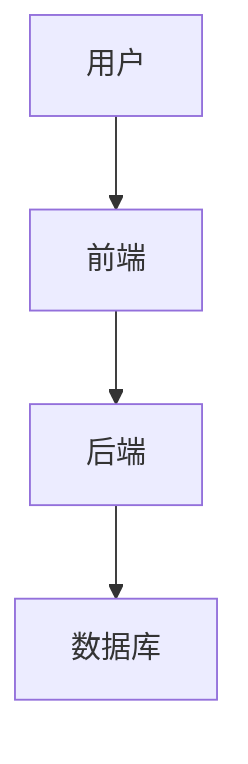

                 


# 跨文化交际AI Agent：提升LLM的文化敏感度

## 关键词：
- 跨文化交际
- AI Agent
- 大语言模型（LLM）
- 文化敏感度
- 语义理解
- 算法原理
- 系统设计

## 摘要：
随着全球化的深入发展，跨文化交际变得越来越重要。然而，现有的大语言模型（LLM）在处理跨文化交际时，往往缺乏文化敏感度，导致误解和沟通障碍。本文将深入探讨如何通过设计和实现跨文化交际AI Agent来提升LLM的文化敏感度。我们将从跨文化交际的核心概念、理论基础、算法原理、系统设计、项目实战到最佳实践等方面进行详细阐述。通过理论与实践的结合，我们将帮助读者更好地理解和实现跨文化交际AI Agent，从而提升LLM在跨文化环境中的表现。

---

## 第1章: 跨文化交际与AI Agent概述

### 1.1 跨文化交际的定义与重要性
#### 1.1.1 跨文化交际的核心概念
跨文化交际是指在不同文化背景的人们之间的交流。文化差异包括语言、习俗、价值观、信仰等多个方面，这些差异可能导致沟通中的误解和冲突。因此，理解并适应不同文化背景是实现有效跨文化交际的关键。

#### 1.1.2 跨文化交际在现代社会中的作用
在当前全球化背景下，跨文化交际无处不在，尤其是在商业、教育、旅游等领域。然而，由于文化差异的存在，跨文化交际中的沟通障碍仍然频繁发生。如何通过技术手段提升跨文化交际的效率和准确性，成为一个重要课题。

#### 1.1.3 AI Agent在跨文化交际中的潜力
AI Agent（智能代理）是一种能够执行特定任务的计算机程序。在跨文化交际中，AI Agent可以通过自然语言处理（NLP）、机器学习等技术，帮助用户实现更高效、更准确的跨文化沟通。AI Agent不仅可以理解不同文化背景下的语言和语境，还可以提供文化适配的建议和反馈。

### 1.2 大语言模型（LLM）与跨文化交际
#### 1.2.1 大语言模型的定义与特点
大语言模型（Large Language Model, LLM）是一种基于深度学习的自然语言处理模型，具有大规模的训练数据和强大的语言生成能力。LLM可以通过训练大量的文本数据，学习语言的语法、语义和语用学规则，从而实现自然语言理解与生成。

#### 1.2.2 LLM在跨文化交际中的优势
LLM在跨文化交际中的优势主要体现在以下几个方面：
1. **多语言支持**：LLM可以通过训练多语言数据，支持多种语言的自然语言处理任务。
2. **语义理解**：LLM能够理解不同语言和文化背景下的语义，从而提供更准确的翻译和对话生成。
3. **文化适配**：LLM可以通过文化适配算法，调整其输出以适应不同文化背景的需求。

#### 1.2.3 当前LLM在跨文化交际中的局限性
尽管LLM在跨文化交际中具有潜力，但目前仍存在一些局限性：
1. **文化敏感度不足**：LLM在训练过程中可能无法充分捕捉到不同文化背景下的细微差异。
2. **文化偏见**：LLM的训练数据可能存在文化偏见，导致其在跨文化交际中的表现不佳。
3. **动态文化适应**：LLM难以实时适应动态变化的文化背景和语境。

### 1.3 跨文化交际AI Agent的目标与意义
#### 1.3.1 提升LLM文化敏感度的目标
跨文化交际AI Agent的核心目标是通过设计和实现文化敏感度提升算法，增强LLM在跨文化交际中的表现。具体目标包括：
1. 提升LLM对不同文化背景的理解能力。
2. 实现文化适配的语义生成和翻译。
3. 提供基于文化背景的对话建议和反馈。

#### 1.3.2 跨文化交际AI Agent的核心价值
跨文化交际AI Agent的价值体现在以下几个方面：
1. **提升沟通效率**：通过文化适配算法，减少跨文化交际中的误解和冲突。
2. **增强用户体验**：为用户提供更个性化、更自然的跨文化沟通体验。
3. **促进跨文化合作**：在商业、教育等领域，跨文化交际AI Agent可以促进不同文化背景的人们之间的合作。

#### 1.3.3 本书的研究重点与创新点
本书的研究重点在于通过设计和实现跨文化交际AI Agent，提升LLM的文化敏感度。创新点包括：
1. 提出基于文化维度的LLM适配算法。
2. 实现跨文化语义理解模型，提升LLM在不同文化背景下的语义理解能力。
3. 提供跨文化交际AI Agent的系统设计与实现方案。

### 1.4 本章小结
本章主要介绍了跨文化交际的定义与重要性，以及AI Agent在跨文化交际中的潜力。同时，我们还探讨了大语言模型（LLM）在跨文化交际中的优势与局限性，并提出了本书的研究目标与创新点。

---

## 第2章: 跨文化交际的核心概念与理论基础

### 2.1 跨文化交际的基本原理
#### 2.1.1 文化差异的定义与分类
文化差异是指不同文化背景之间在语言、习俗、价值观、信仰等方面的差异。文化差异可以分为显性差异和隐性差异。显性差异包括语言、宗教、节日等，而隐性差异则包括价值观、思维方式等。

#### 2.1.2 跨文化交际中的文化适配性
文化适配性是指在跨文化交际中，个体或系统能够理解和适应不同文化背景的能力。文化适配性是实现有效跨文化交际的关键。

#### 2.1.3 跨文化交际的核心要素
跨文化交际的核心要素包括：
1. **语言**：不同语言的语法、词汇、语用学规则。
2. **文化背景**：包括价值观、信仰、习俗等。
3. **语境**：包括物理环境、社会环境等。

### 2.2 跨文化交际的理论框架
#### 2.2.1 Hofstede文化维度理论
Hofstede文化维度理论是研究文化差异的重要理论之一。该理论将文化差异归纳为五个维度：
1. **个体主义与集体主义**：个体主义强调个人目标，集体主义强调集体目标。
2. **权力距离**：指社会中人们对权力分配的态度。
3. **长期导向与短期导向**：指文化对长期目标与短期目标的重视程度。
4. ** masculinity与femininity**：指文化中男性与女性角色的分工与价值。
5. **自我导向与外向导向**：指文化中个体的自我导向与外向程度。

#### 2.2.2 Hall的高语境与低语境文化理论
Hall的高语境与低语境文化理论将文化分为高语境和低语境两种类型：
1. **高语境文化**：信息的表达依赖于上下文，非语言 cues非常重要。
2. **低语境文化**：信息的表达依赖于语言，非语言 cues相对不重要。

#### 2.2.3 跨文化交际中的冲突与调和
跨文化交际中的冲突通常源于文化差异，而调和则是通过理解和适应不同文化背景来实现的。冲突与调和的平衡是实现有效跨文化交际的关键。

### 2.3 跨文化交际与AI Agent的结合
#### 2.3.1 AI Agent在跨文化交际中的角色
AI Agent在跨文化交际中的角色可以是：
1. **翻译器**：提供多语言翻译服务。
2. **对话生成器**：生成符合文化背景的对话内容。
3. **文化顾问**：提供文化适配的建议和反馈。

#### 2.3.2 跨文化交际AI Agent的核心功能
跨文化交际AI Agent的核心功能包括：
1. **文化识别**：识别用户的文化背景。
2. **语义理解**：理解不同文化背景下的语义。
3. **文化适配**：根据文化背景调整输出内容。

#### 2.3.3 跨文化交际AI Agent的设计原则
跨文化交际AI Agent的设计原则包括：
1. **文化敏感性**：设计时充分考虑文化差异。
2. **用户友好性**：界面简洁易用。
3. **动态适应性**：能够实时适应文化背景的变化。

### 2.4 本章小结
本章主要介绍了跨文化交际的核心概念与理论基础，包括文化差异的定义与分类、跨文化交际的基本原理，以及跨文化交际的理论框架。同时，我们还探讨了AI Agent在跨文化交际中的角色与功能。

---

## 第3章: 跨文化交际AI Agent的核心要素

### 3.1 跨文化数据的收集与处理
#### 3.1.1 多语言数据的获取与标注
跨文化数据的收集与处理是实现跨文化交际AI Agent的基础。我们需要获取多语言数据，并对其进行标注，以便后续的处理与分析。

#### 3.1.2 跨文化语料库的构建
跨文化语料库的构建需要包括不同语言、文化背景的文本数据。语料库的构建过程包括数据清洗、标注、分类等步骤。

#### 3.1.3 文化差异的数据表示方法
文化差异可以通过多种方式表示，例如通过文化维度的数值表示，或者通过语料库中的文化标签。

### 3.2 跨文化语义理解模型
#### 3.2.1 跨文化语义理解的定义
跨文化语义理解是指在不同文化背景下的语义理解。与单文化语义理解相比，跨文化语义理解需要考虑文化差异的影响。

#### 3.2.2 基于LLM的跨文化语义分析
基于LLM的跨文化语义分析需要对LLM进行文化适配的训练，使其能够理解不同文化背景下的语义。

#### 3.2.3 跨文化语义模型的训练方法
跨文化语义模型的训练方法包括：
1. **多文化数据增强**：通过数据增强技术，增加不同文化背景下的数据。
2. **文化适配策略**：在模型训练中引入文化适配的策略。

### 3.3 跨文化适配算法
#### 3.3.1 跨文化适配算法的定义
跨文化适配算法是指在不同文化背景下，调整模型输出以适应文化差异的算法。

#### 3.3.2 基于文化维度的适配策略
基于文化维度的适配策略是指根据Hofstede文化维度理论，调整模型的输出。

#### 3.3.3 跨文化适配算法的实现步骤
跨文化适配算法的实现步骤包括：
1. **文化识别**：识别用户的文化背景。
2. **文化适配**：根据文化背景调整模型输出。
3. **输出生成**：生成符合文化背景的输出内容。

### 3.4 本章小结
本章主要介绍了跨文化交际AI Agent的核心要素，包括跨文化数据的收集与处理、跨文化语义理解模型，以及跨文化适配算法。

---

## 第4章: 跨文化交际AI Agent的算法原理

### 4.1 跨文化语料库的构建
#### 4.1.1 数据清洗与标注
数据清洗是指对原始数据进行去噪和格式化处理，标注是指对数据进行分类和标签化处理。

#### 4.1.2 文化标签的引入
在跨文化语料库中，我们需要引入文化标签，以便后续的处理与分析。

### 4.2 跨文化语义理解模型的训练
#### 4.2.1 模型架构设计
跨文化语义理解模型的架构设计需要考虑文化差异的影响，可以通过引入文化嵌入来实现。

#### 4.2.2 文化嵌入的引入
文化嵌入是指将文化背景信息嵌入到模型中，以便模型能够理解不同文化背景下的语义。

#### 4.2.3 跨文化语义理解模型的训练流程
跨文化语义理解模型的训练流程包括：
1. **数据预处理**：清洗和标注数据。
2. **文化嵌入训练**：训练文化嵌入模型。
3. **模型训练**：训练跨文化语义理解模型。

### 4.3 跨文化适配算法的实现
#### 4.3.1 算法设计
跨文化适配算法的设计需要考虑文化差异的影响，可以通过引入文化维度的权重调整来实现。

#### 4.3.2 算法实现步骤
跨文化适配算法的实现步骤包括：
1. **文化识别**：识别用户的文化背景。
2. **文化适配**：根据文化背景调整模型参数。
3. **输出生成**：生成符合文化背景的输出内容。

### 4.4 本章小结
本章主要介绍了跨文化交际AI Agent的算法原理，包括跨文化语料库的构建、跨文化语义理解模型的训练，以及跨文化适配算法的实现。

---

## 第5章: 跨文化交际AI Agent的系统设计

### 5.1 系统功能设计
#### 5.1.1 系统概述
跨文化交际AI Agent的系统功能设计包括文化识别、语义理解、文化适配等功能。

#### 5.1.2 系统功能模块
跨文化交际AI Agent的系统功能模块包括：
1. **文化识别模块**：识别用户的文化背景。
2. **语义理解模块**：理解用户输入的语义。
3. **文化适配模块**：根据文化背景调整模型输出。

#### 5.1.3 系统功能流程
系统功能流程包括：
1. 用户输入查询。
2. 系统识别用户文化背景。
3. 系统理解用户输入的语义。
4. 系统根据文化背景调整输出内容。
5. 系统生成并返回结果。

### 5.2 系统架构设计
#### 5.2.1 系统架构概述
跨文化交际AI Agent的系统架构设计包括前端、后端和数据库三个部分。

#### 5.2.2 系统架构图


#### 5.2.3 系统交互流程
系统交互流程包括：
1. 用户通过前端界面输入查询。
2. 前端将查询发送到后端。
3. 后端调用文化识别模块，识别用户文化背景。
4. 后端调用语义理解模块，理解用户输入的语义。
5. 后端调用文化适配模块，根据文化背景调整输出内容。
6. 后端将结果返回到前端。
7. 前端将结果展示给用户。

### 5.3 系统接口设计
#### 5.3.1 系统接口概述
系统接口设计包括用户接口和系统内部接口。

#### 5.3.2 系统接口定义
系统接口定义包括：
1. 用户接口：前端界面，用于用户输入查询。
2. 系统内部接口：后端与各功能模块之间的接口。

### 5.4 本章小结
本章主要介绍了跨文化交际AI Agent的系统设计，包括系统功能设计、系统架构设计、系统接口设计等。

---

## 第6章: 跨文化交际AI Agent的项目实战

### 6.1 环境安装
#### 6.1.1 开发环境
跨文化交际AI Agent的开发环境包括Python、深度学习框架（如TensorFlow、PyTorch）等。

#### 6.1.2 依赖安装
需要安装的依赖包括：
1. Python 3.x
2. TensorFlow或PyTorch
3. 自然语言处理库（如spaCy、NLTK）
4. 其他工具库（如Pandas、Matplotlib）

### 6.2 系统核心实现
#### 6.2.1 文化识别模块实现
文化识别模块可以通过用户输入的语言、地区等信息来识别用户的文化背景。

#### 6.2.2 语义理解模块实现
语义理解模块可以通过预训练的LLM模型来实现。

#### 6.2.3 文化适配模块实现
文化适配模块可以根据用户的文化背景，调整模型的输出内容。

### 6.3 代码实现
#### 6.3.1 文化识别模块代码
```python
def identify_culture(user_input):
    # 根据用户输入的语言、地区等信息，识别文化背景
    pass
```

#### 6.3.2 语义理解模块代码
```python
def semantic_understanding(user_input):
    # 使用预训练的LLM模型，理解用户输入的语义
    pass
```

#### 6.3.3 文化适配模块代码
```python
def cultural_adaptation(culture_info, model_output):
    # 根据文化背景，调整模型输出内容
    pass
```

### 6.4 项目小结
本章通过具体的项目实战，展示了跨文化交际AI Agent的实现过程，包括环境安装、系统核心实现等。

---

## 第7章: 跨文化交际AI Agent的最佳实践

### 7.1 实践经验总结
#### 7.1.1 文化敏感度提升的关键点
1. **数据多样性**：确保训练数据涵盖不同文化背景。
2. **文化适配算法优化**：不断优化文化适配算法，提升模型的输出效果。
3. **用户反馈收集**：通过用户反馈，不断改进系统。

### 7.2 注意事项
#### 7.2.1 数据偏见问题
需要注意数据偏见问题，确保训练数据的多样性和代表性。

#### 7.2.2 文化适配的动态性
文化适配需要根据实际情况动态调整，不能一成不变。

### 7.3 拓展阅读
推荐的拓展阅读包括：
1. Hofstede文化维度理论相关文献。
2. 跨文化交际的相关研究论文。
3. 深度学习与自然语言处理的最新研究成果。

### 7.4 本章小结
本章总结了跨文化交际AI Agent的最佳实践，包括实践经验总结、注意事项，以及拓展阅读推荐。

---

## 作者：AI天才研究院/AI Genius Institute & 禅与计算机程序设计艺术 /Zen And The Art of Computer Programming

---

以上为《跨文化交际AI Agent：提升LLM的文化敏感度》的技术博客文章的目录大纲，包含了从背景介绍到系统设计，再到项目实战和最佳实践的完整内容。

