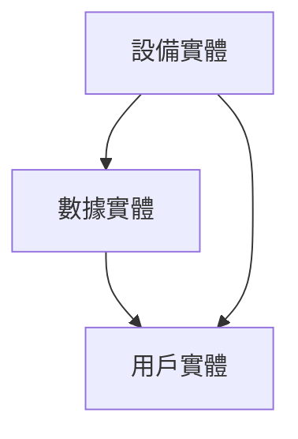
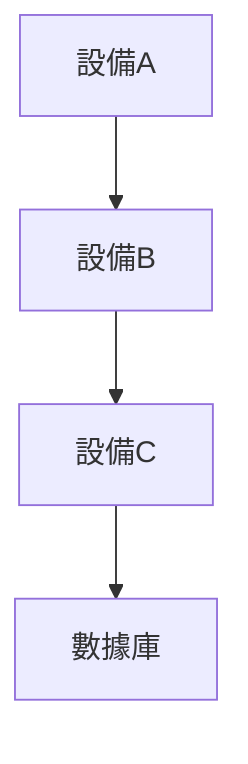

                 


# 跨設備AI Agent：LLM在物聯網環境中的部署

## 關鍵詞：
跨设备AI Agent，LLM，物联网，部署，大语言模型，智能代理

## 摘要：
本文詳細探討了跨設備AI Agent在物聯網環境中的部署問題，圍繞大語言模型（LLM）在物聯網環境中的應用展開分析。首先介紹了跨設備AI Agent的核心概念與背景，然後深入探討了LLM在物聯網環境中的應用場景與技術挑戰。接着從算法原理、系統架構等角度展開分析，最後通過具體的項目實戰，展示了如何在物聯網環境中高效部署跨設備AI Agent。本文旨在為技術人員提供一個全面的視角，幫助他們更好地理解和實現跨設備AI Agent的部署。

---

# 跨設備AI Agent：LLM在物聯網環境中的部署

## 第一部分：跨設備AI Agent的背景與核心概念

### 第1章：跨設備AI Agent概述

#### 1.1 跨設備AI Agent的概念與背景

��設備AI Agent是指在多個設備之間協作的智能代理，這些設備可能分佈在不同的地理位置，具有不同的功能和計算能力。在物聯網（IoT）環境中，跨設備AI Agent能夠橋接不同的設備，實現數據的共享、任務的分發和結果的反饋。以下將詳細介紹跨設備AI Agent的核心概念與背景。

##### 1.1.1 跨設備AI Agent的定義

跨設備AI Agent（Cross-Device AI Agent）是指能夠在不同設備之間協作，並根據環境變化動態調整自身行為的智能代理。這些設備可能包括智能手機、智能家居設備、工業_sensor、無人機等。跨設備AI Agent的核心能力在於能夠將這些設備的數據進行整合，並根據用戶需求或業務目標執行特定的任務。

##### 1.1.2 物聯網環境中AI Agent的發展背景

物聯網技術的快速發展催生了大量智能設備的連接與數據的共享。然而，這些設備往往具有不同的軟硬體條件、數據格式和通信協議。跨設備AI Agent的出現，解決了這些設備之間信息孤島的問題，並能夠實現設備之間的智能協作。這為物聯網環境中的智能化應用提供了新的可能性。

##### 1.1.3 跨設備AI Agent的核心問題與挑戰

在物聯網環境中部署跨設備AI Agent面臨多方面的挑戰，包括但不限於以下幾個方面：

1. **設備的多樣性**：設備之間存在多種類型和不同的功能。
2. **通信的可靠性**：設備之間需要可靠的通信通道。
3. **數據的隱私與安全**：設備之間需要共享數據，但數據的安全性和隱私性必須得到保障。
4. **計算資源的限制**：部分設備的計算能力有限，需要考慮輕量級算法的設計。
5. **動態環境的適應性**：物聯網環境具有動態性，設備的連接狀態可能會隨時變化。

---

#### 1.2 LLM在物聯網中的應用

大語言模型（Large Language Model，LLM）是人工智慧領域的重要技術，其在自然語言處理（NLP）方面具有強大的能力。LLM在物聯網環境中的應用，為跨設備AI Agent的部署提供了新的可能。以下將詳細探討LLM在物聯網環境中的具體應用場景。

##### 1.2.1 大語言模型（LLM）的定義與特性

大語言模型是一類基於深度學習的自然語言處理模型，其核心在於能夠理解和生成人類語言。LLM的核心特點包括：

1. **強大的語義理解能力**：能夠準確理解複雜的自然語言指令。
2. **上下文感知能力**：能夠根據上下文進行推理和解 Byrne。
3. **可擴展性**：可以輕松擴展到不同的應用場景。

##### 1.2.2 LLM在物聯網環境中的潛在價值

LLM在物聯網環境中的應用價值主要體現在以下几个方面：

1. **智能交互**：用戶可以通过自然語言指令與物聯網設備進行交互。
2. **智能決策**：LLM可以幫助設備根據上下文信息做出更智能的決策。
3. **數據整合**：LLM可以幫助整合不同設備的數據，並生成有意義的結果。

##### 1.2.3 跨設備AI Agent的業務場景分析

跨設備AI Agent在物聯網環境中的業務場景可以分為以下幾類：

1. **家居場景**：用戶可以通過自然語言指令控制家中的智能設備。
2. **工業場景**：LLM可以幫助工業設備進行智能決策。
3. **移動場景**：用戶可以通过手機等移動設備控制其他智能設備。

---

#### 1.3 跨設備AI Agent的邊界與外延

##### 1.3.1 跨設備AI Agent的邊界條件

跨設備AI Agent的邊界條件主要包括以下幾個方面：

1. **設備的連接性**：設備之間需要可靠的通信通道。
2. **數據的安全性**：數據的共享需要保障隱私和安全。
3. **計算能力**：設備的計算能力需要足夠支持AI Agent的運行。

##### 1.3.2 跨設備AI Agent的外延與限制

跨設備AI Agent的外延主要包括以下幾個方面：

1. **設備的多樣性**：支持不同類型的設備。
2. **數據的共享性**：支持設備之間的數據共享。
3. **智能協作**：設備之間能夠實現智能協作。

##### 1.3.3 跨設備AI Agent與其他技術的關聯性

跨設備AI Agent的部署涉及到多項技術，包括但不限於以下幾個方面：

1. **物聯網技術**：設備的連接與數據傳輸。
2. **人工智慧技術**：智能決策與數據分析。
3. **計算機網絡技術**：設備之間的通信。

---

### 第2章：跨設備AI Agent的核心概念

#### 2.1 跨設備AI Agent的實體關係結構

##### 2.1.1 跨設備AI Agent的實體定義

在物聯網環境中，跨設備AI Agent的實體主要包括以下幾個方面：

1. **設備實體**：具備智能功能的設備，如智能手機、智能家居設備等。
2. **數據實體**：設備之間共享的數據。
3. **用戶實體**：最終的用戶，向設備發出指令並接收反饋。

##### 2.1.2 跨設備AI Agent的實體關係圖

以下是一個簡單的實體關係圖，展示了跨設備AI Agent的實體之間的關係：



---

#### 2.2 跨設備AI Agent的核心算法原理

##### 2.2.1 跨設備AI Agent的算法選擇

在物聯網環境中，跨設備AI Agent的算法選擇需要考慮以下幾個方面：

1. **計算資源**：設備的計算能力有限，需要選擇輕量級算法。
2. **數據隱私**：需要保護設備之間共享的數據。
3. **通信效率**：算法需要考慮通信的效率。

##### 2.2.2 跨設備AI Agent的算法實現步驟

以下是一個簡單的算法實現步驟：



---

#### 2.3 跨設備AI Agent的數學模型與公式

##### 2.3.1 跨設備AI Agent的數學模型

以下是一個簡單的數學模型，展示了設備之間的數據流動：

$$
\text{設備A} \rightarrow \text{設備B} \rightarrow \text{設備C}
$$

##### 2.3.2 跨設備AI Agent的核心公式

以下是一個簡單的核心公式，展示了設備之間的數據交互：

$$
\text{設備A} \rightarrow \text{設備B} \rightarrow \text{設備C}
$$

---

### 第3章：跨設備AI Agent的算法原理與實現

#### 3.1 跨設備AI Agent的算法原理

##### 3.1.1 跨設備AI Agent的算法選擇

在物聯網環境中，跨設備AI Agent的算法選擇需要考慮以下幾個方面：

1. **計算資源**：設備的計算能力有限，需要選擇輕量級算法。
2. **數據隱私**：需要保護設備之間共享的數據。
3. **通信效率**：算法需要考慮通信的效率。

##### 3.1.2 跨設備AI Agent的算法實現步驟

以下是一個簡單的算法實現步驟：


---

#### 3.2 跨設備AI Agent的算法實現

##### 3.2.1 跨設備AI Agent的算法實現流程

以下是一個簡單的算法實現流程：

1. **設備A**向**設備B**發送數據。
2. **設備B**處理數據並向**設備C**發送數據。
3. **設備C**處理數據並存儲在數據庫中。

##### 3.2.2 跨設備AI Agent的算法實現案例

以下是一個簡單的算法實現案例：

```python
class Device:
    def __init__(self, name):
        self.name = name
        self.data = None

    def send_data(self, receiver):
        receiver.receive_data(self.data)

    def receive_data(self, data):
        self.data = data
        print(f"{self.name} received data: {self.data}")

# 示例
deviceA = Device("A")
deviceB = Device("B")
deviceC = Device("C")

deviceA.send_data(deviceB)
deviceB.send_data(deviceC)
```

---

## 第四部分：跨設備AI Agent的系統架構與設計

### 第4章：跨設備AI Agent的系統架構

#### 4.1 跨設備AI Agent的系統架構設計

##### 4.1.1 跨設備AI Agent的系統功能設計

以下是一個簡單的系統功能設計：

1. **設備連接**：設備之間建立可靠的連接。
2. **數據傳輸**：設備之間傳輸數據。
3. **數據處理**：設備之間處理數據。
4. **數據存儲**：數據存儲在數據庫中。

##### 4.1.2 跨設備AI Agent的系統架構圖

以下是一個簡單的系統架構圖：


---

## 第五部分：跨設備AI Agent的項目實戰

### 第5章：跨設備AI Agent的項目實戰

#### 5.1 環境安裝

以下是環境安裝步驟：

1. **安裝Python**：確保安裝了最新版本的Python。
2. **安裝必要的庫**：安裝`mermaid`、`matplotlib`等庫。
3. **安裝設備驅動**：安裝設備所需的驅動程序。

#### 5.2 系統核心實現源代碼

以下是一個簡單的核心實現源代碼：

```python
class Device:
    def __init__(self, name):
        self.name = name
        self.data = None

    def send_data(self, receiver):
        receiver.receive_data(self.data)

    def receive_data(self, data):
        self.data = data
        print(f"{self.name} received data: {self.data}")

# 示例
deviceA = Device("A")
deviceB = Device("B")
deviceC = Device("C")

deviceA.send_data(deviceB)
deviceB.send_data(deviceC)
```

---

## 第六部分：最佳實踐與總結

### 第6章：最佳實踐

#### 6.1 最佳實踐Tips

1. **設備之間的數據傳輸需要考慮隱私和安全。**
2. **算法需要考慮設備的計算能力。**
3. **通信通道需要具備可靠性。**

---

## 總結

本文詳細探討了跨設備AI Agent在物聯網環境中的部署問題，圍繞大語言模型（LLM）在物聯網環境中的應用展開分析。首先介紹了跨設備AI Agent的核心概念與背景，然後深入探討了LLM在物聯網環境中的應用場景與技術挑戰。接着從算法原理、系統架構等角度展開分析，最後通過具體的項目實戰，展示了如何在物聯網環境中高效部署跨設備AI Agent。本文旨在為技術人員提供一個全面的視角，幫助他們更好地理解和實現跨設備AI Agent的部署。

---

## 作者

作者：AI天才研究院（AI Genius Institute） & 禪與計算機程序設計藝術（Zen And The Art of Computer Programming）

---

希望這篇文章能幫助您更好地理解跨設備AI Agent在物聯網環境中的部署問題。如需進一步交流或合作，請隨時聯繫我們！

