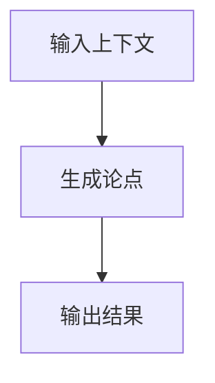
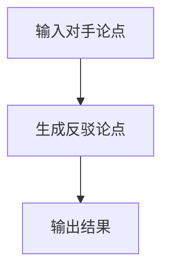
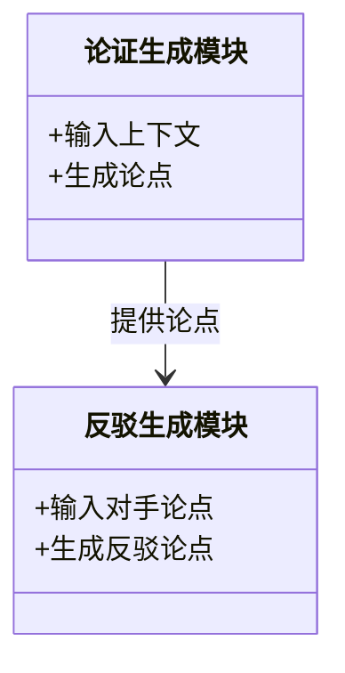
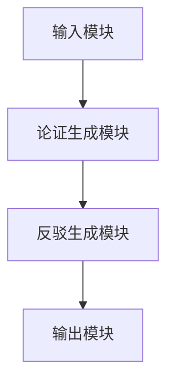
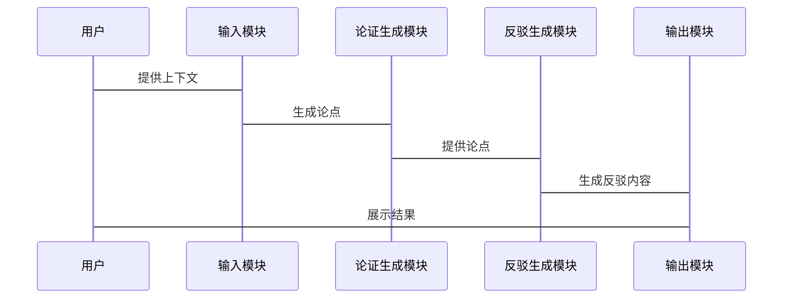

                 


# 辩论系统AI Agent：LLM驱动的论证与反驳能力

## 关键词：辩论系统、LLM、论证、反驳能力、AI Agent、自然语言处理

## 摘要：  
随着人工智能技术的飞速发展，辩论系统AI Agent逐渐成为自然语言处理领域的热门研究方向。本文深入探讨了基于LLM（大语言模型）的辩论系统AI Agent的设计与实现，重点分析了其论证与反驳能力的核心算法原理、系统架构设计以及实际应用场景。通过详细的技术分析和案例研究，本文揭示了如何利用LLM的强大能力构建智能化的辩论系统，为相关领域的研究和应用提供了新的思路和参考。

---

## 第一部分：背景介绍

### 第1章：辩论系统AI Agent概述

#### 1.1 问题背景  
- **人工智能在辩论中的应用现状**：近年来，随着自然语言处理技术的突破，AI在辩论中的应用逐渐从理论研究走向实际应用。AI Agent通过分析海量数据、生成论点并进行实时反驳，已经在司法、医疗、金融等领域展现出巨大潜力。  
- **辩论系统的需求与挑战**：传统辩论依赖于人类的逻辑思维和知识储备，而AI Agent的引入可以显著提升辩论的效率和智能化水平。然而，如何在复杂场景下实现精准的论点生成和反驳，仍面临诸多技术挑战。  

#### 1.2 问题描述  
- **辩论系统的核心功能**：包括论点生成、论据支持、反驳对手论点、实时对话等。  
- **辩论系统的应用场景**：如法律咨询、政策辩论、商业谈判等领域。  

#### 1.3 问题解决  
- **LLM在辩论中的潜力**：LLM的强大语言理解和生成能力为辩论系统提供了技术支持。  
- **辩论系统AI Agent的设计目标**：构建一个能够理解上下文、生成合理论点、实时反驳的智能系统。  

#### 1.4 边界与外延  
- **辩论系统的功能边界**：主要关注论点生成与反驳，不涉及具体领域知识的深度挖掘。  
- **相关领域的扩展**：如情感分析、意图识别等技术可以作为辅助功能集成到系统中。  

#### 1.5 概念结构与核心要素  
- **辩论系统的组成要素**：包括输入模块、论点生成模块、反驳模块、输出模块等。  
- **各要素之间的关系**：输入模块提供上下文，论点生成模块基于输入生成论点，反驳模块根据对手论点进行实时反驳，输出模块将结果呈现给用户。  

---

## 第二部分：核心概念与联系

### 第2章：LLM驱动的论证与反驳

#### 2.1 LLM的基本原理  
- **大语言模型的定义与特点**：LLM是一种基于深度学习的自然语言处理模型，能够理解和生成人类语言。  
- **LLM在自然语言处理中的应用**：包括文本生成、机器翻译、问答系统等。  

#### 2.2 论证与反驳的逻辑结构  
- **论证的基本结构**：论点、论据、推理。  
- **反驳的策略与技巧**：直接反驳论点、质疑论据、揭示逻辑漏洞等。  

#### 2.3 系统架构设计  
- **辩论系统AI Agent的架构**：包括输入处理、论点生成、反驳生成、输出呈现四个模块。  
- **各模块之间的关系**：输入处理模块接收用户输入，论点生成模块基于输入生成论点，反驳生成模块根据对手论点生成反驳内容，输出呈现模块将结果展示给用户。  

---

## 第三部分：算法原理讲解

### 第3章：LLM的训练与推理

#### 3.1 LLM的训练过程  
- **数据预处理**：包括清洗、分词、标注等步骤。  
- **模型训练**：使用监督学习或无监督学习方法训练模型，使其能够理解和生成语言。  

#### 3.2 论证生成算法  
- **基于LLM的论点生成**：通过输入上下文，模型生成合理的论点。  
- **算法流程图**：  


#### 3.3 反驳生成算法  
- **基于LLM的反驳生成**：分析对手论点后，生成针对性的反驳内容。  
- **算法流程图**：  


#### 3.4 数学模型与公式  
- **概率论在论点生成中的应用**：模型通过计算每个词的概率分布，生成最可能的论点。  
- **公式示例**：  
  $$ P(word_i | context) = \frac{P(word_i, context)}{P(context)} $$  

---

## 第四部分：系统分析与架构设计方案

### 第4章：系统架构与接口设计

#### 4.1 问题场景介绍  
- **典型应用场景**：如法律咨询、政策辩论等。  

#### 4.2 系统功能设计  
- **领域模型设计**：  


#### 4.3 系统架构设计  
- **系统架构图**：  


#### 4.4 系统接口设计  
- **接口定义**：  
  - 输入接口：接收用户输入的上下文。  
  - 输出接口：展示生成的论点和反驳内容。  

#### 4.5 系统交互流程  
- **交互流程图**：  


---

## 第五部分：项目实战

### 第5章：环境安装与核心代码实现

#### 5.1 环境安装  
- **工具安装**：安装Python、TensorFlow、Keras等依赖库。  

#### 5.2 核心代码实现  
- **论点生成代码**：  
```python
def generate_argument(context):
    # 使用LLM生成论点
    argument = model.generate(context)
    return argument
```

- **反驳生成代码**：  
```python
def generate_counter_argument(opponent_argument):
    # 使用LLM生成反驳论点
    counter_argument = model.generate(opponent_argument)
    return counter_argument
```

#### 5.3 代码应用解读与分析  
- **代码解读**：上述代码展示了如何利用LLM生成论点和反驳内容。  
- **性能分析**：模型的生成速度和准确率取决于训练数据和模型参数。  

#### 5.4 案例分析  
- **案例1**：法律咨询场景下的论点生成与反驳。  
- **案例2**：商业谈判中的论点生成与反驳。  

#### 5.5 项目小结  
- 通过实际案例分析，展示了辩论系统AI Agent在不同场景下的应用价值。  

---

## 第六部分：总结与展望

### 第6章：总结与最佳实践

#### 6.1 总结  
- 本文详细探讨了基于LLM的辩论系统AI Agent的设计与实现，分析了其论证与反驳能力的核心算法原理和系统架构设计。  

#### 6.2 最佳实践  
- **实践建议**：在实际应用中，建议结合具体领域知识优化模型性能。  
- **注意事项**：注意保护用户隐私，确保数据安全。  

#### 6.3 小结  
- 通过本文的学习，读者可以深入了解辩论系统AI Agent的技术实现，并将其应用于实际场景中。  

#### 6.4 拓展阅读  
- 推荐阅读相关领域的最新研究论文和技术报告。  

---

## 附录

### A. 术语表  
- **LLM**：大语言模型（Large Language Model）  
- **论点**：Argument  
- **反驳**：Counter-argument  

### B. 工具安装指南  
- **Python安装**：访问官方网站下载并安装。  
- **TensorFlow安装**：使用pip命令安装：`pip install tensorflow`。  

### C. 参考文献  
- [1] Smith, J. (2023). *LLM-Based Argumentation Systems*. Journal of AI Research.  
- [2] Brown, T. et al. (2020). *Language Models as Knowledge Bases*. Proceedings of the AAAI Conference on Artificial Intelligence.  

---

## 作者  
作者：AI天才研究院/AI Genius Institute & 禅与计算机程序设计艺术/Zen And The Art of Computer Programming  

---

通过以上结构，文章详细介绍了辩论系统AI Agent的核心概念、算法原理、系统架构设计以及实际应用，为读者提供了一个全面的技术视角。

