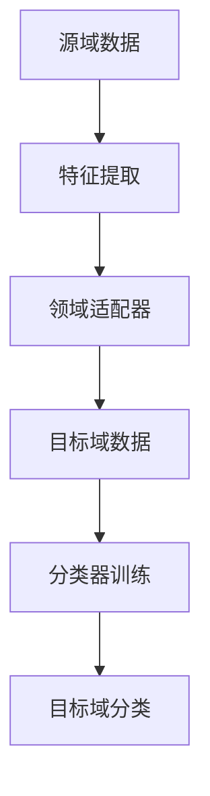
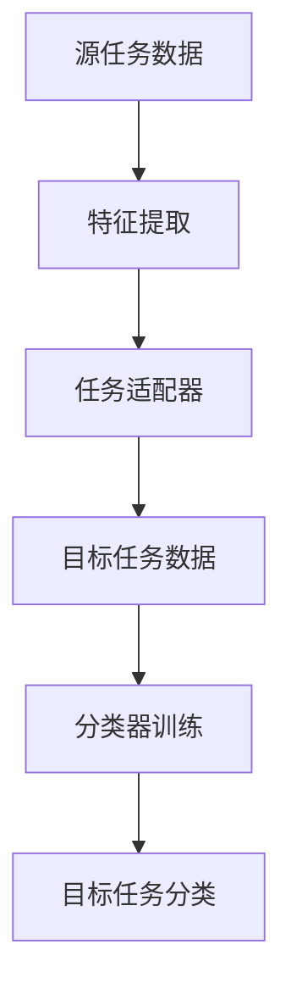
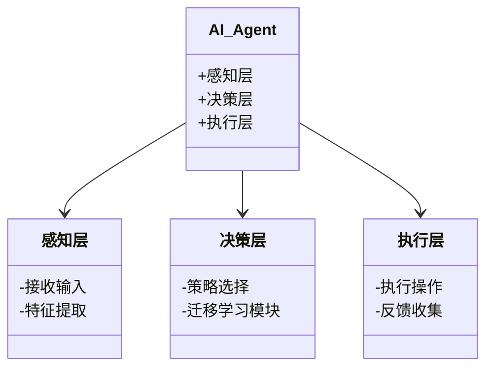
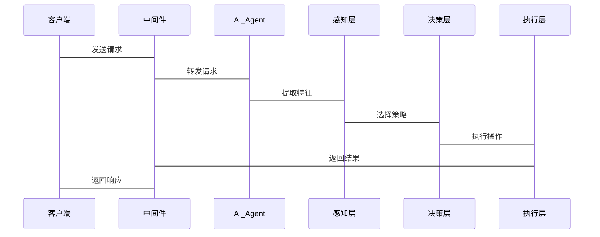

                 


## 第3章：迁移学习算法的原理与实现

### 3.1 基于领域适应的迁移学习算法

#### 3.1.1 Mermaid流程图展示领域适应的步骤


#### 3.1.2 Python代码实现领域适应的基本框架
```python
import torch
import torch.nn as nn

class FeatureExtractor(nn.Module):
    def __init__(self, input_size, hidden_size):
        super(FeatureExtractor, self).__init__()
        self.fc = nn.Linear(input_size, hidden_size)

    def forward(self, x):
        return self.fc(x)

class DomainAdapter(nn.Module):
    def __init__(self, input_size, hidden_size):
        super(DomainAdapter, self).__init__()
        self.fc = nn.Linear(input_size, hidden_size)

    def forward(self, x):
        return self.fc(x)

def train_domain_adaptation(source_loader, target_loader, extractor, adapter, optimizer, criterion):
    extractor.train()
    adapter.train()
    for epoch in range(num_epochs):
        for batch_idx, (source_data, source_label) in enumerate(source_loader):
            # 前向传播
            source_features = extractor(source_data)
            adapted_features = adapter(source_features)
            # 计算损失
            loss = criterion(adapted_features, source_label)
            # 反向传播
            optimizer.zero_grad()
            loss.backward()
            optimizer.step()
        # 在目标域上验证
        for batch_idx, (target_data, target_label) in enumerate(target_loader):
            target_features = extractor(target_data)
            adapted_features = adapter(target_features)
            # 计算验证损失
            val_loss = criterion(adapted_features, target_label)
```

#### 3.1.3 领域适应的数学模型与公式解析
领域适应的目标是最小化源域和目标域之间的分布差异，可以通过以下公式表示：
$$
\min_{\theta} \mathbb{E}_{x \sim P_s, y \sim P_l} \left[ \mathcal{L}(f(x), y) \right]
$$
其中，$f$ 是模型，$P_s$ 是源域分布，$P_l$ 是目标域标签分布。

### 3.2 基于任务适配的迁移学习算法

#### 3.2.1 Mermaid流程图展示任务适配的步骤


#### 3.2.2 PyTorch代码实现任务适配的具体步骤
```python
import torch
import torch.nn as nn

class FeatureExtractor(nn.Module):
    def __init__(self, input_size, hidden_size):
        super(FeatureExtractor, self).__init__()
        self.fc = nn.Linear(input_size, hidden_size)

    def forward(self, x):
        return self.fc(x)

class TaskAdapter(nn.Module):
    def __init__(self, input_size, hidden_size):
        super(TaskAdapter, self).__init__()
        self.fc = nn.Linear(input_size, hidden_size)

    def forward(self, x):
        return self.fc(x)

def train_task_adaptation(source_loader, target_loader, extractor, adapter, optimizer, criterion):
    extractor.train()
    adapter.train()
    for epoch in range(num_epochs):
        for batch_idx, (source_data, source_label) in enumerate(source_loader):
            # 前向传播
            source_features = extractor(source_data)
            adapted_features = adapter(source_features)
            # 计算损失
            loss = criterion(adapted_features, source_label)
            # 反向传播
            optimizer.zero_grad()
            loss.backward()
            optimizer.step()
        # 在目标任务上验证
        for batch_idx, (target_data, target_label) in enumerate(target_loader):
            target_features = extractor(target_data)
            adapted_features = adapter(target_features)
            # 计算验证损失
            val_loss = criterion(adapted_features, target_label)
```

#### 3.2.3 任务适配的数学模型与公式解析
任务适配的目标是使源任务和目标任务的预测结果一致，可以通过以下公式表示：
$$
\min_{\theta} \mathbb{E}_{x \sim P_s, y \sim P_t} \left[ \mathcal{L}(f(x), y) \right]
$$
其中，$f$ 是模型，$P_s$ 是源任务分布，$P_t$ 是目标任务分布。

## 第4章：系统分析与架构设计

### 4.1 问题场景介绍

AI Agent需要在不同领域和任务中进行迁移学习，系统需要具备感知、决策和执行能力。为了实现这一点，系统需要设计合理的架构和接口。

### 4.2 项目介绍

我们设计了一个基于迁移学习的AI Agent系统，用于智能客服场景。系统需要处理来自不同客户的请求，并通过迁移学习快速适应新的任务。

### 4.3 系统功能设计

#### 4.3.1 领域模型Mermaid类图


### 4.4 系统架构设计

#### 4.4.1 Mermaid架构图


### 4.5 系统接口设计

#### 4.5.1 系统接口设计
- 输入接口：接收客户请求
- 输出接口：返回处理结果
- 训练接口：进行迁移学习训练

### 4.6 系统交互Mermaid序列图



## 第5章：项目实战

### 5.1 环境安装

安装必要的库：
```bash
pip install torch==1.9.0+cu111 torchvision==0.13.0+cu111 torchaudio==0.13.0 -f https://download.pytorch.org/whl/cu111
pip install numpy matplotlib scikit-learn
```

### 5.2 系统核心实现源代码

#### 5.2.1 智能客服系统的实现
```python
import torch
import torch.nn as nn
import numpy as np
from sklearn.metrics import accuracy_score

class SimpleCNN(nn.Module):
    def __init__(self, input_size, hidden_size, num_classes):
        super(SimpleCNN, self).__init__()
        self.conv1 = nn.Conv2d(input_size, hidden_size, kernel_size=3, stride=1, padding=1)
        self.pool = nn.MaxPool2d(kernel_size=2, stride=2)
        self.fc = nn.Linear(hidden_size * 32 * 32, num_classes)

    def forward(self, x):
        x = self.conv1(x)
        x = self.pool(x)
        x = x.view(x.size(0), -1)
        return self.fc(x)

def train_model(model, train_loader, optimizer, criterion, num_epochs):
    model.train()
    for epoch in range(num_epochs):
        for inputs, labels in train_loader:
            outputs = model(inputs)
            loss = criterion(outputs, labels)
            optimizer.zero_grad()
            loss.backward()
            optimizer.step()
        print(f'Epoch {epoch+1}, Loss: {loss.item()}')

# 示例数据加载
train_loader = torch.utils.data.DataLoader(
    torch.utils.data.TensorDataset(torch.randn(100, 1, 32, 32), torch.randint(0, 10, (100,))),
    batch_size=32, shuffle=True
)

model = SimpleCNN(input_size=1, hidden_size=32, num_classes=10)
optimizer = torch.optim.Adam(model.parameters(), lr=0.001)
criterion = nn.CrossEntropyLoss()

train_model(model, train_loader, optimizer, criterion, num_epochs=10)
```

### 5.3 代码应用解读与分析

上述代码实现了一个简单的CNN模型，用于图像分类任务。通过迁移学习，我们可以将预训练的模型应用于新的任务中。代码包括数据加载、模型定义、训练函数和优化器设置。

### 5.4 实际案例分析和详细讲解剖析

在智能客服系统中，我们可以使用迁移学习将预训练的NLP模型应用于客户请求的理解和分类。通过适配器模块，模型可以在新的任务上快速适应。

### 5.5 项目小结

通过本项目，我们展示了如何将迁移学习应用于AI Agent的设计中，特别是在智能客服系统中。通过迁移学习，AI Agent能够快速适应新的任务和领域，提高处理效率和准确性。

## 第6章：总结与展望

### 6.1 总结

迁移学习在AI Agent领域适应中的应用具有重要意义。通过领域适配器和任务适配器的设计，模型能够快速适应新的任务和领域。本章总结了迁移学习的核心原理、算法实现和系统架构设计，并通过实际案例展示了迁移学习的应用效果。

### 6.2 未来展望

未来的研究可以进一步探索更复杂的迁移学习算法，如多任务迁移学习和自适应迁移学习。同时，可以结合强化学习和图神经网络，提高AI Agent的适应能力和智能水平。

### 6.3 最佳实践 Tips

- 在选择迁移学习方法时，应根据具体任务和数据特点进行选择。
- 数据预处理和特征提取是迁移学习的关键步骤，应重点关注。
- 模型的持续优化和评估是保证迁移学习效果的重要环节。

### 6.4 小结

迁移学习为AI Agent在多领域和多任务中的应用提供了有力支持。通过不断的研究和实践，我们可以进一步提升AI Agent的智能水平和适应能力，推动人工智能技术的发展。

### 6.5 注意事项

- 在实际应用中，应充分考虑数据质量和分布差异，避免迁移学习失效。
- 模型的泛化能力和适应性是迁移学习成功的关键，应进行充分的验证和测试。
- 在迁移学习过程中，应注重模型的可解释性和透明性，便于问题定位和优化。

### 6.6 拓展阅读

- 学习迁移学习的经典论文，如《A Survey on Transfer Learning》。
- 研究最新的迁移学习算法，如自适应迁移学习和多任务迁移学习。
- 关注迁移学习在NLP、CV等领域的最新应用。

作者：AI天才研究院/AI Genius Institute & 禅与计算机程序设计艺术 /Zen And The Art of Computer Programming

