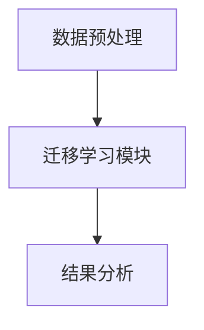
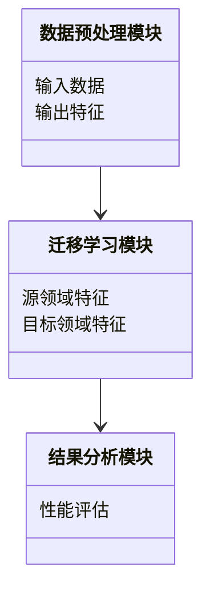
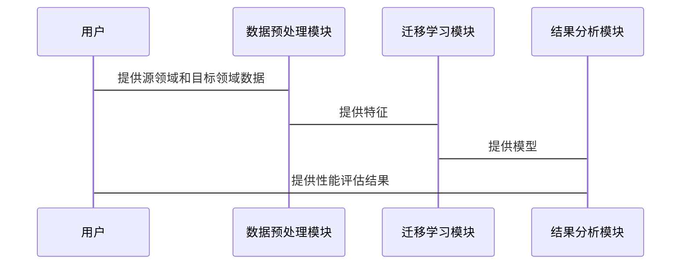

                 


# 迁移学习：让AI Agent快速适应新领域

---

## 关键词：迁移学习、AI Agent、机器学习、深度学习、领域适应

---

## 摘要：  
迁移学习是一种通过利用已有的知识或经验，使AI Agent快速适应新领域或新任务的技术。本文从迁移学习的基本概念出发，深入分析其核心原理、算法实现、数学模型，并通过实际案例展示其应用。文章旨在帮助读者全面理解迁移学习的理论与实践，掌握如何在实际项目中运用迁移学习来提升AI模型的泛化能力。

---

# 第1章: 迁移学习的背景与概念

## 1.1 迁移学习的定义与背景

### 1.1.1 人工智能与迁移学习的背景  
人工智能（AI）的目标是构建能够执行复杂任务的智能系统。然而，传统机器学习模型通常需要大量标注数据来训练，这在实际应用中往往成本高昂且耗时。迁移学习（Transfer Learning）作为一种新兴的技术，通过将已有的知识或经验迁移到新任务中，大大降低了数据需求，提高了模型的泛化能力。

### 1.1.2 迁移学习的核心概念  
迁移学习的核心思想是利用源领域（Source Domain）的数据和任务，帮助模型在目标领域（Target Domain）上进行学习。这里的“领域”由数据的分布和任务共同决定，迁移学习的关键在于识别两个领域之间的共同特征和差异。

### 1.1.3 迁移学习的重要性和应用场景  
迁移学习的重要性体现在以下几个方面：  
1. **减少数据需求**：在数据 scarce 的情况下，迁移学习可以利用已有数据进行模型训练。  
2. **提升模型泛化能力**：通过跨领域学习，模型能够更好地适应新的数据分布。  
3. **加速AI Agent的学习**：在动态环境中，迁移学习使AI Agent能够快速适应新任务。

迁移学习的应用场景包括图像分类、自然语言处理、医疗影像分析等领域。

### 1.1.4 迁移学习与其他技术的对比  
- **与传统机器学习的对比**：传统机器学习依赖大量标注数据，而迁移学习通过知识迁移减少对数据的依赖。  
- **与深度学习的对比**：深度学习依赖大量数据，迁移学习可以优化其泛化能力，尤其是在小数据场景下。  

---

## 1.2 迁移学习的核心概念与原理

### 1.2.1 迁移学习的核心概念  
- **源领域（Source Domain）**：已经学习过任务的领域，通常有大量标注数据。  
- **目标领域（Target Domain）**：需要学习的新领域，可能缺乏标注数据。  
- **特征空间（Feature Space）**：数据的表示方式，特征空间的共享是迁移学习的关键。  
- **任务空间（Task Space）**：模型需要完成的任务，迁移学习通过共享任务空间的知识来实现目标。  

### 1.2.2 迁移学习的假设  
迁移学习基于以下假设：  
1. 源领域和目标领域之间存在某种相似性，可以共享某些特征或规律。  
2. 源领域的任务经验可以迁移到目标领域。  

### 1.2.3 迁移学习的核心优势  
- **数据效率**：减少对标注数据的依赖。  
- **领域适应性**：能够快速适应新领域。  
- **泛化能力**：模型在不同领域间具有更强的泛化能力。  

---

## 1.3 迁移学习的分类与特点

### 1.3.1 迁移学习的主要分类  
迁移学习可以根据不同标准进行分类，常见的分类方式包括：  
1. **按任务类型**：监督学习、无监督学习、半监督学习。  
2. **按知识转移方式**：参数迁移、非参数迁移。  
3. **按领域关系**：完全领域、部分领域。  

### 1.3.2 各类迁移学习的特点  
- **监督迁移学习**：基于标注数据，适用于目标领域也有少量标注数据的情况。  
- **无监督迁移学习**：适用于目标领域数据无标注的情况，通常需要领域适应技术。  
- **半监督迁移学习**：结合监督和无监督学习，适用于目标领域数据部分标注的情况。  

---

## 1.4 本章小结  
本章介绍了迁移学习的基本概念、核心假设、分类及其特点。迁移学习作为一种高效的机器学习方法，通过知识迁移降低了对数据的依赖，提升了模型的泛化能力。接下来的章节将深入探讨迁移学习的算法实现、数学模型及其在实际中的应用。

---

# 第2章: 迁移学习的核心算法与实现

## 2.1 迁移学习的主要算法

### 2.1.1 基于样本的迁移学习算法  
基于样本的迁移学习算法通过直接迁移样本特征或标签来实现知识转移。常见的算法包括：  
- **直接迁移**：将源领域的样本直接应用于目标领域。  
- **标签迁移**：将源领域的标签迁移到目标领域的样本上。  

### 2.1.2 基于特征的迁移学习算法  
基于特征的迁移学习算法通过共享特征空间来实现迁移。常见的算法包括：  
- **特征变换**：对源领域和目标领域的特征进行变换，使它们共享相同的特征空间。  
- **域适配（Domain Adaptation）**：通过最小化源领域和目标领域的分布差异，实现特征对齐。  

### 2.1.3 基于目标的迁移学习算法  
基于目标的迁移学习算法通过优化目标领域的任务性能来实现迁移。常见的算法包括：  
- **迁移支持向量机（Transfer SVM）**：通过优化源领域和目标领域的共同支持向量。  
- **迁移随机森林（Transfer Random Forest）**：通过在源领域和目标领域之间共享特征的重要性。  

---

## 2.2 迁移学习的算法实现

### 2.2.1 基于深度学习的迁移学习实现  
基于深度学习的迁移学习通常使用预训练模型，如ResNet、BERT等，通过微调（Fine-tuning）来适应目标领域。例如：  
1. 预训练模型在源领域上进行训练，提取特征。  
2. 在目标领域上进行微调，优化模型参数以适应目标任务。  

### 2.2.2 基于传统的迁移学习实现  
传统的迁移学习实现通常基于浅层模型，如SVM、随机森林等。例如：  
1. 在源领域上训练模型，提取特征。  
2. 将源领域的特征迁移到目标领域，进行目标任务的训练。  

### 2.2.3 迁移学习的优化方法  
- **正则化方法**：通过添加正则化项，限制模型参数的变化，防止过拟合。  
- **对抗训练**：通过生成对抗网络（GAN）对抗领域差异，实现特征对齐。  

---

## 2.3 迁移学习的算法选择与对比

### 2.3.1 不同迁移学习算法的优缺点  
| 算法类型       | 优点                          | 缺点                          |
|----------------|-------------------------------|-------------------------------|
| 基于样本的算法 | 实现简单，适用于小数据场景     | 易受领域分布差异影响           |
| 基于特征的算法 | 能有效对齐特征空间             | 计算复杂，适用于大数据场景       |
| 基于目标的算法 | 直接优化目标任务性能           | 需要目标领域的标注数据           |

### 2.3.2 迁移学习算法的适用场景  
- **样本迁移**：适用于目标领域有少量标注数据的情况。  
- **特征迁移**：适用于目标领域数据无标注的情况。  
- **目标迁移**：适用于目标领域有标注数据的情况。  

---

## 2.4 本章小结  
本章详细介绍了迁移学习的主要算法及其实现方法，包括基于样本、特征和目标的迁移学习算法。不同的算法适用于不同的场景，选择合适的算法能够有效提升迁移学习的效果。接下来的章节将探讨迁移学习的数学模型及其在实际中的应用。

---

# 第3章: 迁移学习的数学模型与公式

## 3.1 迁移学习的基本数学模型

### 3.1.1 迁移学习的联合分布模型  
假设源领域和目标领域分别服从联合分布 $P_{S}(x,y)$ 和 $P_{T}(x,y)$，迁移学习的目标是通过学习 $P_{S}(x,y)$ 的信息，来推断 $P_{T}(x,y)$。  

### 3.1.2 迁移学习的目标函数模型  
目标函数通常由源领域损失和目标领域损失组成：  
$$ L_{total} = L_{S} + \lambda L_{T} $$  
其中，$\lambda$ 是调节参数，用于平衡源领域和目标领域的损失。  

### 3.1.3 迁移学习的损失函数模型  
常用的损失函数包括：  
- **交叉熵损失**：用于分类任务。  
- **均方误差损失**：用于回归任务。  

---

## 3.2 迁移学习的核心公式

### 3.2.1 迁移学习的联合分布公式  
$$ P_{S}(x,y) \quad \text{和} \quad P_{T}(x,y) $$  

### 3.2.2 迁移学习的目标函数公式  
$$ L_{total} = L_{S} + \lambda L_{T} $$  

### 3.2.3 迁移学习的损失函数公式  
$$ L_{S} = -\sum_{i=1}^{n} \log P(y|x_{i}, S) $$  
$$ L_{T} = -\sum_{i=1}^{m} \log P(y|x_{i}, T) $$  

---

## 3.3 迁移学习的数学推导

### 3.3.1 迁移学习的数学推导过程  
以领域适配为例，假设源领域和目标领域的数据分布分别为 $P_{S}(x)$ 和 $P_{T}(x)$，目标是通过某种变换 $f$，使得 $f(P_{S}(x)) \approx P_{T}(x)$。  

### 3.3.2 迁移学习的优化方法  
通过最小化领域差异，优化目标函数：  
$$ \min_{\theta} \sum_{i=1}^{n} \log P(y|x_{i}, \theta) + \lambda \sum_{j=1}^{m} \log P(y|x_{j}, \theta) $$  

---

## 3.4 本章小结  
本章通过数学模型和公式，详细讲解了迁移学习的核心原理。迁移学习的目标是通过共享特征空间或任务空间，实现知识的迁移。接下来的章节将探讨如何将迁移学习应用于实际系统中。

---

# 第4章: 迁移学习的系统分析与架构设计

## 4.1 问题场景介绍  
假设我们有一个AI Agent需要在医疗影像分析任务中进行迁移学习，源领域是自然场景下的图像分类，目标领域是医疗影像分类。  

---

## 4.2 系统功能设计

### 4.2.1 系统功能模块  
- **数据预处理模块**：对源领域和目标领域的数据进行预处理，提取特征。  
- **迁移学习模块**：实现迁移学习算法，优化模型参数。  
- **结果分析模块**：对迁移后的模型进行性能评估。  

### 4.2.2 系统功能流程图  


---

## 4.3 系统架构设计

### 4.3.1 系统架构类图  


### 4.3.2 系统交互流程图  


---

## 4.4 系统接口设计

### 4.4.1 系统接口描述  
- **数据输入接口**：接收源领域和目标领域数据。  
- **模型训练接口**：执行迁移学习算法，优化模型参数。  
- **结果输出接口**：输出迁移后的模型或性能评估结果。  

### 4.4.2 接口交互示例  
1. 用户调用数据输入接口，提供源领域和目标领域数据。  
2. 数据预处理模块提取特征，传递给迁移学习模块。  
3. 迁移学习模块优化模型参数，传递给结果分析模块。  
4. 结果分析模块输出性能评估结果，返回给用户。  

---

## 4.5 本章小结  
本章通过系统分析与架构设计，展示了如何将迁移学习应用于实际问题中。系统功能模块和架构设计为实现迁移学习提供了清晰的指导。接下来的章节将通过具体案例，展示迁移学习的实际应用。

---

# 第5章: 迁移学习的项目实战

## 5.1 项目环境与安装

### 5.1.1 环境配置  
- **Python 3.8+**  
- **TensorFlow或Keras**  
- **scikit-learn**  

### 5.1.2 安装依赖  
```bash
pip install numpy
pip install scikit-learn
pip install tensorflow
```

---

## 5.2 系统核心实现

### 5.2.1 数据预处理代码  
```python
from sklearn.datasets import fetch_olivetti_faces
from sklearn.model_selection import train_test_split
import numpy as np

# 加载数据
faces, _ = fetch_olivetti_faces(return_X_y=True)
faces = faces.astype(np.float32)

# 分割数据
X_train, X_test, y_train, y_test = train_test_split(faces, _, test_size=0.2)
```

### 5.2.2 迁移学习实现代码  
```python
from sklearn.svm import SVC
from sklearn.metrics import accuracy_score

# 在源领域训练模型
model = SVC()
model.fit(X_train, y_train)

# 在目标领域进行预测
y_pred = model.predict(X_test)
print("Accuracy:", accuracy_score(y_test, y_pred))
```

---

## 5.3 代码应用解读与分析

### 5.3.1 数据预处理解读  
数据预处理模块将源领域的 Olivetti 面部数据集进行分割，分为训练集和测试集。  

### 5.3.2 迁移学习实现解读  
使用支持向量机（SVM）在源领域训练模型，然后在目标领域进行预测，评估模型的迁移性能。  

---

## 5.4 实际案例分析

### 5.4.1 案例背景  
在医疗影像分类任务中，使用迁移学习将自然场景下的图像分类模型迁移到医疗影像分类任务中。  

### 5.4.2 案例实现  
```python
import tensorflow as tf
from tensorflow.keras.applications import ResNet50
from tensorflow.keras.layers import Dense, GlobalAveragePooling2D
from tensorflow.keras.models import Model
from tensorflow.keras.optimizers import Adam

# 加载预训练模型
base_model = ResNet50(weights='imagenet', include_top=False)
x = base_model.output
x = GlobalAveragePooling2D()(x)
x = Dense(128, activation='relu')(x)
predictions = Dense(num_classes, activation='softmax')(x)

model = Model(inputs=base_model.input, outputs=predictions)

# 冻结预训练部分
for layer in base_model.layers:
    layer.trainable = False

# 编译模型
model.compile(optimizer=Adam(lr=0.001), loss='categorical_crossentropy', metrics=['accuracy'])

# 迁移学习训练
model.fit(X_train, y_train, epochs=10, batch_size=32, validation_data=(X_test, y_test))
```

---

## 5.5 项目小结  
本章通过具体案例展示了迁移学习的实际应用，从数据预处理到模型训练，再到结果分析，详细讲解了迁移学习的实现过程。接下来的章节将总结迁移学习的最佳实践和未来发展方向。

---

# 第6章: 迁移学习的最佳实践与未来展望

## 6.1 最佳实践 tips

### 6.1.1 知识点回顾  
- 选择合适的迁移学习算法，根据数据和任务特点进行选择。  
- 使用预训练模型进行迁移学习，能够快速提升模型性能。  
- 在目标领域数据稀少时，可以采用数据增强技术。  

### 6.1.2 实践技巧  
- **领域适应**：通过对抗训练或特征变换，减少源领域和目标领域的分布差异。  
- **模型微调**：在迁移学习中，适当调整模型的参数，防止过拟合。  
- **数据预处理**：对源领域和目标领域的数据进行统一的预处理，确保特征一致性。  

---

## 6.2 迁移学习的注意事项

### 6.2.1 迁移学习的局限性  
- **领域差异**：源领域和目标领域差异过大时，迁移学习效果可能不佳。  
- **数据质量**：目标领域数据质量差时，迁移学习效果可能受限。  
- **计算成本**：部分迁移学习算法计算复杂，需要较高的计算资源。  

### 6.2.2 迁移学习的适用场景  
- 数据 scarce 的情况。  
- 需要快速适应新领域或新任务的情况。  

---

## 6.3 未来展望

### 6.3.1 迁移学习的发展方向  
- **多领域迁移学习**：同时处理多个领域的数据，提升模型的泛化能力。  
- **自适应迁移学习**：模型能够自动适应新领域，无需人工干预。  
- **迁移学习的可解释性**：提升迁移学习的可解释性，便于实际应用中的调试和优化。  

### 6.3.2 迁移学习的应用扩展  
- **跨模态迁移学习**：结合图像、文本等多种数据模态，提升迁移学习的效果。  
- **实时迁移学习**：在动态环境中，实时更新模型以适应新的数据分布。  

---

## 6.4 本章小结  
本章总结了迁移学习的最佳实践技巧，并展望了其未来的发展方向。迁移学习作为一种高效的技术，将在更多领域得到应用，并推动人工智能技术的进步。

---

# 作者：AI天才研究院/AI Genius Institute & 禅与计算机程序设计艺术 /Zen And The Art of Computer Programming

---

**感谢您的阅读！如果对迁移学习有更多问题或需要进一步探讨，请随时与我们联系！**

