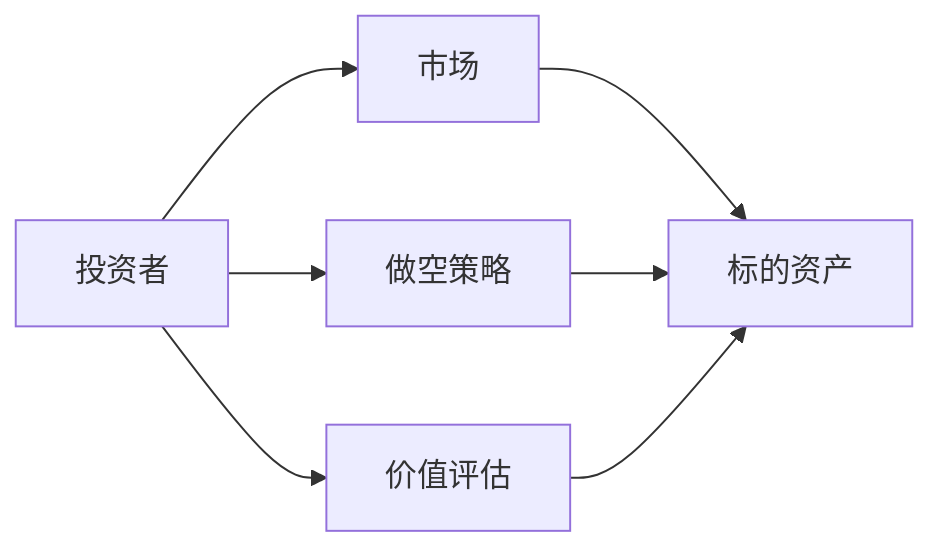
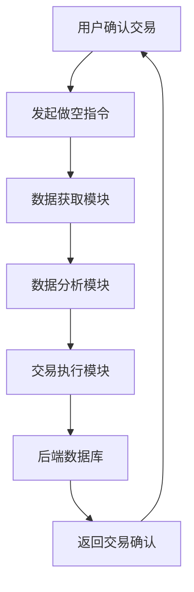

                 


# 迈克尔·伯里的做空策略与价值投资

## 关键词：迈克尔·伯里，价值投资，做空策略，投资哲学，风险管理

## 摘要：迈克尔·伯里以其独特的做空策略和价值投资理念闻名，本文将深入分析他的投资哲学、做空策略的核心概念、算法原理、系统架构设计以及实际案例。通过详细讲解这些方面，帮助读者理解伯里的投资方法，并提供实际操作的指导和最佳实践。

---

# 第一部分: 迈克尔·伯里的投资哲学与做空策略背景

## 第1章: 迈克尔·伯里的投资哲学与做空策略概述

### 1.1 迈克尔·伯里的投资哲学

#### 1.1.1 价值投资的核心理念

价值投资是一种以基本面分析为基础的投资策略，其核心理念是寻找市场价格低于其内在价值的资产。伯里认为，市场的短期波动掩盖了资产的长期价值，因此投资者应关注企业的内在价值，而不是市场的短期情绪。

**内在价值计算公式**：
$$ V = \frac{CF}{r - g} $$
其中，\( V \) 是内在价值，\( CF \) 是未来现金流，\( r \) 是折现率，\( g \) 是现金流增长率。

#### 1.1.2 做空策略的定义与特点

做空策略是通过借入股票卖出，期望在价格下跌时以更低的价格买回股票还给借出者，从而获利。做空的特点包括高风险、高杠杆和逆市场趋势。

#### 1.1.3 伯里投资哲学的核心要素

- **长期视角**：伯里强调长期投资，关注企业的基本面。
- **逆向思维**：在市场恐慌时寻找低估资产，在市场狂热时寻找高估资产。
- **风险管理**：严格控制仓位和杠杆，避免过度风险暴露。

### 1.2 做空策略的背景与现状

#### 1.2.1 做空交易的市场环境

做空策略在市场下跌趋势中表现良好，但在市场上涨趋势中可能面临巨大损失。伯里通常在市场泡沫时期进行做空，捕捉市场的过度投机行为。

#### 1.2.2 伯里做空策略的成功案例

- **案例1：互联网泡沫破裂**：伯里在2000年互联网泡沫破裂前做空科技股，获利丰厚。
- **案例2：2008年金融危机**：伯里通过做空次贷相关资产成功预测了危机。

#### 1.2.3 做空与价值投资的结合

伯里将做空策略与价值投资结合，通过寻找市场中高估的资产进行做空，同时寻找低估的资产进行做多，实现双向投资。

### 1.3 伯里投资哲学的边界与外延

#### 1.3.1 投资哲学的核心要素

- **市场分析**：关注宏观经济、行业趋势和企业基本面。
- **风险控制**：严格控制杠杆和仓位，避免重大损失。
- **逆向思维**：在市场恐慌时寻找机会，避免随市场波动。

#### 1.3.2 做空策略的适用场景

- **市场泡沫**：资产价格远高于内在价值时。
- **行业周期**：行业处于衰退期或下行周期时。
- **企业基本面恶化**：企业财务状况恶化或管理不善时。

#### 1.3.3 投资哲学与市场的互动关系

伯里的投资哲学强调市场的非有效性，认为市场短期波动与长期价值背离时，投资者可以通过逆向投资获利。

### 1.4 伯里投资哲学的实体关系图



### 1.5 本章小结

本章介绍了迈克尔·伯里的投资哲学和做空策略，强调了价值投资和做空策略的核心理念、成功案例以及适用场景。伯里通过逆向思维和严格的风险管理，成功在市场波动中获利。

---

## 第2章: 价值投资与做空策略的核心概念

### 2.1 价值投资的核心原理

#### 2.1.1 内在价值的计算公式

$$ V = \frac{CF}{r - g} $$

其中，\( V \) 是内在价值，\( CF \) 是未来现金流，\( r \) 是折现率，\( g \) 是现金流增长率。

#### 2.1.2 市场价值与内在价值的对比

| 指标 | 内在价值 | 市场价值 |
|------|----------|----------|
| 基础 | 企业未来现金流 | 市场供需 | 
| 适用 | 长期投资决策 | 短期交易决策 |

### 2.2 做空策略的数学模型

#### 2.2.1 做空收益的计算公式

$$ R = S_0 - S_1 $$

其中，\( R \) 是收益，\( S_0 \) 是卖出价格，\( S_1 \) 是买回价格。

#### 2.2.2 做空风险的评估指标

- **波动率**：资产价格波动越大，做空风险越高。
- **杠杆率**：杠杆越高，潜在收益和风险越大。
- **市场趋势**：市场整体趋势影响做空收益。

### 2.3 价值投资与做空策略的对比分析

| 指标 | 价值投资 | 做空策略 |
|------|----------|----------|
| 目标 | 寻找低估资产 | 寻找高估资产 |
| 风险 | 市场下跌风险 | 市场上涨风险 |
| 收益 | 长期资本增值 | 短期套利机会 |

### 2.4 本章小结

本章详细讲解了价值投资和做空策略的核心原理和数学模型，分析了两者的对比和区别。伯里通过结合两者，实现了在不同市场环境下灵活投资。

---

## 第3章: 迈克尔·伯里做空策略的算法原理

### 3.1 做空策略的算法流程

```mermaid
graph TD
A[开始] --> B[识别市场趋势]
B --> C[寻找高估资产]
C --> D[建立空头头寸]
D --> E[监控市场变化]
E --> F[平仓获利或止损]
F --> G[结
```

### 3.2 做空策略的Python实现

```python
def calculate_short_profit(short_price, buy_price):
    return short_price - buy_price

# 示例代码
short_price = 100  # 做空价格
buy_price = 90     # 买回价格
profit = calculate_short_profit(short_price, buy_price)
print(f"做空利润：{profit}")
```

### 3.3 做空策略的风险管理

- **止损设置**：设定最大亏损比例，如亏损10%时立即止损。
- **杠杆控制**：合理控制杠杆，避免过度杠杆导致的损失。
- **头寸分配**：根据资产相关性分配头寸，分散风险。

### 3.4 本章小结

本章通过算法流程和代码实现，详细讲解了做空策略的实现步骤和风险管理方法。伯里通过严格的算法和风险管理，确保做空策略的稳健性。

---

## 第4章: 系统分析与架构设计方案

### 4.1 问题场景介绍

伯里通过分析市场、行业和企业基本面，制定做空策略。系统需要支持实时数据获取、分析和交易执行。

### 4.2 系统功能设计

- **数据获取**：获取标的资产的历史和实时数据。
- **基本面分析**：计算内在价值，识别高估资产。
- **交易执行**：根据分析结果执行做空指令。

### 4.3 系统架构设计


### 4.4 系统接口设计

- **数据接口**：与数据供应商对接，获取实时数据。
- **交易接口**：与 brokerage 系统对接，执行交易指令。

### 4.5 系统交互序列图



### 4.6 本章小结

本章通过系统架构设计和交互图，展示了如何构建一个支持做空策略的交易系统。伯里通过系统化的方法，确保了投资策略的高效执行。

---

## 第5章: 项目实战

### 5.1 环境安装

安装必要的Python库，如Pandas、NumPy、Matplotlib等。

### 5.2 系统核心实现源代码

```python
import pandas as pd

def calculate_short_profit(short_price, buy_price):
    return short_price - buy_price

# 示例代码
data = pd.read_csv('stock_data.csv')
short_price = data['close'].iloc[0]  # 做空价格
buy_price = data['close'].iloc[-1]   # 买回价格
profit = calculate_short_profit(short_price, buy_price)
print(f"做空利润：{profit}")
```

### 5.3 代码应用解读与分析

分析代码的功能，理解如何计算做空利润，并如何应用于实际投资决策。

### 5.4 实际案例分析

以伯里做空互联网泡沫为例，分析其投资决策过程和结果。

### 5.5 项目小结

本章通过实际案例和代码实现，展示了如何在实际投资中应用伯里的做空策略。

---

## 第6章: 最佳实践与注意事项

### 6.1 最佳实践 tips

- **严格风险管理**：控制杠杆和仓位，避免过度风险暴露。
- **持续学习**：关注市场变化和企业基本面，及时调整投资策略。
- **结合市场环境**：根据市场环境调整做空策略，灵活应对市场变化。

### 6.2 小结

伯里通过严格的纪律和系统的分析，成功实施了做空策略。投资者在实际操作中应遵循这些最佳实践，确保稳健投资。

### 6.3 注意事项

- **市场风险**：做空策略在市场上涨时可能面临重大损失。
- **流动性风险**：标的资产流动性不足可能影响交易执行。
- **法律风险**：部分市场对做空有严格限制，需遵守相关法规。

### 6.4 拓展阅读

- 迈克尔·伯里的投资著作和访谈。
- 价值投资和做空策略的经典文献。

### 6.5 本章小结

本章总结了伯里做空策略的最佳实践和注意事项，强调了纪律和风险管理的重要性。

---

## 结语

迈克尔·伯里的做空策略与价值投资理念为投资者提供了独特的视角。通过深入分析他的投资哲学、算法原理和实际案例，我们可以更好地理解如何在市场波动中寻找机会。伯里通过严格的纪律和系统的分析，成功实现了长期投资目标。

---

## 作者：AI天才研究院/AI Genius Institute & 禅与计算机程序设计艺术 /Zen And The Art of Computer Programming

---

以上是关于迈克尔·伯里的做空策略与价值投资的详细文章，涵盖了他的投资哲学、算法原理、系统架构和实际案例分析。

