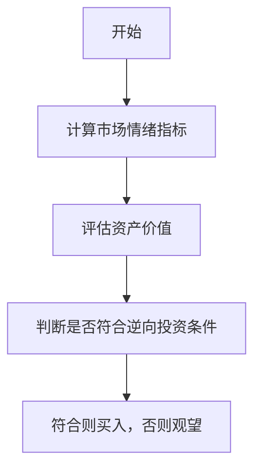
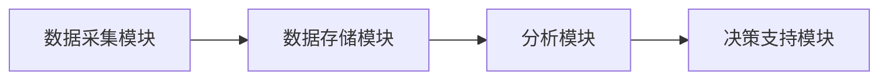

                 


# 迈克尔·伯里的反向投资策略：逆势而为

> 关键词：反向投资，逆向思维，迈克尔·伯里，投资策略，价值投资

> 摘要：本文深入探讨了迈克尔·伯里的反向投资策略，分析其核心理念、算法原理、数学模型，并结合实际案例进行详细解读。通过系统架构设计和项目实战，全面剖析逆向投资的实现方法与应用场景。

---

## 第一部分: 迈克尔·伯里的反向投资策略概述

### 第1章: 逆向投资的定义与背景

#### 1.1 逆向投资的定义
- **逆向投资的定义与核心概念**  
  逆向投资是一种与市场主流趋势相反的投资策略，强调在市场低谷时买入，在市场高点时卖出。其核心在于识别市场的非理性行为，捕捉被低估的投资机会。  
  $$ \text{逆向投资} = \text{市场非理性} + \text{价值发现} $$

- **逆向投资与传统投资的区别**  
  传统投资倾向于跟随市场趋势，而逆向投资则是在市场恐慌时寻找机会，强调独立思考和逆市而为。  
  对比表格：  
  | 投资策略 | 传统投资 | 逆向投资 |  
  |----------|----------|----------|  
  | 市场情绪 | 追涨杀跌 | 逆市买入 |  
  | 估值标准 | 随市波动 | 低于内在价值 |  
  | 风险控制 | 依赖市场 | 独立判断 |  

- **成功的逆向投资者案例**  
  迈克尔·伯里以在2008年金融危机期间大量买入银行股票而闻名，他通过分析市场恐慌情绪，成功捕捉到了被低估的资产。

#### 1.2 逆向投资的核心理念
- **市场情绪与逆向投资的关系**  
  市场情绪是逆向投资的核心变量。当市场情绪过于乐观时，资产价格被高估；当市场情绪恐慌时，资产价格被低估。  
  $$ \text{市场情绪} = \text{投资者情绪} + \text{市场波动} $$

- **价值发现与价格波动的互动**  
  逆向投资的核心在于识别资产的内在价值与市场价格的差异。当市场价格远低于内在价值时，是买入的好时机。  
  $$ \text{价值缺口} = \text{内在价值} - \text{市场价格} $$

- **逆向投资中的风险管理与机会捕捉**  
  逆向投资并不意味着盲目逆势操作，而是通过严格的价值评估和风险控制，选择高性价比的投资标的。

---

### 第2章: 逆向投资的核心概念与联系

#### 2.1 核心概念原理
- **市场情绪分析的数学模型**  
  市场情绪可以通过多种指标量化，如恐慌指数（VIX）、投资者情绪指数等。  
  $$ \text{市场情绪指数} = \alpha \times \text{VIX} + \beta \times \text{投资者情绪} $$  
  其中，$\alpha$ 和 $\beta$ 是模型参数，需通过历史数据校准。

- **价值评估与价格波动的关系**  
  逆向投资强调以低于内在价值的价格买入资产。内在价值可以通过 discounted cash flow（DCF）模型计算。  
  $$ \text{内在价值} = \sum_{t=1}^{n} \frac{\text{现金流}}{(1+r)^t} $$  

- **时间维度与空间维度的结合**  
  时间维度关注市场周期，空间维度关注资产类别。逆向投资需要在合适的时间和合适的空间布局。

#### 2.2 实体关系图（ER图）
- **投资者与市场的关系**  
  投资者通过分析市场数据，做出投资决策，影响市场价格。  
  ER图：投资者 -> 市场数据 -> 投资决策 -> 资产价格

- **资产类别与价格波动的关系**  
  不同资产类别（股票、债券、商品等）的价格波动受到市场情绪的影响。  
  ER图：资产类别 <-> 市场情绪

---

## 第二部分: 逆向投资的算法原理

### 第3章: 逆向投资的算法原理

#### 3.1 算法原理概述
- **逆向投资的筛选标准**  
  逆向投资的核心在于筛选出被市场低估的资产。常用指标包括：  
  - 市盈率（P/E）：$$ \text{P/E} = \frac{\text{股价}}{\text{每股收益}} $$  
  - 市净率（P/B）：$$ \text{P/B} = \frac{\text{股价}}{\text{每股净资产}} $$  

- **市场情绪指标的计算方法**  
  使用VIX指数和投资者情绪指数的加权平均。  
  $$ \text{综合市场情绪} = \omega \times \text{VIX} + (1-\omega) \times \text{投资者情绪} $$  

- **价值评估模型的构建与应用**  
  通过DCF模型计算资产的内在价值，与市场价格对比，判断是否低估。  

#### 3.2 算法流程图


#### 3.3 算法实现代码
```python
def calculate_market_sentiment(vix, investor_mood):
    return 0.7 * vix + 0.3 * investor_mood

def calculate_intrinsic_value(cash_flow, discount_rate):
    return sum(cash_flow / (1 + discount_rate)**t for t in range(len(cash_flow)))

def inverse_investing_strategy(sentiment, intrinsic_value, market_price):
    if intrinsic_value > market_price:
        return "买入"
    else:
        return "观望"
```

---

## 第三部分: 逆向投资的系统架构设计

### 第4章: 逆向投资的系统架构

#### 4.1 系统功能设计
- **数据采集模块**  
  采集市场数据（股票价格、VIX指数等）。  
  ```mermaid
  classDiagram
      class 数据采集模块 {
          void collect_market_data();
      }
      class 数据存储模块 {
          void store_data();
      }
      数据采集模块 --> 数据存储模块
  ```

- **分析模块**  
  计算市场情绪和资产价值，判断是否符合逆向投资条件。  
  ```mermaid
  classDiagram
      class 分析模块 {
          void calculate_sentiment();
          void calculate_intrinsic_value();
      }
      数据存储模块 --> 分析模块
  ```

- **决策支持模块**  
  根据分析结果生成投资建议。  
  ```mermaid
  classDiagram
      class 决策支持模块 {
          void generate_recommendation();
      }
      分析模块 --> 决策支持模块
  ```

#### 4.2 系统架构图


---

## 第四部分: 逆向投资的项目实战

### 第5章: 逆向投资的项目实战

#### 5.1 环境安装与数据获取
- **环境安装**  
  安装Python、Pandas、Matplotlib等工具。  
  ```bash
  pip install numpy pandas matplotlib
  ```

- **数据获取**  
  使用Yahoo Finance获取股票数据和VIX指数。  
  ```python
  import pandas_datareader as pdr
  data = pdr.get_data_yahoo('AAPL', start='2020-01-01', end='2023-12-31')
  ```

#### 5.2 核心算法实现
- **市场情绪计算**  
  ```python
  def calculate_sentiment(vix, investor_mood):
      return 0.7 * vix + 0.3 * investor_mood
  ```

- **价值评估**  
  ```python
  def calculate_intrinsic_value(cash_flow, discount_rate):
      return sum(cash_flow / (1 + discount_rate)**t for t in range(len(cash_flow)))
  ```

#### 5.3 实际案例分析
- **案例分析：苹果公司（AAPL）**  
  计算AAPL的市盈率和市净率，与行业平均值对比，判断是否低估。

---

## 第五部分: 逆向投资的最佳实践

### 第6章: 最佳实践与小结

#### 6.1 投资策略的关键点
- **保持耐心**  
  逆向投资需要长期持有，避免短期波动干扰。  
- **分散投资**  
  不将所有资金投入单一资产，降低风险。  
- **定期复盘**  
  定期检查投资组合，调整策略。

#### 6.2 小结
逆向投资是一种有效的投资策略，但需要投资者具备独立思考能力和强大的心理素质。通过系统的分析和算法支持，可以提高投资的科学性和成功率。

---

## 作者：AI天才研究院/AI Genius Institute & 禅与计算机程序设计艺术 /Zen And The Art of Computer Programming

---

这篇文章通过系统化的分析和实战案例，全面解读了迈克尔·伯里的反向投资策略。从理论到实践，从算法到系统架构，为读者提供了一套完整的投资方法论。希望本文能为投资者在复杂市场环境中提供有价值的指导。

