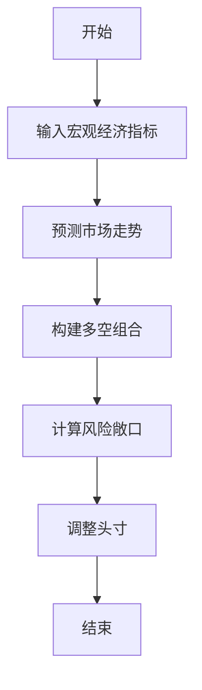
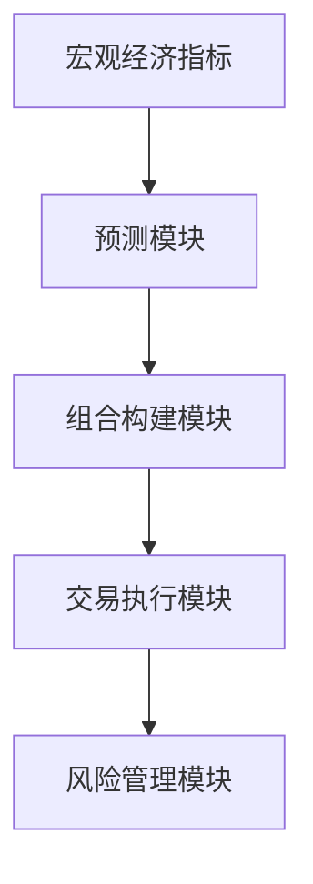

                 


# 迈克尔·伯里的宏观对冲策略

> 关键词：宏观对冲、迈克尔·伯里、风险管理、资产配置、交易策略

> 摘要：本文深入分析迈克尔·伯里的宏观对冲策略，从背景介绍、核心概念、算法原理、系统架构到项目实战，全面解析其在对冲基金中的应用与实现。

---

## 第1章: 宏观对冲的基本概念与背景

### 1.1 宏观对冲的定义与特点

宏观对冲是一种投资策略，通过同时押注市场上涨和下跌，利用资产价格波动赚取收益。其核心特点包括：
- **跨市场投资**：同时涉及股票、债券、商品等多种资产。
- **对冲风险**：通过做多和做空来抵消市场波动带来的风险。
- **宏观经济驱动**：依赖于对宏观经济指标的分析，如GDP、利率、通货膨胀等。

### 1.2 迈克尔·伯里与宏观对冲策略

迈克尔·伯里是宏观对冲领域的先驱，其策略基于对经济周期和市场情绪的分析：
- **投资理念**：伯里认为，宏观经济指标可以预测市场走势，从而在波动中获利。
- **策略核心**：通过资产配置和风险控制，捕捉市场波动中的收益。
- **策略地位**：伯里策略在对冲基金中具有重要地位，被视为宏观经济驱动型对冲的典范。

### 1.3 宏观对冲策略的主要类型

- **基于资产价格波动的对冲**：通过技术分析预测价格波动。
- **基于经济周期的对冲**：利用经济周期变化进行资产配置。
- **基于市场情绪的对冲**：通过市场情绪指标调整投资策略。

---

## 第2章: 宏观对冲策略的背景与演变

### 2.1 宏观对冲的历史发展

- **早期对冲基金**：20世纪50年代开始出现，主要通过套利和对冲风险获利。
- **宏观对冲的兴起**：20世纪80年代，随着全球化和金融市场的开放，宏观对冲策略逐渐成熟。
- **伯里策略的形成与演变**：伯里在80年代提出了基于宏观经济指标的对冲策略，经过多次调整和完善，成为经典。

### 2.2 经济学基础与宏观对冲

- **宏观经济学与对冲策略的关系**：宏观经济指标是策略的核心，如GDP增长率、通货膨胀率等。
- **资本资产定价模型（CAPM）**：用于评估资产的预期收益，指导投资决策。
- **市场有效性假设**：假设市场存在一定程度的无效性，使宏观对冲策略可行。

### 2.3 伯里策略的核心假设与边界条件

- **经济周期波动的可预测性**：假设经济指标的变化可以被预测。
- **市场参与者行为的可预测性**：假设市场参与者的行为模式相对稳定。
- **对冲策略的有效性边界**：策略的有效性受市场条件和宏观经济环境的限制。

---

## 第3章: 伯里宏观对冲策略的核心原理

### 3.1 资产配置与风险控制

- **资产配置**：根据经济指标预测，调整资产配置比例。
- **风险控制**：通过做空和做多平衡风险，确保收益稳定。

### 3.2 宏观经济指标的分析与应用

- **主要指标**：GDP、利率、通货膨胀、失业率等。
- **周期性分析**：经济指标的周期性变化为策略提供依据。
- **资产价格关系**：指标变化对资产价格的影响是策略的基础。

### 3.3 对冲策略的构建与实施

- **组合构建**：基于宏观经济预测，构建多空组合。
- **动态调整**：根据市场变化实时调整头寸。
- **绩效评估**：定期评估策略收益与风险。

---

## 第4章: 伯里策略的核心概念与联系

### 4.1 核心概念的原理分析

- **资产价格波动的可预测性**：通过宏观经济指标预测价格变化。
- **市场参与者行为的可预测性**：假设市场参与者行为模式稳定。
- **宏观经济指标与资产价格的关系**：指标变化影响资产价格波动。

### 4.2 核心概念的对比分析

| 概念             | 描述                                             |
|------------------|--------------------------------------------------|
| 资产配置         | 根据预测调整资产比例                             |
| 风险管理         | 通过多空对冲控制风险                             |
| 经济指标         | 宏观经济指标指导投资决策                         |

---

## 第5章: 伯里宏观对冲策略的算法原理

### 5.1 算法概述

伯里策略的核心算法是均值-方差优化，用于资产配置和风险控制。

### 5.2 算法流程



### 5.3 数学模型

均值-方差优化模型：

$$
\text{目标函数：} \quad \min \sigma^2 \\
\text{约束条件：} \quad \sum w_i = 1, \quad \sum w_i r_i = \mu
$$

其中，\( w_i \) 是资产权重，\( r_i \) 是资产收益，\( \mu \) 是预期收益。

### 5.4 代码实现

```python
import numpy as np

def mean_variance_optimization(returns, target_return):
    n = len(returns.columns)
    cov_matrix = returns.cov()
    inv_cov = np.linalg.inv(cov_matrix)
    ones = np.ones(n)
    
    # 解决优化问题
    w = np.dot(inv_cov, ones) / (ones.T.dot(inv_cov).dot(ones))
    return w
```

---

## 第6章: 系统分析与架构设计

### 6.1 问题场景介绍

- **问题场景**：如何基于宏观经济指标构建对冲组合。
- **项目介绍**：开发一个基于伯里策略的对冲系统。

### 6.2 系统功能设计


### 6.3 系统架构设计



---

## 第7章: 项目实战

### 7.1 环境安装

安装Python和相关库（pandas、numpy、scipy）。

### 7.2 核心代码实现

```python
import pandas as pd
import numpy as np

def main():
    data = pd.read_csv('macro_indicators.csv')
    returns = pd.read_csv('asset_returns.csv')
    w = mean_variance_optimization(returns, data.mean())
    print(w)

if __name__ == "__main__":
    main()
```

### 7.3 实际案例分析

通过历史数据验证策略的有效性，计算收益和风险指标。

---

## 第8章: 最佳实践

### 8.1 小结

伯里宏观对冲策略通过宏观经济指标预测市场走势，构建对冲组合，实现风险可控下的收益最大化。

### 8.2 注意事项

- 数据质量：宏观经济指标的准确性至关重要。
- 策略调整：根据市场变化及时调整策略。
- 风险控制：严格控制最大回撤。

### 8.3 扩展阅读

推荐阅读伯里的经典著作《The Subtle Art of the Macro Hedge Fund》。

---

## 作者

作者：AI天才研究院/AI Genius Institute & 禅与计算机程序设计艺术 /Zen And The Art of Computer Programming

---

以上是《迈克尔·伯里的宏观对冲策略》的技术博客的完整目录和内容大纲。

