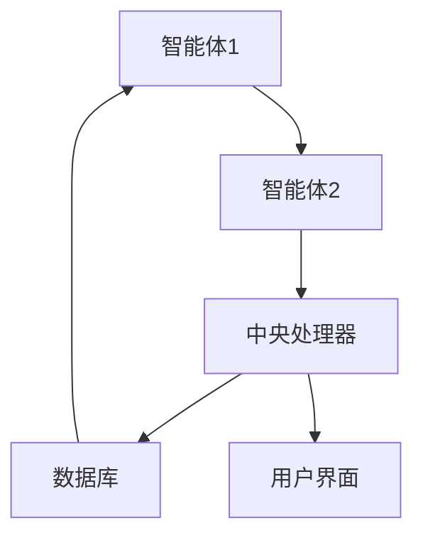

                 


# 运用AI多智能体实现动态估值模型调整

**关键词**：AI多智能体、动态估值模型、分布式系统、协同优化、实时调整

**摘要**：  
本文探讨了如何利用AI多智能体技术实现动态估值模型的实时调整。通过分析传统估值模型的局限性，提出了一种基于多智能体协作的动态估值方法，结合数学建模和算法优化，构建了一个高效、灵活的动态估值系统。文章详细介绍了AI多智能体的基本原理、动态估值模型的数学基础、系统架构设计以及实际应用案例，为读者提供了一套完整的解决方案。

---

## 第一部分：AI多智能体与动态估值模型概述

### 第1章：问题背景与核心概念

#### 1.1 问题背景
- 传统估值模型在动态环境下缺乏灵活性，难以应对实时变化的数据和环境。
- 多智能体系统通过分布式计算和协作优化，能够有效处理复杂动态环境中的估值问题。
- 本文提出一种基于AI多智能体的动态估值模型，结合实时数据和多智能体协作，实现动态调整。

#### 1.2 问题描述
- 动态估值模型的核心目标是实时更新估值结果，适应环境变化。
- 多智能体协作的必要性在于通过分布式计算和协同优化，提高估值的准确性和效率。
- 问题的边界包括数据来源、调整频率和智能体间的通信机制。

#### 1.3 核心概念与联系
- **AI多智能体**：由多个智能体组成，每个智能体负责特定任务，通过通信协作完成整体目标。
- **动态估值模型**：根据实时数据和环境变化，动态调整估值参数和权重。
- 两者关系：AI多智能体提供分布式计算和协作机制，动态估值模型提供动态调整方法，共同实现高效估值。

---

## 第二部分：AI多智能体与动态估值模型的核心原理

### 第2章：AI多智能体的原理与实现

#### 2.1 AI多智能体的基本原理
- **组成与功能**：由多个智能体组成，每个智能体负责特定任务，如数据采集、计算和反馈。
- **通信协作**：智能体之间通过消息传递机制协作，确保数据同步和任务分配。
- **决策机制**：基于本地数据和全局信息，智能体做出决策并更新估值。

#### 2.2 动态估值模型的数学基础
- **动态估值公式**：$$ V(t) = \sum_{i=1}^{n} w_i(t) \cdot x_i(t) $$
  其中，$w_i(t)$ 是第 $i$ 个特征的权重，$x_i(t)$ 是第 $i$ 个特征的值。
- **动态权重调整**：基于反馈机制，权重随时间动态调整。
- **优化算法**：使用梯度下降或遗传算法优化权重和模型参数。

#### 2.3 核心概念对比表
| 概念 | 属性 | 描述 |
|------|------|------|
| AI多智能体 | 分布式 | 多个智能体协同工作 |
| 动态估值模型 | 时间依赖性 | 随时间变化的估值 |

---

### 第3章：动态估值模型的算法实现

#### 3.1 多智能体协作算法
- **分布式计算流程**：智能体之间协同完成数据采集、计算和反馈。
- **通信协议**：定义消息格式和传输机制，确保智能体间高效通信。
- **任务分配策略**：基于负载均衡和任务优先级分配任务。

#### 3.2 动态调整算法
- **反馈机制**：根据实时数据和评估结果调整权重。
- **实时更新**：动态调整模型参数，确保估值的准确性。
- **稳定性与收敛性**：通过优化算法确保模型在动态变化中保持稳定。

---

## 第三部分：系统分析与架构设计

### 第4章：系统架构设计

#### 4.1 项目背景
- 系统目标：实现动态估值模型的实时调整，提高估值的准确性和效率。
- 项目需求：支持多智能体协作、实时数据处理和动态调整。

#### 4.2 系统功能设计
- **数据采集**：智能体实时采集数据并传递给中央处理器。
- **计算与调整**：中央处理器根据数据调整模型参数并反馈给智能体。
- **输出结果**：智能体将调整后的估值结果返回给用户或系统。

#### 4.3 系统架构图（Mermaid）


---

## 第四部分：项目实战

### 第5章：项目实战

#### 5.1 环境安装
- **安装依赖**：安装Python、numpy、scipy等库。
- **配置环境**：设置多智能体通信的网络环境。

#### 5.2 核心代码实现
```python
import numpy as np

class Agent:
    def __init__(self, id, data_source):
        self.id = id
        self.data_source = data_source
        self.model = Model()

    def collect_data(self):
        return self.data_source.get_data()

    def compute(self, weights):
        data = self.collect_data()
        return np.dot(data, weights)

class Model:
    def __init__(self):
        self.weights = np.random.rand(10, 1)

    def update_weights(self, feedback):
        self.weights += feedback
```

#### 5.3 案例分析
- **案例背景**：实时股票价格预测。
- **数据来源**：多个智能体分别采集不同市场的数据。
- **动态调整**：根据市场变化实时调整权重，提高预测准确性。

---

## 第五部分：最佳实践

### 第6章：最佳实践

#### 6.1 小结
- AI多智能体与动态估值模型结合，能够高效应对动态环境中的估值问题。
- 通过分布式计算和协作优化，提高了系统的实时性和准确性。

#### 6.2 注意事项
- 数据同步：确保智能体之间的数据一致性。
- 网络延迟：考虑网络延迟对实时性的影响。
- 安全性：确保智能体间通信的安全性。

#### 6.3 拓展阅读
- 推荐阅读《Multi-Agent Systems》和《Dynamic Systems Modeling》。

---

**作者：AI天才研究院 & 禅与计算机程序设计艺术**

