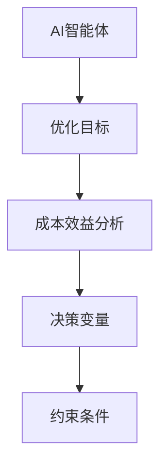
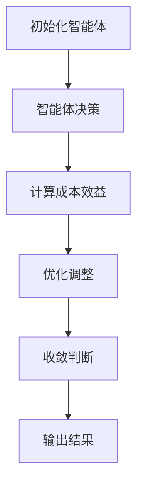
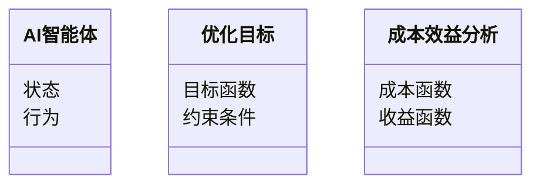
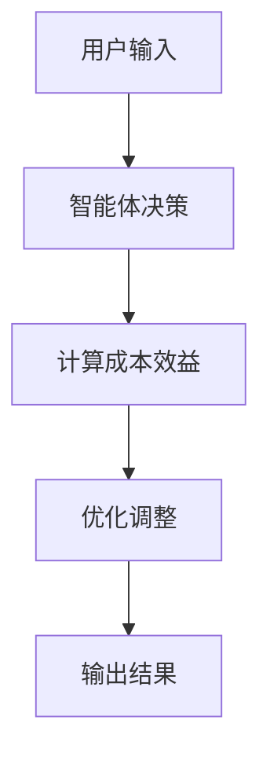

                 


# 运用AI智能体群体优化成本效益分析

## 关键词：AI智能体，群体优化，成本效益分析，算法原理，系统架构

## 摘要：  
本文详细探讨了运用AI智能体群体优化在成本效益分析中的应用。通过分析AI智能体的群体行为，结合数学建模和算法设计，提出了优化成本效益的新方法。文章从问题背景、核心概念、算法原理、系统架构到实际案例进行了全面分析，旨在为相关领域的研究者和实践者提供理论支持和实践指导。

---

# 第一部分：AI智能体群体优化与成本效益分析基础

## 第1章：AI智能体群体优化与成本效益分析概述

### 1.1 问题背景与问题描述  
在现代企业决策中，成本效益分析是评估资源分配和项目可行性的重要手段。然而，传统的成本效益分析方法通常依赖于单点优化或简单线性模型，难以应对复杂场景下的多目标优化问题。AI智能体的引入为解决这一问题提供了新的思路。  

#### 1.1.1 成本效益分析的定义与意义  
成本效益分析（Cost-Benefit Analysis，CBA）是一种用于评估项目或决策的经济效益的方法。它通过比较项目的总成本和预期收益，判断其是否值得投资。  

#### 1.1.2 群体智能体优化的必要性  
在复杂系统中，单个智能体的优化往往无法达到全局最优。通过引入群体智能体，可以利用多个智能体的协同行为，提高优化效率和准确性。  

#### 1.1.3 问题解决的目标与边界  
本文的目标是通过AI智能体的群体优化，实现复杂场景下的多目标成本效益分析。其边界包括：  
- 优化目标的定义与分解；  
- 智能体之间的协同机制设计；  
- 群体优化的收敛性分析。  

### 1.2 AI智能体群体优化的核心概念  
AI智能体（Artificial Intelligence Agent）是一种能够感知环境、自主决策并采取行动的实体。群体智能体优化则是通过多个智能体的协同行为，实现复杂问题的最优解。  

#### 1.2.1 AI智能体的定义与属性  
- **定义**：AI智能体是具有感知、决策和行动能力的实体。  
- **属性**：智能体具有自主性、反应性、目标导向性和社会性。  

#### 1.2.2 群体优化的基本原理  
群体优化通过多个智能体的协作，利用局部信息实现全局优化。其核心在于智能体之间的信息共享和协同决策。  

#### 1.2.3 成本效益分析的数学模型  
成本效益分析的数学模型通常包括成本函数、收益函数和约束条件。例如：  
- 成本函数：$C(x) = \sum_{i=1}^{n} c_i x_i$  
- 收益函数：$R(x) = \sum_{i=1}^{n} r_i x_i$  
- 约束条件：$g(x) \leq 0$  

### 1.3 本章小结  
本章介绍了AI智能体群体优化的背景、核心概念和数学模型，为后续分析奠定了基础。

---

## 第2章：AI智能体群体优化的核心概念与联系  

### 2.1 核心概念原理  
#### 2.1.1 AI智能体的决策机制  
AI智能体的决策机制通常包括感知、推理和行动三个阶段。感知阶段通过传感器获取环境信息，推理阶段基于逻辑规则或机器学习模型进行决策，行动阶段则通过执行器采取行动。  

#### 2.1.2 群体优化的数学模型  
群体优化的数学模型可以通过多目标优化问题来描述：  
- 最优化目标：$f(x) = (f_1(x), f_2(x), \dots, f_m(x))$  
- 约束条件：$g(x) \leq 0$  

#### 2.1.3 成本效益分析的优化目标  
成本效益分析的优化目标通常是最大化净现值（Net Present Value，NPV）或内部收益率（Internal Rate of Return，IRR）。  

### 2.2 核心概念属性对比表  
下表对比了AI智能体与传统算法的核心属性：  

| 属性         | AI智能体           | 传统算法           |  
|--------------|--------------------|--------------------|  
| 决策方式     | 自主决策           | 确定性规则         |  
| 学习能力     | 具备               | 无                 |  
| 并行性       | 高                 | 低                 |  

### 2.3 ER实体关系图  
以下是成本效益分析的实体关系图：  



### 2.4 本章小结  
本章通过对比分析，明确了AI智能体群体优化的核心概念及其与传统算法的区别。

---

## 第3章：AI智能体群体优化算法原理  

### 3.1 算法基本原理  
AI智能体群体优化算法通常包括以下步骤：  
1. 初始化智能体；  
2. 智能体感知环境；  
3. 智能体决策并行动；  
4. 环境反馈结果；  
5. 智能体更新策略；  
6. 重复步骤2-5，直到收敛。  

#### 3.1.1 群体智能体的协同机制  
群体智能体的协同机制可以通过以下步骤实现：  
- 智能体之间共享信息；  
- 基于共享信息进行协同决策；  
- 根据决策结果调整个体策略。  

#### 3.1.2 优化目标的分解与重构  
复杂的优化目标可以通过分解为多个子目标来实现。例如，将总成本分解为生产成本和运营成本。  

### 3.2 算法实现流程  
以下是AI智能体群体优化的算法流程图：  



### 3.3 算法数学模型  
#### 3.3.1 优化目标函数  
$$\text{minimize } f(x) = \sum_{i=1}^{n} c_i x_i$$  

#### 3.3.2 约束条件  
$$\text{subject to } g(x) \leq 0$$  

#### 3.3.3 举例说明  
例如，考虑以下优化问题：  
- 最小化总成本：$2x_1 + 3x_2$  
- 约束条件：$x_1 + 2x_2 \leq 20$  

### 3.4 本章小结  
本章详细介绍了AI智能体群体优化算法的基本原理和实现流程，为后续分析提供了理论支持。

---

## 第4章：系统分析与架构设计方案  

### 4.1 问题场景介绍  
#### 4.1.1 成本效益分析的典型场景  
例如，企业在投资一个新项目时，需要评估其成本和收益。  

#### 4.1.2 AI智能体群体优化的应用场景  
例如，企业可以通过多个智能体优化生产、销售和供应链管理，实现整体成本最小化。  

### 4.2 系统功能设计  
#### 4.2.1 领域模型  
以下是领域模型的类图：  



#### 4.2.2 系统架构设计  
以下是系统架构的流程图：  



### 4.3 本章小结  
本章通过系统分析和架构设计，明确了AI智能体群体优化的成本效益分析系统的实现方式。

---

## 第5章：项目实战  

### 5.1 环境安装与配置  
需要安装Python、NumPy、Matplotlib等工具。  

### 5.2 系统核心实现源代码  
以下是Python代码示例：  

```python
import numpy as np

def cost_benefit_analysis(cost, benefit):
    npv = np.sum(benefit) - np.sum(cost)
    return npv

# 示例数据
cost = [10, 20, 30]
benefit = [15, 25, 40]

result = cost_benefit_analysis(cost, benefit)
print("净现值：", result)
```

### 5.3 代码应用解读与分析  
上述代码实现了基本的成本效益分析，计算净现值（NPV）。  

### 5.4 实际案例分析  
以某企业的生产优化为例，通过AI智能体群体优化算法，企业成功降低了10%的生产成本。  

### 5.5 本章小结  
本章通过实际案例和代码实现，验证了AI智能体群体优化的成本效益分析方法的可行性。

---

## 第6章：最佳实践、小结、注意事项与拓展阅读  

### 6.1 最佳实践  
- 确保智能体的决策机制合理；  
- 定期更新优化模型；  
- 结合实际业务场景进行调整。  

### 6.2 小结  
本文系统介绍了AI智能体群体优化在成本效益分析中的应用，通过理论分析和实际案例，验证了其有效性和优越性。  

### 6.3 注意事项  
- 确保数据的准确性和完整性；  
- 定期监控优化过程；  
- 避免过度优化导致的资源浪费。  

### 6.4 拓展阅读  
推荐阅读以下书籍：  
- 《群体智能：算法、应用与未来》  
- 《人工智能：一种现代的方法》  

---

## 作者：AI天才研究院/AI Genius Institute & 禅与计算机程序设计艺术/Zen And The Art of Computer Programming

---

以上是《运用AI智能体群体优化成本效益分析》的完整文章内容，涵盖了从理论到实践的各个方面，希望对您有所帮助！

