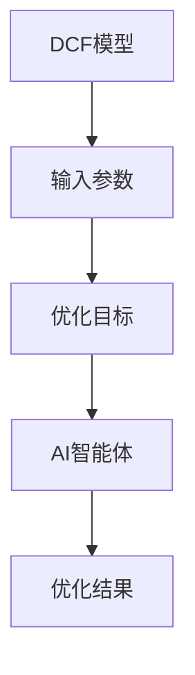
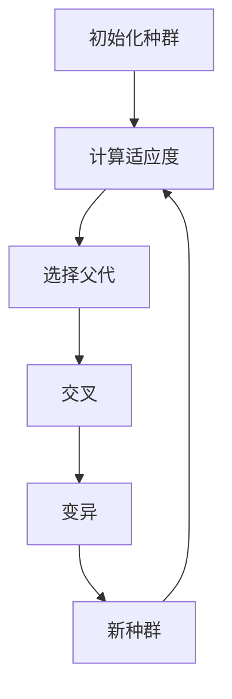
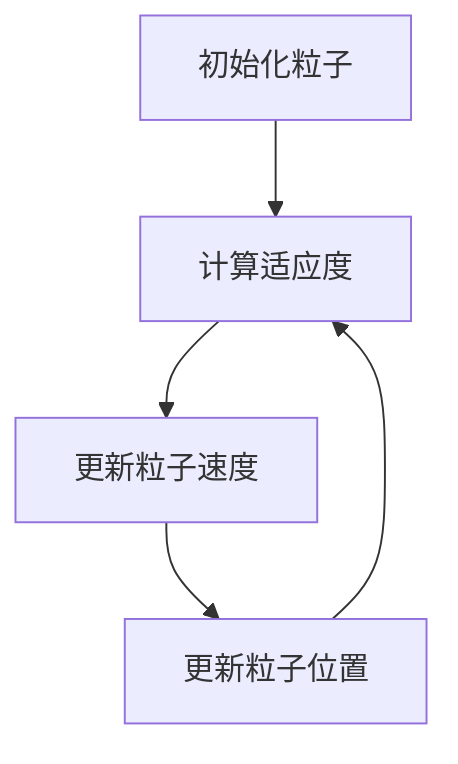
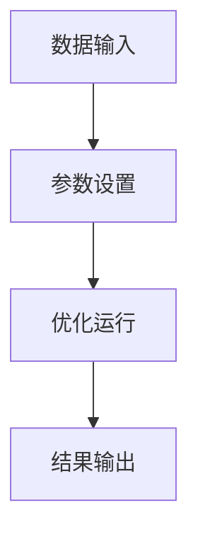
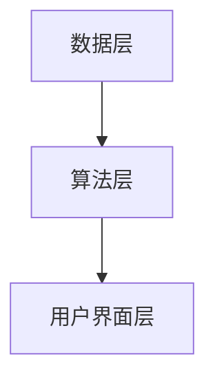
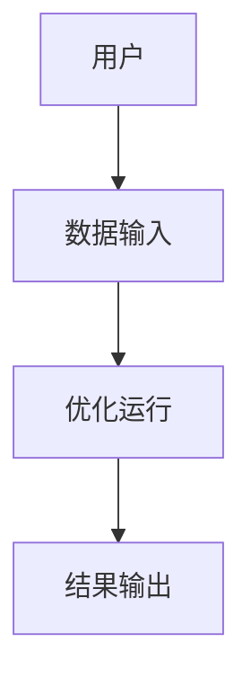

                 


# 运用AI智能体群体优化现金流折现模型

> 关键词：AI智能体，现金流折现模型，群体优化，遗传算法，粒子群优化

> 摘要：本文探讨如何利用AI智能体的群体优化技术来改进现金流折现模型（DCF模型），通过详细分析优化算法、系统设计和实际案例，展示AI技术在金融建模中的应用潜力。

---

## 第1章 现金流折现模型与AI智能体概述

### 1.1 现金流折现模型的基本概念

#### 1.1.1 现金流折现模型的定义
现金流折现模型（DCF模型）是一种评估企业内在价值的方法，通过将未来现金流折现到现值来估算公司价值。模型的核心公式为：

$$ \text{企业价值} = \sum_{t=1}^{n} \frac{CF_t}{(1 + r)^t} $$

其中，$CF_t$ 表示第 $t$ 年的现金流，$r$ 是折现率。

#### 1.1.2 现金流折现模型的核心要素
- **现金流预测**：对未来各期的现金流进行预测，通常包括自由现金流、运营现金流等。
- **折现率**：用于将未来现金流折现到现值的利率，通常基于资本资产定价模型（CAPM）计算。
- **期限**：预测现金流的期限，通常为5年或更长。

#### 1.1.3 现金流折现模型的应用场景
- 公司估值：评估企业整体价值或股权价值。
- 投资决策：判断投资项目是否可行。
- 并购分析：评估收购目标公司的价值。

### 1.2 AI智能体的基本概念

#### 1.2.1 AI智能体的定义
AI智能体（Artificial Intelligence Agent）是指能够感知环境并采取行动以实现目标的智能系统。智能体可以是软件程序，也可以是机器人。

#### 1.2.2 AI智能体的核心特征
- **自主性**：能够自主决策。
- **反应性**：能实时感知环境并做出反应。
- **学习能力**：通过经验改进性能。

#### 1.2.3 AI智能体与传统算法的区别
AI智能体具有自主性和学习能力，能够适应环境变化，而传统算法通常需要手动调整参数。

### 1.3 现金流折现模型优化的背景与意义

#### 1.3.1 现金流折现模型的传统优化方法
传统的DCF模型优化通常依赖试错法，效率低下且容易出错。

#### 1.3.2 AI智能体在DCF模型优化中的优势
- **自动化**：AI智能体可以自动调整参数，提高效率。
- **准确性**：通过优化算法找到更优解，提高模型准确性。
- **适应性**：能够适应数据变化和市场波动。

#### 1.3.3 优化DCF模型的实际应用价值
优化后的DCF模型可以更准确地评估企业价值，帮助投资者做出更明智的决策。

## 第2章 现金流折现模型的结构与AI智能体的属性特征

### 2.1 现金流折现模型的结构

#### 2.1.1 DCF模型的基本公式
$$ V = \sum_{t=1}^{n} \frac{CF_t}{(1 + r)^t} + \frac{TV}{(1 + r)^n} $$

其中，$V$ 是企业价值，$CF_t$ 是第 $t$ 年的现金流，$r$ 是折现率，$TV$ 是终值。

#### 2.1.2 DCF模型的输入参数
- 现金流预测：未来各期的现金流。
- 折现率：基于CAPM计算的无风险利率加上风险溢价。
- 期限：预测现金流的年数。

#### 2.1.3 DCF模型的输出结果
企业价值、股权价值、净现值（NPV）等。

### 2.2 AI智能体的属性特征

#### 2.2.1 AI智能体的学习能力
AI智能体能够通过训练数据学习优化策略，改进其预测能力。

#### 2.2.2 AI智能体的适应性
智能体能够根据环境变化调整其行为，适应不同的数据和市场条件。

#### 2.2.3 AI智能体的协作能力
群体智能体之间可以协作，共享信息，共同优化目标。

### 2.3 现金流折现模型与AI智能体的关系

#### 2.3.1 DCF模型优化中的问题建模
将DCF模型的优化问题转化为一个数学优化问题，目标是最小化或最大化某个函数。

#### 2.3.2 AI智能体在DCF模型优化中的角色
作为优化工具，AI智能体能够高效地搜索最优解。

#### 2.3.3 现金流折现模型优化的流程图（Mermaid）



---

## 第3章 现金流折现模型的数学模型与优化算法

### 3.1 DCF模型的数学模型

#### 3.1.1 DCF模型的公式推导
DCF模型的现值公式推导如下：

$$ V = \sum_{t=1}^{n} \frac{CF_t}{(1 + r)^t} $$

#### 3.1.2 折现率的计算公式
折现率 $r$ 可以基于CAPM模型计算：

$$ r = r_f + \beta (r_m - r_f) $$

其中，$r_f$ 是无风险利率，$\beta$ 是贝塔系数，$r_m$ 是市场预期回报率。

### 3.2 AI优化算法的数学模型

#### 3.2.1 遗传算法（GA）
遗传算法通过选择、交叉和变异操作生成新的解，逐步优化目标函数。

#### 3.2.2 粒子群优化（PSO）
粒子群优化算法通过粒子之间的信息共享，找到全局最优解。

### 3.3 算法原理与流程图

#### 3.3.1 遗传算法流程图（Mermaid）



#### 3.3.2 粒子群优化流程图（Mermaid）



---

## 第4章 系统设计与架构

### 4.1 系统功能设计

#### 4.1.1 功能模块
- 数据输入模块：读取财务数据和市场数据。
- 参数设置模块：设置优化目标和约束条件。
- 优化运行模块：执行AI智能体优化算法。
- 结果输出模块：显示优化结果和分析报告。

#### 4.1.2 功能流程图（Mermaid）



### 4.2 系统架构设计

#### 4.2.1 分层架构
- 数据层：处理输入数据和存储中间结果。
- 算法层：实现优化算法的核心逻辑。
- 用户界面层：提供友好的操作界面。

#### 4.2.2 架构图（Mermaid）



### 4.3 接口设计

#### 4.3.1 数据接口
- 输入接口：接收财务数据和市场数据。
- 输出接口：输出优化结果和分析报告。

#### 4.3.2 API接口
提供RESTful API，方便与其他系统集成。

### 4.4 交互流程图（Mermaid）



---

## 第5章 项目实战与案例分析

### 5.1 项目环境安装

#### 5.1.1 安装Python
```bash
python --version
pip install numpy
pip install matplotlib
pip install pymermaid
```

#### 5.1.2 安装优化库
```bash
pip install DEAP
pip install pygmo
```

### 5.2 核心代码实现

#### 5.2.1 遗传算法实现

```python
import numpy as np
from deap import algorithms, base, tools

# 定义适应度函数
def evaluate(individual):
    r = individual[0]
    # 计算DCF模型价值
    cf = [100, 150, 200, 250, 300]
    npv = sum(cf_t / (1 + r) ** t for t, cf_t in enumerate(cf, start=1))
    return (-npv,)

# 定义遗传算法参数
toolbox = base.Toolbox()
toolbox.register("attr_float", lambda: np.random.uniform(0.05, 0.15))
toolbox.register("individual", base.FloatingPointIndividual, 
                size=1, strategy=tools.SteadyStateStrategy, 
                low=0.05, high=0.15)
toolbox.register("mate", tools.cxBlend, alpha=0.5)
toolbox.register("mut", tools.mutGaussian, sigma=0.02)

# 初始化种群
population = algorithms.initPopulation(toolbox, 100, 1)

# 进行优化
algorithms.eaSimple(population, toolbox, 0.5, 0.2, 100, evaluate)
```

#### 5.2.2 粒子群优化实现

```python
import numpy as np
from pygmo import *

# 定义适应度函数
def fitness(x):
    r = x[0]
    cf = [100, 150, 200, 250, 300]
    npv = sum(cf_t / (1 + r) ** t for t, cf_t in enumerate(cf, start=1))
    return [npv]

# 初始化问题
prob = problem(dimensions=1, fitness=fitness)

# 初始化种群
algo = algorithm(algo=ALGO_PSO, parameters={'w': 0.5, 'k': 2, 'c1': 1, 'c2': 1})

# 进行优化
pop = population(1)
pop = algo.evolve(pop, 100)
best = pop.get_x(0)
```

### 5.3 案例分析

#### 5.3.1 数据准备
使用某公司过去5年的现金流数据，预测未来5年的现金流。

#### 5.3.2 优化过程
通过遗传算法优化折现率，计算出最优的折现率和对应的NPV。

#### 5.3.3 结果分析
展示优化后的NPV值，比较传统方法和AI优化方法的结果差异。

---

## 第6章 最佳实践与小结

### 6.1 最佳实践

#### 6.1.1 算法选择
根据具体问题选择合适的算法，遗传算法适合复杂问题，粒子群优化适合连续优化问题。

#### 6.1.2 数据处理
确保输入数据的准确性和完整性，处理异常值和缺失值。

#### 6.1.3 结果验证
通过多种方法验证优化结果的准确性，如对比传统方法、敏感性分析等。

### 6.2 小结

通过本文的介绍，我们了解了如何利用AI智能体优化现金流折现模型。AI智能体的群体优化技术能够显著提高DCF模型的计算效率和准确性，为金融建模提供了新的思路。

---

## 附录

### 附录A 算法代码示例
- 遗传算法代码
- 粒子群优化代码

### 附录B 参考文献
- DCF模型相关文献
- 群体智能算法相关文献

---

作者：AI天才研究院（AI Genius Institute）

