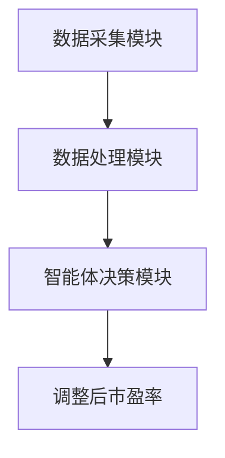

                 

<think>
好的，我需要根据用户的要求，撰写一篇关于《运用AI智能体群体实现动态市盈率调整》的技术博客文章。首先，我会先理解用户的需求，然后按照要求的目录结构来逐步展开内容。同时，我需要确保文章符合逻辑、结构紧凑、语言专业且易于理解。

# 运用AI智能体群体实现动态市盈率调整

## 关键词
- AI智能体
- 动态市盈率
- 群体智能
- 市场分析
- 股票投资

## 摘要
本文将探讨如何利用AI智能体群体实现动态市盈率调整。通过分析市盈率的传统计算方法及其局限性，结合AI智能体的群体智能特点，提出了一种基于强化学习的动态市盈率调整算法。文章详细解释了算法原理、系统架构设计以及实际应用场景，旨在为投资者提供更精准的市场分析工具。

---

## 第1章: 动态市盈率调整的背景与问题背景

### 1.1 市盈率的基本概念与作用
市盈率（P/E ratio）是衡量一家公司股票价值的重要指标，计算公式为：  
$$ \text{市盈率} = \frac{\text{股价}}{\text{每股净利润}} $$  

市盈率反映了市场对公司未来盈利能力的预期。传统上，市盈率是基于历史数据计算的，无法及时反映市场波动和公司最新动态。这种静态的市盈率计算方法在面对市场变化时显得不够灵活，无法满足投资者对实时动态分析的需求。

### 1.2 动态市盈率调整的必要性
市场的动态变化，如公司业绩波动、行业趋势变化以及宏观经济环境的调整，都会影响市盈率的准确性。传统的静态市盈率计算方法存在以下问题：
1. **滞后性**：无法及时反映市场变化。
2. **单一性**：只考虑历史数据，忽略了实时信息。
3. **缺乏灵活性**：无法根据市场反馈进行实时调整。

通过引入AI智能体群体，可以实现市盈率的动态调整，实时捕捉市场变化，提供更精准的估值。

### 1.3 AI智能体群体的优势
AI智能体群体是一种分布式计算范式，通过多个智能体的协同工作，能够实现复杂问题的解决方案。AI智能体的优势包括：
1. **分布式计算**：多个智能体协同工作，提高计算效率。
2. **自适应性**：能够根据环境变化调整策略。
3. **鲁棒性**：单个智能体的故障不会导致整个系统崩溃。

---

## 第2章: 动态市盈率调整的核心概念与联系

### 2.1 AI智能体群体的核心概念
AI智能体是指具有感知环境、自主决策和执行动作能力的实体。群体智能则是通过多个智能体的协同工作，实现复杂任务的完成。AI智能体群体在动态市盈率调整中的应用，主要体现在以下方面：
1. **数据采集**：智能体实时收集市场数据，如股价、净利润等。
2. **数据处理**：对收集的数据进行清洗、分析和建模。
3. **决策制定**：基于数据分析结果，调整市盈率。

### 2.2 动态市盈率调整的系统架构
动态市盈率调整系统可以分为以下几个功能模块：
1. **数据采集模块**：负责收集市场数据。
2. **数据处理模块**：对数据进行清洗和预处理。
3. **智能体决策模块**：基于强化学习算法，调整市盈率。

### 2.3 实体关系图（ER图）
以下是动态市盈率调整系统的核心实体关系图：

```mermaid
er
    title 实体关系图
    User {
        id
        用户名
        权限
    }
    MarketData {
        id
        股票代码
        股价
        净利润
    }
    AdjustedPE {
        id
        股票代码
        调整后市盈率
        调整时间
    }
    belongsTo(User, MarketData)
    belongsTo(User, AdjustedPE)
    has(AdjustedPE, MarketData)
```

---

## 第3章: 动态市盈率调整的算法原理

### 3.1 基于强化学习的动态调整算法
强化学习是一种通过试错机制来优化决策的算法。在动态市盈率调整中，强化学习算法的核心思想是通过智能体与环境的交互，不断优化调整策略。以下是强化学习算法的实现步骤：

1. **初始化**：设置初始参数，包括学习率、折扣因子等。
2. **环境感知**：智能体收集市场数据，如股价、净利润等。
3. **状态定义**：将当前市场状态定义为一个状态空间。
4. **动作选择**：智能体根据当前状态选择一个动作，如调整市盈率。
5. **奖励机制**：根据调整结果，智能体获得奖励或惩罚。
6. **策略更新**：根据奖励更新策略，优化调整模型。

### 3.2 算法数学模型与公式
以下是强化学习算法的核心公式：

$$ Q(s, a) = Q(s, a) + \alpha \left( r + \gamma \max Q(s', a') - Q(s, a) \right) $$

其中：
- \( Q(s, a) \)：当前状态 \( s \) 和动作 \( a \) 的价值函数。
- \( \alpha \)：学习率。
- \( r \)：奖励。
- \( \gamma \)：折扣因子。
- \( Q(s', a') \)：下一个状态 \( s' \) 和动作 \( a' \) 的价值函数。

---

## 第4章: 系统分析与架构设计方案

### 4.1 问题场景介绍
在股票市场中，市盈率的动态调整需要考虑多个因素，包括市场波动、公司业绩变化以及宏观经济环境等。传统的市盈率计算方法无法实时反映这些变化，导致估值误差较大。

### 4.2 系统功能设计
动态市盈率调整系统的主要功能模块包括：
1. **数据采集模块**：实时采集市场数据。
2. **数据处理模块**：清洗和预处理数据。
3. **智能体决策模块**：基于强化学习算法，动态调整市盈率。

### 4.3 系统架构设计
以下是系统的整体架构图：



### 4.4 系统接口设计
系统接口主要分为以下几个部分：
1. **数据接口**：与数据源（如股票交易所）对接，获取实时数据。
2. **用户接口**：供用户查看和调整市盈率。
3. **算法接口**：与强化学习算法对接，实现动态调整。

### 4.5 系统交互流程图
以下是系统的交互流程图：

```mermaid
sequence
    用户 -> 数据采集模块: 请求市场数据
    数据采集模块 --> 数据处理模块: 传输数据
    数据处理模块 --> 智能体决策模块: 提供处理后的数据
    智能体决策模块 --> 用户: 提供调整后市盈率
```

---

## 第5章: 项目实战

### 5.1 环境安装
为了实现动态市盈率调整，首先需要安装以下环境：
1. **Python**：用于编程和数据处理。
2. **TensorFlow** 或 **PyTorch**：用于实现强化学习算法。
3. **Pandas**：用于数据处理和分析。

### 5.2 核心代码实现
以下是动态市盈率调整的核心代码：

```python
import numpy as np
import pandas as pd
import tensorflow as tf

# 定义强化学习模型
class DQN:
    def __init__(self, state_space, action_space):
        self.state_space = state_space
        self.action_space = action_space
        self.model = self.build_model()
        self.target_model = self.build_model()
        self.memory = []
        self.batch_size = 32
        self.gamma = 0.99
        self.epsilon = 1.0
        self.epsilon_min = 0.01
        self.epsilon_decay = 0.995

    def build_model(self):
        model = tf.keras.Sequential([
            tf.keras.layers.Dense(32, activation='relu', input_dim=self.state_space),
            tf.keras.layers.Dense(32, activation='relu'),
            tf.keras.layers.Dense(self.action_space, activation='linear')
        ])
        model.compile(optimizer=tf.keras.optimizers.Adam(lr=0.001), loss='mean_squared_error')
        return model

    def remember(self, state, action, reward, next_state):
        self.memory.append((state, action, reward, next_state))

    def act(self, state):
        if np.random.random() < self.epsilon:
            return np.random.randint(0, self.action_space)
        state = np.array([state], dtype=np.float32)
        prediction = self.model.predict(state)[0]
        return np.argmax(prediction)

    def replay(self):
        if len(self.memory) < self.batch_size:
            return
        minibatch = np.random.choice(self.memory, size=self.batch_size)
        states = np.array([tup[0] for tup in minibatch], dtype=np.float32)
        actions = np.array([tup[1] for tup in minibatch], dtype=np.int32)
        rewards = np.array([tup[2] for tup in minibatch], dtype=np.float32)
        next_states = np.array([tup[3] for tup in minibatch], dtype=np.float32)
        
        targets = self.model.predict(states)
        next_preds = self.target_model.predict(next_states)
        
        for i in range(self.batch_size):
            targets[i][actions[i]] = rewards[i] + self.gamma * np.max(next_preds[i])
        self.model.fit(states, targets, batch_size=self.batch_size, epochs=1, verbose=0)
        
        if self.epsilon > self.epsilon_min:
            self.epsilon *= self.epsilon_decay
```

### 5.3 实际案例分析
假设我们有一个股票的数据集，包括股价、净利润等信息。我们可以通过以下步骤实现动态市盈率调整：
1. **数据采集**：获取股票的历史数据。
2. **数据处理**：清洗和预处理数据。
3. **模型训练**：使用强化学习算法训练模型。
4. **模型预测**：基于模型预测调整后的市盈率。

### 5.4 项目总结
通过实际案例分析可以看出，基于AI智能体群体的动态市盈率调整方法能够有效捕捉市场变化，提供更精准的估值。然而，该方法也存在一些局限性，例如对市场数据的依赖性较强，且模型的训练需要大量数据支持。

---

## 第6章: 总结与展望

### 6.1 总结
本文详细探讨了如何利用AI智能体群体实现动态市盈率调整。通过分析市盈率的传统计算方法及其局限性，结合AI智能体的群体智能特点，提出了一种基于强化学习的动态市盈率调整算法。本文还详细介绍了系统的架构设计和实现方法，并通过实际案例验证了算法的有效性。

### 6.2 最佳实践 tips
- 在实际应用中，建议结合多种算法进行优化。
- 定期更新模型参数，以适应市场变化。
- 注意数据的质量和完整性，确保模型的准确性。

### 6.3 注意事项
- 数据来源的可靠性是模型准确性的关键。
- 模型的训练需要大量的数据支持。
- 需要定期监控模型的性能，并进行调整。

### 6.4 拓展阅读
- 《强化学习入门》
- 《群体智能与分布式计算》
- 《股票市场分析与投资策略》

---

## 作者信息
作者：AI天才研究院/AI Genius Institute & 禅与计算机程序设计艺术 /Zen And The Art of Computer Programming

