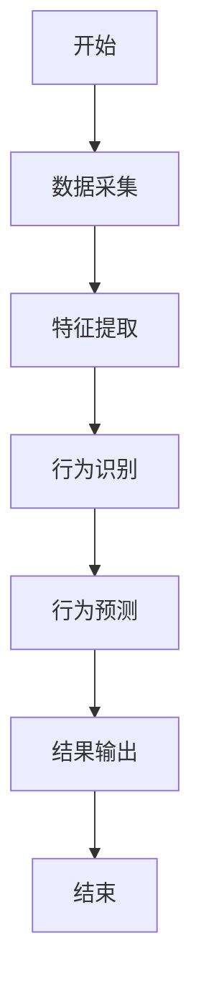
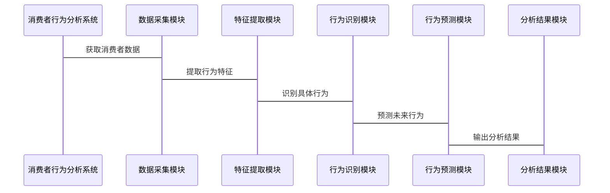

                 


# 运用AI智能体群体实现动态消费者行为分析

> 关键词：AI智能体群体，动态消费者行为，行为分析，算法原理，系统架构

> 摘要：本文详细探讨了如何利用AI智能体群体来分析消费者的动态行为。通过系统化的分析和算法设计，结合实际案例，展示了如何构建高效的行为分析系统，帮助企业在复杂市场环境中做出更明智的决策。

---

# 第1章: 动态消费者行为分析的背景与问题

## 1.1 智能体群体的概念与特点

### 1.1.1 智能体的定义与核心属性

- **智能体（Agent）**：智能体是指能够感知环境、自主决策并采取行动的实体。其核心属性包括：
  - **自主性**：无需外部干预，自主决策。
  - **反应性**：能够实时感知环境变化并做出反应。
  - **目标导向性**：具有明确的目标，行为围绕目标展开。
  - **社交能力**：能够与其他智能体或系统进行交互和协作。

### 1.1.2 智能体群体的形成与特征

- **群体智能**：多个智能体通过协作实现比个体更复杂目标的智能形式。
- **群体特征**：
  - 分布式：智能体独立运行，通过通信协作。
  - 自适应：能够根据环境变化动态调整行为。
  - 高效性：群体智能往往比个体智能在某些任务上表现更优。

### 1.1.3 智能体群体与消费者行为的关系

- **消费者行为**：消费者在购买过程中的决策、选择和互动。
- **智能体群体的作用**：模拟消费者行为，分析其模式和趋势，帮助预测和优化市场策略。

## 1.2 动态消费者行为分析的背景

### 1.2.1 消费者行为分析的传统方法

- **传统方法**：基于统计分析、问卷调查、焦点小组等。
- **局限性**：难以捕捉实时动态变化，分析结果滞后。

### 1.2.2 动态消费者行为的复杂性

- **动态性**：消费者行为受多种因素影响，实时变化。
- **多样性**：个体差异大，行为模式复杂。
- **数据量**：需要处理海量实时数据。

### 1.2.3 AI智能体群体在行为分析中的优势

- **实时性**：能够实时感知和分析消费者行为。
- **准确性**：通过群体协作提高分析结果的准确性。
- **适应性**：能够快速适应市场环境的变化。

## 1.3 问题描述与目标

### 1.3.1 动态消费者行为分析的核心问题

- 如何实时捕捉消费者行为数据？
- 如何高效分析消费者行为模式？
- 如何利用分析结果优化市场策略？

### 1.3.2 智能体群体在行为分析中的应用目标

- 构建动态消费者行为分析模型。
- 提供实时行为洞察和预测。
- 支持企业制定动态市场策略。

### 1.3.3 问题的边界与外延

- **边界**：仅关注消费者行为分析，不涉及生产或供应链。
- **外延**：可扩展至其他领域的行为分析，如社交网络行为。

## 1.4 核心概念与联系

### 1.4.1 智能体群体与消费者行为的实体关系图

```mermaid
er
actor: 消费者
actor -[1..n]-> action: 行为动作
action -[1]-> context: 行为场景
action -[1]-> feature: 行为特征
```

---

# 第2章: AI智能体群体的行为分析算法原理

## 2.1 智能体行为分析的核心算法

### 2.1.1 基于规则的智能体行为分析

- **规则定义**：根据预定义规则识别行为。
- **优点**：简单易懂，适用于规则明确的场景。
- **缺点**：难以应对复杂多变的场景。

### 2.1.2 基于学习的智能体行为分析

- **机器学习模型**：如决策树、随机森林、神经网络等。
- **监督学习**：基于标注数据训练分类器。
- **无监督学习**：发现数据中的隐含模式。

### 2.1.3 混合型智能体行为分析

- **结合规则与学习**：利用规则处理明确场景，机器学习应对复杂情况。
- **优势**：灵活性高，适应性强。

## 2.2 算法流程图



## 2.3 算法实现代码示例

```python
def behavior_analysis(data):
    # 特征提取
    features = extract_features(data)
    # 行为识别
    recognized = recognize_behavior(features)
    # 行为预测
    prediction = predict_next_behavior(recognized)
    return prediction
```

## 2.4 数学模型与公式

### 2.4.1 行为识别模型

$$ P(B|D) = \frac{P(D|B)P(B)}{P(D)} $$

其中：
- \( P(B|D) \) 是在数据 \( D \) 下行为 \( B \) 的概率。
- \( P(D|B) \) 是行为 \( B \) 产生的数据 \( D \) 的概率。
- \( P(B) \) 是行为 \( B \) 的先验概率。
- \( P(D) \) 是数据 \( D \) 的全概率。

---

# 第3章: 系统分析与架构设计

## 3.1 问题场景介绍

### 3.1.1 需求分析

- **目标**：实时分析消费者行为，提供动态洞察。
- **用户角色**：企业市场部门、数据分析师。
- **核心需求**：实时性、准确性、可扩展性。

## 3.2 系统功能设计

### 3.2.1 领域模型

```mermaid
classDiagram
    class 消费者行为分析系统 {
        +消费者数据
        +行为特征
        +行为预测模型
        +分析结果
    }
    class 智能体 {
        +行为规则
        +学习模型
        +交互接口
    }
    消费者行为分析系统 -->> 智能体: 使用智能体进行分析
```

### 3.2.2 系统架构设计


## 3.3 系统接口设计

### 3.3.1 接口定义

- **输入接口**：消费者行为数据流。
- **输出接口**：行为分析结果，预测报告。

### 3.3.2 交互流程



---

# 第4章: 项目实战

## 4.1 环境安装与配置

### 4.1.1 系统环境

- **操作系统**：Linux/Windows/MacOS
- **开发工具**：Python, PyCharm, Jupyter Notebook
- **依赖库**：NumPy, Pandas, Scikit-learn, TensorFlow

### 4.1.2 安装命令

```bash
pip install numpy pandas scikit-learn tensorflow
```

## 4.2 系统核心实现

### 4.2.1 数据采集模块

```python
import pandas as pd

def collect_data():
    # 从数据库或API获取数据
    data = pd.read_csv('consumer_behavior.csv')
    return data
```

### 4.2.2 特征提取模块

```python
def extract_features(data):
    # 提取行为特征，如时间戳、行为类型、用户ID等
    features = data[['timestamp', 'action_type', 'user_id']]
    return features
```

### 4.2.3 行为识别模块

```python
from sklearn.tree import DecisionTreeClassifier

def recognize_behavior(features):
    # 训练行为识别模型
    model = DecisionTreeClassifier()
    model.fit(features, labels)
    return model.predict(new_features)
```

## 4.3 案例分析与解读

### 4.3.1 实际案例

- **案例背景**：某电商平台的消费者行为分析。
- **数据分析结果**：识别出高峰购物时段，预测未来销售趋势。

---

# 第5章: 最佳实践与小结

## 5.1 小结

- **总结**：通过AI智能体群体实现动态消费者行为分析，能够实时捕捉和分析消费者行为，为企业提供精准的市场洞察。
- **优势**：实时性、准确性、灵活性。

## 5.2 注意事项

- **数据隐私**：确保消费者数据的隐私和安全。
- **模型更新**：定期更新模型以适应市场变化。
- **性能优化**：优化系统性能，确保实时分析能力。

## 5.3 扩展阅读

- 推荐阅读相关书籍和论文，深入学习AI智能体和行为分析的知识。

---

# 作者：AI天才研究院 & 禅与计算机程序设计艺术

