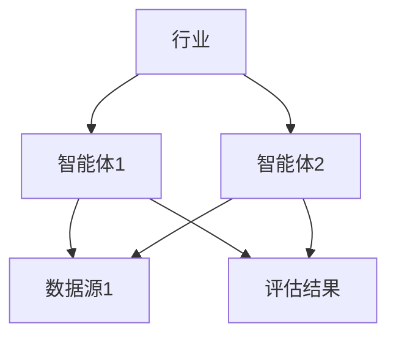
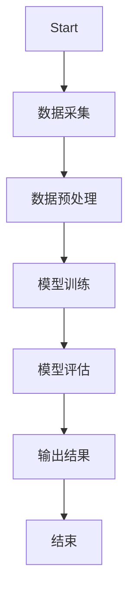
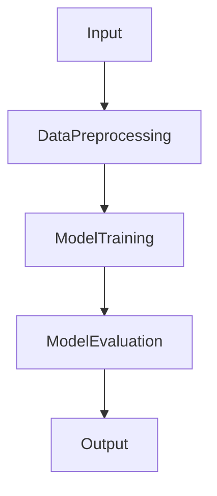
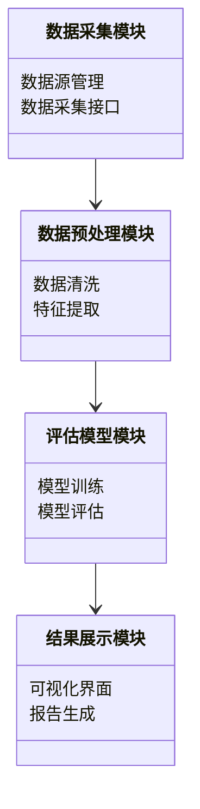

                 


# 运用AI智能体群体实现动态行业吸引力评估

> 关键词：AI智能体，行业吸引力，动态评估，群体智能，算法原理

> 摘要：本文详细探讨了如何利用AI智能体群体实现动态行业吸引力评估。通过分析传统评估方法的局限性，提出了基于群体智能的新方法，结合算法原理和系统架构设计，展示了如何在实际场景中应用该方法。文章从背景介绍、核心概念、算法实现、系统设计到项目实战，层层深入，为读者提供了全面的技术解析。

---

# 第一部分：背景介绍与核心概念

## 第1章：动态行业吸引力评估的背景与问题描述

### 1.1 问题背景

#### 1.1.1 行业吸引力评估的传统方法与局限性
传统的行业吸引力评估方法通常基于静态数据，例如行业市场规模、增长率、竞争程度等。这些方法往往忽略了市场的动态变化，难以捕捉行业吸引力的实时波动。此外，单一的评估模型难以适应不同行业的复杂性和多样性。

#### 1.1.2 AI智能体在动态评估中的优势
AI智能体具有学习、推理和自适应能力，能够实时收集和处理多源数据，提供动态的评估结果。通过构建智能体群体，可以实现对行业吸引力的多维度、多层次评估，显著提高了评估的准确性和实时性。

#### 1.1.3 当前行业吸引力评估的主要挑战
当前的挑战包括数据的实时性与多样性、模型的可解释性、智能体之间的协同与竞争机制等。此外，如何在复杂动态环境中实现高效的群体智能协作，仍是一个开放性问题。

### 1.2 问题描述

#### 1.2.1 动态行业吸引力评估的核心目标
动态行业吸引力评估的核心目标是实时捕捉行业吸引力的变化趋势，提供精准的动态评估结果，为企业决策提供支持。

#### 1.2.2 评估指标与数据来源
评估指标包括市场规模、增长率、竞争程度、政策环境、技术发展等。数据来源包括行业报告、新闻资讯、社交媒体、企业财报等。

#### 1.2.3 问题解决的边界与外延
本文主要聚焦于行业吸引力的动态评估，不涉及具体的企业战略制定，但评估结果可为战略制定提供重要参考。

### 1.3 核心概念与要素

#### 1.3.1 AI智能体的定义与特征
AI智能体是一种能够感知环境、做出决策并执行动作的实体，具有自主性、反应性、目标导向性和社会性等特征。

#### 1.3.2 行业吸引力的评估维度
评估维度包括市场潜力、竞争强度、政策支持、技术创新、资源禀赋等。

#### 1.3.3 动态评估的核心要素与关系
动态评估的核心要素包括时间维度、空间维度、数据源和智能体协作机制。智能体之间的协作关系是动态评估的关键。

---

## 第2章：AI智能体群体与动态评估的核心概念

### 2.1 AI智能体群体的定义与特点

#### 2.1.1 单个AI智能体的功能与能力
单个智能体具有数据采集、特征提取、模型训练、决策推理等功能。

#### 2.1.2 智能体群体的协作机制
智能体群体通过通信协议进行信息共享和协同决策，形成群体智能。

#### 2.1.3 群体智能的优势与局限性
优势包括分布式计算能力、容错性和鲁棒性；局限性包括通信开销和协同难度。

### 2.2 动态行业吸引力评估的原理

#### 2.2.1 动态评估的基本原理
通过实时数据采集和智能体协作，动态更新行业吸引力评估结果。

#### 2.2.2 行业吸引力的动态变化机制
行业吸引力受市场、政策、技术等因素影响，呈动态变化趋势。

#### 2.2.3 智能体群体的协同评估过程
智能体群体通过分工协作，分别完成数据处理、模型训练和结果整合。

### 2.3 核心概念的对比分析

#### 2.3.1 静态评估与动态评估的对比
| 评估维度 | 静态评估 | 动态评估 |
|----------|----------|----------|
| 时间维度 | 静态 | 动态 |
| 数据来源 | 历史数据 | 实时数据 |
| 结果更新 | 定期更新 | 实时更新 |

#### 2.3.2 单一智能体与群体智能的对比
| 比较维度 | 单一智能体 | 群体智能 |
|----------|----------|----------|
| 处理能力 | 单一任务 | 多任务协作 |
| 稳定性 | 易受单点故障影响 | 高冗余性，可靠性高 |
| 学习能力 | 个体学习 | 群体学习 |

#### 2.3.3 传统评估方法与AI驱动方法的对比
| 比较维度 | 传统评估 | AI驱动评估 |
|----------|----------|----------|
| 数据处理 | 离线处理 | 实时处理 |
| 模型复杂度 | 简单模型 | 复杂模型 |
| 可扩展性 | 较低 | 较高 |

### 2.4 实体关系图（Mermaid）



---

## 第3章：AI智能体群体与动态评估的关系

### 3.1 AI智能体群体的协作模型

#### 3.1.1 智能体之间的通信机制
智能体之间通过消息队列或事件总线进行通信，共享数据和协同决策。

#### 3.1.2 群体智能的自适应能力
群体智能能够根据环境变化自适应调整协作策略。

#### 3.1.3 智能体群体的分工与协作
智能体根据任务分工，分别承担数据采集、特征提取、模型训练等任务。

### 3.2 动态行业吸引力评估的协同过程

#### 3.2.1 数据采集与预处理
智能体从多源数据中采集行业相关信息，进行数据清洗和特征提取。

#### 3.2.2 模型训练与评估
智能体群体协作训练评估模型，动态更新模型参数。

#### 3.2.3 结果整合与输出
智能体将评估结果整合，输出最终的动态行业吸引力评估报告。

### 3.3 动态评估的流程图（Mermaid）



---

# 第二部分：算法原理与实现

## 第4章：动态行业吸引力评估的算法原理

### 4.1 问题建模

#### 4.1.1 数据流图（Mermaid）



#### 4.1.2 数据预处理
- 数据清洗：去除噪声数据。
- 特征提取：提取关键特征，如市场规模增长率、竞争程度等。

#### 4.1.3 模型训练
- 使用机器学习算法，如随机森林、XGBoost等，训练评估模型。

### 4.2 数学模型

#### 4.2.1 时间序列分析模型
使用ARIMA模型预测行业吸引力的变化趋势。

$$ ARIMA(p, d, q) $$

其中，p为自回归阶数，d为差分阶数，q为移动平均阶数。

#### 4.2.2 自适应评估模型
构建自适应评估模型，动态调整评估权重。

$$ w_i = \alpha \cdot w_{i-1} + (1-\alpha) \cdot f(x_i) $$

其中，$\alpha$为学习率，$f(x_i)$为当前评估函数。

### 4.3 算法实现

#### 4.3.1 核心代码实现
```python
def dynamic吸引力评估():
    数据采集()
    数据预处理()
    模型训练()
    模型评估()
    输出结果()
```

#### 4.3.2 代码解读
- `数据采集()`: 从多源数据源采集行业相关信息。
- `数据预处理()`: 清洗数据并提取特征。
- `模型训练()`: 使用机器学习算法训练评估模型。
- `模型评估()`: 验证模型性能并调整参数。
- `输出结果()`: 输出动态行业吸引力评估结果。

### 4.4 实际案例分析

#### 4.4.1 案例背景
以科技行业为例，分析其吸引力的动态变化。

#### 4.4.2 数据来源
- 科技行业市场规模数据
- 行业竞争格局数据
- 政策环境数据

#### 4.4.3 模型应用
使用ARIMA模型预测科技行业的未来吸引力趋势。

---

## 第5章：系统分析与架构设计

### 5.1 应用场景介绍

#### 5.1.1 实时监控
实时监控行业吸引力变化，支持企业快速决策。

#### 5.1.2 竞争分析
分析竞争对手的动态，制定竞争策略。

#### 5.1.3 市场预测
预测未来行业发展趋势，制定长期战略。

### 5.2 系统功能设计

#### 5.2.1 领域模型（Mermaid类图）



### 5.3 系统架构设计

#### 5.3.1 微服务架构（Mermaid架构图）

```mermaid
container 微服务架构 {
    service 数据采集服务
    service 数据预处理服务
    service 评估模型服务
    service 结果展示服务
    service 智能体协作服务
}
```

### 5.4 接口设计与交互流程

#### 5.4.1 接口设计
- 数据采集接口：`GET /api/data`
- 模型评估接口：`POST /api/evaluate`
- 结果展示接口：`GET /api/report`

#### 5.4.2 交互流程（Mermaid序列图）

```mermaid
sequenceDiagram
    用户 --> 数据采集模块: 请求数据
    数据采集模块 --> 数据预处理模块: 传递数据
    数据预处理模块 --> 评估模型模块: 传递特征
    评估模型模块 --> 结果展示模块: 传递结果
    用户 <-- 结果展示模块: 显示报告
```

---

## 第6章：项目实战与代码实现

### 6.1 环境搭建

#### 6.1.1 安装必要的工具
- Python 3.8+
- TensorFlow 2.0+
- Keras 2.4+
- Pandas 1.3+
- Matplotlib 3.5+

#### 6.1.2 安装AI框架
- 安装TensorFlow和Keras：`pip install tensorflow keras`
- 安装数据处理库：`pip install pandas scikit-learn`

### 6.2 核心代码实现

#### 6.2.1 数据预处理代码

```python
import pandas as pd
import numpy as np

def 数据预处理():
    data = pd.read_csv('industry_data.csv')
    data = data.dropna()
    data['增长率'] = data['市场规模'].pct_change()
    return data
```

#### 6.2.2 模型训练代码

```python
from sklearn.ensemble import RandomForestRegressor
from sklearn.metrics import mean_absolute_error

def 模型训练(data):
    X = data[['市场规模', '增长率', '竞争程度']]
    y = data['吸引力指数']
    model = RandomForestRegressor(n_estimators=100)
    model.fit(X, y)
    return model
```

#### 6.2.3 模型评估代码

```python
def 模型评估(model, test_data):
    X_test = test_data[['市场规模', '增长率', '竞争程度']]
    y_test = test_data['吸引力指数']
    y_pred = model.predict(X_test)
    print(mean_absolute_error(y_test, y_pred))
```

### 6.3 代码解读与分析

#### 6.3.1 数据预处理
- 使用Pandas读取CSV数据，去除缺失值。
- 添加增长率特征，计算市场规模的变化率。

#### 6.3.2 模型训练
- 使用随机森林回归模型训练吸引力指数预测模型。

#### 6.3.3 模型评估
- 使用均绝对误差评估模型的预测准确性。

### 6.4 实际案例分析

#### 6.4.1 数据来源
- 行业数据：科技行业的市场规模、增长率、竞争程度等。

#### 6.4.2 模型训练与评估
- 训练模型并评估其性能，调整参数以优化预测结果。

#### 6.4.3 结果展示
- 使用Matplotlib绘制预测结果与实际结果的对比图。

### 6.5 项目小结

#### 6.5.1 经验总结
- 数据质量对模型性能影响显著，需加强数据清洗和特征工程。
- 模型选择与调参是关键，需进行充分的实验验证。

#### 6.5.2 挑战与解决方案
- 智能体协作机制的实现难度较大，需设计高效的通信协议和协同策略。

---

## 第7章：最佳实践与总结

### 7.1 最佳实践 tips

#### 7.1.1 数据采集
- 确保数据的实时性和多样性。
- 使用多源数据，增强评估的准确性。

#### 7.1.2 模型选择
- 根据具体场景选择合适的算法。
- 进行充分的交叉验证，优化模型性能。

#### 7.1.3 智能体协作
- 设计高效的通信机制，减少网络开销。
- 确保智能体之间的协同与竞争达到最佳平衡。

### 7.2 全文总结

#### 7.2.1 核心内容回顾
- 本文详细介绍了动态行业吸引力评估的方法与实现。
- 提出了基于AI智能体群体的评估模型，显著提高了评估的实时性和准确性。

#### 7.2.2 未来发展方向
- 探索更高效的智能体协作机制。
- 研究更复杂的动态评估模型，如深度学习模型。
- 开发更智能化的应用场景，如实时预警系统。

### 7.3 参考文献与拓展阅读

#### 7.3.1 参考文献
1. Goodfellow, I., Bengio, Y., & Courville, A. (2016). 《Deep Learning》.
2. Russell, S., & Norvig, P. (2010). 《人工智能:一种现代方法》.
3. Hyndman, R. J., & Athanasopoulos, G. (2018). 《_forecast: principles and practice》.

#### 7.3.2 拓展阅读
- 时间序列分析的高级方法，如Prophet、LSTM等。
- 群体智能的最新研究，如蚁群算法、粒子群优化等。

---

# 作者：AI天才研究院 & 禅与计算机程序设计艺术

---

以上是文章的完整目录与内容概要，涵盖了从背景介绍、核心概念、算法原理、系统设计到项目实战的全过程。通过详细讲解和实际案例分析，本文为读者提供了一个全面的技术解析，帮助读者理解如何运用AI智能体群体实现动态行业吸引力评估。

