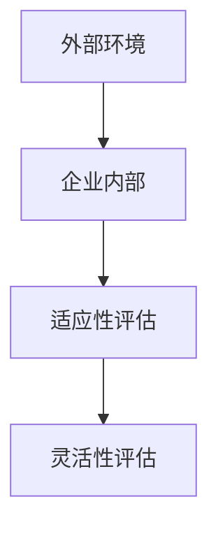
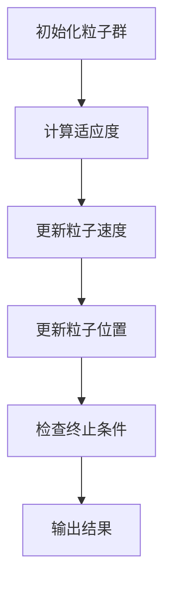
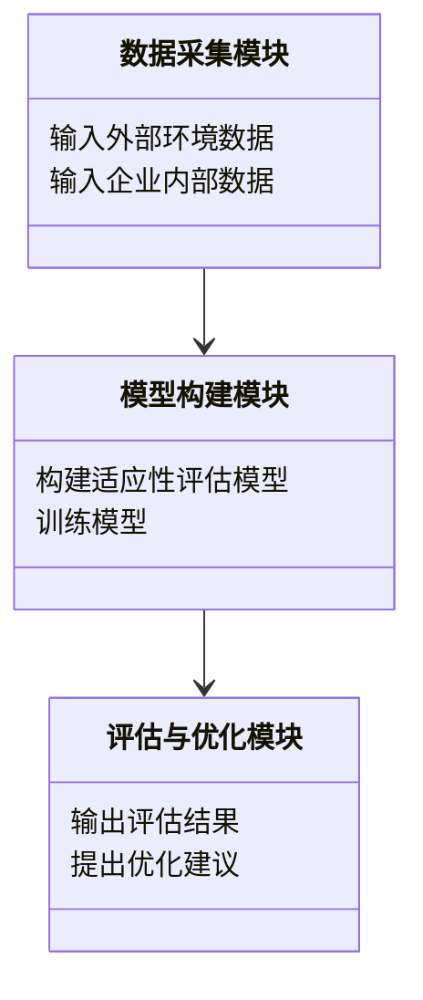

                 


# 运用AI智能体群体评估公司适应性和灵活性

> 关键词：AI智能体，群体智能，企业适应性，灵活性评估，系统架构，算法实现

> 摘要：随着企业环境的日益复杂化和动态化，评估公司的适应性和灵活性变得至关重要。传统的评估方法往往依赖于静态指标和单点分析，难以捕捉企业的动态变化和整体适应能力。本文提出运用AI智能体群体来评估公司适应性和灵活性，通过群体智能算法和系统架构设计，构建一个动态、实时的评估系统。文章详细介绍了AI智能体的基本概念、群体智能算法的实现原理、系统架构设计，以及实际项目中的应用案例。

---

## 第一部分: 运用AI智能体群体评估公司适应性和灵活性的背景与核心概念

### 第1章: 问题背景与核心概念

#### 1.1 问题背景
企业适应性和灵活性是企业在复杂多变的市场环境中生存和发展的关键能力。传统的企业评估方法通常依赖于财务指标、市场份额等静态数据，难以捕捉企业的动态适应能力。尤其是在数字化转型和人工智能技术快速发展的今天，企业需要能够快速响应市场变化、调整组织结构和业务模式。因此，如何动态评估企业的适应性和灵活性，成为一个重要的研究课题。

此外，企业的适应性和灵活性往往涉及多个维度，例如组织结构的灵活性、资源分配的效率、员工的响应速度等。传统的评估方法通常基于主观判断或单一维度的分析，难以全面捕捉企业的动态能力。

---

#### 1.2 问题描述
企业在面对外部环境变化时，需要具备以下能力：
1. **适应性**：能够快速调整战略、组织结构和业务流程，以应对市场变化。
2. **灵活性**：在不同场景下灵活切换资源分配、调整业务模式，以最大化企业价值。

传统的评估方法通常依赖于以下手段：
1. **财务指标**：如净利润率、ROE等，这些指标无法反映企业的动态适应能力。
2. **问卷调查**：依赖于主观判断，难以量化企业的实际能力。
3. **静态分析**：难以捕捉企业的动态变化。

---

#### 1.3 问题解决与边界
**AI智能体群体评估的核心思路**：通过构建多个AI智能体，模拟企业在不同场景下的行为，分析其适应性和灵活性。这些智能体能够通过群体协作，共同评估企业的动态能力。

**边界与外延**：
- **边界**：本文主要关注企业内部的适应性和灵活性评估，不涉及外部市场环境的直接建模。
- **外延**：AI智能体群体评估可以扩展到其他领域，例如供应链管理、组织行为分析等。

---

### 第2章: AI智能体群体与企业适应性评估的核心概念

#### 2.1 AI智能体的定义与特征
**AI智能体**（Artificial Intelligence Agent）是一种能够感知环境并采取行动以实现目标的实体。其核心特征包括：
- **自主性**：能够在没有外部干预的情况下自主决策。
- **反应性**：能够实时感知环境变化并做出响应。
- **协作性**：能够与其他智能体协作，共同完成复杂任务。

**AI智能体与传统算法的对比**：

| 特性       | 传统算法         | AI智能体       |
|------------|------------------|----------------|
| 决策方式   | 基于预设规则     | 基于环境反馈   |
| 学习能力   | 无               | 有（强化学习）  |
| 灵活性     | 低               | 高             |

---

#### 2.2 企业适应性与灵活性的系统模型
**企业适应性评估的系统结构**：
- **输入**：外部环境数据（市场变化、客户需求等）。
- **处理**：企业内部数据（组织结构、资源分配等）。
- **输出**：适应性评估结果。

**适应性与灵活性的关系**：
- 适应性是灵活性的前提，灵活性是适应性的表现。
- 灵活性越高，企业能够更快地调整资源分配，适应外部变化。

**系统模型图**：



---

## 第二部分: AI智能体群体评估的算法原理与数学模型

### 第3章: 群体智能算法与适应性评估模型

#### 3.1 群体智能算法概述
群体智能算法是一种模拟生物群体行为的算法，例如鸟群觅食、蜂群分工等。常见的群体智能算法包括：
1. **粒子群优化（PSO）**：模拟鸟群觅食行为。
2. **遗传算法（GA）**：模拟生物进化过程。
3. **蚁群算法（ACO）**：模拟蚂蚁觅食行为。

**粒子群优化算法的流程图**：



---

#### 3.2 适应性评估模型的构建
**模型构建的基本思路**：
1. **数据采集**：收集企业的内外部数据。
2. **特征提取**：提取影响适应性和灵活性的关键特征。
3. **模型训练**：使用群体智能算法训练评估模型。
4. **结果分析**：输出适应性和灵活性评估结果。

**适应性评估的数学模型**：
$$适应性评估结果 = \sum_{i=1}^{n} (w_i \cdot x_i)$$
其中，$w_i$ 是特征 $x_i$ 的权重，$n$ 是特征总数。

---

### 第4章: 系统架构与接口设计

#### 4.1 系统架构设计
**系统功能模块**：
- **数据采集模块**：负责采集企业内外部数据。
- **模型构建模块**：负责构建适应性评估模型。
- **评估与优化模块**：负责输出评估结果并提出优化建议。

**系统架构图**：



---

### 第5章: 项目实战与案例分析

#### 5.1 项目环境安装
- **Python版本**：Python 3.8+
- **依赖库安装**：
  ```bash
  pip install numpy pandas scikit-learn matplotlib
  ```

#### 5.2 核心代码实现
**粒子群优化算法的Python实现**：

```python
import numpy as np

class Particle:
    def __init__(self, n_dim, min_val, max_val):
        self.n_dim = n_dim
        self.min_val = min_val
        self.max_val = max_val
        self.position = self._random_position()
        self.velocity = np.zeros(n_dim)
    
    def _random_position(self):
        return np.random.uniform(self.min_val, self.max_val, self.n_dim)

def particle_swarm_optimization(n_dim, n_particles, min_val, max_val, max_iter):
    particles = [Particle(n_dim, min_val, max_val) for _ in range(n_particles)]
    global_best = float('inf')
    
    for _ in range(max_iter):
        for particle in particles:
            # 计算适应度
            fitness = np.sum(particle.position)
            # 更新全局最优
            if fitness < global_best:
                global_best = fitness
        # 更新粒子速度和位置
        for particle in particles:
            particle.velocity = 0.1 * particle.velocity + 0.2 * np.random.rand() * (global_best - particle.position)
            particle.position += particle.velocity
    
    return global_best

# 示例调用
result = particle_swarm_optimization(3, 10, 0, 1, 50)
print("最优适应度值:", result)
```

---

## 第三部分: 最佳实践与总结

### 第6章: 最佳实践与总结

#### 6.1 经验总结
- **数据质量**：数据的准确性和完整性对评估结果至关重要。
- **模型调参**：不同场景下需要调整算法参数以获得最佳效果。
- **实时性**：适应性和灵活性评估需要实时更新以反映企业的动态变化。

#### 6.2 小结
通过运用AI智能体群体评估企业适应性和灵活性，企业能够更快速、更准确地捕捉动态变化，提升整体竞争力。本文通过理论分析、算法实现和案例展示，详细介绍了该方法的具体应用。

#### 6.3 注意事项
- 避免过度依赖单一算法，结合多种方法提升评估准确性。
- 定期更新模型参数，确保评估结果的有效性。

#### 6.4 拓展阅读
- 阅读相关群体智能算法的经典论文，深入了解其数学原理。
- 研究其他领域中群体智能的应用案例，拓展知识广度。

---

作者：AI天才研究院 & 禅与计算机程序设计艺术

