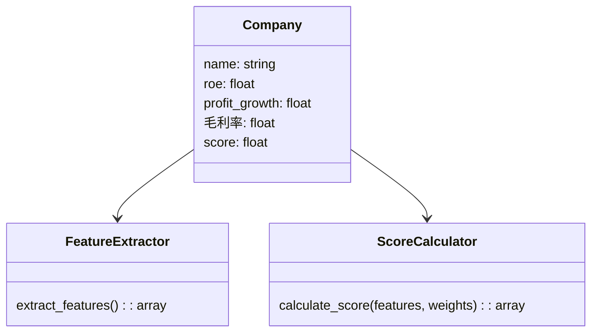
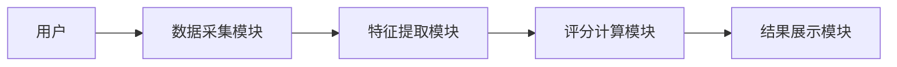

                 


# 运用AI智能体群体识别巴菲特式的行业领导者

## 关键词
AI智能体, 群体智能, 巴菲特投资理念, 行业领导者, 投资分析

## 摘要
本文探讨了如何利用AI智能体群体识别巴菲特式的行业领导者。通过结合巴菲特的投资理念和AI技术，提出了一种基于多智能体的特征提取和群体智能评价方法，详细介绍了算法原理、系统架构设计和实际案例分析。

---

# 第一部分: 背景与概念

## 第1章: 巴菲特式行业领导者的定义与特征

### 1.1 巴菲特投资理念的核心要素
#### 1.1.1 巴菲特投资理念的起源与核心思想
巴菲特的投资理念起源于价值投资理论，核心思想是寻找具有持续竞争优势、良好财务健康状况和长期增长潜力的企业。他强调企业内在价值的重要性，认为市场波动是投资机会的来源。

#### 1.1.2 巴菲特式行业领导者的定义与特征
巴菲特式行业领导者是指在行业内具有持续竞争优势、稳定的财务表现和长期增长潜力的企业。其特征包括：
1. 高ROE（净资产收益率）。
2. 稳定的收入增长。
3. 良好的现金流。
4. 强大的竞争优势（如品牌、技术、市场地位）。

#### 1.1.3 巴菲特投资理念的现代应用
随着市场的复杂化，巴菲特投资理念需要结合现代技术进行优化。通过AI技术，可以更高效地筛选和分析企业数据，发现潜在的行业领导者。

---

## 第2章: AI智能体群体的概念与优势

### 2.1 AI智能体的基本定义与分类
AI智能体是指能够感知环境、做出决策并采取行动的智能系统。根据智能体的交互方式，可以分为：
1. **反应式智能体**：基于当前环境输入做出反应。
2. **认知式智能体**：具备目标设定、规划和推理能力。
3. **群体智能体**：多个智能体协同工作的系统。

### 2.2 群体智能的定义与特点
群体智能是指多个智能体通过协同工作实现个体无法完成的任务。其特点包括：
1. **分布式计算**：任务由多个智能体分担。
2. **自主性**：每个智能体独立决策。
3. **协作性**：通过通信实现协同。
4. **鲁棒性**：个体故障不影响整体任务完成。

### 2.3 AI智能体群体在投资分析中的优势
1. **高效性**：多个智能体可以同时分析大量数据。
2. **多样性**：群体中的不同智能体可以提供多样化的分析视角。
3. **鲁棒性**：群体决策通常比个体决策更稳定。

---

# 第二部分: 核心概念与理论

## 第3章: 巴菲特投资理念的AI实现原理

### 3.1 巴菲特投资理念的核心要素
#### 3.1.1 企业竞争优势的定义与分类
竞争优势是企业在市场上胜过竞争对手的关键因素。主要分为：
1. **成本优势**：生产效率高，成本低。
2. **品牌优势**：强大的品牌影响力。
3. **技术优势**：拥有独特的技术或专利。

#### 3.1.2 企业财务健康状况的分析方法
通过分析企业的财务报表，评估企业的盈利能力、资产负债情况和现金流健康状况。

#### 3.1.3 企业长期价值的评估模型
使用DCF模型（ discounted cash flow model）评估企业的未来现金流折现值，确定其内在价值。

---

## 第4章: AI智能体群体的特征提取与分析

### 4.1 巴菲特式行业领导者的评价指标体系
为了识别巴菲特式行业领导者，我们需要构建一个综合评价指标体系，包括：
1. **财务指标**：ROE、净利润增长率、毛利率。
2. **市场指标**：市场份额、品牌价值、市盈率。
3. **运营指标**：研发投入占比、管理效率、供应链稳定性。

### 4.2 AI智能体的特征提取方法
通过自然语言处理（NLP）和机器学习技术，从企业年报、新闻报道等文本数据中提取关键词和情感倾向，结合财务数据进行多维度特征提取。

### 4.3 群体智能的评价指标与权重分配
根据各个指标的重要性，进行权重分配。例如：
- 财务指标权重：60%
- 市场指标权重：30%
- 运营指标权重：10%

---

# 第三部分: 算法原理

## 第5章: 多智能体特征提取算法

### 5.1 算法流程
1. 数据采集：收集企业的财务数据、文本数据和市场数据。
2. 特征提取：通过NLP和统计方法提取关键特征。
3. 特征加权：根据权重分配对特征进行加权。
4. 群体评价：多个智能体协同计算最终评分。

### 5.2 算法实现代码
```python
import numpy as np

def extract_features(data):
    # 示例：提取财务数据特征
    features = []
    for company in data:
        roe = company['roe']
        profit_growth = company['net_profit_growth']
       毛利率 = company['gross_margin']
        features.append([roe, profit_growth,毛利率])
    return np.array(features)

def calculate_score(features, weights):
    # 示例：计算加权评分
    score = np.dot(features, weights)
    return score

# 示例权重
weights = np.array([0.6, 0.3, 0.1])
data = [...]  # 示例数据
features = extract_features(data)
scores = calculate_score(features, weights)
```

### 5.3 数学模型
$$ \text{总评分} = \sum_{i=1}^{n} w_i \times f_i $$
其中，\( w_i \) 是第 \( i \) 个特征的权重，\( f_i \) 是第 \( i \) 个特征的值。

---

# 第四部分: 系统分析与架构设计

## 第6章: 系统功能设计

### 6.1 领域模型类图


### 6.2 系统架构设计


### 6.3 系统交互序列图
```mermaid
sequenceDiagram
    用户 -> 数据采集模块: 请求数据
    数据采集模块 -> 特征提取模块: 提供数据
    特征提取模块 -> 评分计算模块: 提供特征
    评分计算模块 -> 结果展示模块: 提供评分
    用户 <- 结果展示模块: 显示结果
```

---

# 第五部分: 项目实战

## 第7章: 项目实现

### 7.1 环境配置
安装必要的库：
```bash
pip install numpy pandas scikit-learn
```

### 7.2 核心代码实现
```python
import pandas as pd
from sklearn.linear_model import LinearRegression

def main():
    # 示例数据
    data = {
        'name': ['Company A', 'Company B', 'Company C'],
        'roe': [15, 20, 18],
        'profit_growth': [10, 5, 8],
        '毛利率': [40, 35, 38]
    }
    df = pd.DataFrame(data)
    
    # 特征提取
    features = df[['roe', 'profit_growth', '毛利率']]
    target = df['score']
    
    # 模型训练
    model = LinearRegression()
    model.fit(features, target)
    
    # 预测评分
    predicted_scores = model.predict(features)
    
    # 输出结果
    for i in range(len(df)):
        print(f"{df['name'][i]} 的预测评分：{predicted_scores[i]}")

if __name__ == "__main__":
    main()
```

### 7.3 实际案例分析
以科技行业为例，分析苹果和微软的财务数据，使用上述算法计算它们的评分，识别行业领导者。

---

# 结论

## 第8章: 总结与展望

### 8.1 总结
本文通过结合巴菲特投资理念和AI技术，提出了一种基于多智能体的行业领导者识别方法。通过特征提取、加权评分和群体智能，能够更高效地识别潜在的行业领导者。

### 8.2 展望
未来，随着AI技术的发展，行业领导者识别将更加智能化和自动化。可以通过引入更复杂的模型（如深度学习）和更丰富的数据源（如社交媒体数据）来进一步优化识别算法。

---

## 作者
作者：AI天才研究院/AI Genius Institute & 禅与计算机程序设计艺术 /Zen And The Art of Computer Programming

