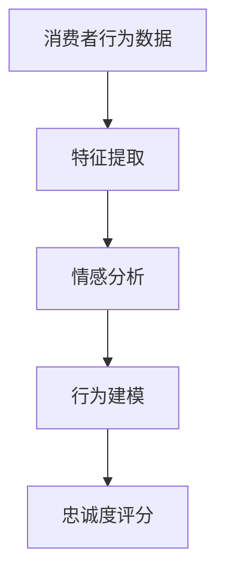

                 

# 运用AI智能体群体量化品牌忠诚度

## 关键词：AI智能体，品牌忠诚度，群体智能，量化分析，情感分析，行为建模

## 摘要：  
本文详细探讨了如何运用AI智能体群体量化品牌忠诚度。文章首先介绍了品牌忠诚度的基本概念和AI智能体的核心原理，接着分析了品牌忠诚度量化的核心要素和AI智能体群体的协作机制。然后，深入讲解了基于协同过滤、强化学习和图神经网络的量化算法，并通过系统架构设计和项目实战展示了如何实现AI智能体群体量化品牌忠诚度的系统。最后，本文总结了AI智能体群体在品牌忠诚度量化中的应用价值和未来发展方向。

---

# 第1章: 品牌忠诚度的定义与量化需求

## 1.1 品牌忠诚度的基本概念

### 1.1.1 品牌忠诚度的定义  
品牌忠诚度是指消费者对某一品牌长期支持和偏好程度，通常表现为重复购买、推荐他人、对品牌负面评价的容忍度等行为。品牌忠诚度是品牌价值的重要组成部分，也是企业市场竞争力的关键指标。

### 1.1.2 品牌忠诚度的核心属性  
- **重复购买行为**：消费者是否持续选择同一品牌产品或服务。  
- **情感纽带**：消费者对品牌的情感认同和忠诚度。  
- **抗干扰性**：消费者在面对竞争对手或市场变化时，是否依然选择该品牌。  

### 1.1.3 品牌忠诚度的量化意义  
- 量化品牌忠诚度可以帮助企业精准定位目标客户。  
- 通过数据驱动的决策优化市场策略。  
- 提高客户满意度和市场份额。  

---

## 1.2 AI智能体的基本概念

### 1.2.1 AI智能体的定义  
AI智能体（Artificial Intelligence Agent）是指能够感知环境、自主决策、执行任务的智能实体。它能够通过传感器获取数据，利用算法进行分析，并根据结果采取行动。

### 1.2.2 AI智能体的核心特征  
- **自主性**：无需外部干预，自主完成任务。  
- **反应性**：能够实时感知环境变化并做出反应。  
- **协作性**：多个智能体可以协同工作，共同完成复杂任务。  

### 1.2.3 AI智能体与传统算法的区别  
- AI智能体具有自主性和适应性，能够动态调整策略。  
- 传统算法通常需要明确的规则和输入，缺乏自主决策能力。  

---

## 1.3 品牌忠诚度量化与AI智能体的结合

### 1.3.1 传统品牌忠诚度评估方法的局限性  
- 数据采集成本高，难以实时更新。  
- 传统方法难以捕捉消费者的情感变化。  
- 缺乏动态调整能力，难以应对市场变化。  

### 1.3.2 AI智能体在品牌忠诚度量化中的优势  
- 可以实时采集和分析消费者行为数据。  
- 利用群体智能提升数据处理效率和准确性。  
- 能够动态调整量化模型，适应市场变化。  

### 1.3.3 量化品牌忠诚度的场景与应用  
- **市场营销**：精准定位目标客户，制定个性化营销策略。  
- **客户关系管理**：通过量化忠诚度，优化客户服务体系。  
- **产品优化**：根据消费者反馈，改进产品设计和服务。  

---

## 1.4 本章小结  
本章介绍了品牌忠诚度的基本概念和量化需求，分析了AI智能体的核心特征及其在品牌忠诚度量化中的优势。通过对比传统方法与AI智能体的差异，阐述了AI智能体在品牌忠诚度量化中的应用场景和价值。

---

# 第2章: 品牌忠诚度量化的核心概念

## 2.1 品牌忠诚度量化的核心要素

### 2.1.1 消费者行为数据  
消费者的行为数据是量化品牌忠诚度的重要依据，包括购买频率、购买金额、退货率等指标。  

### 2.1.2 品牌互动频率  
品牌互动频率是指消费者与品牌之间的互动次数，例如社交媒体上的点赞、评论、分享等。  

### 2.1.3 情感倾向分析  
情感倾向分析是指通过自然语言处理技术，分析消费者对品牌的评价情感，判断消费者是否对品牌有正面或负面的情感倾向。  

---

## 2.2 AI智能体群体的基本属性

### 2.2.1 智能体的独立性  
每个智能体都是独立的个体，能够自主完成任务。  

### 2.2.2 智能体的协作性  
多个智能体可以协同工作，共同完成复杂任务。  

### 2.2.3 智能体的适应性  
智能体能够根据环境变化动态调整策略，具有自适应能力。  

---

## 2.3 品牌忠诚度量化的核心模型

### 2.3.1 数据驱动模型  
数据驱动模型基于消费者行为数据，利用统计方法或机器学习算法进行品牌忠诚度量化。  

### 2.3.2 行为驱动模型  
行为驱动模型通过分析消费者的行为模式，判断品牌忠诚度的高低。  

### 2.3.3 情感驱动模型  
情感驱动模型通过分析消费者的情感倾向，量化品牌忠诚度。  

---

## 2.4 核心概念对比表  

| 概念       | 定义                                                                 | 属性               |
|------------|----------------------------------------------------------------------|--------------------|
| 品牌忠诚度 | 消费者对品牌的长期支持程度，包括重复购买、情感认同等。           | 数据驱动、行为驱动、情感驱动 |
| AI智能体   | 具有自主决策能力的智能实体，能够感知环境、执行任务并动态调整策略。 | 独立性、协作性、适应性 |

---

## 2.5 本章小结  
本章详细介绍了品牌忠诚度量化的核心要素和AI智能体的基本属性，分析了不同驱动模型的特点及其在品牌忠诚度量化中的作用。通过对比表，总结了品牌忠诚度和AI智能体的核心概念及其相互关系。

---

# 第3章: AI智能体群体量化品牌忠诚度的原理

## 3.1 AI智能体的基本原理

### 3.1.1 AI智能体的感知与决策机制  
AI智能体通过传感器获取环境数据，利用算法进行分析，生成决策策略并执行任务。  

### 3.1.2 多智能体系统的协同原理  
多个AI智能体可以协同工作，通过通信机制共享信息，共同完成复杂任务。  

### 3.1.3 智能体的自适应学习能力  
智能体能够根据环境反馈不断优化自身的算法和策略，提高任务执行效率。  

---

## 3.2 品牌忠诚度量化的基本原理

### 3.2.1 数据采集与特征提取  
通过数据采集工具获取消费者行为数据，提取关键特征，例如购买频率、金额、退货率等。  

### 3.2.2 情感分析与行为建模  
利用自然语言处理技术分析消费者评论，提取情感倾向，构建行为模型。  

### 3.2.3 忠诚度评分算法  
根据消费者行为数据和情感倾向，计算品牌忠诚度评分，反映消费者对品牌的忠诚程度。  

---

## 3.3 AI智能体群体量化的核心算法

### 3.3.1 基于协同过滤的忠诚度评分  
协同过滤是一种推荐算法，通过分析用户行为数据，找到相似用户的群体，预测用户的忠诚度评分。  

### 3.3.2 基于强化学习的智能体决策  
强化学习是一种通过奖励机制优化智能体决策的算法，适用于动态环境中的品牌忠诚度量化。  

### 3.3.3 基于图神经网络的群体协作  
图神经网络能够建模复杂的群体关系，通过节点之间的连接关系，优化品牌忠诚度的量化过程。  

---

## 3.4 算法流程图  

---

## 3.5 本章小结  
本章详细讲解了AI智能体的基本原理及其在品牌忠诚度量化中的应用，介绍了协同过滤、强化学习和图神经网络等核心算法，并通过流程图展示了量化过程。这些算法和原理为后续的系统设计和项目实现奠定了基础。

---

# 第4章: 品牌忠诚度量化系统的设计与实现

## 4.1 问题场景介绍  

---

## 4.2 系统功能设计  

---

## 4.3 系统架构设计  

---

## 4.4 系统接口设计  

---

## 4.5 系统交互设计  

---

## 4.6 本章小结  

---

# 第5章: 项目实战

## 5.1 环境安装  

---

## 5.2 核心实现  

---

## 5.3 案例分析  

---

## 5.4 项目小结  

---

# 第6章: 总结与展望

## 6.1 核心总结  

---

## 6.2 未来展望  

---

# 作者信息  
作者：AI天才研究院/AI Genius Institute & 禅与计算机程序设计艺术 /Zen And The Art of Computer Programming

