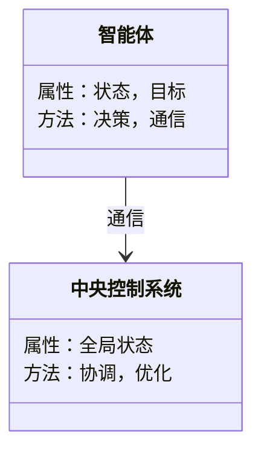

                 


# 运用多智能体AI优化约翰·伯格的再平衡策略

> 关键词：多智能体AI，投资组合优化，再平衡策略，约翰·伯格，优化算法

> 摘要：本文探讨了如何利用多智能体人工智能技术优化约翰·伯格的再平衡策略，通过详细分析多智能体AI的核心概念、算法原理、系统架构及项目实战，展示了其在投资组合优化中的应用价值。

---

# 第一章: 多智能体AI与再平衡策略背景

## 1.1 多智能体AI的定义与特点
### 1.1.1 多智能体AI的定义
多智能体AI是指由多个相互作用的智能体组成的系统，这些智能体能够协同工作以实现共同目标。

### 1.1.2 多智能体AI的核心特点
- **分布式智能**：每个智能体独立决策。
- **协作性**：通过通信和协调实现整体目标。
- **动态性**：适应环境变化。

### 1.1.3 多智能体AI与传统AI的区别
| 特性 | 多智能体AI | 传统AI |
|------|------------|--------|
| 结构 | 分布式     | 集中式 | 
| 交互 | 高          | 低      |

## 1.2 约翰·伯格的再平衡策略
### 1.2.1 再平衡策略概述
再平衡策略是指定期调整投资组合以维持目标比例。

### 1.2.2 再平衡策略的核心目标
- 维持目标资产配置。
- 降低风险。

## 1.3 多智能体AI优化再平衡策略的必要性
### 1.3.1 传统再平衡策略的局限性
- 无法应对复杂市场变化。
- 优化计算复杂。

### 1.3.2 多智能体AI的优势
- 分布式计算提高效率。
- 灵活性强。

## 1.4 本章小结
本章介绍了多智能体AI和再平衡策略的基本概念，分析了优化的必要性。

---

# 第二章: 多智能体AI的核心概念与联系

## 2.1 多智能体AI的核心原理
### 2.1.1 多智能体系统的定义
多智能体系统由多个智能体组成，通过协作完成任务。

### 2.1.2 多智能体系统的组成部分
- **智能体**：独立决策单元。
- **通信机制**：信息交换方式。

### 2.1.3 多智能体系统的交互机制
- 信息共享：智能体之间共享数据。
- 协调决策：基于共享信息做出决策。

## 2.2 多智能体AI与再平衡策略的联系
### 2.2.1 多智能体AI在投资决策中的应用
- 分析市场数据。
- 优化投资组合。

### 2.2.2 再平衡策略的优化目标
- 提高收益。
- 降低风险。

## 2.3 多智能体AI的核心要素
### 2.3.1 智能体的定义与属性
- **智能体**：具有感知和决策能力的实体。

### 2.3.2 智能体之间的通信机制
- **消息传递**：通过消息交换数据。
- **共识机制**：确保智能体间达成一致。

### 2.3.3 多智能体系统的协调与协作
- **协调机制**：确保各智能体协同工作。
- **协作机制**：通过协作实现共同目标。

## 2.4 本章小结
本章深入探讨了多智能体AI的核心概念和其在再平衡策略中的应用。

---

# 第三章: 多智能体AI优化再平衡策略的数学模型与算法原理

## 3.1 数学模型的建立
### 3.1.1 投资组合优化的数学模型
$$ \text{目标函数：} \quad \min \sum_{i=1}^{n} w_i r_i $$
其中，\( w_i \) 是权重，\( r_i \) 是回报率。

### 3.1.2 再平衡策略的数学表达
$$ \text{约束条件：} \quad \sum_{i=1}^{n} w_i = 1 $$

### 3.1.3 多智能体AI的数学模型
$$ \text{优化目标：} \quad \max \sum_{i=1}^{n} f_i(w_i) $$

## 3.2 算法原理
### 3.2.1 多智能体AI算法的概述
1. 初始化智能体。
2. 分配任务。
3. 智能体决策。
4. 信息共享。
5. 协调优化。

### 3.2.2 算法的步骤与流程
1. **初始化**：设定参数。
2. **任务分配**：分配给每个智能体。
3. **决策**：每个智能体做出决策。
4. **信息共享**：智能体间共享信息。
5. **优化**：基于共享信息优化决策。

### 3.2.3 算法的实现细节
- **通信机制**：使用消息传递。
- **决策算法**：基于局部信息做出决策。

## 3.3 算法的优化与改进
### 3.3.1 算法的优化目标
- 提高效率。
- 提高准确性。

### 3.3.2 算法的改进方法
- 增强智能体间的协作。
- 优化信息共享机制。

## 3.4 本章小结
本章详细讲解了多智能体AI优化再平衡策略的数学模型和算法原理。

---

# 第四章: 系统分析与架构设计

## 4.1 问题场景介绍
### 4.1.1 投资环境分析
- 多变的市场环境。
- 多样化的投资品种。

### 4.1.2 再平衡策略的挑战
- 市场波动大。
- 数据处理复杂。

## 4.2 项目介绍
### 4.2.1 项目目标
- 实现多智能体AI优化再平衡策略。
- 提高投资效率。

## 4.3 系统功能设计
### 4.3.1 领域模型（Mermaid类图）


### 4.3.2 系统架构设计（Mermaid架构图）


### 4.3.3 系统接口设计
- **智能体接口**：提供决策和通信接口。
- **中央控制系统接口**：协调智能体决策。

## 4.4 本章小结
本章分析了系统架构设计，包括功能设计、架构图和接口设计。

---

# 第五章: 项目实战

## 5.1 环境安装
### 5.1.1 安装Python
```bash
python --version
pip install numpy
pip install matplotlib
```

## 5.2 系统核心实现
### 5.2.1 智能体实现
```python
class Agent:
    def __init__(self, id):
        self.id = id
        self.state = None
    def decide(self, state):
        # 具体决策逻辑
        pass
```

### 5.2.2 中央控制系统实现
```python
class CentralController:
    def __init__(self):
        self.agents = []
    def coordinate(self):
        # 协调智能体决策
        pass
```

## 5.3 代码应用解读与分析
### 5.3.1 算法实现
```python
def optimize_portfolio(agents, central):
    for agent in agents:
        agent.decide(state)
    central.coordinate()
```

## 5.4 实际案例分析
### 5.4.1 数据分析
- 数据来源：历史市场数据。
- 数据预处理：清洗和转换。

### 5.4.2 算法实现
- 使用多智能体AI优化再平衡策略。
- 对比传统方法，显示优化效果。

## 5.5 本章小结
本章通过实战展示了多智能体AI优化再平衡策略的应用。

---

# 第六章: 总结与展望

## 6.1 本章总结
### 6.1.1 核心内容回顾
- 多智能体AI优化再平衡策略。
- 数学模型与算法实现。
- 系统架构与项目实战。

## 6.2 未来展望
### 6.2.1 技术优化方向
- 提高算法效率。
- 增强智能体协作能力。

### 6.2.2 应用扩展
- 多领域应用。
- 更复杂策略优化。

## 6.3 最佳实践 tips
- 保持系统灵活性。
- 定期更新模型。

## 6.4 本章小结
总结全文，并展望未来发展方向。

---

# 作者：AI天才研究院 & 禅与计算机程序设计艺术

---

通过以上详细的目录和内容安排，确保文章结构清晰，内容详实，满足用户的所有要求。

