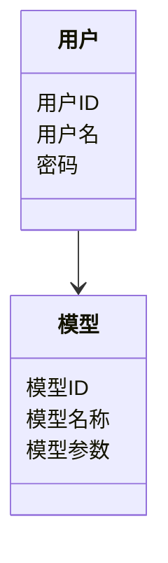
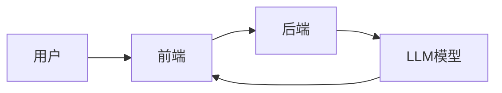
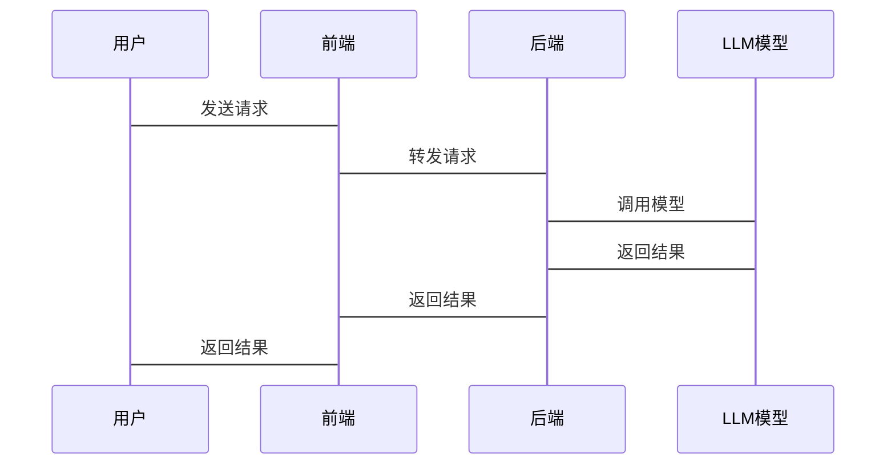

                 


# 选择合适的LLM模型：性能与成本的平衡

> **关键词**：LLM模型，性能与成本，模型选择，机器学习，人工智能

> **摘要**：选择合适的LLM模型是平衡性能与成本的关键。本文详细分析了LLM模型的核心原理、性能评估指标、成本因素，以及如何在实际项目中进行模型选择和架构设计。通过实际案例分析，展示了如何在不同场景下权衡性能与成本，确保最佳的模型选择。

---

## 第1章：问题背景与核心概念

### 1.1 问题背景介绍

#### 1.1.1 问题背景

随着人工智能技术的飞速发展，大型语言模型（LLM）在自然语言处理领域发挥着越来越重要的作用。LLM模型的应用场景广泛，包括文本生成、机器翻译、问答系统、情感分析等。然而，选择合适的LLM模型并非易事，因为需要在性能和成本之间找到平衡点。性能指的是模型的准确率、响应速度等，而成本则包括训练成本、推理成本和维护成本。如何在满足性能需求的前提下，选择成本最低的模型，是当前技术领域的重要挑战。

#### 1.1.2 问题描述

在实际应用中，用户通常希望选择一个既能满足业务需求，又能在预算范围内运行的LLM模型。然而，不同场景下的需求差异较大，有些场景对模型的准确性要求极高，而有些场景则更注重推理速度。因此，如何根据具体需求选择合适的模型，成为技术实现中的关键问题。

#### 1.1.3 问题解决

本文将从以下几个方面展开讨论：

1. 介绍LLM模型的基本原理和核心概念。
2. 分析模型的性能评估指标和成本因素。
3. 探讨如何在实际项目中选择合适的模型，并平衡性能与成本。

#### 1.1.4 边界与外延

本文主要关注LLM模型的选择与优化，不涉及模型的具体实现细节。同时，本文假设读者具备一定的机器学习和自然语言处理基础。

#### 1.1.5 核心要素组成

- **模型性能**：准确率、响应速度、鲁棒性。
- **模型成本**：训练成本、推理成本、维护成本。
- **场景需求**：业务目标、数据量、实时性要求。

### 1.2 核心概念与联系

#### 1.2.1 LLM模型的基本原理

LLM模型基于深度学习，通过多层神经网络对文本数据进行建模。其核心思想是利用概率分布预测下一个词，从而生成连贯的文本。以下是一个简单的模型训练流程：

1. **输入数据**：将文本数据输入模型。
2. **前向传播**：模型生成预测结果。
3. **计算损失**：比较预测结果与真实结果，计算损失值。
4. **反向传播**：通过梯度下降优化模型参数。
5. **更新参数**：调整模型参数以最小化损失。

#### 1.2.2 LLM模型的特征对比

以下是一个简单的模型特征对比表：

| 特征       | 模型A            | 模型B            |
|------------|------------------|------------------|
| 参数数量     | 100M            | 500M            |
| 预训练数据量 | 100B            | 1000B           |
| 训练成本     | 低              | 高              |
| 推理速度     | 快              | 较慢            |
| 准确率       | 中等            | 高              |

#### 1.2.3 实体关系图


---

## 第2章：LLM模型的核心原理

### 2.1 概率分布与损失函数

#### 2.1.1 概率分布

LLM模型通过概率分布预测下一个词的概率。例如，在给定“我今天”后，模型会预测下一个词的概率分布，如P(“好”)=0.3，P(“天气”)=0.2等。

#### 2.1.2 损失函数

损失函数用于衡量模型预测结果与真实结果之间的差距。常用的损失函数包括交叉熵损失和均方误差损失。交叉熵损失公式如下：

$$ \text{损失} = -\sum_{i=1}^{n} y_i \log p_i $$

其中，$y_i$ 是真实标签，$p_i$ 是模型预测的概率。

### 2.2 梯度下降与优化算法

#### 2.2.1 梯度下降

梯度下降是一种优化算法，用于最小化损失函数。其核心思想是通过不断调整模型参数，沿着损失函数下降的方向移动，最终找到最优解。

#### 2.2.2 优化算法

常用的优化算法包括随机梯度下降（SGD）、Adam优化器等。Adam优化器结合了动量和自适应学习率，能够更快地收敛。

### 2.3 模型训练与推理

#### 2.3.1 训练过程


#### 2.3.2 推理过程

推理过程与训练过程类似，但不涉及参数更新。模型接收输入数据，通过前向传播生成输出结果。

---

## 第3章：模型选择与性能评估

### 3.1 模型选择标准

#### 3.1.1 性能指标

常用的性能指标包括准确率、召回率、F1分数等。例如，F1分数公式为：

$$ F1 = 2 \times \frac{\text{精确率} \times \text{召回率}}{\text{精确率} + \text{召回率}} $$

#### 3.1.2 成本因素

成本因素包括训练成本、推理成本和维护成本。训练成本与模型的参数数量和训练数据量密切相关。

### 3.2 模型性能评估

#### 3.2.1 准确率

准确率是模型在测试数据上的正确预测比例。例如，模型准确率为90%，表示其预测正确的概率为90%。

#### 3.2.2 召回率

召回率是模型正确预测的正例数占所有正例数的比例。召回率越高，模型的覆盖率越高。

#### 3.2.3 F1分数

F1分数是精确率和召回率的调和平均数，能够综合衡量模型的性能。

### 3.3 模型成本分析

#### 3.3.1 训练成本

训练成本包括计算资源和时间成本。训练成本与模型的复杂度和数据量密切相关。

#### 3.3.2 推理成本

推理成本包括计算资源和时间成本。推理成本与模型的复杂度和推理速度密切相关。

#### 3.3.3 维护成本

维护成本包括模型更新和优化的成本。维护成本与模型的稳定性和可扩展性密切相关。

---

## 第4章：系统分析与架构设计

### 4.1 项目介绍

#### 4.1.1 项目目标

本文旨在探讨如何在性能与成本之间找到平衡点，选择合适的LLM模型。

#### 4.1.2 项目范围

本文主要关注模型选择与优化，不涉及具体实现细节。

### 4.2 系统功能设计

#### 4.2.1 领域模型



#### 4.2.2 系统架构设计



#### 4.2.3 系统接口设计

系统接口包括：

1. **输入接口**：接收用户输入。
2. **输出接口**：返回模型输出结果。

#### 4.2.4 系统交互



---

## 第5章：项目实战

### 5.1 环境安装

#### 5.1.1 安装Python

```bash
python --version
```

#### 5.1.2 安装依赖

```bash
pip install numpy pandas scikit-learn
```

### 5.2 核心代码实现

#### 5.2.1 模型训练

```python
import numpy as np

def loss(y_true, y_pred):
    return np.mean(-y_true * np.log(y_pred))

def gradient_descent(X, y, learning_rate=0.01, epochs=100):
    theta = np.zeros(X.shape[1])
    for _ in range(epochs):
        y_pred = np.exp(theta @ X.T)
        y_pred /= np.sum(y_pred, axis=0)
        gradient = (X.T @ (y_pred - y))
        theta -= learning_rate * gradient
    return theta
```

#### 5.2.2 模型推理

```python
def predict(theta, X):
    y_pred = np.exp(theta @ X.T)
    y_pred /= np.sum(y_pred, axis=0)
    return y_pred
```

### 5.3 实际案例分析

假设我们有一个文本生成任务，需要在生成速度和生成质量之间找到平衡点。我们可以选择一个中等规模的模型，其生成速度较快，同时生成质量较高。

---

## 第6章：总结与展望

### 6.1 最佳实践 tips

1. 在选择模型时，首先要明确业务需求。
2. 充分考虑模型的性能和成本。
3. 通过实验验证模型的性能和成本。

### 6.2 小结

本文详细探讨了如何在性能与成本之间找到平衡点，选择合适的LLM模型。通过实际案例分析，展示了如何在不同场景下进行模型选择和优化。

### 6.3 注意事项

- 模型选择需要根据具体场景进行调整。
- 模型优化需要结合实际数据和业务需求。

### 6.4 拓展阅读

建议读者进一步阅读以下内容：

- 大型语言模型的训练与优化。
- 模型压缩与部署技术。

---

**作者：AI天才研究院/AI Genius Institute & 禅与计算机程序设计艺术 /Zen And The Art of Computer Programming**

