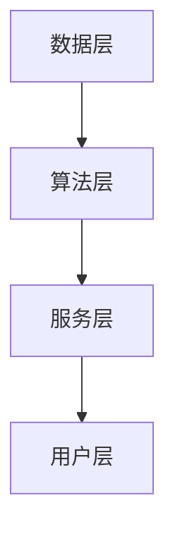
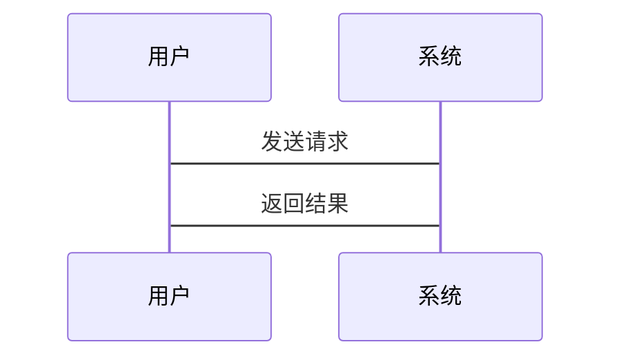

                 


# 《金融AI应用的全面测试与质量保证策略》

## 关键词：金融AI、测试、质量保证、机器学习模型、系统架构、测试策略

## 摘要：  
本文全面探讨金融AI应用的测试与质量保证策略，涵盖核心概念、算法原理、系统架构、项目实战及最佳实践。通过详细分析，帮助读者掌握金融AI应用的测试方法，确保系统的可靠性和高效性。

---

# 第1章: 金融AI应用的背景与现状

## 1.1 金融AI应用的定义与特点

### 1.1.1 金融AI应用的定义  
金融AI应用是指利用人工智能技术（如机器学习、深度学习）对金融数据进行分析、预测和决策支持的应用系统。这些应用广泛应用于股票交易、风险评估、信用评分、欺诈检测等领域。

### 1.1.2 金融AI应用的核心特点  
- **数据驱动**：依赖大量金融数据进行分析和预测。  
- **智能算法**：采用复杂算法（如神经网络、随机森林）进行模式识别和决策。  
- **实时性**：需要快速响应和实时处理，特别是在高频交易中。  
- **准确性与稳定性**：金融决策对准确性和稳定性要求极高。  

### 1.1.3 金融AI应用的边界与外延  
- **边界**：专注于金融领域的特定问题，如股票价格预测、信用评分。  
- **外延**：涵盖从数据采集、模型训练到结果应用的整个生命周期。  

## 1.2 金融AI应用的核心要素

### 1.2.1 数据驱动  
金融AI依赖高质量的数据，包括历史交易数据、市场新闻、用户行为数据等。数据的完整性和准确性直接影响模型的性能。

### 1.2.2 智能算法  
常用的算法包括：  
- **监督学习**：如随机森林、支持向量机（SVM）。  
- **无监督学习**：如聚类分析。  
- **深度学习**：如LSTM用于时间序列预测。  

### 1.2.3 业务场景  
金融AI的应用场景包括：  
- 股票预测  
- 风险评估  
- 欺诈检测  
- 自动化交易  

## 1.3 金融AI应用的现状与挑战

### 1.3.1 当前发展现状  
- 技术进步推动AI在金融领域的广泛应用。  
- 大数据和云计算为金融AI提供了强大的支持。  

### 1.3.2 应用中的主要挑战  
- **数据质量**：数据噪声、缺失值等问题影响模型性能。  
- **模型解释性**：复杂的模型（如深度学习）难以解释，影响决策的透明性。  
- **监管合规性**：金融AI需符合严格的监管要求，如GDPR。  

### 1.3.3 未来发展趋势  
- **模型可解释性**：开发更透明的模型，满足监管需求。  
- **多模态数据融合**：结合文本、图像等多种数据源进行分析。  
- **自动化与智能化**：实现从数据到决策的全流程自动化。  

## 1.4 本章小结  
本章介绍了金融AI应用的定义、特点、核心要素及当前的挑战与发展趋势，为后续的测试与质量保证策略奠定了基础。

---

# 第2章: 测试与质量保证的基本概念

## 2.1 测试的定义与目标

### 2.1.1 测试的定义  
测试是通过输入特定的测试用例，验证系统或模型的行为是否符合预期。  

### 2.1.2 测试的目标  
- 检测缺陷：发现模型或系统的错误。  
- 保证质量：确保系统在规定条件下正常运行。  
- 验证需求：确保系统满足业务需求。  

### 2.1.3 测试的基本流程  
1. **测试计划**：确定测试范围、目标和方法。  
2. **测试用例设计**：根据需求和场景设计测试用例。  
3. **测试执行**：运行测试用例，记录结果。  
4. **结果分析**：分析测试结果，报告缺陷。  

## 2.2 质量保证的核心要素

### 2.2.1 质量保证的定义  
质量保证是通过系统化的过程确保产品或服务满足质量要求。  

### 2.2.2 质量保证的核心要素  
- **测试策略**：制定合理的测试计划和方法。  
- **测试覆盖率**：确保测试覆盖所有关键功能和场景。  
- **测试报告**：记录测试结果，分析问题根源。  

### 2.2.3 质量保证与测试的关系  
- 质量保证是测试的指导原则，测试是实现质量保证的手段。  

## 2.3 测试与质量保证的流程

### 2.3.1 测试计划  
- 确定测试目标、范围和资源分配。  

### 2.3.2 测试执行  
- 执行测试用例，记录结果。  

### 2.3.3 测试结果分析  
- 分析测试结果，生成测试报告，提出改进建议。  

## 2.4 本章小结  
本章介绍了测试与质量保证的基本概念和流程，为后续的金融AI应用测试奠定了理论基础。

---

# 第3章: 金融AI应用测试的核心算法原理

## 3.1 分类算法的测试原理

### 3.1.1 分类算法的定义  
分类算法通过训练数据学习分类器，对新数据进行分类。  

### 3.1.2 分类算法的测试指标  
- **准确率**：正确分类的比例。  
- **精确率**：预测为正类中实际为正类的比例。  
- **召回率**：实际为正类中被正确分类的比例。  

### 3.1.3 分类算法的测试流程  
1. 数据预处理：清洗和归一化数据。  
2. 划分训练集和测试集。  
3. 训练分类器。  
4. 测试并评估性能。  

### 3.1.4 分类算法的数学模型  
贝叶斯分类器的公式：  
$$ P(y|x) = \frac{P(x|y)P(y)}{P(x)} $$  

## 3.2 回归算法的测试原理

### 3.2.1 回归算法的定义  
回归算法用于预测连续型变量。  

### 3.2.2 回归算法的测试指标  
- **均方误差（MSE）**：预测值与真实值的平方差之和。  
- **决定系数（R²）**：模型解释变量变化的能力。  

### 3.2.3 回归算法的测试流程  
1. 数据预处理：处理缺失值和异常值。  
2. 划分训练集和测试集。  
3. 训练回归模型。  
4. 测试并评估性能。  

### 3.2.4 回归算法的数学模型  
线性回归的公式：  
$$ y = w_1x_1 + w_2x_2 + ... + w_nx_n + b $$  

## 3.3 自然语言处理算法的测试原理

### 3.3.1 自然语言处理算法的定义  
NLP算法用于处理文本数据，如情感分析、实体识别。  

### 3.3.2 自然语言处理算法的测试指标  
- **准确率**：正确识别实体的比例。  
- **F1分数**：综合精确率和召回率的指标。  

### 3.3.3 自然语言处理算法的测试流程  
1. 数据预处理：分词、去除停用词。  
2. 划分训练集和测试集。  
3. 训练NLP模型。  
4. 测试并评估性能。  

## 3.4 测试算法的数学模型

### 3.4.1 分类算法的数学模型  
贝叶斯分类器的公式：  
$$ P(y|x) = \frac{P(x|y)P(y)}{P(x)} $$  

### 3.4.2 回归算法的数学模型  
线性回归的公式：  
$$ y = w_1x_1 + w_2x_2 + ... + w_nx_n + b $$  

## 3.5 本章小结  
本章详细讲解了分类、回归和自然语言处理算法的测试原理和数学模型，为金融AI应用的测试提供了理论支持。

---

# 第4章: 金融AI应用系统的架构与测试

## 4.1 金融AI应用系统的架构设计

### 4.1.1 系统架构概述  
金融AI系统通常包括数据层、算法层、服务层和用户层。  

### 4.1.2 系统架构图  


### 4.1.3 关键模块的交互  
- 数据层：存储和处理金融数据。  
- 算法层：执行机器学习算法。  
- 服务层：提供API接口供用户调用。  

## 4.2 系统接口设计

### 4.2.1 API接口设计  
- **输入**：金融数据请求。  
- **输出**：预测结果或决策建议。  

### 4.2.2 接口测试  
- 使用工具（如Postman）进行接口测试。  

## 4.3 系统交互设计

### 4.3.1 交互流程  
1. 用户发送请求。  
2. 系统处理请求并返回结果。  

### 4.3.2 交互序列图  


## 4.4 本章小结  
本章通过系统架构图和交互序列图，详细介绍了金融AI应用系统的架构与测试方法，为后续的测试策略提供了指导。

---

# 第5章: 金融AI应用测试的项目实战

## 5.1 项目环境安装

### 5.1.1 安装Python环境  
使用Anaconda安装Python 3.8及以上版本。  

### 5.1.2 安装必要的库  
```bash
pip install numpy pandas scikit-learn
```

## 5.2 测试用例设计

### 5.2.1 测试用例模板  
```markdown
| 用例编号 | 用例名称 | 输入 | 预期输出 | 实际输出 | 是否通过 |
|----------|----------|------|----------|----------|----------|
| TC001    | 预测股票价格 | 收盘价数据 | 预测价格 | 预测价格 | 是       |
```

## 5.3 测试执行与结果分析

### 5.3.1 测试执行  
- 使用自动化测试框架（如unittest）执行测试用例。  

### 5.3.2 测试结果分析  
- 统计通过率和失败率。  
- 分析失败用例的原因。  

## 5.4 代码实现

### 5.4.1 测试代码示例  
```python
import unittest
from sklearn.linear_model import LinearRegression

class TestLinearRegression(unittest.TestCase):
    def test_predict_price(self):
        # 输入数据
        X = [[1], [2], [3]]
        y = [2, 4, 6]
        # 训练模型
        model = LinearRegression()
        model.fit(X, y)
        # 测试
        self.assertEqual(model.predict([[4]]).item(), 8)
        
if __name__ == "__main__":
    unittest.main()
```

### 5.4.2 代码分析  
- 使用scikit-learn库进行回归测试。  
- 预测结果与预期结果进行比较。  

## 5.5 本章小结  
本章通过项目实战，详细讲解了金融AI应用测试的环境安装、测试用例设计、测试执行和结果分析，帮助读者掌握实际操作技能。

---

# 第6章: 金融AI应用的质量保证策略

## 6.1 测试计划的制定

### 6.1.1 测试目标  
- 确保系统在规定条件下正常运行。  

### 6.1.2 测试范围  
- 包括功能测试、性能测试和安全测试。  

## 6.2 测试覆盖率的提升

### 6.2.1 覆盖率定义  
测试覆盖率是指测试用例覆盖需求或功能的比例。  

### 6.2.2 提升覆盖率的方法  
- 增加测试用例数量。  
- 使用自动化测试工具。  

## 6.3 测试报告的编写

### 6.3.1 报告结构  
- 测试总结  
- 缺陷列表  
- 改进建议  

## 6.4 CI/CD的实施

### 6.4.1 CI/CD的定义  
CI（持续集成）：频繁地将代码合并到主分支并进行测试。  
CD（持续交付）：确保代码随时可发布。  

### 6.4.2 实施步骤  
1. 配置CI/CD工具（如Jenkins）。  
2. 配置自动化测试流程。  

## 6.5 本章小结  
本章通过制定测试计划、提升测试覆盖率和实施CI/CD，详细讲解了金融AI应用的质量保证策略。

---

# 第7章: 金融AI应用测试的案例分析

## 7.1 案例背景介绍

### 7.1.1 案例来源  
假设某银行开发了一个信用评分系统，需要进行测试。  

## 7.2 测试设计与执行

### 7.2.1 测试设计  
- 设计测试用例，覆盖不同信用评分场景。  

### 7.2.2 测试执行  
- 使用自动化测试工具执行测试用例。  

## 7.3 测试结果分析

### 7.3.1 结果总结  
- 测试通过率：95%。  
- 主要问题：部分边界条件未覆盖。  

## 7.4 问题与改进建议

### 7.4.1 问题总结  
- 测试用例覆盖不全面。  

### 7.4.2 改进建议  
- 增加边界条件测试用例。  

## 7.5 本章小结  
本章通过案例分析，展示了如何应用前面的测试策略和方法，帮助读者更好地理解和应用。

---

# 作者：AI天才研究院/AI Genius Institute & 禅与计算机程序设计艺术 /Zen And The Art of Computer Programming

