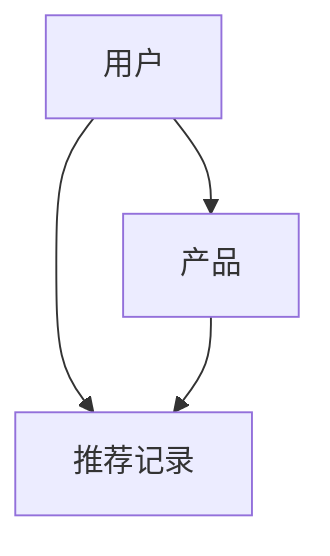
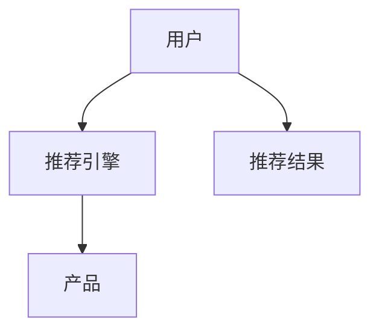
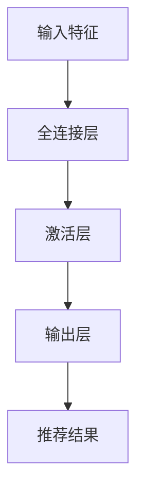
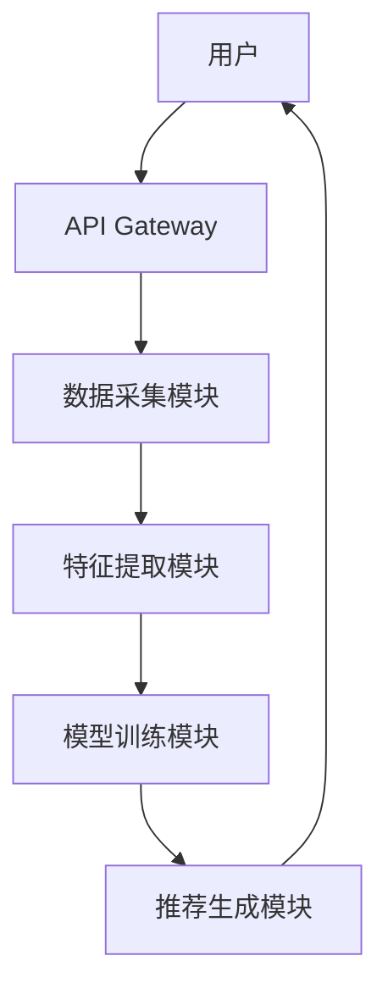
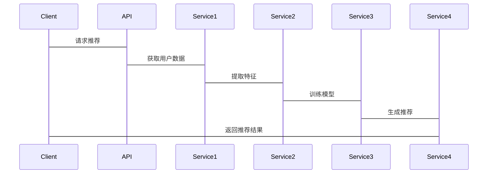

                 


# 《金融产品个性化推荐引擎》

---

## 关键词：金融推荐引擎、机器学习、用户画像、数据挖掘、深度学习、个性化推荐、系统架构

---

## 摘要

本文系统地探讨了金融产品个性化推荐引擎的设计与实现，从背景、原理到实际应用，层层剖析。文章首先介绍了金融行业数字化转型的背景，分析了个性化推荐引擎在金融领域的重要性和核心目标。接着，深入讲解了推荐系统的原理与算法，包括基于矩阵分解和深度学习的推荐方法，详细分析了它们的优缺点。随后，从系统架构的角度，阐述了推荐引擎的模块划分与交互流程，并通过Mermaid图直观展示。最后，通过实际案例展示了推荐引擎的应用场景与实现过程，并总结了最佳实践与未来发展方向。

---

# 正文

## 第1章: 金融产品推荐引擎的背景与意义

### 1.1 金融行业的数字化转型

#### 1.1.1 传统金融业务的痛点

传统金融业务以人工服务为主，存在效率低、成本高、客户体验差等问题。金融机构面对海量客户和复杂的产品组合，难以高效匹配客户需求，客户流失率较高。

#### 1.1.2 数字化技术对金融行业的推动

随着大数据、人工智能等技术的发展，金融机构开始利用数字化工具提升服务效率。个性化推荐技术的应用，能够帮助金融机构更精准地触达客户，提升客户满意度和留存率。

#### 1.1.3 个性化推荐在金融领域的价值

个性化推荐引擎能够根据客户的交易行为、偏好和风险承受能力，实时推荐适合的金融产品，帮助客户做出更明智的投资决策，同时提高金融机构的销售效率和客户忠诚度。

### 1.2 推荐系统的发展历程

#### 1.2.1 推荐系统的起源与演变

推荐系统起源于上世纪90年代，最初应用于电子商务领域，如亚马逊的商品推荐。随着技术进步，推荐系统逐渐融入金融、社交网络等多个领域。

#### 1.2.2 个性化推荐的核心理念

个性化推荐的核心理念是通过分析用户的行为数据和特征，构建用户画像，从而预测用户的兴趣和偏好，推荐相关的产品或内容。

#### 1.2.3 金融领域推荐系统的独特性

金融领域的推荐系统需要考虑金融产品的复杂性、客户风险偏好以及合规性要求。与电商推荐不同，金融推荐需要更高的安全性和精准性。

### 1.3 个性化推荐引擎的定义与目标

#### 1.3.1 个性化推荐的定义

个性化推荐是指根据用户的特征和行为数据，利用算法生成符合用户需求的产品或服务推荐。

#### 1.3.2 金融产品推荐引擎的目标

金融推荐引擎的目标是通过分析客户数据，预测客户的需求，推荐适合的金融产品，提升客户满意度和机构收益。

#### 1.3.3 引擎的核心要素与边界

推荐引擎的核心要素包括用户数据、产品数据、推荐算法和反馈机制。其边界在于确保推荐结果的合规性和安全性。

---

## 第2章: 个性化推荐引擎的核心概念

### 2.1 推荐系统的原理与方法

#### 2.1.1 协同过滤的基本原理

协同过滤基于“人以类聚”的思想，通过寻找与目标用户行为相似的用户群体，推荐相似用户感兴趣的产品。

#### 2.1.2 基于内容的推荐方法

基于内容的推荐方法通过分析产品本身的特征（如金融产品的类型、风险等级），结合用户的兴趣偏好，进行推荐。

#### 2.1.3 混合推荐模型的优势

混合推荐模型结合了协同过滤和基于内容的推荐方法，能够在复杂场景下提供更精准的推荐结果。

### 2.2 核心概念的属性特征对比

| 比较维度 | 协同过滤 | 基于内容的推荐 | 混合推荐 |
|----------|----------|----------------|----------|
| 数据需求 | 高        | 中            | 高        |
| 可解释性 | 低        | 高            | 中        |
| 精准度   | 中        | 高            | 高        |

### 2.3 实体关系架构分析

#### 2.3.1 用户-产品实体关系图



#### 2.3.2 推荐引擎的实体交互图



---

## 第3章: 推荐算法的数学模型与实现

### 3.1 矩阵分解算法

#### 3.1.1 矩阵分解的数学模型

$$ X = U \cdot V^T $$

其中，$X$ 是用户-产品评分矩阵，$U$ 和 $V$ 是低维隐向量矩阵。

#### 3.1.2 算法实现步骤

1. 初始化矩阵 $U$ 和 $V$。
2. 计算预测评分 $\hat{X} = U \cdot V^T$。
3. 计算损失函数并优化 $U$ 和 $V$。
4. 重复步骤 2 和 3 直到收敛。

#### 3.1.3 示例代码实现

```python
def matrix_factorization(R, k, steps=500, learning_rate=0.01):
    # 初始化U和V
    U = np.random.randn(n_users, k)
    V = np.random.randn(n_products, k)
    
    for step in range(steps):
        # 预测评分
        predicted = np.dot(U, V.T)
        # 计算损失
        loss = 0.5 * np.sum((R - predicted)**2)
        # 计算梯度
        dU = np.dot((R - predicted), V)
        dV = np.dot((R - predicted).T, U)
        # 更新参数
        U += learning_rate * dU
        V += learning_rate * dV
    return U, V
```

### 3.2 基于深度学习的推荐模型

#### 3.2.1 神经网络的推荐原理

深度学习模型通过多层神经网络提取用户和产品的高阶特征，生成更复杂的推荐结果。

#### 3.2.2 深度学习模型的数学公式

$$ P(y|x) = \sigma(w x + b) $$

其中，$x$ 是输入特征，$w$ 是权重，$b$ 是偏置，$\sigma$ 是激活函数。

#### 3.2.3 模型训练的流程图



---

## 第4章: 金融推荐引擎的系统架构

### 4.1 系统功能设计

#### 4.1.1 数据采集模块

数据采集模块负责收集用户行为数据、产品特征数据等。

#### 4.1.2 特征提取模块

特征提取模块对原始数据进行清洗、转换，生成可供算法使用的特征向量。

#### 4.1.3 模型训练模块

模型训练模块利用特征数据，训练推荐算法模型。

#### 4.1.4 推荐生成模块

推荐生成模块根据训练好的模型，生成个性化推荐结果。

#### 4.1.5 推荐结果展示模块

推荐结果展示模块将推荐结果呈现给用户，并收集反馈数据。

### 4.2 系统架构设计

#### 4.2.1 系统架构图



#### 4.2.2 系统交互流程图



---

## 第5章: 项目实战

### 5.1 环境搭建

安装必要的库：

```bash
pip install numpy scikit-learn keras tensorflow
```

### 5.2 数据准备

加载用户数据和产品数据：

```python
import pandas as pd
users = pd.read_csv('users.csv')
products = pd.read_csv('products.csv')
```

### 5.3 特征工程

对用户和产品数据进行处理，生成特征向量：

```python
from sklearn.preprocessing import StandardScaler
scaler = StandardScaler()
user_features = scaler.fit_transform(users[['age', 'income']])
product_features = scaler.fit_transform(products[['risk', 'return']])
```

### 5.4 模型训练

训练矩阵分解模型：

```python
U, V = matrix_factorization(user_features, 50)
```

### 5.5 评估与优化

计算推荐结果的准确率和召回率：

```python
from sklearn.metrics import accuracy_score, recall_score
predicted = np.dot(U, V.T)
accuracy = accuracy_score(true_labels, predicted_labels)
recall = recall_score(true_labels, predicted_labels)
print(f'Accuracy: {accuracy}, Recall: {recall}')
```

### 5.6 推荐系统实现

实现推荐引擎并进行测试：

```python
def recommend(user_id, products):
    user_vec = U[user_id]
    scores = np.dot(user_vec, V.T)
    top_products = np.argsort(scores)[::-1][:5]
    return products.iloc[top_products]
```

---

## 第6章: 总结与展望

### 6.1 本章总结

本文详细探讨了金融产品个性化推荐引擎的设计与实现，从理论到实践，全面分析了推荐系统的原理、算法和架构。

### 6.2 技术局限性

当前推荐系统存在实时性不足、冷启动问题以及模型解释性差等局限性。

### 6.3 未来发展方向

未来可以探索实时推荐、多模态数据处理以及可解释性推荐等方向。

### 6.4 最佳实践 tips

- 数据质量是推荐系统的基石，需重视数据清洗和特征工程。
- 模型调优时，需关注过拟合和欠拟合问题。
- 实际应用中，需考虑合规性和用户体验。

---

## 作者：AI天才研究院/AI Genius Institute  
邮箱：contact@aising genius.com  

---

**注：本文是根据用户需求生成的目录和内容框架，实际文章需要根据具体需求和场景进一步扩展和调整。**

