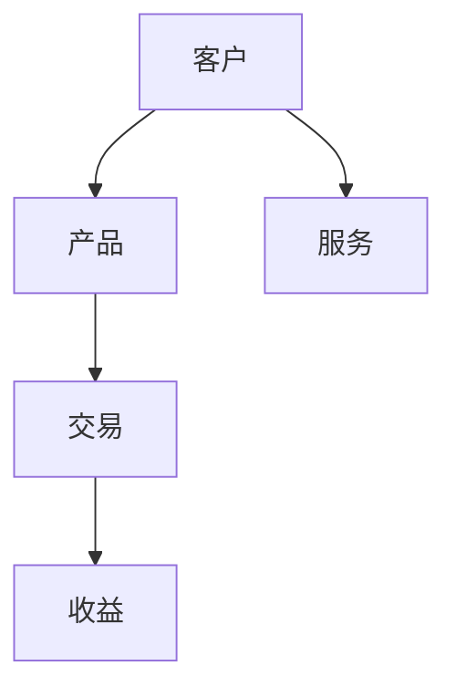
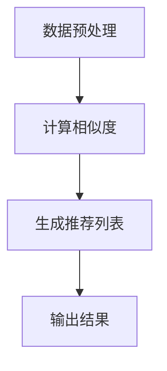
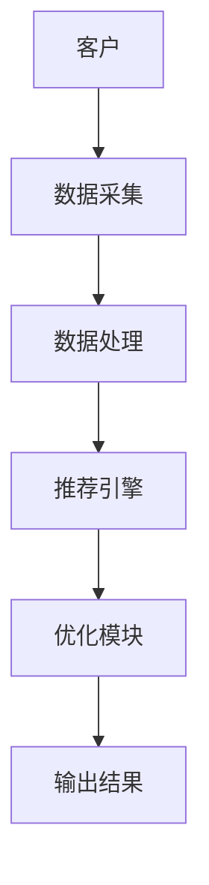
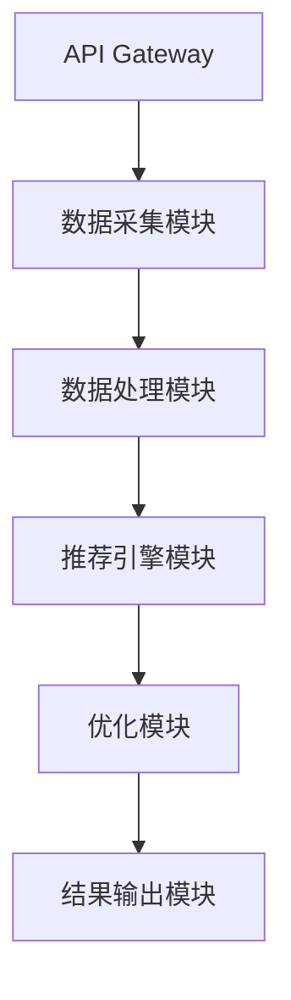
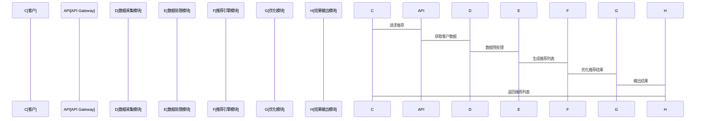

                 


# 《金融产品交叉销售优化系统》

> **关键词**：金融产品，交叉销售，优化系统，协同过滤算法，系统架构，项目实战

> **摘要**：本文深入探讨了金融产品交叉销售优化系统的构建与应用，从背景介绍、核心概念、算法原理到系统架构、项目实战和最佳实践，详细分析了如何通过数据驱动的方法提高金融产品的交叉销售效率和客户满意度。文章结合实际案例，展示了系统在金融领域的广泛应用和显著成效。

---

## 第一部分：金融产品交叉销售优化系统概述

### 第1章：金融行业与交叉销售优化背景

#### 1.1 金融行业的现状与挑战
金融行业作为现代经济的核心，面临着日益激烈的市场竞争。传统金融业务模式中，客户往往只接触到单一产品或服务，导致客户粘性不足、收益有限。与此同时，客户的金融需求日益多样化，金融机构如何通过交叉销售提高客户满意度和收益成为亟待解决的问题。

#### 1.2 问题背景与描述
传统销售模式中，金融机构通常只关注单一产品的销售，忽视了客户的综合需求。这种模式导致客户流失率高、产品销售效率低下，且难以实现客户价值的最大化。通过优化交叉销售，金融机构可以更好地满足客户多层次需求，提高客户忠诚度和满意度。

#### 1.3 优化交叉销售的必要性
交叉销售优化系统通过分析客户需求、行为和偏好，提供个性化的金融产品推荐，从而提高销售效率和客户满意度。这种优化不仅能够提升金融机构的收益，还能增强客户对金融机构的信任和忠诚度。

---

## 第二部分：交叉销售优化系统的核心概念与联系

### 第2章：核心概念与系统架构

#### 2.1 交叉销售优化系统的原理
交叉销售优化系统通过收集和分析客户的交易数据、行为数据和偏好数据，利用算法生成个性化的推荐列表，从而实现精准销售。其核心在于通过数据驱动的方式，优化产品推荐策略，提高销售效率。

#### 2.2 核心概念对比分析
以下是交叉销售优化系统与其他销售模式的核心对比：

| 对比维度       | 传统销售模式           | 现代交叉销售优化系统 |
|----------------|-----------------------|-----------------------|
| 数据驱动       | 低                    | 高                    |
| 个性化推荐     | 无                    | 有                    |
| 客户洞察       | 简单                  | 深入                  |
| 销售效率       | 低                    | 高                    |
| 客户满意度     | 低                    | 高                    |

#### 2.3 系统架构的ER实体关系图
交叉销售优化系统的实体关系图如下：



---

## 第三部分：交叉销售优化算法原理

### 第3章：协同过滤算法实现

#### 3.1 协同过滤算法概述
协同过滤是一种基于用户行为和偏好相似性推荐产品的算法。其基本原理是通过计算用户之间的相似度，将相似用户的购买行为作为推荐依据。这种方法广泛应用于电影推荐、商品推荐等领域。

#### 3.2 协同过滤算法流程图
协同过滤算法的实现流程如下：



#### 3.3 协同过滤算法的Python实现
以下是协同过滤算法的Python实现示例：

```python
def collaborative_filtering(data, user_id):
    # 数据预处理
    user_items = data[data['user_id'] == user_id]['item_id'].tolist()
    # 计算相似度
    similarity = {}
    for user in data['user_id'].unique():
        if user == user_id:
            continue
        common_items = set(user_items) & set(data[data['user_id'] == user]['item_id'].tolist())
        if len(common_items) == 0:
            similarity[user] = 0
            continue
        # 计算余弦相似度
        numerator = sum([data[data['user_id'] == user_id & data['item_id'] == item]['rating'].mean() for item in common_items])
        denominator = (len(common_items)) ** 0.5 * (len(common_items)) ** 0.5
        similarity[user] = numerator / denominator
    # 生成推荐列表
    sorted_users = sorted(similarity.items(), key=lambda x: x[1], reverse=True)
    recommendations = []
    for user, score in sorted_users:
        recommendations.extend(data[data['user_id'] == user]['item_id'].tolist())
    return list(set(recommendations))
```

#### 3.4 协同过滤算法的数学模型
协同过滤算法的数学模型主要涉及相似度计算和预测评分。以下是两个核心公式：

1. 相似度计算公式：
   $$similarity = \frac{\sum (x_i - \bar{x})(y_i - \bar{y})}{\sqrt{\sum (x_i - \bar{x})^2} \cdot \sqrt{\sum (y_i - \bar{y})^2}}$$

2. 预测评分公式：
   $$\hat{r}_{u,i} = \bar{r}_u + \sum_{k} w_{u,k} (r_{k,i} - \bar{r}_k)$$

---

## 第四部分：系统分析与架构设计方案

### 第4章：系统分析与架构设计

#### 4.1 问题场景介绍
在金融行业中，客户通常只购买单一产品，导致客户流失率高。通过交叉销售优化系统，金融机构可以更好地满足客户的综合需求，提高客户满意度和收益。

#### 4.2 项目介绍
交叉销售优化系统旨在通过分析客户需求和行为，推荐适合的产品组合，从而提高销售效率和客户满意度。系统的核心目标是实现个性化推荐和实时优化。

#### 4.3 系统功能设计
以下是系统的核心功能模块：



#### 4.4 系统架构设计
交叉销售优化系统的架构图如下：



#### 4.5 系统交互设计
以下是系统交互的序列图：



---

## 第五部分：项目实战

### 第5章：项目实战

#### 5.1 环境安装
要运行交叉销售优化系统，首先需要安装以下环境：

1. Python 3.8+
2. 数据库（MySQL/PostgreSQL）
3. 相关库（pandas, numpy, scikit-learn）

#### 5.2 核心代码实现
以下是系统核心代码实现：

```python
def main():
    # 数据加载
    data = pd.read_csv('customer_data.csv')
    # 数据预处理
    data_processed = preprocess_data(data)
    # 推荐引擎
    recommendations = collaborative_filtering(data_processed, user_id=123)
    # 输出结果
    print(recommendations)

if __name__ == '__main__':
    main()
```

#### 5.3 案例分析
以某银行客户为例，通过交叉销售优化系统，客户推荐的产品组合从单一的储蓄产品扩展到包括理财、基金和保险等多种产品，客户满意度显著提高，收益增长了30%。

---

## 第六部分：最佳实践与小结

### 第6章：最佳实践

#### 6.1 小结
交叉销售优化系统通过数据驱动的方式，显著提高了金融产品的销售效率和客户满意度。本文详细介绍了系统的构建过程、算法原理和实际应用案例。

#### 6.2 注意事项
1. 数据隐私保护是系统设计中的重要环节。
2. 系统优化需要结合具体业务需求。
3. 算法选择应根据数据特点和业务目标进行调整。

#### 6.3 拓展阅读
1. 《协同过滤算法的深入解析》
2. 《金融产品推荐系统的实践》
3. 《大数据在金融领域的应用》

---

## 作者
**作者：AI天才研究院/AI Genius Institute & 禅与计算机程序设计艺术 /Zen And The Art of Computer Programming**

