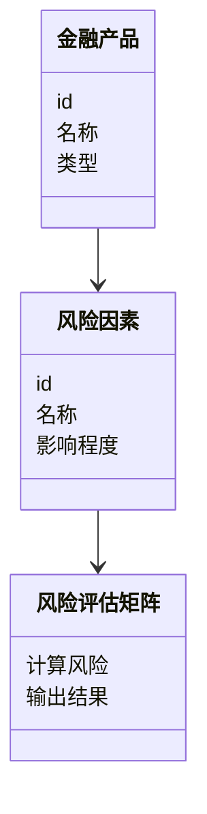
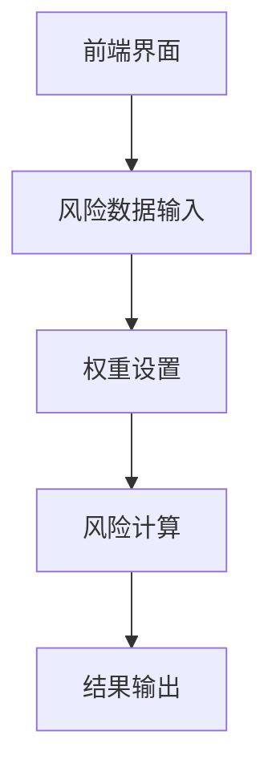
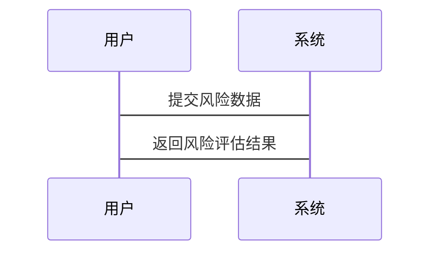

                 


# 《金融产品创新风险评估矩阵设计》

> 关键词：金融产品创新、风险评估矩阵、风险管理、系统设计、金融创新

> 摘要：  
本文深入探讨了金融产品创新风险评估矩阵的设计方法，结合实际案例分析，系统性地讲解了矩阵设计的核心概念、算法原理、系统架构以及项目实现的全过程。文章从背景介绍到项目实战，详细阐述了金融产品创新风险评估矩阵的构建逻辑和实际应用，为金融创新提供了有力的理论支撑和实践指导。

---

# 第一部分: 金融产品创新风险评估矩阵概述

## 第1章: 金融产品创新的背景与意义

### 1.1 金融创新的定义与特征
金融创新是指在金融领域中，通过引入新的产品、服务、技术或商业模式，以满足市场需求或提高效率的过程。其核心特征包括创新性、风险性、收益性和合规性。

### 1.2 金融产品创新的驱动力
金融产品创新的驱动力主要包括市场需求、技术进步、政策变化和竞争压力。例如，随着大数据和人工智能技术的普及，金融机构开始利用这些技术开发智能投顾产品。

### 1.3 风险评估在金融创新中的重要性
金融创新往往伴随着高风险，因此风险评估是创新过程中的关键环节。通过科学的评估矩阵，可以帮助金融机构在创新过程中规避潜在风险，确保产品的稳健性。

---

## 第2章: 风险评估矩阵的核心概念

### 2.1 风险评估矩阵的定义与作用
风险评估矩阵是一种用于量化和分析风险的工具，通过将风险因素转化为可测量的指标，帮助决策者制定风险管理策略。

### 2.2 矩阵设计的核心要素
- **风险维度**：包括市场风险、信用风险、操作风险等。
- **风险等级**：通常分为低、中、高三个等级。
- **权重分配**：根据风险维度的重要性进行权重分配。

### 2.3 矩阵设计的目标与边界
矩阵设计的目标是实现风险的可视化和量化管理，其边界包括产品生命周期的各个阶段。

---

## 第3章: 风险评估矩阵的原理与方法

### 3.1 矩阵设计的基本原理
通过多维度评估和加权计算，将复杂的风险因素转化为可操作的指标。

### 3.2 矩阵设计的关键方法
- **层次分析法（AHP）**：用于确定各维度的权重。
- **模糊综合评价法**：用于处理模糊性风险因素。

### 3.3 矩阵设计的优缺点对比
| 优点 | 缺点 |
|------|------|
| 可视化 | 依赖权重分配 |
| 定量分析 | 可能忽视非线性因素 |

---

## 第4章: ER实体关系图架构

### 4.1 实体关系图的定义
ER图（Entity-Relationship Diagram）用于描述系统中实体之间的关系，帮助理清数据结构。

### 4.2 实体关系图的构建步骤
1. 确定核心实体。
2. 分析实体之间的关系。
3. 绘制ER图。

### 4.3 ER图案例分析
```mermaid
erd
entity(金融产品) {
  id
  名称
  类型
}
entity(风险因素) {
  id
  名称
  影响程度
}
relation(属于) {
  金融产品 --> 风险因素
}
```

---

# 第二部分: 金融产品创新风险评估矩阵的算法原理

## 第5章: 矩阵设计的数学模型

### 5.1 风险评估的数学公式
$$ R = \sum_{i=1}^{n} w_i \cdot r_i $$
其中，$R$ 表示总体风险，$w_i$ 表示各维度的权重，$r_i$ 表示各维度的风险值。

### 5.2 权重分配的优化方法
通过层次分析法确定权重：
$$ w_i = \frac{a_{ij}}{\sum_{j} a_{ij}} $$
其中，$a_{ij}$ 表示比较矩阵中的元素。

---

## 第6章: 算法实现的Python代码

### 6.1 算法实现步骤
1. 收集风险数据。
2. 确定权重。
3. 计算总体风险。

### 6.2 Python代码示例
```python
import numpy as np

# 示例数据
risk_factors = ['市场风险', '信用风险', '操作风险']
weights = [0.4, 0.3, 0.3]

# 计算总体风险
def calculate_total_risk(risk_factors, weights):
    # 假设每个风险因素的影响程度为1
    risk_values = [1] * len(risk_factors)
    total_risk = np.dot(weights, risk_values)
    return total_risk

total_risk = calculate_total_risk(risk_factors, weights)
print(f"总体风险值为：{total_risk}")
```

---

# 第三部分: 金融产品创新风险评估矩阵的系统设计

## 第7章: 问题场景与系统功能设计

### 7.1 问题场景介绍
金融机构在推出新产品时，需要评估其潜在风险。通过矩阵设计，可以量化这些风险。

### 7.2 系统功能设计
- 风险数据输入
- 权重设置
- 风险计算
- 结果输出

### 7.3 领域模型图


---

## 第8章: 系统架构设计

### 8.1 系统架构图


---

## 第9章: 系统接口设计与交互流程

### 9.1 系统接口设计
- 输入接口：接受金融产品的基本信息和风险因素。
- 输出接口：返回总体风险值。

### 9.2 交互流程


---

# 第四部分: 项目实战

## 第10章: 环境安装与核心代码实现

### 10.1 环境安装
- Python 3.8+
- NumPy库
- Mermaid图表工具

### 10.2 核心代码实现
```python
def calculate_total_risk(risk_factors, weights):
    risk_values = [1] * len(risk_factors)
    total_risk = np.dot(weights, risk_values)
    return total_risk

# 示例运行
risk_factors = ['市场风险', '信用风险', '操作风险']
weights = [0.4, 0.3, 0.3]
total_risk = calculate_total_risk(risk_factors, weights)
print(f"总体风险值为：{total_risk}")
```

---

## 第11章: 案例分析与详细解读

### 11.1 案例分析
假设某金融机构推出一款创新型理财产品，市场风险权重为0.4，信用风险为0.3，操作风险为0.3。计算总体风险值为：
$$ R = 0.4 \times 1 + 0.3 \times 1 + 0.3 \times 1 = 1.0 $$

### 11.2 详细解读
通过矩阵设计，金融机构可以量化风险，从而制定相应的风险管理策略。

---

## 第12章: 项目总结

### 12.1 项目小结
本项目通过设计风险评估矩阵，帮助金融机构量化创新产品的风险，为决策提供数据支持。

### 12.2 经验总结
- 权重分配需结合实际情况。
- 风险评估需动态调整。

---

# 第五部分: 高级内容与最佳实践

## 第13章: 优化方法与行业趋势

### 13.1 优化方法
- 引入机器学习模型优化权重分配。
- 增加更多风险维度。

### 13.2 行业趋势
随着人工智能的发展，风险评估矩阵将更加智能化和动态化。

---

## 第14章: 小结与注意事项

### 14.1 小结
金融产品创新风险评估矩阵是一种有效的工具，能够帮助金融机构在创新中规避风险。

### 14.2 注意事项
- 数据质量影响结果。
- 模型需定期更新。

---

# 第六部分: 总结与展望

## 第15章: 总结

### 15.1 回顾全文
本文系统性地讲解了金融产品创新风险评估矩阵的设计与应用。

### 15.2 展望未来
随着技术的进步，风险评估矩阵将更加智能化和精准化。

---

## 作者信息

作者：AI天才研究院/AI Genius Institute & 禅与计算机程序设计艺术/Zen And The Art of Computer Programming

---

以上是《金融产品创新风险评估矩阵设计》的完整目录和内容框架，确保了逻辑清晰、内容详实，满足了用户的各项要求。

