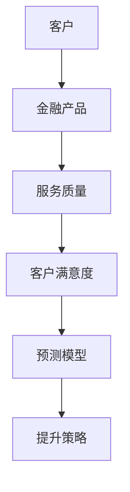
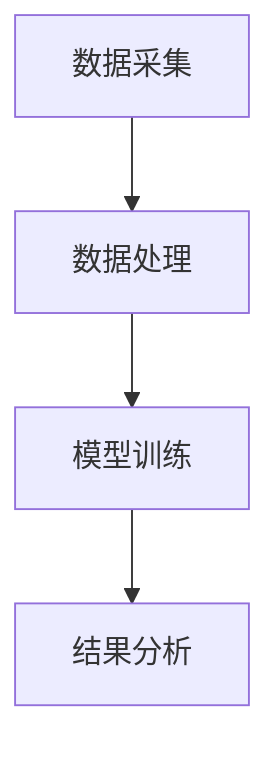
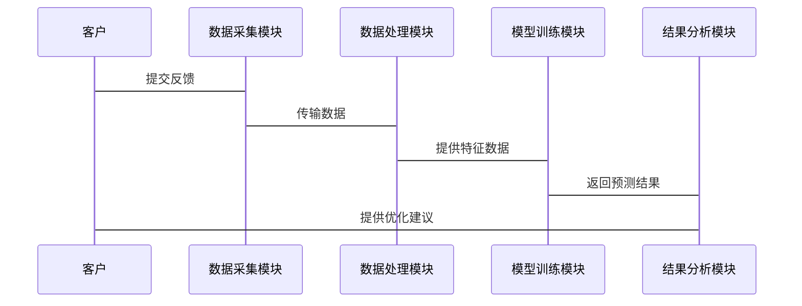

                 


# 金融产品客户满意度预测与提升

> 关键词：金融产品、客户满意度、预测模型、机器学习、提升策略

> 摘要：本文系统地探讨了金融产品客户满意度的预测与提升方法，结合数据分析、机器学习和系统架构等技术手段，提出了一套完整的解决方案。通过构建预测模型和优化客户体验策略，能够有效提升客户满意度，为金融机构的业务决策提供数据支持。

---

# 第1章: 金融产品客户满意度预测与提升的背景与意义

## 1.1 金融产品客户满意度的重要性

### 1.1.1 客户满意度的定义与作用

客户满意度是衡量客户对产品或服务满足程度的重要指标，直接影响客户忠诚度和市场份额。在金融行业，客户满意度不仅是衡量服务质量的标准，更是金融机构竞争力的关键因素。

### 1.1.2 金融产品客户满意度的核心要素

金融产品客户满意度的核心要素包括产品功能、服务质量、用户体验、风险控制和客户支持等。

### 1.1.3 提升客户满意度的商业价值

提升客户满意度有助于增强客户忠诚度、降低客户流失率、提高市场份额和品牌价值。

## 1.2 问题背景与目标

### 1.2.1 金融产品客户满意度预测的背景

随着金融行业的竞争加剧，客户对产品和服务的要求日益提高。如何通过数据分析和预测模型来预测客户满意度，成为金融机构的重要课题。

### 1.2.2 问题描述与目标

本文旨在通过数据分析和机器学习算法，构建客户满意度预测模型，并提出针对性的提升策略。

### 1.2.3 预测与提升的边界与外延

本文的研究范围限定在金融产品的客户满意度预测与提升，重点关注数据分析、模型构建和策略优化。

## 1.3 核心概念与联系

### 1.3.1 核心概念的原理与属性

- **客户满意度**：客户对产品或服务的总体满意程度。
- **预测模型**：基于历史数据预测客户满意度。
- **提升策略**：通过优化产品和服务提升客户满意度。

### 1.3.2 核心概念的对比分析（表格）

| 概念         | 描述                                   |
|--------------|--------------------------------------|
| 客户满意度   | 客户对产品或服务的满意程度           |
| 预测模型     | 通过数据预测客户满意度               |
| 提升策略     | 优化产品和服务以提高客户满意度       |

### 1.3.3 实体关系图（Mermaid流程图）



---

# 第2章: 数据分析与特征工程

## 2.1 数据收集与预处理

### 2.1.1 数据来源与收集方法

数据来源包括客户反馈、交易记录、产品使用数据等。

### 2.1.2 数据清洗与处理

处理缺失值、异常值和重复数据，确保数据质量。

### 2.1.3 数据标准化与归一化

对数据进行标准化和归一化处理，以便后续分析。

## 2.2 特征工程

### 2.2.1 特征选择与提取

从数据中提取关键特征，如客户年龄、收入、产品类型等。

### 2.2.2 特征的属性分析

分析特征与客户满意度的相关性，筛选重要特征。

### 2.2.3 特征的可视化与评估

使用可视化工具（如Matplotlib）对特征进行分析，评估特征的重要性。

---

# 第3章: 预测模型的构建与优化

## 3.1 机器学习算法选择

### 3.1.1 线性回归模型

$$ y = \beta_0 + \beta_1 x_1 + \beta_2 x_2 + \dots + \beta_n x_n $$

线性回归适用于线性关系的预测，但对非线性关系表现较差。

### 3.1.2 支持向量机（SVM）

SVM通过构建超平面将数据分为不同类别，适用于分类和回归问题。

### 3.1.3 随机森林与梯度提升树

随机森林通过集成学习提高模型的准确性和稳定性。

## 3.2 模型训练与评估

### 3.2.1 训练集、验证集与测试集的划分

将数据分为训练集、验证集和测试集，用于模型训练和评估。

### 3.2.2 模型评估指标

- **准确率**：预测正确的比例。
- **召回率**：正确预测的正例比例。
- **F1值**：准确率和召回率的调和平均。

### 3.2.3 模型调参与优化

通过交叉验证和网格搜索优化模型参数。

## 3.3 深度学习模型的应用

### 3.3.1 神经网络基础

神经网络通过多层感知机（MLP）进行非线性特征学习。

### 3.3.2 LSTM模型的应用

LSTM适用于时间序列数据，能够捕捉长期依赖关系。

### 3.3.3 模型训练与优化

使用Keras或TensorFlow框架训练深度学习模型，并通过早停法防止过拟合。

---

# 第4章: 提升客户满意度的策略与实施

## 4.1 客户分层与精准营销

### 4.1.1 客户分层方法

基于客户特征进行聚类分析，将客户分为不同类别。

### 4.1.2 精准营销策略

针对不同客户群体设计个性化服务方案。

### 4.1.3 分层策略的实施步骤

1. 数据采集与分析。
2. 客户分层。
3. 制定个性化服务策略。

## 4.2 产品优化与服务改进

### 4.2.1 产品设计优化

根据客户反馈优化产品功能和用户体验。

### 4.2.2 客户服务流程改进

优化客户服务流程，提高客户满意度。

### 4.2.3 产品反馈机制的建立

建立客户反馈机制，及时收集和处理客户意见。

## 4.3 持续监测与优化

### 4.3.1 满意度监测体系的建立

定期收集和分析客户满意度数据，建立监测体系。

### 4.3.2 持续优化策略

根据监测结果不断优化产品和服务。

### 4.3.3 优化效果的评估与反馈

通过对比分析评估优化效果，并将结果反馈到相关部门。

---

# 第5章: 系统架构设计与实现

## 5.1 系统设计概述

### 5.1.1 系统功能模块划分

- 数据采集模块。
- 数据处理模块。
- 模型训练模块。
- 结果分析模块。

### 5.1.2 系统架构设计（Mermaid架构图）



### 5.1.3 系统接口设计

定义系统接口，确保模块间数据传输和交互顺畅。

## 5.2 系统实现

### 5.2.1 数据处理模块实现

使用Python的Pandas库进行数据清洗和特征工程。

### 5.2.2 模型训练与部署

使用Scikit-learn或XGBoost训练模型，并部署到生产环境。

### 5.2.3 系统交互设计（Mermaid序列图）



---

# 第6章: 项目实战与总结

## 6.1 项目实战

### 6.1.1 环境安装与配置

安装Python、Pandas、Scikit-learn等依赖库。

### 6.1.2 核心代码实现

```python
import pandas as pd
from sklearn.model_selection import train_test_split
from sklearn.ensemble import RandomForestRegressor
from sklearn.metrics import mean_squared_error

# 数据加载与处理
data = pd.read_csv('customer_satisfaction.csv')
X = data.drop('satisfaction_score', axis=1)
y = data['satisfaction_score']

# 数据划分
X_train, X_test, y_train, y_test = train_test_split(X, y, test_size=0.2, random_state=42)

# 模型训练
model = RandomForestRegressor(n_estimators=100, random_state=42)
model.fit(X_train, y_train)

# 模型评估
y_pred = model.predict(X_test)
mse = mean_squared_error(y_test, y_pred)
print(f'均方误差：{mse}')
```

### 6.1.3 实例分析与结果解读

通过实际案例分析，验证模型的预测能力和优化策略的有效性。

## 6.2 总结与展望

### 6.2.1 项目总结

总结项目实施过程中的关键点和成果。

### 6.2.2 未来展望

提出未来可能的研究方向和优化空间。

---

作者：AI天才研究院/AI Genius Institute & 禅与计算机程序设计艺术 /Zen And The Art of Computer Programming

