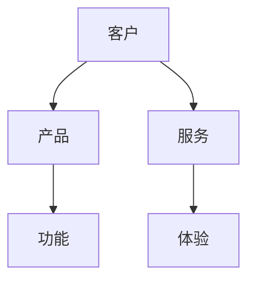
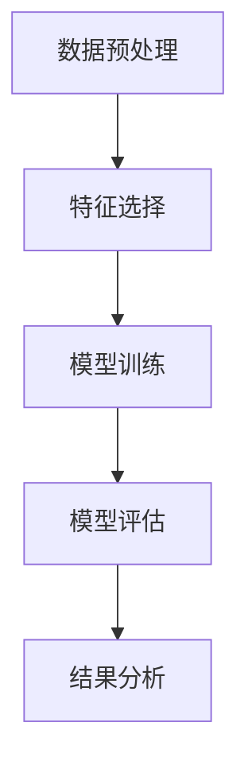
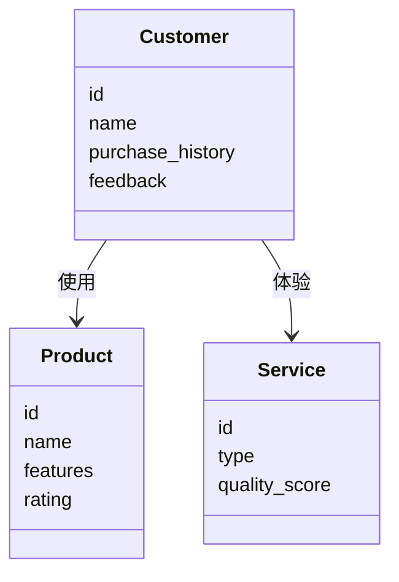
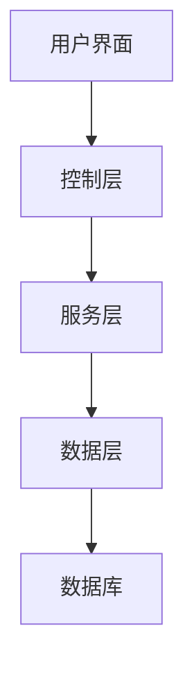
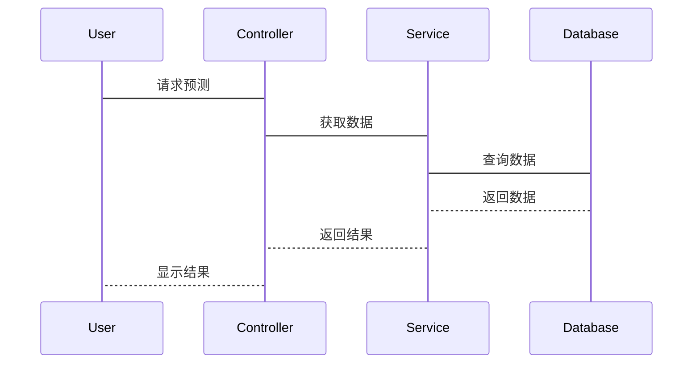

                 


# 《金融产品客户满意度预测与提升策略引擎》

## 关键词：客户满意度预测、金融产品、机器学习、大数据分析、客户体验、满意度提升策略、预测模型

## 摘要：本文将深入探讨如何利用机器学习和大数据分析技术，构建金融产品客户满意度预测模型，并提出有效的提升策略。通过分析客户满意度的核心要素，选择合适的算法，设计系统的架构，最终实现客户满意度的预测与提升策略引擎，帮助企业优化客户体验和提升客户忠诚度。

---

# 第一部分：背景介绍

## 第1章：客户满意度预测与提升的背景与重要性

### 1.1 什么是客户满意度
- 1.1.1 客户满意度的定义与衡量标准
- 1.1.2 金融产品客户满意度的核心要素
- 1.1.3 客户满意度对金融机构的价值

### 1.2 为什么需要预测客户满意度
- 1.2.1 金融行业的竞争压力
- 1.2.2 客户流失对企业的影响
- 1.2.3 提升客户满意度的经济价值

### 1.3 问题背景与目标
- 1.3.1 当前客户满意度预测的挑战
- 1.3.2 本研究的目标与意义
- 1.3.3 研究范围与边界

---

# 第二部分：核心概念与联系

## 第2章：金融产品客户满意度的核心概念

### 2.1 客户满意度预测的核心要素
- 2.1.1 产品特性
- 2.1.2 客户特征
- 2.1.3 服务体验

### 2.2 金融产品客户满意度的影响因素
- 2.2.1 产品功能与特性
- 2.2.2 服务质量与效率
- 2.2.3 客户期望与实际体验

### 2.3 金融产品客户满意度的量化指标
- 2.3.1 客户满意度评分模型
- 2.3.2 满意度与客户行为的关系
- 2.3.3 满意度与客户忠诚度的关联

## 第3章：金融产品客户满意度预测的核心概念与联系

### 3.1 核心概念的原理
- 3.1.1 数据驱动的客户满意度预测
- 3.1.2 机器学习在满意度预测中的应用
- 3.1.3 数据预处理与特征工程

### 3.2 核心概念的属性特征对比
- 3.2.1 不同模型的优缺点对比
- 3.2.2 数据特征的重要性排序
- 3.2.3 模型性能的评估指标

### 3.3 ER实体关系图架构


---

# 第三部分：算法原理与实现

## 第4章：金融产品客户满意度预测的算法原理

### 4.1 常见算法概述
- 4.1.1 线性回归
- 4.1.2 支持向量机
- 4.1.3 随机森林
- 4.1.4 神经网络

### 4.2 算法原理与流程


### 4.3 算法实现代码
```python
import pandas as pd
from sklearn.model_selection import train_test_split
from sklearn.linear_model import LinearRegression

# 示例数据加载
data = pd.read_csv('customer_satisfaction.csv')
X = data[['feature1', 'feature2', ...]]
y = data['target']

# 数据分割
X_train, X_test, y_train, y_test = train_test_split(X, y, test_size=0.2)

# 模型训练
model = LinearRegression()
model.fit(X_train, y_train)

# 模型预测
predictions = model.predict(X_test)
```

### 4.4 数学公式与模型解读
- 线性回归模型：$$ y = \beta_0 + \beta_1x_1 + \beta_2x_2 + ... + \beta_nx_n $$
- 随机森林模型：基于决策树的集成学习方法，通过投票或平均的方式进行预测。

---

# 第四部分：系统架构与设计

## 第5章：系统分析与架构设计方案

### 5.1 问题场景介绍
- 客户满意度预测的业务场景
- 系统目标与功能需求

### 5.2 系统功能设计


### 5.3 系统架构设计


### 5.4 系统接口设计与交互


---

# 第五部分：项目实战与应用

## 第6章：项目实战与实现

### 6.1 环境安装与数据准备
- 安装Python、机器学习库（如scikit-learn、xgboost）
- 数据集获取与预处理

### 6.2 核心系统实现
- 数据预处理与特征工程
- 模型训练与优化
- 模型部署与接口开发

### 6.3 代码实现与解读
```python
from sklearn.ensemble import RandomForestRegressor
from sklearn.metrics import mean_squared_error

# 数据加载与分割
data = pd.read_csv('customer_satisfaction.csv')
X = data[['feature1', 'feature2', ...]]
y = data['target']

X_train, X_test, y_train, y_test = train_test_split(X, y, test_size=0.2)

# 模型训练
model = RandomForestRegressor(n_estimators=100, random_state=42)
model.fit(X_train, y_train)

# 模型评估
score = model.score(X_test, y_test)
print(f"模型得分: {score}")
print(f"均方误差: {mean_squared_error(y_test, model.predict(X_test))}")
```

### 6.4 实际案例分析
- 某银行信用卡客户满意度预测案例
- 模型效果分析与优化建议

---

# 第六部分：最佳实践与总结

## 第7章：最佳实践与经验分享

### 7.1 最佳实践
- 数据清洗与特征工程的重要性
- 模型选择与调优的技巧
- 系统设计与部署的注意事项

### 7.2 小结与总结
- 本文的核心内容回顾
- 未来研究方向与改进空间

### 7.3 注意事项与风险提示
- 数据隐私与安全问题
- 模型的可解释性与鲁棒性
- 业务场景与技术的结合

### 7.4 拓展阅读与学习资源
- 推荐书籍与论文
- 在线课程与技术博客

---

# 作者：AI天才研究院/AI Genius Institute & 禅与计算机程序设计艺术 /Zen And The Art of Computer Programming

