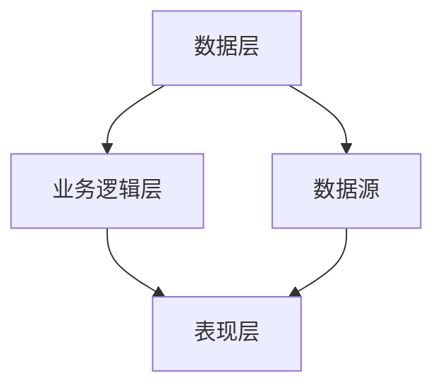

                 


# 《金融产品客户满意度预测系统》

**关键词：** 客户满意度预测、机器学习、金融产品、数据分析、系统设计

**摘要：**  
本文详细探讨了金融产品客户满意度预测系统的构建与实现。通过分析客户满意度预测的核心问题，结合机器学习算法和系统架构设计，提出了一套完整的解决方案。本文从问题背景、核心概念、算法原理、系统架构到项目实战，全面阐述了系统的实现过程，并通过实际案例展示了系统的应用价值。本文旨在为金融行业的客户满意度预测提供理论支持和实践指导。

---

## 第一部分: 问题背景与目标

### 第1章: 问题背景与目标

#### 1.1 客户满意度预测的背景介绍
随着金融行业的快速发展，客户满意度已成为衡量金融机构服务质量的重要指标。金融产品的复杂性和多样性使得客户满意度的预测变得尤为重要。通过预测客户满意度，金融机构可以提前发现潜在问题，优化产品设计和服务流程，从而提升客户忠诚度和市场竞争力。

#### 1.2 问题描述与解决思路
客户满意度预测的核心问题是基于客户行为数据和产品特征，构建一个能够准确预测客户满意度的模型。本文提出以下解决思路：
1. **数据采集与预处理：** 收集客户行为数据、产品特征数据和满意度评分数据，并进行数据清洗和特征工程。
2. **模型选择与优化：** 通过对比不同机器学习算法（如随机森林、支持向量机、神经网络等），选择最适合的模型并进行调参优化。
3. **系统设计与实现：** 设计一个模块化的系统架构，包括数据采集、模型训练、结果展示等功能模块。

#### 1.3 核心概念与系统架构
客户满意度预测系统的核心概念包括：
- **数据特征：** 客户行为数据（如交易频率、投资金额）、产品特征（如产品类型、风险等级）。
- **模型选择：** 基于数据特征选择合适的预测模型。
- **系统架构：** 采用分层架构，包括数据层、业务逻辑层和表现层。

**系统架构图（Mermaid）：**


---

## 第二部分: 核心概念与系统架构

### 第2章: 客户满意度预测的核心原理

#### 2.1 数据特征与分析
- **数据特征的分类与选择：** 数据特征可以分为客户行为特征、产品特征和市场特征。通过特征工程选择最具影响力的因素。
- **数据预处理方法：** 数据清洗（处理缺失值、异常值）、数据标准化、特征降维（如PCA）。

#### 2.2 模型选择与优化
- **常见预测模型的优缺点：**
  - 随机森林：适用于特征工程复杂，但对特征相关性敏感。
  - 支持向量机：适合小数据集，分类效果好。
  - 神经网络：适合大数据集，但训练时间较长。
- **模型选择的策略与方法：** 基于交叉验证和网格搜索进行模型调优。

#### 2.3 系统架构设计
- **系统分层架构：** 数据层负责数据存储与处理，业务逻辑层负责模型训练与预测，表现层负责结果展示与交互。
- **模块的功能与交互：**
  - 数据采集模块：从数据库中读取客户数据。
  - 数据处理模块：进行数据清洗和特征工程。
  - 模型训练模块：选择并训练预测模型。
  - 结果展示模块：可视化预测结果。

---

## 第三部分: 算法原理与数学模型

### 第3章: 预测算法的原理与实现

#### 3.1 算法选择与流程
- **算法选择：** 基于数据特征和业务需求选择随机森林作为预测模型。
- **算法实现流程：**
  1. 数据预处理。
  2. 特征选择。
  3. 模型训练。
  4. 模型评估。

#### 3.2 算法实现的数学模型
- **特征选择的数学方法：** 使用信息增益或互信息进行特征选择。
- **模型训练的数学公式：**
  随机森林的预测公式为：
  $$ y = \text{预测值} $$
  其中，$y$ 是模型输出的满意度评分。
- **模型评估的数学指标：** 使用准确率、召回率、F1值等指标评估模型性能。

#### 3.3 算法实现的代码示例
```python
import pandas as pd
from sklearn.ensemble import RandomForestClassifier
from sklearn.metrics import accuracy_score

# 数据预处理
data = pd.read_csv('customer_data.csv')
X = data.drop('satisfaction_score', axis=1)
y = data['satisfaction_score']

# 特征选择
selected_features = ['transaction_frequency', 'investment_amount', 'product_risk']
X_selected = X[selected_features]

# 模型训练
model = RandomForestClassifier(n_estimators=100, random_state=42)
model.fit(X_selected, y)

# 模型预测
y_pred = model.predict(X_selected)
print("准确率:", accuracy_score(y, y_pred))
```

---

## 第四部分: 系统分析与设计

### 第4章: 系统功能与架构设计

#### 4.1 系统功能模块划分
- **数据采集模块：** 从数据库中读取客户数据。
- **数据处理模块：** 进行数据清洗和特征工程。
- **模型训练模块：** 选择并训练预测模型。
- **结果展示模块：** 可视化预测结果。

#### 4.2 系统架构设计
- **分层架构：** 数据层、业务逻辑层和表现层。
- **模块交互：**
  - 数据层与业务逻辑层交互。
  - 业务逻辑层与表现层交互。

**系统架构图（Mermaid）：**


---

## 第五部分: 项目实战

### 第5章: 项目实战与案例分析

#### 5.1 环境安装
- 安装Python和相关库（如Pandas、Scikit-learn）。
- 安装Jupyter Notebook用于代码实现。

#### 5.2 系统核心实现
```python
import pandas as pd
from sklearn.ensemble import RandomForestClassifier
from sklearn.metrics import accuracy_score

# 数据预处理
data = pd.read_csv('customer_data.csv')
X = data.drop('satisfaction_score', axis=1)
y = data['satisfaction_score']

# 特征选择
selected_features = ['transaction_frequency', 'investment_amount', 'product_risk']
X_selected = X[selected_features]

# 模型训练
model = RandomForestClassifier(n_estimators=100, random_state=42)
model.fit(X_selected, y)

# 模型预测
y_pred = model.predict(X_selected)
print("准确率:", accuracy_score(y, y_pred))
```

#### 5.3 案例分析
- 通过实际案例分析，展示系统的预测能力和实际应用价值。

---

## 第六部分: 最佳实践

### 第6章: 最佳实践与小结

#### 6.1 系统的优势与不足
- 优势：能够准确预测客户满意度，提供数据支持。
- 不足：需要大量数据支持，模型调优时间较长。

#### 6.2 使用中的注意事项
- 数据质量和完整性对模型性能影响较大。
- 模型调优需要结合业务背景进行。

#### 6.3 拓展阅读
- 推荐阅读相关领域的书籍和论文，深入学习客户满意度预测的前沿技术。

---

## 作者：AI天才研究院 & 禅与计算机程序设计艺术

