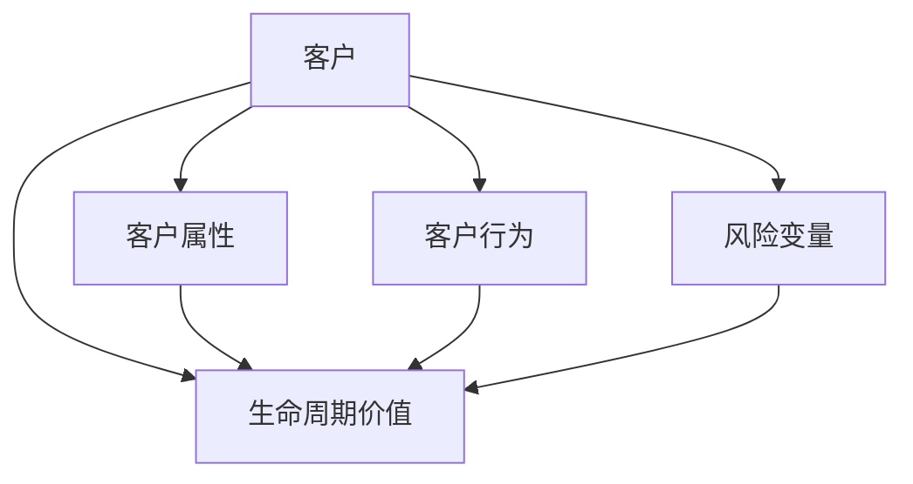
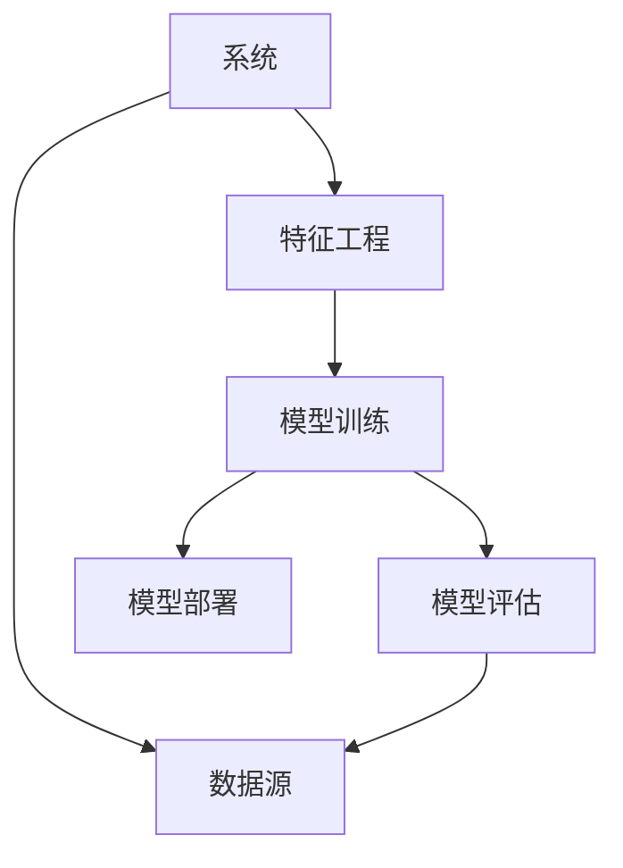

                 


# 《金融产品客户生命周期价值预测》

---

## 关键词：  
客户生命周期价值（CLV）、金融产品、预测模型、机器学习、数据挖掘、客户价值管理

---

## 摘要：  
本文深入探讨了金融产品客户生命周期价值（CLV）预测的核心概念、算法原理、系统架构和项目实战。通过背景介绍、核心概念分析、算法选择与实现、系统设计以及实际案例，本文为读者提供了从理论到实践的全面指导，帮助金融机构更好地预测客户价值，优化资源配置，提升客户满意度和业务收益。

---

# 正文

## 第1章: 客户生命周期价值预测的背景与意义

### 1.1 客户生命周期价值（CLV）的定义  
客户生命周期价值（Customer Lifetime Value，CLV）是指一个客户在其整个生命周期内为企业带来的净收益。在金融产品领域，CLV预测能够帮助金融机构识别高价值客户，优化资源配置，提升客户忠诚度和满意度。  

### 1.2 CLV预测的商业价值  
CLV预测能够帮助金融机构：  
- **优化营销策略**：通过识别高价值客户，制定精准的营销计划，降低营销成本。  
- **提升客户满意度**：通过了解客户需求，提供个性化服务，增强客户忠诚度。  
- **降低客户流失率**：通过预测客户流失风险，采取主动措施挽留客户。  

### 1.3 CLV预测的应用场景  
在金融产品领域，CLV预测适用于以下场景：  
- **银行信用卡业务**：预测客户消费行为，优化授信额度和营销策略。  
- **保险产品**：预测客户续保概率，优化保费定价策略。  
- **理财产品**：预测客户投资行为，优化产品推荐策略。  

---

## 第2章: 客户生命周期价值预测的核心概念与联系

### 2.1 客户生命周期价值的核心要素  
客户生命周期价值的核心要素包括：  
1. **客户属性**：性别、年龄、职业、收入水平等。  
2. **客户行为**：消费频率、消费金额、产品使用情况等。  
3. **客户价值的度量方法**：基于历史数据计算客户贡献值。  

### 2.2 CLV预测的关键变量  
CLV预测的关键变量包括：  
- **收入变量**：客户的历史收入、消费金额。  
- **行为变量**：客户的购买频率、产品使用情况。  
- **风险变量**：客户违约概率、流失概率。  

### 2.3 客户生命周期价值预测的实体关系图  
以下是CLV预测的实体关系图：  



---

## 第3章: 客户生命周期价值预测的算法原理

### 3.1 常见的CLV预测算法  
CLV预测常用的算法包括：  
1. **线性回归模型**：适用于线性关系的预测。  
2. **随机森林模型**：适用于非线性关系的预测，具有较高的准确性和鲁棒性。  
3. **神经网络模型**：适用于复杂非线性关系的预测，能够处理高维数据。  

### 3.2 线性回归模型的原理与实现  

#### 线性回归模型的数学公式  
线性回归模型的数学公式为：  
$$ y = \beta_0 + \beta_1 x_1 + \beta_2 x_2 + \cdots + \beta_n x_n + \epsilon $$  
其中，$y$ 是目标变量，$x_i$ 是自变量，$\beta_i$ 是回归系数，$\epsilon$ 是误差项。  

#### 线性回归模型的实现步骤  
1. **数据预处理**：标准化特征变量。  
2. **模型训练**：使用最小二乘法求解回归系数。  
3. **模型评估**：计算R²值，评估模型拟合优度。  

以下是线性回归模型的Python实现示例：  

```python
import pandas as pd
from sklearn.linear_model import LinearRegression
from sklearn.metrics import r2_score

# 数据预处理
data = pd.DataFrame({
    'x1': [1, 2, 3, 4, 5],
    'x2': [2, 3, 4, 5, 6],
    'y': [3, 4, 5, 6, 7]
})

# 模型训练
model = LinearRegression()
model.fit(data[['x1', 'x2']], data['y'])

# 模型预测
y_pred = model.predict(data[['x1', 'x2']])
print('预测值:', y_pred)

# 模型评估
r2 = r2_score(data['y'], y_pred)
print('R²值:', r2)
```

---

## 第4章: 客户生命周期价值预测的系统架构设计

### 4.1 问题场景介绍  
本章以一个银行信用卡客户价值预测项目为例，设计系统架构。  

### 4.2 系统功能设计  
系统功能包括：  
1. **数据采集**：从数据库中提取客户数据。  
2. **特征工程**：对数据进行清洗、特征提取和标准化处理。  
3. **模型训练**：基于训练数据，训练CLV预测模型。  
4. **模型评估**：评估模型的准确性和稳定性。  
5. **模型部署**：将模型部署到生产环境，提供API接口供其他系统调用。  

### 4.3 系统架构图  
以下是系统架构图：  



---

## 第5章: 客户生命周期价值预测的项目实战

### 5.1 项目背景与目标  
本项目旨在通过机器学习算法，预测银行信用卡客户的生命周期价值，优化营销策略。  

### 5.2 数据预处理  
1. **数据清洗**：处理缺失值、重复值和异常值。  
2. **特征提取**：提取客户的基本信息、消费行为和信用评分。  
3. **数据标准化**：对特征进行标准化处理，确保模型训练的稳定性。  

### 5.3 模型训练与评估  
1. **模型训练**：使用随机森林模型训练CLV预测模型。  
2. **模型评估**：计算模型的准确率、召回率和F1值。  

以下是随机森林模型的Python实现示例：  

```python
from sklearn.ensemble import RandomForestRegressor
from sklearn.metrics import mean_squared_error

# 数据预处理
X = data.drop('y', axis=1)
y = data['y']

# 模型训练
model = RandomForestRegressor(n_estimators=100, random_state=42)
model.fit(X, y)

# 模型预测
y_pred = model.predict(X)
print('预测值:', y_pred)

# 模型评估
mse = mean_squared_error(y, y_pred)
print('均方误差:', mse)
```

---

## 第6章: 总结与展望

### 6.1 本章总结  
本文详细介绍了金融产品客户生命周期价值预测的核心概念、算法原理、系统架构和项目实战。通过理论与实践的结合，为读者提供了一个完整的解决方案。  

### 6.2 未来展望  
未来，随着人工智能技术的发展，CLV预测将更加精准和个性化。金融机构可以通过引入更多数据源（如社交媒体数据）和更复杂的算法（如深度学习模型），进一步提升CLV预测的准确性。  

---

## 作者：  
作者：AI天才研究院 & 禅与计算机程序设计艺术

