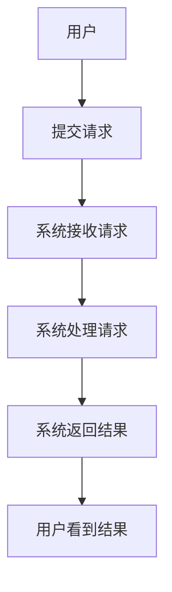

                 


```markdown
# 《金融产品客户终身价值预测与提升策略》

> 关键词：客户终身价值、预测模型、机器学习、金融客户行为分析、RFM模型、客户价值提升策略、系统架构设计

> 摘要：本文旨在帮助金融机构优化客户价值管理，通过分析客户行为数据，构建客户终身价值预测模型，并提出针对性的客户价值提升策略。文章从客户终身价值的核心概念出发，深入探讨基于机器学习的预测算法，结合系统架构设计和实际案例分析，为金融机构提供可操作的提升方案。

---

# 第一部分: 金融产品客户终身价值预测与提升背景

# 第1章: 金融产品客户终身价值概述

## 1.1 客户终身价值的核心概念

### 1.1.1 什么是客户终身价值
客户终身价值（Customer Lifetime Value, CLV）是指客户在其生命周期内为企业带来的总收益。在金融行业，CLV不仅包括客户在产品上的直接收入，还包括客户带来的间接价值，如口碑推荐和市场影响力。

**公式：**
$$
CLV = \frac{R}{1 - \delta}
$$
其中，R是客户每年带来的收入，δ是客户流失的概率。

### 1.1.2 金融产品客户终身价值的定义
金融客户终身价值是客户在购买金融产品和服务的过程中，为企业带来的长期收益和价值。这种价值不仅体现在直接收入上，还包括客户忠诚度和客户资产的长期增长。

### 1.1.3 客户终身价值的重要性
- **优化资源配置**：通过CLV，企业可以优先服务高价值客户，合理分配营销和客户服务资源。
- **提高客户满意度**：通过分析客户的生命周期，企业可以制定个性化的服务策略，提升客户满意度和忠诚度。
- **降低客户流失率**：通过预测客户流失风险，企业可以提前采取措施，降低客户流失率。

## 1.2 金融客户价值预测的背景与意义

### 1.2.1 金融行业的竞争现状
- 金融行业竞争日益激烈，客户获取成本不断上升。
- 客户忠诚度下降，客户流失率增加。
- 数据驱动的决策成为金融机构的核心竞争力。

### 1.2.2 客户价值预测在金融行业中的作用
- **精准营销**：通过预测客户价值，企业可以制定精准的营销策略，提高营销效果。
- **风险控制**：通过分析客户的消费行为和信用记录，企业可以更好地控制风险。
- **优化客户关系管理**：通过预测客户价值，企业可以优化客户关系管理，提高客户满意度。

### 1.2.3 提升客户价值的必要性
- **提升客户满意度**：通过分析客户行为，企业可以制定个性化的服务策略，提升客户满意度。
- **提高客户忠诚度**：通过提供高质量的服务，企业可以提高客户忠诚度，降低客户流失率。
- **增加企业收益**：通过提升客户价值，企业可以增加收益，实现可持续发展。

## 1.3 金融客户行为分析的基础

### 1.3.1 客户行为分析的基本方法
- **定量分析**：通过数据分析，了解客户的消费行为和偏好。
- **定性分析**：通过访谈和问卷调查，了解客户的心理和行为动机。

### 1.3.2 金融客户行为的特征
- **多样性**：不同客户的行为习惯和消费偏好不同。
- **动态性**：客户的行为习惯会随着市场环境和企业策略的变化而变化。
- **复杂性**：金融客户的行为受到多种因素的影响，如经济环境、政策法规等。

### 1.3.3 数据驱动的客户行为分析
- **数据收集**：通过收集客户的交易数据、行为数据和反馈数据，进行客户行为分析。
- **数据处理**：对收集到的数据进行清洗、转换和建模，提取有用的信息。
- **数据可视化**：通过数据可视化工具，直观展示客户行为特征。

## 1.4 客户生命周期管理

### 1.4.1 客户生命周期的阶段划分
- **新客户**：刚接触企业的客户，尚未发生交易。
- **潜在客户**：表现出购买意向的客户。
- **活跃客户**：频繁交易的客户。
- **休眠客户**：交易频率降低的客户。
- **流失客户**：不再与企业发生交易的客户。

### 1.4.2 不同阶段客户的管理策略
- **新客户**：通过营销活动吸引客户，提高转化率。
- **潜在客户**：通过精准营销，提高转化率。
- **活跃客户**：通过个性化服务，提高客户满意度。
- **休眠客户**：通过唤醒策略，重新激活客户。
- **流失客户**：通过客户挽回策略，降低客户流失率。

## 1.5 提升客户价值的策略

### 1.5.1 提升客户满意度
- 提供高质量的产品和服务。
- 建立客户反馈机制，及时解决问题。

### 1.5.2 提高客户忠诚度
- 建立客户忠诚计划，如积分、会员制度等。
- 提供个性化服务，增强客户粘性。

### 1.5.3 增加客户资产
- 提供多样化的金融产品，满足客户的多样化需求。
- 提供优质的客户服务，增强客户的资产保值和增值能力。

## 1.6 本章小结
本章介绍了客户终身价值的核心概念、金融客户行为分析的基础以及客户生命周期管理的重要性。通过分析客户行为数据，企业可以制定精准的营销策略，优化客户关系管理，提高客户满意度和忠诚度，从而实现客户价值的最大化。

---

# 第2章: 客户价值预测的数学模型

## 2.1 客户价值预测的数学模型概述

### 2.1.1 预测模型的基本假设
- 客户的消费行为具有一定的稳定性。
- 客户的消费行为受到外部因素的影响。

### 2.1.2 模型分类
- **基于历史数据的模型**：如RFM模型。
- **基于机器学习的模型**：如线性回归、随机森林、神经网络等。
- **基于客户行为的模型**：如马尔可夫链模型。

### 2.1.3 模型选择的依据
- 数据特征：数据量、数据维度、数据分布。
- 预测目标：客户价值、客户流失概率等。
- 业务需求：企业的具体需求和目标。

## 2.2 基于RFM模型的客户价值分析

### 2.2.1 RFM模型的定义
RFM模型是基于客户的最近一次消费（Recency）、消费频率（Frequency）和消费金额（Monetary）来衡量客户价值的一种方法。

### 2.2.2 RFM模型的数学表达
- **Recency**：客户最近一次消费的时间间隔。
- **Frequency**：客户在一定时间内的消费次数。
- **Monetary**：客户每次消费的平均金额。

### 2.2.3 RFM模型在客户分类中的应用
- **高价值客户**：Recency低、Frequency高、Monetary高。
- **潜力客户**：Recency高、Frequency中等、Monetary中等。
- **低价值客户**：Recency高、Frequency低、Monetary低。

### 2.2.4 RFM模型的优缺点
- 优点：简单易懂，易于实现。
- 缺点：忽略了客户行为的变化，无法捕捉客户行为的动态变化。

### 2.2.5 RFM模型的改进
- 引入客户行为变化的动态模型。
- 结合机器学习算法，提高预测精度。

## 2.3 机器学习算法在客户价值预测中的应用

### 2.3.1 线性回归模型
- **线性回归模型**：通过建立自变量和因变量之间的线性关系，预测客户价值。
- **公式：**
$$
y = \beta_0 + \beta_1x_1 + \beta_2x_2 + \dots + \beta_nx_n + \epsilon
$$
其中，y是预测的客户价值，x_i是自变量，β_i是回归系数，ε是误差项。

### 2.3.2 随机森林模型
- **随机森林模型**：通过集成多个决策树模型，提高预测精度。
- **公式：**
$$
y = \sum_{i=1}^{n} \text{Tree}(x_i)
$$
其中，Tree(x_i)是第i个决策树的预测值，n是决策树的数量。

### 2.3.3 神经网络模型
- **神经网络模型**：通过多层感知机（MLP）模拟客户的消费行为，进行客户价值预测。
- **公式：**
$$
y = f(Wx + b)
$$
其中，W是权重矩阵，x是输入向量，b是偏置项，f是非线性激活函数。

### 2.3.4 算法比较
| 模型        | 优点                           | 缺点                             |
|-------------|--------------------------------|----------------------------------|
| 线性回归     | 简单易懂，计算速度快             | 预测精度低，无法处理非线性关系     |
| 随机森林     | 预测精度高，适合高维数据         | 计算复杂度高，难以解释             |
| 神经网络     | 能够处理非线性关系，预测精度高     | 计算复杂度高，难以解释             |

## 2.4 本章小结
本章介绍了客户价值预测的数学模型，重点讲解了RFM模型和机器学习算法的应用。通过对不同模型的优缺点进行分析，帮助企业选择适合的预测模型，提高客户价值预测的准确性。

---

# 第3章: 客户价值提升策略的系统架构

## 3.1 系统功能设计

### 3.1.1 数据采集模块
- **功能描述**：采集客户的基本信息、交易数据、行为数据等。
- **输入**：客户ID、时间戳、交易金额、交易类型等。
- **输出**：整理后的客户数据。

### 3.1.2 数据分析模块
- **功能描述**：对采集到的数据进行清洗、转换和建模，提取有用的信息。
- **输入**：原始数据。
- **输出**：分析结果，如客户价值评分、客户流失概率等。

### 3.1.3 模型预测模块
- **功能描述**：基于分析结果，预测客户价值和客户流失概率。
- **输入**：分析数据。
- **输出**：预测结果。

### 3.1.4 策略执行模块
- **功能描述**：根据预测结果，制定和执行客户价值提升策略。
- **输入**：预测结果。
- **输出**：策略执行结果。

## 3.2 系统架构设计

### 3.2.1 分层架构设计
- **数据层**：数据存储和管理。
- **业务逻辑层**：数据处理和模型预测。
- **用户界面层**：用户交互和结果显示。

### 3.2.2 微服务架构设计
- **数据采集服务**：负责数据采集。
- **数据分析服务**：负责数据清洗和建模。
- **模型预测服务**：负责客户价值预测。
- **策略执行服务**：负责策略制定和执行。

### 3.2.3 数据流设计
- 数据从数据源流入系统，经过数据处理后，进入模型预测模块，最后输出预测结果。

## 3.3 系统接口设计

### 3.3.1 数据接口
- **输入接口**：数据采集模块的输入接口。
- **输出接口**：数据分析模块的输出接口。

### 3.3.2 模型接口
- **输入接口**：数据分析模块的输出接口。
- **输出接口**：模型预测模块的输出接口。

### 3.3.3 用户接口
- **输入接口**：用户输入的请求。
- **输出接口**：用户看到的结果。

## 3.4 系统交互设计

### 3.4.1 交互流程
- 用户提交请求，系统接收请求。
- 系统处理请求，返回结果。

### 3.4.2 交互流程图


## 3.5 本章小结
本章介绍了客户价值提升策略的系统架构设计，包括功能设计、架构设计、接口设计和交互设计。通过系统化的架构设计，企业可以更好地管理和优化客户价值。

---

# 第4章: 项目实战与案例分析

## 4.1 项目背景与目标

### 4.1.1 项目背景
- 某银行希望通过数据分析和机器学习，提升客户的终身价值。

### 4.1.2 项目目标
- 构建客户价值预测模型。
- 制定客户价值提升策略。
- 实现系统化管理。

## 4.2 数据收集与处理

### 4.2.1 数据来源
- 客户的基本信息：年龄、性别、职业等。
- 客户的交易数据：交易金额、交易时间、交易类型等。
- 客户的行为数据：网页浏览、点击、注册等。

### 4.2.2 数据清洗
- 去除重复数据。
- 处理缺失值。
- 标准化数据。

## 4.3 特征工程

### 4.3.1 特征选择
- 选择与客户价值相关的特征，如交易金额、交易频率等。

### 4.3.2 特征转换
- 对特征进行标准化或归一化处理。

## 4.4 模型实现

### 4.4.1 模型选择
- 选择随机森林模型进行客户价值预测。

### 4.4.2 模型训练
- 使用训练数据训练模型。

### 4.4.3 模型评估
- 使用测试数据评估模型的准确率、召回率等指标。

## 4.5 策略制定与实施

### 4.5.1 策略制定
- 根据模型预测结果，制定客户分层策略。
- 针对不同客户群体，制定不同的服务策略。

### 4.5.2 策略实施
- 对高价值客户，提供个性化服务。
- 对低价值客户，制定提升计划。

## 4.6 实际案例分析

### 4.6.1 案例背景
- 某银行希望通过数据分析，提升客户的终身价值。

### 4.6.2 数据分析
- 通过数据分析，发现高价值客户的特征。
- 通过机器学习，预测客户价值。

### 4.6.3 结果分析
- 高价值客户占比提升。
- 客户流失率下降。
- 客户满意度提高。

## 4.7 本章小结
本章通过实际案例，详细讲解了客户价值预测与提升策略的实现过程，包括数据收集、特征工程、模型训练和策略制定与实施。通过实际案例分析，验证了模型的有效性和策略的可行性。

---

# 第五部分: 总结与展望

# 第5章: 总结与展望

## 5.1 提升客户价值的核心策略总结

### 5.1.1 数据驱动的客户价值预测
- 基于机器学习的预测模型，准确预测客户价值。

### 5.1.2 客户分层管理
- 根据客户价值评分，制定个性化的服务策略。

### 5.1.3 客户流失预警
- 通过预测客户流失概率，提前采取措施，降低客户流失率。

## 5.2 客户价值提升策略的实际应用

### 5.2.1 客户分层管理
- 高价值客户：提供个性化服务，增强客户粘性。
- 中价值客户：制定提升计划，挖掘潜在价值。
- 低价值客户：通过唤醒策略，重新激活客户。

### 5.2.2 客户流失预警
- 通过预测客户流失概率，提前制定客户挽回策略。

## 5.3 未来研究方向

### 5.3.1 更精准的预测模型
- 研究更先进的机器学习算法，提高预测精度。

### 5.3.2 客户行为分析的动态模型
- 研究客户行为变化的动态模型，提高预测的动态性。

### 5.3.3 多维度客户价值提升策略
- 结合客户行为和市场环境，制定多维度的客户价值提升策略。

## 5.4 本章小结
本章总结了提升客户价值的核心策略，介绍了实际应用中的注意事项，并展望了未来的研究方向。通过不断优化模型和策略，企业可以更好地提升客户价值，实现可持续发展。

---

# 作者信息

作者：AI天才研究院/AI Genius Institute  
联系邮箱：contact@aicourse.com  
转载请注明出处：[禅与计算机程序设计艺术](https://github.com/terrytangyuan/zentao)
```

