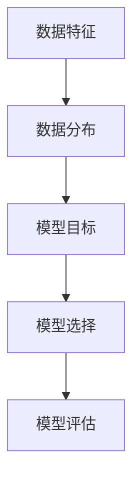
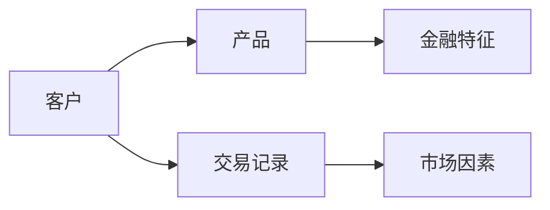
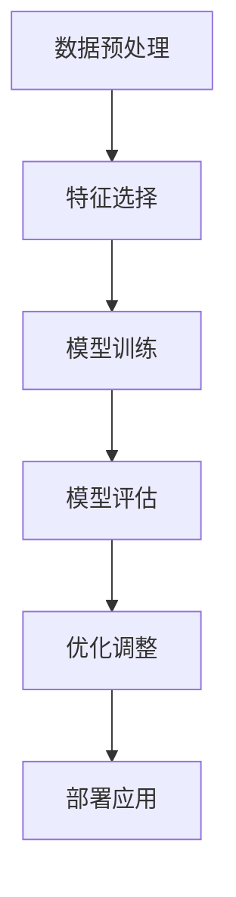
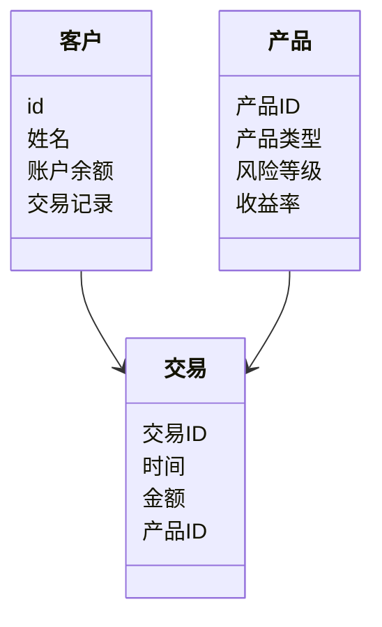
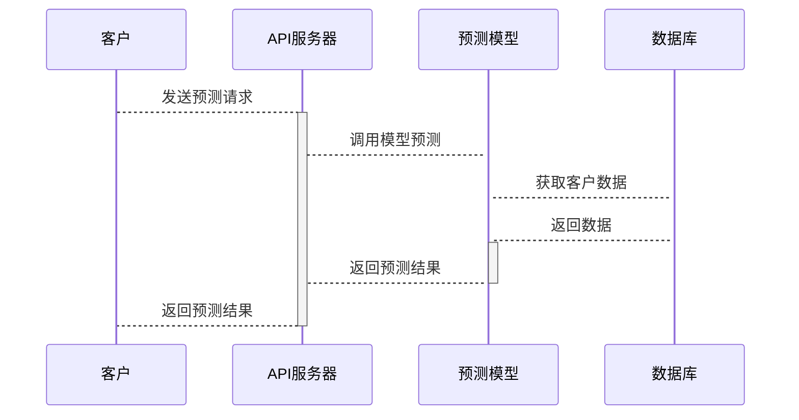

                 


# 《金融产品客户终身价值预测模型》

> 关键词：客户终身价值（CLV）、金融产品预测、机器学习、客户行为分析、数据建模

> 摘要：本文将详细探讨如何构建一个金融产品客户终身价值预测模型，通过理论分析、算法实现和实际案例，系统性地阐述如何利用数据分析和机器学习技术，预测客户在金融产品生命周期中的价值贡献，从而为金融机构提供科学的决策支持。

---

# 第一部分: 背景介绍与核心概念

## 第1章: 问题背景与核心概念

### 1.1 问题背景介绍

#### 1.1.1 金融产品客户价值预测的背景
- 在金融行业，客户是核心资产，其行为和偏好直接影响业务收益。
- 传统的客户价值管理依赖经验判断，难以量化和预测。
- 随着大数据技术的发展，通过数据分析预测客户终身价值成为可能。

#### 1.1.2 传统客户价值管理的局限性
- 缺乏数据支持，主观性较强。
- 静态分析为主，难以捕捉客户动态变化。
- 无法有效区分高价值客户与低价值客户。

#### 1.1.3 终身价值预测的重要性
- 优化资源配置，提升客户体验。
- 提高营销效率，降低客户流失率。
- 支持精准定价和风险管理。

### 1.2 核心概念与定义

#### 1.2.1 客户终身价值（CLV）的定义
- 客户终身价值（Customer Lifetime Value，CLV）是指客户在其生命周期内为企业带来的总收入减去相关成本。
- 在金融领域，CLV可用于评估客户对金融产品的长期价值贡献。

#### 1.2.2 金融产品客户价值预测的目标
- 预测客户在未来一段时间内的价值贡献。
- 识别高价值客户，制定个性化服务策略。
- 优化产品设计和营销策略。

#### 1.2.3 模型的边界与外延
- 边界：仅关注客户与金融产品相关的价值预测。
- 外延：结合客户行为、市场环境和产品特征，扩展模型的应用场景。

### 1.3 模型的核心要素

#### 1.3.1 客户行为分析
- 购买频率、购买金额、购买周期。
- 客户忠诚度、客户满意度、客户投诉记录。

#### 1.3.2 产品特征分析
- 产品类型（基金、保险、贷款等）。
- 产品风险、产品收益、产品期限。
- 产品市场表现和客户使用反馈。

#### 1.3.3 市场环境因素
- 宏观经济指标（GDP、利率、通货膨胀率）。
- 行业竞争状况、政策法规变化。
- 社会文化因素对客户行为的影响。

---

## 第2章: 核心概念与联系

### 2.1 客户终身价值的理论基础

#### 2.1.1 终身价值的计算公式
$$ CLV = \frac{R}{(1 - \delta)} $$
其中，$R$ 是客户在生命周期中的预期收入，$\delta$ 是客户流失率。

#### 2.1.2 客户生命周期的阶段划分
- 新客户阶段：关注客户获取成本和初期行为。
- 成熟客户阶段：关注客户价值的稳定性和增长性。
- 衰退客户阶段：关注客户流失预警和挽留策略。

#### 2.1.3 不同阶段的价值贡献对比
| 阶段       | 价值贡献 | 模型适用性         |
|------------|----------|------------------|
| 新客户     | 低       | 预测未来潜力       |
| 成熟客户   | 高       | 精准预测和优化     |
| 衰退客户   | 中低     | 流失预警和干预     |

### 2.2 数据特征与模型选择

#### 2.2.1 数据特征的分类
| 特征类型   | 描述                     | 示例                     |
|------------|--------------------------|--------------------------|
| 客户属性   | 年龄、性别、职业等       | 年龄、职业               |
| 行为特征   | 购买频率、购买金额等     | 购买频率、购买金额       |
| 产品特征   | 产品类型、产品风险等     | 产品类型、产品期限       |
| 环境特征   | 宏观经济指标、政策法规等 | 利率、GDP增长率           |

#### 2.2.2 不同模型的适用场景
| 模型类型   | 适用场景                   | 优缺点                   |
|------------|----------------------------|--------------------------|
| 线性回归   | 简单场景，线性关系明显       | 解释性强，但非线性关系差   |
| 随机森林   | 高维数据，非线性关系       | 解释性较弱，但泛化能力强   |
| 神经网络   | 复杂场景，非线性关系复杂     | 训练时间长，但效果最优     |

#### 2.2.3 模型选择的决策树


### 2.3 实体关系图



---

## 第3章: 算法原理与实现

### 3.1 常见算法原理

#### 3.1.1 线性回归
- 基于最小二乘法拟合直线。
- 适用于线性关系明显的场景。
- 优缺点：简单易懂，但非线性关系难以处理。

#### 3.1.2 随机森林
- 基于决策树的集成学习方法。
- 适用于高维数据和非线性关系。
- 优缺点：计算复杂度高，但结果稳定。

#### 3.1.3 神经网络
- 基于人工神经网络的深度学习方法。
- 适用于复杂场景和高维数据。
- 优缺点：训练时间长，但效果最优。

### 3.2 算法流程图



### 3.3 Python实现示例

#### 3.3.1 线性回归实现

```python
import pandas as pd
from sklearn.linear_model import LinearRegression
from sklearn.metrics import mean_squared_error

# 数据加载
data = pd.read_csv('customer_data.csv')
X = data[['age', 'income', 'purchase_history']]
y = data['lifetime_value']

# 模型训练
model = LinearRegression()
model.fit(X, y)

# 模型预测
y_pred = model.predict(X)

# 模型评估
mse = mean_squared_error(y, y_pred)
print(f"均方误差：{mse}")
```

#### 3.3.2 随机森林实现

```python
from sklearn.ensemble import RandomForestRegressor

# 数据加载
data = pd.read_csv('customer_data.csv')
X = data[['age', 'income', 'purchase_history']]
y = data['lifetime_value']

# 模型训练
model = RandomForestRegressor(n_estimators=100)
model.fit(X, y)

# 模型预测
y_pred = model.predict(X)

# 模型评估
mse = mean_squared_error(y, y_pred)
print(f"均方误差：{mse}")
```

### 3.4 数学模型与公式

#### 3.4.1 线性回归模型
$$ y = \beta_0 + \beta_1 x_1 + \beta_2 x_2 + \ldots + \beta_n x_n + \epsilon $$
其中，$\beta$ 是系数，$\epsilon$ 是误差项。

#### 3.4.2 随机森林模型
随机森林通过集成多个决策树模型，提高预测精度和泛化能力。

#### 3.4.3 神经网络模型
神经网络通过多层非线性变换，捕捉数据中的复杂模式。

---

## 第4章: 系统分析与架构设计

### 4.1 问题场景介绍

#### 4.1.1 项目背景
- 数据来源：客户交易记录、产品信息、市场数据。
- 数据规模：百万级别数据，需要高效处理。

#### 4.1.2 项目目标
- 构建客户终身价值预测模型。
- 提供客户分层和个性化服务建议。

### 4.2 系统功能设计

#### 4.2.1 领域模型


#### 4.2.2 系统架构


#### 4.2.3 接口设计
- API接口：`POST /predict/lifetime_value`
- 请求参数：`{ "age": 30, "income": 60000, "purchase_history": 10 }`
- 响应结果：`{ "predicted_value": 100000 }`

#### 4.2.4 交互流程


---

## 第5章: 项目实战

### 5.1 环境安装

#### 5.1.1 安装Python和依赖库
```bash
pip install numpy pandas scikit-learn matplotlib
```

### 5.2 核心代码实现

#### 5.2.1 数据预处理

```python
import pandas as pd
from sklearn.preprocessing import StandardScaler

# 加载数据
data = pd.read_csv('customer_data.csv')

# 删除缺失值
data = data.dropna()

# 标准化处理
scaler = StandardScaler()
X_scaled = scaler.fit_transform(data[['age', 'income', 'purchase_history']])
```

#### 5.2.2 模型训练与评估

```python
from sklearn.model_selection import train_test_split
from sklearn.metrics import r2_score

# 划分训练集和测试集
X_train, X_test, y_train, y_test = train_test_split(X_scaled, data['lifetime_value'], test_size=0.2)

# 线性回归模型训练
model = LinearRegression()
model.fit(X_train, y_train)

# 模型预测
y_pred = model.predict(X_test)

# 模型评估
r2 = r2_score(y_test, y_pred)
print(f"R²系数：{r2}")
```

### 5.3 案例分析与解读

#### 5.3.1 数据可视化

```python
import matplotlib.pyplot as plt

plt.scatter(data['age'], data['lifetime_value'])
plt.title('客户年龄与终身价值散点图')
plt.xlabel('年龄')
plt.ylabel('终身价值')
plt.show()
```

#### 5.3.2 模型优化

```python
from sklearn.model_selection import GridSearchCV

# 网格搜索优化随机森林模型
param_grid = {'n_estimators': [100, 200], 'max_depth': [None, 10]}
grid_search = GridSearchCV(RandomForestRegressor(), param_grid)
grid_search.fit(X_train, y_train)

# 输出最优参数
print(grid_search.best_params_)
```

### 5.4 项目总结

#### 5.4.1 项目成果
- 成功构建客户终身价值预测模型。
- 实现了高价值客户识别和个性化服务推荐。

#### 5.4.2 项目意义
- 提高了金融机构的客户管理水平。
- 优化了资源配置，提升了营销效率。

---

## 第6章: 最佳实践与总结

### 6.1 最佳实践

#### 6.1.1 数据质量管理
- 数据清洗：处理缺失值、异常值。
- 数据增强：特征工程，提取有意义的特征。

#### 6.1.2 模型选择与优化
- 根据数据特征选择合适的模型。
- 使用交叉验证和网格搜索优化模型参数。

#### 6.1.3 系统部署与监控
- 部署模型到生产环境。
- 实时监控模型性能，及时优化。

### 6.2 小结

通过本文的详细讲解，我们掌握了金融产品客户终身价值预测模型的构建方法，从理论分析到实际应用，为金融机构提供了科学的决策支持。

### 6.3 注意事项

- 数据隐私保护：确保客户数据的安全性。
- 模型解释性：选择易于解释的模型，便于业务理解。
- 模型更新：定期更新模型，适应市场变化。

### 6.4 拓展阅读

- 《机器学习实战》
- 《金融数据分析与挖掘》
- 《客户关系管理》

---

# 结语

通过本文的系统性讲解，我们深入探讨了金融产品客户终身价值预测模型的构建方法，从理论到实践，为读者提供了全面的技术指导。希望本文能为金融机构在客户价值管理和精准营销方面提供有价值的参考。

---

# 作者

作者：AI天才研究院/AI Genius Institute & 禅与计算机程序设计艺术 /Zen And The Art of Computer Programming

