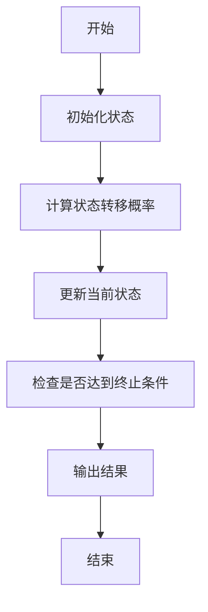
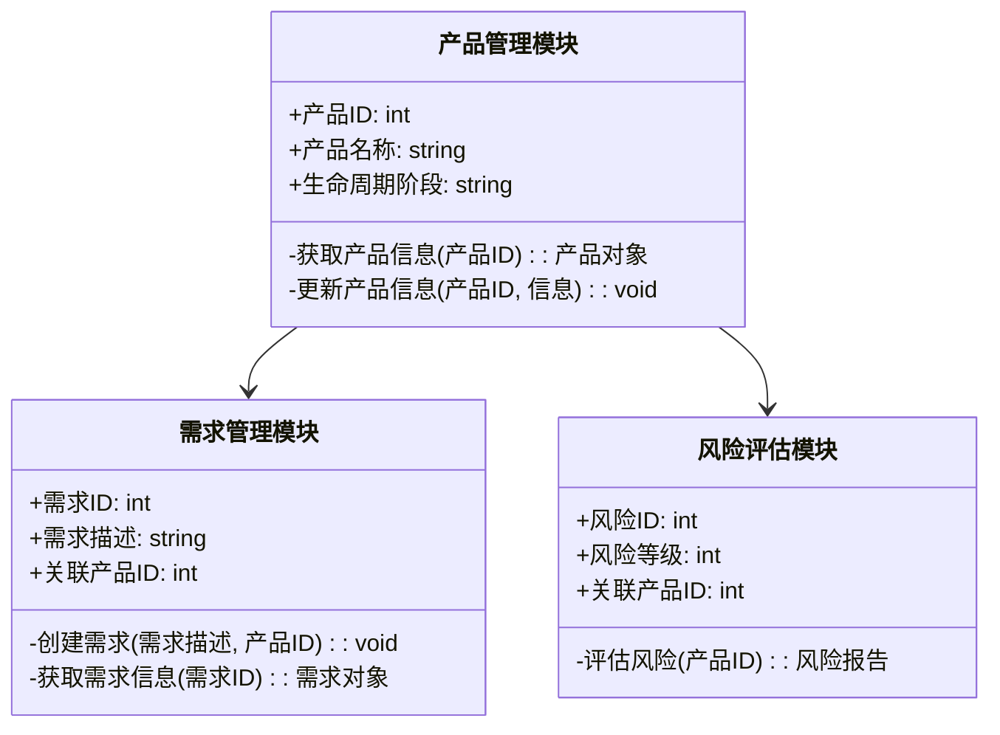
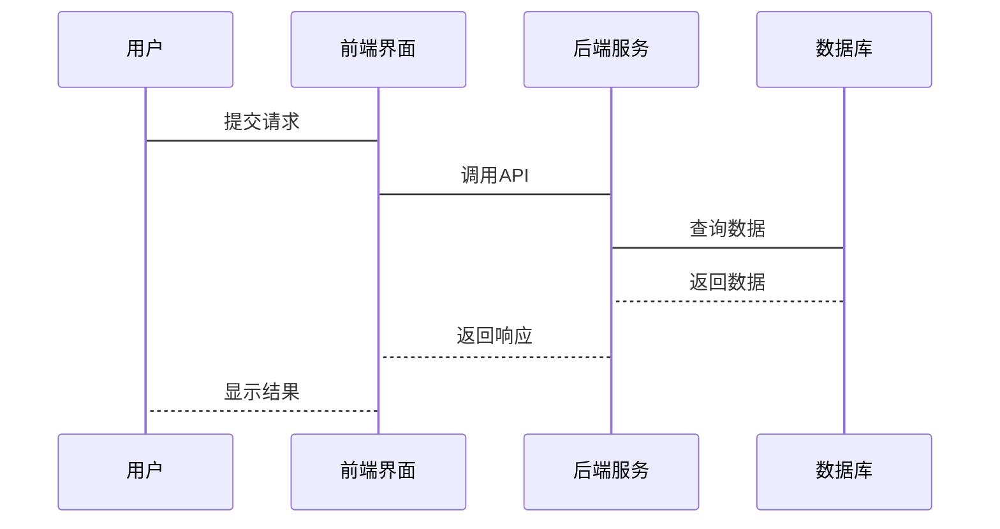

                 


# 《金融产品生命周期管理平台》

## 关键词：金融产品，生命周期，管理平台，系统架构，项目实战

## 摘要：本文详细探讨了金融产品生命周期管理平台的设计与实现，从背景到核心概念，再到算法原理和系统架构，最后通过项目实战和最佳实践提供全面解析。

---

# 第1章: 金融产品生命周期管理平台的背景与重要性

## 1.1 金融产品的生命周期概述

### 1.1.1 金融产品的定义与分类
- 金融产品的基本定义
- 金融产品的分类（如银行产品、证券产品、保险产品等）
- 不同类型金融产品的特点

### 1.1.2 金融产品生命周期的四个阶段
- 产品设计与开发阶段
- 产品上线与运营阶段
- 产品终止与清算阶段
- 生命周期各阶段的特点与挑战

### 1.1.3 金融产品生命周期管理的重要性
- 提高产品开发效率
- 降低运营风险
- 提升客户满意度
- 优化资源分配

## 1.2 金融产品生命周期管理平台的定义与特点

### 1.2.1 平台的定义
- 什么是金融产品生命周期管理平台？
- 平台的目标与核心功能

### 1.2.2 平台的核心特点
- 集成化管理
- 风险控制
- 数据驱动
- 灵活性与可扩展性

### 1.2.3 平台与传统金融业务的区别
- 传统金融业务的局限性
- 平台的优势与创新点

## 1.3 金融产品生命周期管理平台的应用场景

### 1.3.1 产品设计与开发阶段
- 需求管理
- 风险评估
- 产品设计

### 1.3.2 产品上线与运营阶段
- 上架流程
- 运营监控
- 用户反馈

### 1.3.3 产品终止与清算阶段
- 终止流程
- 清算管理
- 数据归档

## 1.4 本章小结
- 总结本章内容，强调平台在金融业务中的关键作用

---

# 第2章: 金融产品生命周期管理平台的核心概念与联系

## 2.1 核心概念原理

### 2.1.1 产品需求管理模块
- 需求收集与分析
- 需求优先级排序
- 需求文档管理

### 2.1.2 产品风险评估模块
- 风险识别与评估
- 风险量化与排序
- 风险控制措施

### 2.1.3 产品上架与运营模块
- 产品上线流程
- 运营数据监控
- 用户行为分析

### 2.1.4 产品终止与清算模块
- 终止流程管理
- 清算数据处理
- 数据归档与存档

## 2.2 核心概念属性特征对比表格

| 模块名称         | 核心功能               | 输入/输出          | 关键技术点         |
|------------------|-----------------------|-------------------|------------------|
| 产品需求管理模块 | 管理需求文档           | 需求文档           | 需求分析工具       |
| 产品风险评估模块 | 评估产品风险           | 风险评估报告       | 风险分析算法       |
| 产品上架与运营模块 | 管理产品上线与运营     | 运营数据           | 数据分析与监控工具 |
| 产品终止与清算模块 | 管理产品终止与清算     | 清算报告           | 清算流程管理工具   |

## 2.3 ER实体关系图架构

```mermaid
erd
  图形
  产品表
    ID
    名称
    类型
    生命周期阶段
  需求表
    ID
    描述
    关联产品ID
  风险表
    ID
    风险等级
    关联产品ID
  运营表
    ID
    运营数据
    关联产品ID
  清算表

  产品表--1:多->需求表
  产品表--1:多->风险表
  产品表--1:多->运营表
  产品表--1:多->清算表
```

## 2.4 本章小结
- 总结核心模块及其关系，为后续章节奠定基础

---

# 第3章: 金融产品生命周期管理平台的算法原理

## 3.1 生命周期建模

### 3.1.1 状态转移矩阵
- 状态转移矩阵的定义
- 状态转移矩阵的构建
- 状态转移矩阵的应用

### 3.1.2 马尔可夫链模型
- 马尔可夫链的基本原理
- 马尔可夫链在生命周期建模中的应用
- 马尔可夫链的优势与局限性

## 3.2 算法实现

### 3.2.1 算法流程


### 3.2.2 Python代码实现
```python
import numpy as np

# 定义状态转移矩阵
transition_matrix = np.array([
    [0.3, 0.5, 0.2],
    [0.4, 0.2, 0.4],
    [0.1, 0.3, 0.6]
])

# 初始化当前状态概率分布
current_state = np.array([1, 0, 0])

# 计算下一步状态
next_state = np.dot(current_state, transition_matrix)

print("当前状态:", current_state)
print("下一步状态:", next_state)
```

### 3.2.3 数学模型与公式
$$ P_{n+1} = P_n \times T $$

其中，$P_n$ 是当前状态概率向量，$T$ 是状态转移矩阵。

---

# 第4章: 金融产品生命周期管理平台的系统分析与架构设计

## 4.1 系统功能设计

### 4.1.1 领域模型


## 4.2 系统架构设计

### 4.2.1 架构图


### 4.2.2 接口设计
- 前端与后端接口
- 后端与数据库接口

### 4.2.3 交互流程


## 4.3 本章小结
- 总结系统架构设计的核心思想与实现方案

---

# 第5章: 金融产品生命周期管理平台的项目实战

## 5.1 环境搭建

### 5.1.1 安装Python与相关库
- 安装Python
- 安装NumPy、Pandas等库

### 5.1.2 安装开发工具
- 安装IDE（如PyCharm）
- 安装版本控制工具（如Git）

## 5.2 核心功能实现

### 5.2.1 产品需求管理模块
```python
class ProductRequestManager:
    def __init__(self):
        self.requests = []

    def create_request(self, description, product_id):
        self.requests.append({
            'description': description,
            'product_id': product_id
        })
```

### 5.2.2 风险评估模块
```python
class RiskAssessment:
    def __init__(self):
        self.risk_levels = [1, 2, 3]

    def assess(self, product_id):
        # 示例评估逻辑
        return {
            'product_id': product_id,
            'risk_level': self.risk_levels[0]
        }
```

### 5.2.3 产品上架与运营模块
```python
class ProductOperation:
    def __init__(self):
        self.operations = []

    def record_operation(self, operation_type, product_id):
        self.operations.append({
            'type': operation_type,
            'product_id': product_id
        })
```

## 5.3 代码解读与分析
- 详细解读代码功能
- 分析代码实现的逻辑

## 5.4 案例分析与详细讲解
- 实际案例分析
- 详细讲解实现步骤

## 5.5 项目小结
- 总结项目实现的关键点与经验教训

---

# 第6章: 金融产品生命周期管理平台的最佳实践

## 6.1 小结
- 总结全文内容
- 强调平台的重要性和优势

## 6.2 注意事项
- 平台设计中的常见问题
- 使用中的注意事项

## 6.3 拓展阅读
- 推荐相关书籍和资源
- 提供进一步学习的方向

---

# 作者：AI天才研究院/AI Genius Institute & 禅与计算机程序设计艺术 /Zen And The Art of Computer Programming

---

以上是《金融产品生命周期管理平台》的技术博客文章的详细目录大纲，涵盖了从背景介绍到系统架构设计的各个方面，并通过项目实战和最佳实践提供了深入的分析与指导。

