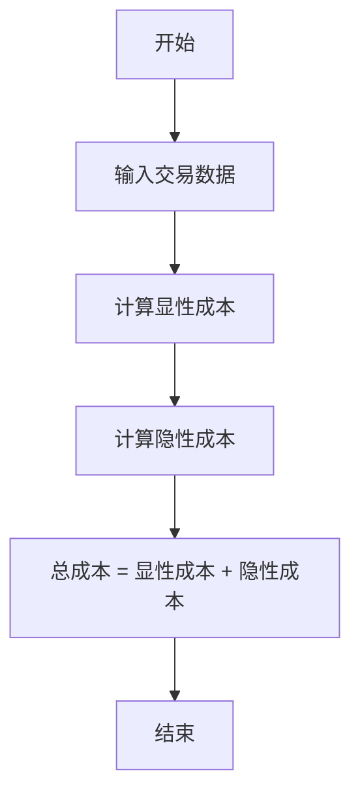
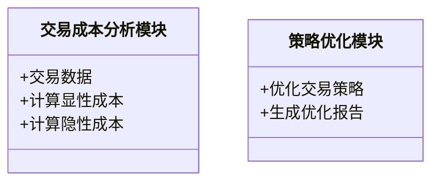

                 


# 金融市场交易成本分析与策略优化平台

> 关键词：金融市场，交易成本，策略优化，量化交易，算法优化，系统设计

> 摘要：本文将深入探讨金融市场中交易成本的构成、分析方法及其对投资策略优化的影响。通过系统化的分析与设计，结合实际案例，阐述如何构建一个高效的交易成本分析与策略优化平台，帮助投资者降低交易成本，提升投资效率。

---

## 第一部分: 金融市场交易成本概述

### 第1章: 交易成本的定义与构成

#### 1.1 交易成本的定义
交易成本是指在金融市场上进行交易时所产生的所有费用和损失，包括显性成本（如佣金、买卖价差）和隐性成本（如机会成本、市场冲击）。

#### 1.2 交易成本的构成要素
- **显性成本**：佣金、印花税、买卖价差。
- **隐性成本**：滑点、市场冲击、信息不对称。

#### 1.3 交易成本与交易效率的关系
交易成本越高，交易效率越低，反之亦然。降低交易成本可以提高资本运作效率。

### 第2章: 交易成本的影响因素

#### 2.1 市场结构对交易成本的影响
- **场内交易**：交易所撮合交易，成本较低。
- **场外交易**：由做市商撮合，成本较高。
- **电子化交易**：通过电子交易平台进行，成本最低。

#### 2.2 交易规模与成本的关系
- 大额交易：由于市场深度有限，容易产生较大的滑点，增加隐性成本。
- 小额交易：通常佣金比例较高，显性成本占比较大。

#### 2.3 时间因素对交易成本的影响
- **高频交易**：由于交易频率高，显性成本被分摊，但隐性成本（如市场冲击）可能增加。
- **低频交易**：交易频率低，显性成本较高。

### 第3章: 交易成本的分类与特征

#### 3.1 显性成本与隐性成本
- **显性成本**：可以直接量化，如佣金、印花税。
- **隐性成本**：难以直接量化，如滑点、市场冲击。

#### 3.2 确定性成本与不确定性成本
- **确定性成本**：如佣金、印花税，可以通过合同确定。
- **不确定性成本**：如滑点、市场冲击，受市场环境影响。

#### 3.3 交易成本的动态变化特征
- 市场波动性高时，隐性成本增加。
- 市场流动性好时，隐性成本降低。

---

## 第二部分: 交易成本分析的核心概念与联系

### 第4章: 核心概念原理

#### 4.1 交易成本的经济学解释
- **交易成本**是交易双方在达成交易过程中所产生的所有费用和损失，包括显性成本和隐性成本。

#### 4.2 交易成本与市场效率的关系
- 市场效率 = 1 / (交易成本 + 交易摩擦)

#### 4.3 交易成本与投资策略的关系
- 交易成本影响投资组合的再平衡频率和规模。

### 第5章: 概念属性特征对比表格

| 概念       | 特性1         | 特性2         | 特性3         |
|------------|---------------|---------------|---------------|
| 显性成本   | 可测量         | 确定性         | 直接影响         |
| 隐性成本   | 不可测量       | 不确定性       | 间接影响         |

### 第6章: ER实体关系图

```mermaid
erd
    actor:投资者
    actor --> transaction:提交交易
    transaction --> cost:产生交易成本
    cost --> platform:交易平台
    platform --> data:记录交易数据
```

---

## 第三部分: 交易成本分析的数学模型与算法原理

### 第7章: 交易成本分析的数学模型

#### 7.1 交易成本的线性模型
$$C = a \times Q + b$$
其中，$C$为总成本，$Q$为交易量，$a$为单位成本，$b$为固定成本。

#### 7.2 交易成本的非线性模型
$$C(Q) = a \times Q^2 + b \times Q + c$$
其中，$Q$为交易量，$a$、$b$、$c$为系数。

### 第8章: 算法原理与流程图



---

## 第四部分: 系统分析与架构设计方案

### 第9章: 问题场景介绍

#### 9.1 问题背景
- 投资者需要优化交易策略，降低交易成本。

#### 9.2 项目介绍
- 构建一个交易成本分析与策略优化平台，帮助投资者降低交易成本。

### 第10章: 系统功能设计

#### 10.1 领域模型类图



### 第11章: 系统架构设计

#### 11.1 系统架构图


---

## 第五部分: 项目实战

### 第12章: 环境安装与系统实现

#### 12.1 环境安装
- 安装Python、Pandas、NumPy等工具。

#### 12.2 核心代码实现

```python
import pandas as pd
import numpy as np

def calculate_explicit_cost(volume):
    return 0.005 * volume

def calculate_implicit_cost(volume, market_depth):
    return 0.002 * volume * (1 - market_depth)

def total_cost(volume, market_depth):
    explicit = calculate_explicit_cost(volume)
    implicit = calculate_implicit_cost(volume, market_depth)
    return explicit + implicit

# 示例
volume = 1000
market_depth = 0.8
print("总成本：", total_cost(volume, market_depth))
```

---

## 第六部分: 总结与展望

### 第13章: 总结

#### 13.1 核心内容回顾
- 交易成本的构成与分类。
- 交易成本对市场效率和投资策略的影响。
- 交易成本分析的数学模型与算法。

#### 13.2 注意事项
- 数据质量和实时性对交易成本分析至关重要。
- 算法优化需要结合实际市场环境。

### 第14章: 未来展望

#### 14.1 拓展方向
- 结合人工智能技术优化交易成本分析。
- 研究高频交易中的隐性成本优化方法。

---

## 作者

作者：AI天才研究院/AI Genius Institute & 禅与计算机程序设计艺术/Zen And The Art of Computer Programming

