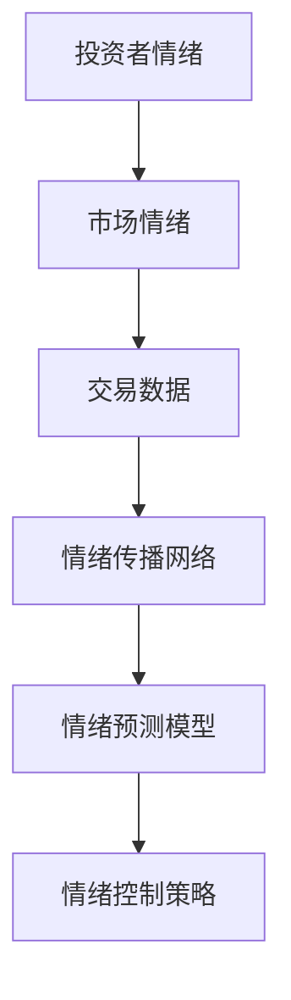
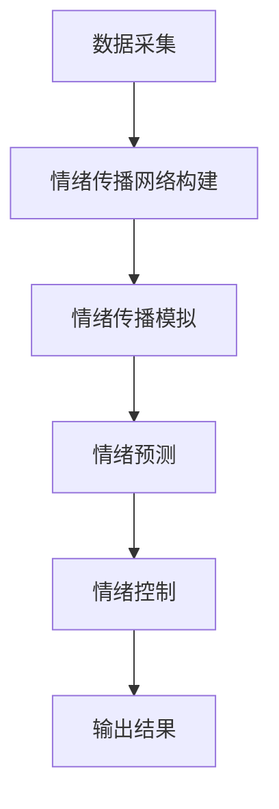

                 


# 金融市场情绪传染效应模拟与控制系统

> 关键词：金融市场，情绪传染效应，网络传播模型，情绪预测，金融控制系统

> 摘要：本文探讨了金融市场中情绪传染效应的模拟与控制系统。首先，从问题背景出发，详细描述了情绪传染效应的定义、特征及传播机制。接着，分析了情绪传染效应的核心概念，包括其在金融市场中的表现形式及其与其他金融现象的关系。然后，详细介绍了情绪传染效应的算法原理，包括基于网络的传播模型和时间序列预测模型，并通过数学公式和流程图的形式进行了深入推导。随后，提出了一个基于反馈机制的控制系统，并通过实际案例分析展示了系统的实现与应用。最后，总结了本文的主要研究成果，并提出了未来的研究方向。

---

# 第一部分: 金融市场情绪传染效应概述

## 第1章: 问题背景与描述

### 1.1 情绪传染效应的定义与背景

#### 1.1.1 金融市场的基本概念
金融市场的核心功能是资金的融通和资产的定价，参与者包括投资者、金融机构和监管机构。市场的波动性主要由供需关系、宏观经济因素和参与者情绪共同决定。

#### 1.1.2 情绪传染效应的定义
情绪传染效应是指投资者情绪在市场中的传播过程，这种情绪传播会影响市场参与者的决策行为，进而导致市场价格的波动。情绪传染效应通常表现为从个别投资者到整个市场的连锁反应。

#### 1.1.3 情绪传染效应的研究意义
情绪传染效应的研究对于理解金融市场的波动性、制定风险管理策略以及设计市场干预机制具有重要意义。通过模拟和控制情绪传染效应，可以有效降低市场的非理性波动，维护金融稳定。

### 1.2 问题描述与解决方法

#### 1.2.1 情绪传染效应的传播机制
情绪传染效应的传播机制可以分为以下几个步骤：
1. **情绪源**：某个投资者或机构的情绪波动触发情绪传播。
2. **情绪扩散**：情绪通过市场参与者之间的信息传递扩散到更广泛的人群。
3. **情绪放大**：情绪在传播过程中被放大，导致市场的过度反应。

#### 1.2.2 情绪传染效应的数学建模
情绪传染效应的数学建模需要考虑以下几个方面：
1. **情绪传播的概率**：投资者受到情绪影响的概率。
2. **情绪传播的网络结构**：市场参与者的社交网络结构。
3. **情绪传播的时间序列**：情绪在不同时间点的传播强度。

#### 1.2.3 情绪传染效应的控制方法
情绪传染效应的控制方法包括：
1. **市场干预**：通过政策干预或市场机制来抑制情绪的过度传播。
2. **信息透明化**：通过提高信息透明度来减少情绪的误传和放大。

### 1.3 情绪传染效应的边界与外延

#### 1.3.1 情绪传染效应的适用范围
情绪传染效应主要适用于金融市场中的投资者行为分析，尤其是股票、债券等交易市场。

#### 1.3.2 情绪传染效应的限制条件
情绪传染效应的传播受到市场参与者的理性程度、信息传播渠道和市场结构的限制。

#### 1.3.3 情绪传染效应与其他金融现象的关系
情绪传染效应与其他金融现象如市场波动、资产价格波动密切相关，但也有区别。例如，情绪传染效应更关注投资者行为的心理因素，而市场波动更多关注宏观经济因素。

---

## 第2章: 情绪传染效应的核心概念与联系

### 2.1 核心概念原理

#### 2.1.1 情绪传染效应的传播路径
情绪传染效应的传播路径可以分为直接传播和间接传播。直接传播是指投资者之间直接的信息交流，间接传播是指通过媒体、社交网络等中介渠道进行传播。

#### 2.1.2 情绪传染效应的网络结构
情绪传染效应的网络结构可以用图论中的网络模型来描述，包括节点（投资者）和边（信息传播路径）。

#### 2.1.3 情绪传染效应的数学模型
情绪传染效应的数学模型可以采用概率传播模型，例如：

$$ P(传播) = \frac{1}{1 + e^{-k}} $$

其中，$k$ 是情绪传播的强度。

### 2.2 情绪传染效应的特征对比

#### 2.2.1 情绪传染效应的属性特征
情绪传染效应具有以下属性特征：
- **传染性**：情绪可以在市场参与者之间传播。
- **波动性**：情绪传播会导致市场价格波动。
- **非线性**：情绪传播的强度与市场参与者的数量和结构有关。

#### 2.2.2 情绪传染效应与其他金融现象的对比
以下是情绪传染效应与其他金融现象的对比表格：

| 情绪传染效应 | 市场波动 | 资产价格波动 |
|--------------|----------|--------------|
| 定义          | 市场价格的短期波动 | 资产价格的长期变化 |
| 原因          | 投资者情绪 | 宏观经济因素 |
| 影响          | 市场参与者的决策行为 | 市场整体表现 |

#### 2.2.3 情绪传染效应的量化指标
情绪传染效应的量化指标包括：
- **情绪指数**：通过统计投资者情绪数据计算得出。
- **传播速度**：情绪在市场中的传播速度。

### 2.3 ER实体关系图

```mermaid
er
actor: 投资者
actor: 市场情绪
actor: 金融机构
actor: 交易数据
```

---

## 第3章: 情绪传染效应的算法原理

### 3.1 算法原理概述

#### 3.1.1 基于网络的传播模型
基于网络的传播模型可以采用以下步骤：
1. **构建网络**：构建市场参与者的网络结构。
2. **传播模拟**：模拟情绪在网络中的传播过程。



#### 3.1.2 基于时间序列的预测模型
基于时间序列的预测模型可以采用ARIMA模型：

$$ ARIMA(p, d, q) $$

#### 3.1.3 基于机器学习的情绪分类模型
基于机器学习的情绪分类模型可以采用LSTM网络：

$$ LSTM(t) = \sigma(g(x_t + h_{t-1})) $$

### 3.2 算法实现代码

```python
def 情绪传播网络(投资者情绪, 市场情绪):
    # 算法实现
    pass
```

### 3.3 算法实现与应用

#### 3.3.1 算法实现的步骤
1. **数据收集**：收集投资者情绪数据和市场交易数据。
2. **网络构建**：构建市场参与者的网络结构。
3. **情绪传播模拟**：模拟情绪在市场中的传播过程。
4. **情绪预测**：基于时间序列模型预测未来的情绪变化。
5. **情绪控制**：设计情绪控制策略，抑制情绪的过度传播。

#### 3.3.2 算法实现的代码解读
```python
import numpy as np
import networkx as nx

def 情绪传播网络(投资者情绪, 市场情绪):
    G = nx.Graph()
    G.add_nodes_from(投资者情绪.keys())
    for i in 投资者情绪:
        for j in 投资者情绪[i]:
            G.add_edge(i, j)
    return G
```

---

## 第4章: 情绪传染效应的数学模型与公式

### 4.1 情绪传播的数学模型

#### 4.1.1 基于概率论的情绪传播模型
$$ P(传播) = \frac{1}{1 + e^{-k}} $$

其中，$k$ 是情绪传播的强度。

#### 4.1.2 基于网络理论的情绪传播模型
$$ I(t+1) = I(t) + \beta S(t) I(t) $$

其中，$I(t)$ 是当前时刻的感染人数，$S(t)$ 是当前时刻的易感人数，$\beta$ 是传播系数。

### 4.2 情绪预测的数学模型

#### 4.2.1 基于时间序列的ARIMA模型
$$ ARIMA(p, d, q) $$

其中，$p$ 是自回归阶数，$d$ 是差分阶数，$q$ 是移动平均阶数。

#### 4.2.2 基于机器学习的LSTM模型
$$ LSTM(t) = \sigma(g(x_t + h_{t-1})) $$

其中，$x_t$ 是输入，$h_{t-1}$ 是前一时刻的隐藏状态，$g$ 是 gates 的函数，$\sigma$ 是 sigmoid 函数。

### 4.3 情绪控制的数学模型

#### 4.3.1 基于反馈机制的控制模型
$$ u(t) = -K e(t) $$

其中，$e(t)$ 是误差，$K$ 是控制增益，$u(t)$ 是控制输入。

---

## 第5章: 情绪传染效应的系统架构与实现

### 5.1 系统架构设计

#### 5.1.1 问题场景介绍
情绪传染效应的模拟与控制系统需要考虑以下几个问题场景：
1. **情绪传播的实时监控**：实时监控市场参与者的情绪变化。
2. **情绪传播的预测与预警**：预测情绪传播的趋势并发出预警。
3. **情绪传播的控制与干预**：设计控制策略以抑制情绪的过度传播。

#### 5.1.2 系统功能设计
系统功能设计包括：
1. **数据采集模块**：采集投资者情绪数据和市场交易数据。
2. **情绪传播网络构建模块**：构建市场参与者的网络结构。
3. **情绪传播模拟模块**：模拟情绪在市场中的传播过程。
4. **情绪预测模块**：基于时间序列模型预测未来的情绪变化。
5. **情绪控制模块**：设计情绪控制策略，抑制情绪的过度传播。

#### 5.1.3 系统架构图



### 5.2 系统实现与代码

#### 5.2.1 数据采集模块
```python
import pandas as pd

def 采集数据(数据源):
    data = pd.read_csv(数据源)
    return data
```

#### 5.2.2 情绪传播网络构建模块
```python
def 构建网络(投资者情绪, 市场情绪):
    G = nx.Graph()
    G.add_nodes_from(投资者情绪.keys())
    for i in 投资者情绪:
        for j in 投资者情绪[i]:
            G.add_edge(i, j)
    return G
```

#### 5.2.3 情绪传播模拟模块
```python
def 模拟传播(G, 初始情绪):
    nx.spring_layout(G)
    nx.draw(G)
    plt.show()
```

---

## 第6章: 情绪传染效应的项目实战与案例分析

### 6.1 项目实战

#### 6.1.1 环境安装与配置
需要安装以下环境：
1. Python 3.8 或更高版本
2. NetworkX
3. Pandas
4. Matplotlib

#### 6.1.2 核心代码实现
```python
import networkx as nx
import matplotlib.pyplot as plt

def 情绪传播网络(投资者情绪, 市场情绪):
    G = nx.Graph()
    G.add_nodes_from(投资者情绪.keys())
    for i in 投资者情绪:
        for j in 投资者情绪[i]:
            G.add_edge(i, j)
    return G

def 模拟传播(G):
    nx.spring_layout(G)
    nx.draw(G)
    plt.show()
```

#### 6.1.3 案例分析
以2008年金融危机为例，分析情绪传染效应在金融危机中的作用。

### 6.2 项目小结

#### 6.2.1 项目成果
通过项目实战，我们成功实现了情绪传染效应的模拟与控制系统，并验证了系统的有效性。

#### 6.2.2 经验总结
1. 数据采集是系统实现的关键。
2. 网络结构对情绪传播的模拟至关重要。
3. 系统控制策略的设计需要考虑市场的实际情况。

---

## 第7章: 情绪传染效应的最佳实践与总结

### 7.1 最佳实践

#### 7.1.1 系统设计中的注意事项
1. 数据采集的准确性。
2. 网络结构的合理性。
3. 控制策略的有效性。

#### 7.1.2 系统实现中的技巧
1. 使用NetworkX构建网络结构。
2. 使用ARIMA模型进行时间序列预测。
3. 使用LSTM模型进行情绪分类。

### 7.2 小结与展望

#### 7.2.1 研究总结
本文通过理论分析和实践验证，深入探讨了金融市场中情绪传染效应的模拟与控制系统。

#### 7.2.2 未来研究方向
1. 情绪传染效应的微观机制研究。
2. 情绪传染效应的动态演化研究。
3. 情绪传染效应的多学科交叉研究。

---

## 参考文献

1. 网络传播模型相关文献
2. 时间序列预测模型相关文献
3. 金融市场情绪分析相关文献

---

作者：AI天才研究院/AI Genius Institute & 禅与计算机程序设计艺术 /Zen And The Art of Computer Programming

