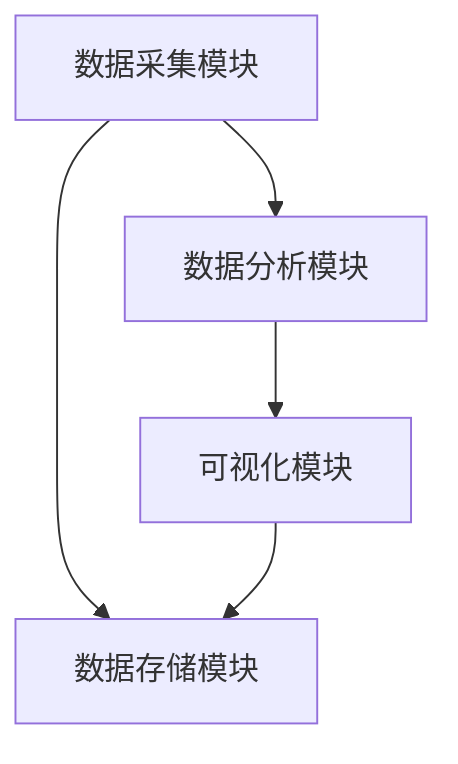
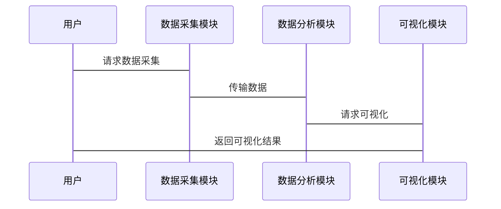

                 

# 金融市场跨资产相关性网络分析

## 关键词：金融市场、跨资产相关性、网络分析、复杂网络、系统性风险

## 摘要：  
本文探讨了金融市场中跨资产相关性网络分析的方法与应用。通过构建资产相关性网络，分析资产之间的相互作用，识别系统性风险，优化投资组合，并通过网络分析技术揭示金融市场结构的复杂性。本文结合统计学、图论和复杂网络理论，提供了一种全新的视角来理解金融市场。

---

# 第1章 金融市场与跨资产相关性概述

## 1.1 金融市场的基本概念

### 1.1.1 金融市场的定义与分类  
金融市场是指以金融资产为交易对象，通过公开市场机制进行资金流动和资源配置的场所。金融市场可以分为股票市场、债券市场、外汇市场、基金市场等。

### 1.1.2 资产的定义与类型  
资产是指具有价值并可被交易的金融工具，主要包括股票、债券、基金、外汇、黄金等。每类资产都有其独特的风险和收益特征。

### 1.1.3 金融市场的重要性与作用  
金融市场是现代经济体系的核心，它通过价格发现机制、资产配置和风险管理功能，为投资者提供收益和风险平衡的选择。

## 1.2 跨资产相关性的概念

### 1.2.1 相关性的定义与度量  
相关性是指两个或多个资产价格变动之间的关系程度。常用相关系数来衡量，相关系数范围在-1到1之间。

### 1.2.2 跨资产相关性的意义  
研究跨资产相关性有助于识别系统性风险，优化投资组合，降低风险敞口。

### 1.2.3 跨资产相关性在网络分析中的应用  
通过构建资产相关性网络，可以发现资产之间的相互关联，识别市场中的关键节点和风险传播路径。

## 1.3 网络分析的基本概念

### 1.3.1 网络分析的定义  
网络分析是通过图论方法研究网络结构及其属性的技术，用于分析节点之间的关系和网络的整体特征。

### 1.3.2 网络分析在金融领域的应用  
网络分析广泛应用于金融市场风险评估、资产配置、市场结构分析等领域。

### 1.3.3 跨资产相关性网络分析的目标  
构建资产相关性网络，分析网络的结构特征，识别系统性风险，优化投资组合。

---

# 第2章 相关性分析基础

## 2.1 统计相关性的基本概念

### 2.1.1 相关系数的定义  
相关系数是衡量两个变量之间线性相关程度的统计指标，常用皮尔逊相关系数。

$$ r = \frac{\sum (x_i - \bar{x})(y_i - \bar{y})}{\sqrt{\sum (x_i - \bar{x})^2 \sum (y_i - \bar{y})^2}} $$  

### 2.1.2 相关系数的计算公式  
皮尔逊相关系数计算公式如上，其中$\bar{x}$和$\bar{y}$分别为变量$x$和$y$的均值。

### 2.1.3 相关系数的性质  
相关系数的取值范围为[-1, 1]，绝对值越大表示相关性越强。

## 2.2 网络分析的基础知识

### 2.2.1 图论的基本概念  
图论是网络分析的基础，图由节点（顶点）和边（连接节点的边）组成。

### 2.2.2 网络节点与边的定义  
在资产相关性网络中，节点代表资产，边代表资产之间的相关性。

### 2.2.3 网络的度、聚类系数等指标  
- 度：节点的度数表示该节点连接的边数。
- 聚类系数：衡量网络中节点的邻居之间连接的紧密程度。

## 2.3 跨资产相关性网络的构建

### 2.3.1 数据收集与预处理  
从金融市场数据源获取资产价格数据，进行数据清洗和标准化处理。

### 2.3.2 相关性矩阵的构建  
计算资产价格的相关系数矩阵，确定哪些资产之间具有显著的相关性。

### 2.3.3 网络图的构建与可视化  
基于相关性矩阵，使用图论方法构建网络图，并通过可视化工具展示网络结构。

---

# 第3章 复杂网络理论与金融市场

## 3.1 复杂网络的基本概念

### 3.1.1 复杂网络的定义  
复杂网络是指由大量节点和边组成的非线性复杂系统，具有小世界网络和无标度网络特征。

### 3.1.2 复杂网络的特征  
复杂网络通常具有无标度性（少数节点具有高连接度）、小世界性（短程连接和高聚类性）等特征。

### 3.1.3 复杂网络在金融中的应用  
复杂网络理论可用于分析金融市场中的系统性风险、资产价格联动性等。

## 3.2 网络鲁棒性与金融市场风险

### 3.2.1 网络鲁棒性的定义  
网络鲁棒性指网络在面对节点或边的损失时保持整体功能的能力。

### 3.2.2 金融市场中的网络鲁棒性  
在金融市场中，网络鲁棒性用于评估资产相关性网络在极端市场条件下的稳定性。

## 3.3 网络社区检测与资产分类

### 3.3.1 社区检测的定义  
社区检测是将网络中的节点划分为若干个社区的过程。

### 3.3.2 金融市场中的社区检测  
通过社区检测，可以将相关性较高的资产划分为同一类别，便于投资组合管理和风险控制。

---

# 第4章 跨资产相关性网络的构建方法

## 4.1 数据预处理与特征提取

### 4.1.1 数据清洗  
处理缺失值、异常值等数据问题。

### 4.1.2 数据标准化  
对不同资产的价格数据进行标准化处理，以便进行相关性计算。

## 4.2 相关性矩阵的构建与分析

### 4.2.1 计算相关系数  
使用统计方法计算资产之间的相关系数。

### 4.2.2 确定相关性阈值  
选择合适的相关性阈值，构建相关性网络。

## 4.3 网络构建与可视化

### 4.3.1 使用图论算法构建网络  
基于相关性矩阵，使用图论算法构建资产相关性网络。

### 4.3.2 网络可视化的工具与方法  
使用Matplotlib、NetworkX等工具对网络进行可视化，展示资产之间的关联关系。

---

# 第5章 系统分析与架构设计

## 5.1 项目背景与目标

### 5.1.1 项目背景  
本项目旨在通过网络分析方法研究金融市场中资产之间的相关性。

### 5.1.2 项目目标  
构建资产相关性网络，分析网络结构特征，识别系统性风险。

## 5.2 系统功能设计

### 5.2.1 领域模型设计  
使用Mermaid绘制领域模型类图，展示系统功能模块之间的关系。

## 5.3 系统架构设计

### 5.3.1 系统架构图  
使用Mermaid绘制系统架构图，展示系统的组件及其交互关系。

## 5.4 系统接口设计与交互流程

### 5.4.1 系统接口设计  
定义系统各模块之间的接口，例如数据采集模块与数据分析模块的接口。

### 5.4.2 系统交互流程  
使用Mermaid绘制交互序列图，展示用户与系统之间的交互流程。

---

# 第6章 项目实战：资产相关性网络分析

## 6.1 环境安装与配置

### 6.1.1 安装Python环境  
安装Python 3.x，安装必要的库如Pandas、NetworkX、Matplotlib。

### 6.1.2 数据源选择  
选择合适的金融市场数据源，如Yahoo Finance API。

## 6.2 核心代码实现

### 6.2.1 数据采集与预处理  
编写代码从数据源获取资产价格数据，并进行数据清洗和标准化处理。

### 6.2.2 相关性网络构建  
计算资产之间的相关系数，构建相关性矩阵，使用NetworkX库构建网络图。

### 6.2.3 网络可视化  
使用Matplotlib对网络进行可视化，展示资产之间的关联关系。

## 6.3 案例分析与结果解读

### 6.3.1 案例分析  
以股票和债券为例，分析它们之间的相关性变化。

### 6.3.2 结果解读  
解释网络图中的节点和边，分析资产之间的关联强度和方向。

## 6.4 项目总结与经验分享

### 6.4.1 项目总结  
总结项目实现的关键点，如数据处理、网络构建和可视化。

### 6.4.2 经验分享  
分享在项目中遇到的问题及解决方法，如数据清洗和相关性计算中的挑战。

---

# 第7章 总结与展望

## 7.1 本章总结  
总结全文的主要内容，强调跨资产相关性网络分析在金融市场研究中的重要性。

## 7.2 未来展望  
展望未来的研究方向，如动态网络分析、机器学习与网络分析的结合。

---

# 作者：AI天才研究院/AI Genius Institute & 禅与计算机程序设计艺术/Zen And The Art of Computer Programming

