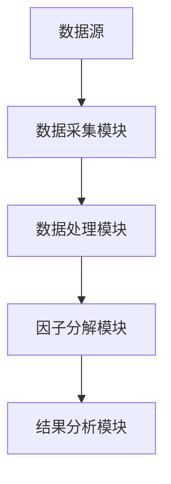

                 


# 金融市场风险因子分解与分析

> 关键词：金融市场风险，风险因子分解，主成分分析，因子分析，风险管理系统

> 摘要：本文详细探讨了金融市场风险因子分解与分析的方法和应用。从金融市场风险的基本概念出发，介绍了风险因子分解的意义与主要方法，包括主成分分析和因子分析等。通过数学模型和算法的详细推导，结合实际案例，展示了如何通过系统设计和项目实战来实现风险因子的分解与分析。最后，总结了相关研究的成果与展望。

---

## 第1章: 金融市场风险概述

### 1.1 金融市场风险的基本概念

#### 1.1.1 风险的定义与分类
- 风险的定义：金融市场中的风险是指资产价格波动带来的损失可能性。
- 风险的分类：
  - 系统性风险（Market Risk）
  - 非系统性风险（Specific Risk）

#### 1.1.2 风险因子的定义与特征
- 风险因子：影响资产价格波动的关键因素。
- 风险因子的特征：
  - 可测量性
  - 可分解性
  - 相关性

#### 1.1.3 风险因子分解的意义与作用
- 风险管理的需要
- 投资组合优化的需要
- 风险定价的需要

---

### 1.2 风险因子分解的背景与方法

#### 1.2.1 风险因子分解的背景
- 金融市场波动的复杂性
- 风险管理的需求
- 风险因子分解的理论基础

#### 1.2.2 风险因子分解的主要方法
- 主成分分析（PCA）
- 因子分析模型
- 其他分解方法

---

## 第2章: 风险因子分解的数学模型与公式

### 2.1 协方差矩阵与因子载荷矩阵

#### 2.1.1 协方差矩阵的定义与计算
- 协方差矩阵的定义：衡量资产收益之间的相关性。
- 计算公式：
  $$\text{Cov}(X, Y) = E[(X - E[X])(Y - E[Y])]$$

#### 2.1.2 因子载荷矩阵的构建与解释
- 因子载荷矩阵的定义：表示因子与资产之间的相关性。
- 计算公式：
  $$\text{载荷矩阵} = \text{因子得分} \times \text{因子载荷系数}$$

#### 2.1.3 矩阵的特征分解与因子提取
- 特征分解：将协方差矩阵分解为特征值和特征向量。
- 计算公式：
  $$A = PDP^{-1}$$
  其中，$D$ 为对角矩阵，$P$ 为特征向量矩阵。

---

### 2.2 因子分析的数学推导

#### 2.2.1 因子模型的构建
- 因子模型的基本形式：
  $$X = \mu + \Lambda F + \epsilon$$
  其中，$\Lambda$ 为因子载荷矩阵，$F$ 为因子，$\epsilon$ 为误差项。

#### 2.2.2 参数估计方法
- 最小二乘法
- 最大似然估计法

#### 2.2.3 因子旋转与解释
- 因子旋转的目的：提高因子的可解释性。
- 常用的旋转方法：方差最大化旋转。

---

## 第3章: 风险因子分解的算法实现

### 3.1 主成分分析（PCA）算法

#### 3.1.1 PCA算法的步骤
1. 计算协方差矩阵。
2. 对协方差矩阵进行特征分解。
3. 选择前 $k$ 个特征向量作为主成分。

#### 3.1.2 PCA算法的实现代码
```python
import numpy as np

def pca(X, n_components):
    # 计算协方差矩阵
    cov_matrix = np.cov(X.T)
    # 特征分解
    eigenvalues, eigenvectors = np.linalg.eigh(cov_matrix)
    # 排序
    sorted_idx = np.argsort(eigenvalues)[::-1]
    eigenvalues = eigenvalues[sorted_idx]
    eigenvectors = eigenvectors[:, sorted_idx]
    # 选择前n_components个主成分
    principal_components = eigenvectors[:, :n_components]
    return principal_components
```

#### 3.1.3 PCA算法的优缺点
- 优点：降维能力强，计算简单。
- 缺点：可能忽略重要变量，解释性较差。

---

### 3.2 因子分析模型的实现

#### 3.2.1 因子分析模型的参数估计
- 参数估计方法：最大似然估计。
- 计算公式：
  $$\hat{\Lambda} = \arg\min_{\Lambda} \text{tr}((X - \mu)(X - \mu)^T - \Lambda \Lambda^T)$$

#### 3.2.2 因子分析模型的实现代码
```python
import factor_analyzer

def factor_analysis(X, n_factors):
    fa = factor_analyzer.FactorAnalyzer(n_factors=n_factors)
    fa.fit(X)
    return fa.loadings_
```

#### 3.2.3 因子分析模型的验证与评估
- 模型评估指标：因子载荷的显著性，模型拟合度。

---

## 第4章: 风险因子分解的系统架构设计

### 4.1 系统功能设计

#### 4.1.1 数据采集与预处理
- 数据来源：金融市场数据（股票价格、指数、期货价格等）。
- 数据清洗：处理缺失值、异常值。

#### 4.1.2 因子分解算法实现
- 实现主成分分析和因子分析算法。

#### 4.1.3 结果可视化与分析
- 可视化工具：Matplotlib、Seaborn。
- 分析方法：因子载荷图、因子得分图。

### 4.2 系统架构设计

#### 4.2.1 系统模块划分
- 数据采集模块
- 数据处理模块
- 因子分解模块
- 结果分析模块

#### 4.2.2 系统流程图


#### 4.2.3 系统接口设计
- 输入接口：金融市场数据。
- 输出接口：因子载荷矩阵、因子得分矩阵。

---

## 第5章: 项目实战与案例分析

### 5.1 项目环境搭建

#### 5.1.1 数据来源与获取
- 数据来源：股票价格数据（如Yahoo Finance）。
- 数据获取工具：Pandas、Yahoo Finance API。

#### 5.1.2 数据清洗与预处理
- 删除缺失值。
- 标准化数据。

#### 5.1.3 环境配置与工具安装
- 安装Python库：NumPy、Pandas、FactorAnalyzer。

### 5.2 核心代码实现

#### 5.2.1 因子分解算法实现
```python
import pandas as pd
import numpy as np
import factor_analyzer

# 数据加载
data = pd.read_csv('stock_prices.csv')

# 数据标准化
data_norm = (data - data.mean()) / data.std()

# 主成分分析
def pca(X, n_components):
    cov_matrix = np.cov(X.T)
    eigenvalues, eigenvectors = np.linalg.eigh(cov_matrix)
    sorted_idx = np.argsort(eigenvalues)[::-1]
    eigenvalues = eigenvalues[sorted_idx]
    eigenvectors = eigenvectors[:, sorted_idx]
    principal_components = eigenvectors[:, :n_components]
    return principal_components

principal_components = pca(data_norm, 3)

# 因子分析
fa = factor_analyzer.FactorAnalyzer(n_factors=3)
fa.fit(data_norm)
loadings = fa.loadings_
```

#### 5.2.2 结果可视化与分析
```python
import matplotlib.pyplot as plt

# 绘制因子载荷图
plt.figure(figsize=(10, 6))
plt.bar(range(loadings.shape[1]), loadings.mean(axis=0))
plt.title('Factor Loadings')
plt.show()

# 绘制因子得分图
principal_components_df = pd.DataFrame(principal_components, columns=['PC1', 'PC2', 'PC3'])
principal_components_df.plot.scatter('PC1', 'PC2')
plt.title('Factor Score Plot')
plt.show()
```

#### 5.2.3 案例分析与结果解读
- 分析因子载荷，确定主要影响因素。
- 通过因子得分图，观察因子之间的关系。

### 5.3 项目小结
- 项目实现的步骤总结。
- 可能遇到的问题及解决方案。

---

## 第6章: 总结与展望

### 6.1 本书内容总结
- 风险因子分解的核心概念。
- 本书的主要内容和方法。

### 6.2 未来研究方向
- 更复杂的因子分解方法。
- 结合机器学习的因子分析。

### 6.3 最佳实践 tips
- 数据预处理的重要性。
- 选择合适的因子分解方法。

### 6.4 小结
- 风险因子分解在金融风险管理中的重要性。
- 学习和应用中的注意事项。

---

## 作者信息

作者：AI天才研究院/AI Genius Institute & 禅与计算机程序设计艺术 /Zen And The Art of Computer Programming

---

通过以上目录结构，读者可以逐步了解从理论到实践的过程，从基础概念到实际应用，确保能够全面掌握金融市场风险因子分解与分析的方法和技巧。

