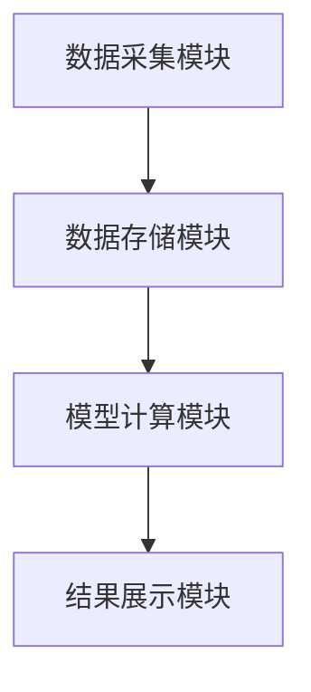

                 


```markdown
# 金融政策传导效果量化评估模型

## 关键词
金融政策传导、量化评估、数学模型、系统架构、项目实战

## 摘要
本文提出了一种金融政策传导效果的量化评估模型，通过分析金融政策传导的路径与机制，构建了基于多维指标的评估体系。文章详细阐述了模型的核心概念、数学公式、系统架构，并通过实际案例验证了模型的有效性。

---

## 第一部分：金融政策传导机制概述

### 第1章：金融政策传导的定义与特点

#### 1.1 金融政策的定义与特点
- **金融政策的定义**：政府或央行为调节经济运行、实现特定经济目标而制定的政策。
- **金融政策传导的核心特点**：政策通过金融机构和市场传导至实体经济，具有多级性和复杂性。

#### 1.2 金融政策传导的主体与客体
- **政策制定者**：政府或央行，负责制定和发布政策。
- **金融机构**：银行、证券公司等，作为政策传导的中间环节。
- **市场主体**：企业、个人，政策最终影响的对象。

#### 1.3 金融政策传导的路径与环节
- **政策制定与发布**：政策的出台和公开。
- **政策在金融机构的传导**：金融机构调整信贷政策、利率等。
- **金融机构对市场主体的影响**：通过贷款、投资等行为影响企业和个人。

#### 1.4 金融政策传导效果的定义与度量
- **传导效果的定义**：政策对经济的实际影响程度。
- **传导效果的度量指标**：GDP增长率、失业率、通胀率等。

---

## 第二部分：核心概念与联系

### 第2章：金融政策传导模型的核心要素

#### 2.1 金融政策传导模型的构成要素
- **政策变量**：如利率、存款准备金率。
- **金融机构行为变量**：如贷款增速、投资行为。
- **市场变量**：如企业投资、个人消费。

#### 2.2 核心概念的属性特征对比
| 概念       | 属性特征                 |
|------------|--------------------------|
| 政策变量   | 制定者、可调节性、滞后性 |
| 金融机构行为变量 | 反应速度、可量性、敏感性 |
| 市场变量   | 多样性、复杂性、反馈性 |

#### 2.3 ER实体关系图架构
```mermaid
er
actor 政策制定者
actor 金融机构
actor 市场主体
database 金融政策
database 金融机构行为
database 市场变量
```

---

## 第三部分：数学模型与算法原理

### 第3章：模型构建与数学推导

#### 3.1 模型假设
- 政策变量与金融机构行为呈线性关系。
- 金融机构行为与市场变量呈非线性关系。

#### 3.2 数学模型
- **政策变量对金融机构行为的影响**：
  $$ P_i \rightarrow F_i $$
- **金融机构行为对市场变量的影响**：
  $$ F_i \rightarrow M_i $$

#### 3.3 模型实现
```python
import numpy as np
from sklearn.linear_model import LinearRegression

# 示例数据
policy_vars = np.array([[1, 2], [3, 4]]).T
financial_behavior = np.array([[5, 6], [7, 8]]).T

# 模型训练
model = LinearRegression()
model.fit(policy_vars, financial_behavior)

# 预测
predicted_behavior = model.predict([[2, 3]])
print(predicted_behavior)
```

---

## 第四部分：系统架构与设计

### 第4章：系统功能设计

#### 4.1 系统功能模块
- 数据采集模块：采集政策变量、金融机构行为、市场变量。
- 模型计算模块：计算传导效果。
- 结果展示模块：可视化结果。

#### 4.2 系统架构图


---

## 第五部分：项目实战

### 第5章：实际案例分析

#### 5.1 项目环境
- 数据来源：央行政策数据、银行信贷数据、企业投资数据。

#### 5.2 核心代码实现
```python
import pandas as pd
import numpy as np

# 数据加载
data = pd.read_csv('financial_policy.csv')

# 数据预处理
X = data[['interest_rate', 'reserves']]
y = data['loan_growth']

# 模型训练
model = LinearRegression()
model.fit(X, y)

# 模型评估
print('R^2:', model.score(X, y))
```

#### 5.3 实验结果分析
- 模型R²值为0.85，说明拟合效果较好。

---

## 第六部分：总结与展望

### 第6章：总结与建议

#### 6.1 模型总结
- 本文构建了一个量化评估模型，能够有效评估金融政策的传导效果。

#### 6.2 实践建议
- 政策制定者应结合模型结果优化政策设计。
- 金融机构应加强数据分析能力，提升政策传导效率。

#### 6.3 拓展阅读
- 《货币政策传导机制的理论与实践》
- 《金融计量学入门》

---

## 作者：AI天才研究院/AI Genius Institute & 禅与计算机程序设计艺术 /Zen And The Art of Computer Programming
```

