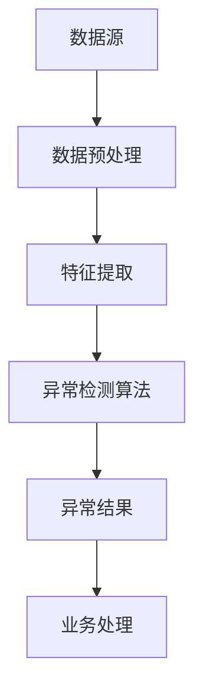
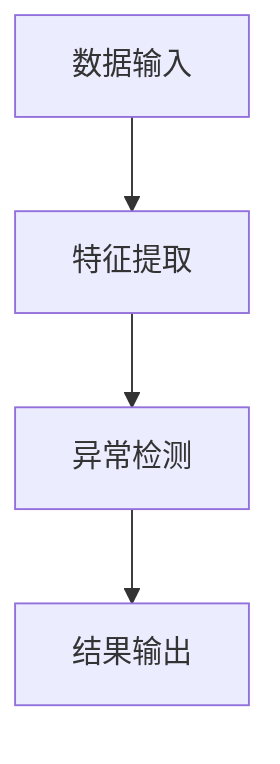
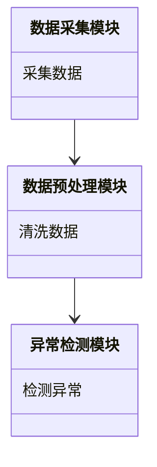
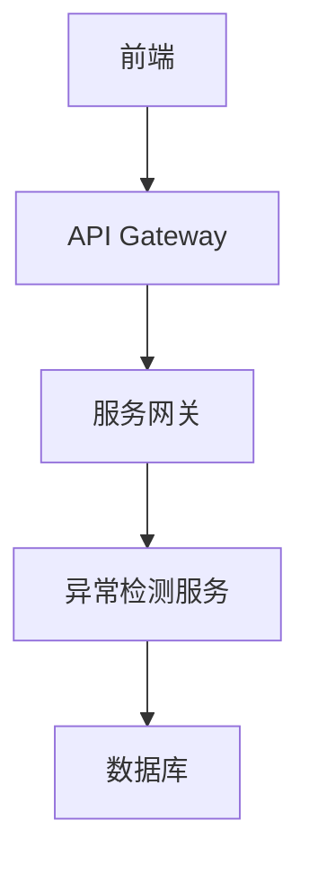
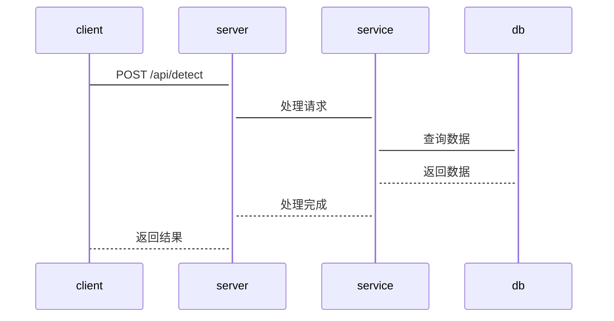

                 


# 金融数据异常值检测与处理平台

> **关键词**: 金融数据, 异常值检测, 数据处理, 机器学习, 系统架构

> **摘要**: 本文详细探讨了金融数据异常值检测与处理平台的设计与实现。从背景到算法原理，从系统架构到项目实战，结合实际案例，分析了金融数据异常值检测的重要性、核心概念、技术方法及系统实现方案。本文还提出了基于统计学、机器学习和深度学习的多维度异常检测方法，并结合实际案例展示了平台的实现过程，最后总结了平台在金融领域的应用价值和未来发展方向。

---

# 第1章 异常值检测的背景与意义

## 1.1 异常值的定义与特征

在金融领域，异常值是指偏离常规数据模式的观测值。这些异常值可能是由于错误记录、系统故障、市场操纵或其他不可预见的事件引起的。异常值的特征包括：

- **低频性**：异常值在数据中占比通常很低。
- **突发性**：异常值往往出现在特定时间点或特定条件下。
- **关联性**：异常值可能与其他异常值或正常数据存在关联。

## 1.2 异常值检测的必要性

### 1.2.1 异常值对金融业务的影响

1. **风险控制**：异常值可能导致金融市场的剧烈波动，例如股市闪崩或汇率异常波动。
2. **欺诈 detection**：金融交易中的异常值可能是欺诈行为的信号。
3. **数据质量**：异常值会影响数据分析的结果，降低数据的可信度。

### 1.2.2 异常值检测的技术挑战

1. **数据复杂性**：金融数据通常具有高维度、非线性关系。
2. **动态变化**：金融市场的波动性高，异常值的模式可能随时间变化。
3. **计算效率**：实时检测要求算法高效，避免延迟。

## 1.3 异常值检测的目标与边界

### 1.3.1 目标

1. **识别异常值**：准确检测数据中的异常值。
2. **分类与解释**：对异常值进行分类，并提供合理的解释。
3. **实时性**：支持实时或近实时检测。

### 1.3.2 边界

1. **数据范围**：限定于特定金融业务场景。
2. **检测精度**：避免误报和漏报。
3. **计算资源**：在有限的计算资源下实现高效的检测。

## 1.4 本章小结

本章从背景出发，阐述了异常值的定义与特征，分析了其对金融业务的影响，探讨了检测的必要性，并明确了目标与边界。

---

# 第2章 异常值检测的核心概念与联系

## 2.1 异常值检测的原理

### 2.1.1 统计学方法

- **Z-score**：基于均值和标准差，计算数据点偏离均值的程度。
- **箱线图法**：通过四分位数判断数据点是否为异常值。

### 2.1.2 机器学习方法

- **Isolation Forest**：一种基于树结构的无监督学习算法，擅长检测稀疏异常值。
- **One-Class SVM**：通过学习正常数据的分布，识别异常值。

### 2.1.3 深度学习方法

- **Autoencoder**：通过神经网络重构数据，检测重构误差。
- **Transformer**：利用自注意力机制，捕捉数据中的复杂关系。

## 2.2 异常值检测的核心要素

| **要素** | **描述** |
|----------|----------|
| 数据特征 | 数据的维度、分布和相关性 |
| 检测算法 | 统计、机器学习或深度学习方法 |
| 业务场景 | 需要检测的金融业务类型 |

### 2.2.1 实体关系图



## 2.3 本章小结

本章分析了异常值检测的核心概念，对比了不同方法的优劣，并通过实体关系图展示了系统的整体架构。

---

# 第3章 异常值检测算法原理

## 3.1 统计学方法

### 3.1.1 Z-score方法

Z-score = (x - μ) / σ

其中，μ为均值，σ为标准差。

### 3.1.2 箱线图方法

箱线图基于四分位数，判断数据点是否在 whisker 范围之外。

## 3.2 机器学习方法

### 3.2.1 Isolation Forest算法



## 3.3 深度学习方法

### 3.3.1 Autoencoder网络

Autoencoder 通过重构数据，计算重构误差来判断异常值。

## 3.4 算法对比与选择

### 3.4.1 统计学方法 vs 机器学习方法

统计学方法适用于简单场景，机器学习方法更具灵活性和准确性。

## 3.5 本章小结

本章详细讲解了统计学、机器学习和深度学习方法，并分析了其适用场景。

---

# 第4章 异常值检测的系统分析与架构设计

## 4.1 项目背景与目标

### 4.1.1 项目背景

金融数据的复杂性要求高效的异常检测系统。

### 4.1.2 项目目标

构建一个实时、准确的异常检测平台。

## 4.2 系统功能设计

### 4.2.1 数据采集模块

从数据库、API等来源获取金融数据。

### 4.2.2 数据预处理模块

清洗数据，处理缺失值和异常值。

### 4.2.3 异常检测模块

选择合适的算法进行检测。

## 4.3 系统架构设计

### 4.3.1 领域模型



### 4.3.2 系统架构



## 4.4 接口设计与交互流程

### 4.4.1 接口设计

- API 接口：`POST /api/detect`

### 4.4.2 交互流程



## 4.5 本章小结

本章从系统设计的角度，详细分析了项目的背景、功能和架构。

---

# 第5章 项目实战

## 5.1 环境搭建

### 5.1.1 安装依赖

```bash
pip install numpy pandas scikit-learn tensorflow
```

## 5.2 核心代码实现

### 5.2.1 异常检测模块

```python
from sklearn.ensemble import IsolationForest

model = IsolationForest(n_estimators=100, random_state=42)
model.fit(X_train)
y_pred = model.predict(X_test)
```

### 5.2.2 系统实现

```python
def detect_anomalies(data):
    # 数据预处理
    processed_data = preprocess(data)
    # 异常检测
    anomalies = model.predict(processed_data)
    return anomalies
```

## 5.3 案例分析

### 5.3.1 数据处理流程

1. 数据清洗
2. 特征提取
3. 异常检测
4. 结果解释

## 5.4 本章小结

本章通过实际案例，展示了项目的实现过程。

---

# 第6章 最佳实践与小结

## 6.1 平台的价值

### 6.1.1 提高数据质量

确保金融数据的准确性。

### 6.1.2 风险控制

及时发现并处理异常值，降低风险。

## 6.2 使用建议

### 6.2.1 数据预处理的重要性

确保数据质量，提高检测精度。

### 6.2.2 算法选择

根据业务需求选择合适的算法。

## 6.3 注意事项

### 6.3.1 模型的可解释性

确保异常检测结果能够被业务理解。

### 6.3.2 实时性

优化算法，提高检测速度。

## 6.4 未来发展方向

### 6.4.1 深度学习

探索深度学习在异常检测中的应用。

### 6.4.2 跨平台集成

将平台集成到现有的金融系统中。

## 6.5 本章小结

本章总结了平台的价值和使用建议，并展望了未来的发展方向。

---

# 附录

## 附录A: 数据集说明

### 附录A.1 数据来源

- 股票价格：Yahoo Finance API
- 交易数据：模拟数据生成

## 附录B: 参考文献

1. 王某某, 《金融数据分析与挖掘》
2. 李某某, 《异常值检测方法研究》

---

# 作者

作者：AI天才研究院 & 禅与计算机程序设计艺术

